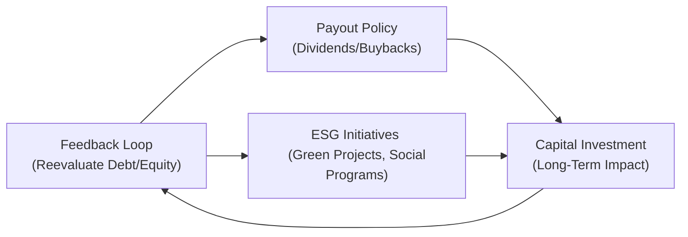
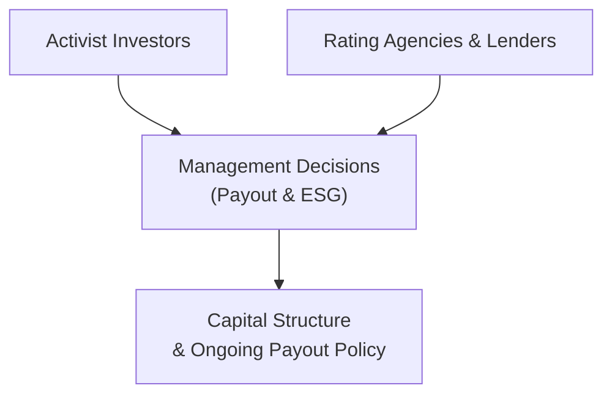

## The Big Picture: Why Integrate Payout, ESG, and Capital Structure

If you think back to your Level I days (and maybe you’re saying, “Uh, that feels like ages ago!”), you might remember that payout policy (i.e., how a firm returns cash to shareholders) is only one piece of the capital structure puzzle. At Level II, it becomes obvious that dividends and share repurchases aren't isolated from the firm’s debt and equity decisions. And oh boy, add ESG (Environmental, Social, and Governance) expectations into the mix, and you can see how complicated—yet so interesting—these decisions get.

Firms often face competing priorities: meet investor demands for consistent or growing payouts, maintain a healthy balance of debt and equity, and allocate resources for ambitious ESG initiatives that can shape the company’s brand over the long haul. The tension between near-term returns (which shareholders love) and sustainable investments (which can take years to bear fruit) is intense. Managers must find a balance that supports a stable capital structure, satisfies stakeholders, and doesn't compromise the firm’s strategic goals—like upholding ESG commitments or seizing new market opportunities.

Before we proceed, it might help to recall a personal story that got me thinking differently about all this. A few years back, I grabbed coffee with a CFO friend who confided that his company had just announced a share repurchase program to keep activist investors happy. But behind the scenes, they were struggling to find capital for a new green manufacturing plant. The CFO was worried that taking on more debt for the plant might blow up the company’s leverage ratios—making share buybacks riskier. At the same time, not building the green plant could damage the firm’s “ESG-friendly” image. It was, he joked, a “pick your poison” situation. And that “poison” was exactly the tension among payout policy, ESG obligations, and capital structure choices.

## Payout Policies: Dividends and Buybacks in a Capital Structure Context

Payout policy involves returning cash to shareholders through dividends or share repurchases (or both). Each method has implications for the firm’s leverage, liquidity, and even cost of capital.

• Dividends: Historically popular and often viewed as a “sign of financial strength.” But high dividends can reduce a firm’s cash buffer, limiting future flexibility.  
• Share Repurchases: Often used when management believes the stock is undervalued—or simply wants to distribute extra cash without committing to ongoing dividends. Share buybacks reduce the number of shares outstanding, potentially boosting metrics such as earnings per share (EPS).

Now, how do these decisions interact with capital structure (the mix of debt and equity)? If a firm is heavily leveraged, it may be forced to think twice about new or increased payouts because higher interest obligations might squeeze free cash flow. In tough times, that debt load can become burdensome. But ironically, if you go too light on debt, you risk forgoing tax advantages (assuming tax deductibility of interest) and possibly undersignaling your confidence in the business. Striking the right blend ensures the firm remains solvent and flexible while rewarding shareholders.

### Example: Balancing Dividend Increases with Debt Constraints
Suppose Company A is financed with 50% debt and 50% equity. The firm’s bond covenants limit how much additional debt the firm can take on. After two years of strong cash flow from operations, the board wants to double the annual dividend. However, the CFO notes that once they do that, there’ll be less internal funding left to pay down existing debt, making the firm vulnerable if next year’s cash flow dips (say, from a macro downturn). Meanwhile, that same cash could have been used to invest in more energy-efficient machinery, which might pay off in both tax credits and positive public relations. It’s the classic short-term versus long-term trade-off.

Here’s a quick formula refresher for Weighted Average Cost of Capital (WACC), which guides many of these decisions:


\text{WACC} \;=\; \frac{E}{D + E} \, r_e \;+\; \frac{D}{D + E} \, r_d \,(1 - t)


Where:
• \\( E \\) is the market value of equity  
• \\( D \\) is the market value of debt  
• \\( r_e \\) is the required return on equity  
• \\( r_d \\) is the interest rate on debt  
• \\( t \\) is the corporate tax rate  

A firm typically tries to minimize its WACC while keeping enough flexibility to handle future contingencies. If the firm sets a high dividend, it might have to issue new equity or debt to fund expansions—or cut back on them altogether. Either scenario affects the WACC and thus the feasibility of additional ESG initiatives.

## The ESG Angle: Resource Allocation for Sustainable Growth

ESG commitments add another dimension to capital structure decisions. Let’s just say, you can’t easily separate “doing good” from “financial planning.” Over the last decade, a growing number of investors watch how companies treat the environment, their stakeholders, and their governance structures. All these factors can shape brand value and risk profiles.

• Environmental: Investing in green tech or carbon offset programs can require large upfront outlays, meaning the company needs to either use cash on hand (reducing potential dividends or buybacks) or raise additional financing.  
• Social: Fair labor practices or ethical sourcing can raise production costs in the near term, impacting free cash flow.  
• Governance: A transparent, well-structured board may favor moderate leverage and consistent but conservative dividends, adopting policies that prioritize long-term stability.

At times, ESG initiatives have real payoffs—reduced energy costs from solar panel installations, for example—and the potential to attract a broader investor base. Firms with robust ESG profiles often report lower equity cost, because there’s a perception of lower idiosyncratic risk. The same can go for debt, especially if you can issue “green bonds” at a slightly lower coupon due to strong investor demand.

Still, not every ESG project is going to pay for itself right away. In the short term, these investments might crowd out dividends or buybacks. Managers have to juggle these alternative uses of cash, and if they’re not careful, well, the rhetorical question is: “What’s the point of ramping up your ESG credentials if you end up financially strapped?”

### Diagram: Interplay of Capital Structure, Payouts, and ESG

Below is a simplified Mermaid flowchart illustrating how capital structure decisions feed into (and from) payout policy and ESG initiatives:

This diagram is obviously an oversimplification—real capital budgeting, especially with ESG in mind, involves a lot more nuance. But it’s a handy reference to keep track of the moving parts.

## Balancing Short-Term Gains with Long-Term ESG Goals

One constant tension is balancing the near-term desire to keep shareholders happy against building a durable, socially responsible enterprise. Short-term oriented investors might prefer a larger buyback or dividend right now, while management hopes to allocate enough capital for major prevention-of-future-problems—like improving the supply chain with sustainable materials.

There’s no single “right” answer, but from an exam perspective, you might see a vignette that describes:

• A potential activist investor pushing for a special dividend in the next quarter.  
• A newly announced ESG compliance regulation that might require additional capital outflows over the next few years.  
• Stricter leverage requirements that limit the firm’s capacity to pay out large sums of cash.

The best recommendation often involves synthesizing each of these constraints into a coherent structure. A modest share buyback might work alongside the issuance of a new green bond that finances an ESG capital project. Or maybe the board will decide on a smaller dividend increase while planning a future ESG-based equity offering that appeals to socially conscious investors.

## Debt vs. Equity in an ESG-Focused Landscape

Now let’s talk about the trade-off between debt and equity financing when you have big ESG targets:

• Debt Financing: Typically cheaper than equity (especially if interest is tax-deductible). However, if your ESG projects don’t produce immediate returns, you still have to meet fixed interest obligations. Rating agencies might lower a rating if the firm’s debt load becomes excessive, especially if future ESG spending is uncertain.  
• Equity Financing: Might be more flexible, particularly if your ESG narrative resonates with socially responsible investors or certain institutional funds that have mandates to invest in ESG-friendly companies. On the downside, you dilute existing ownership, which can irritate shareholders expecting a stable or rising dividend.

In some markets, companies issue green bonds or sustainability-linked bonds that (hopefully) come with slightly lower coupons, because there’s strong market demand for these instruments. However, the firm may need to demonstrate credible ESG progress (sometimes measured via third-party audits or key performance indicators), or it might face penalty interest rates. Good governance is crucial here: rating agencies and lenders want enough transparency to ensure the money is used responsibly for green or social programs. It’s not just about raising cheap debt; it’s about accountability and a project pipeline that meets stakeholder expectations.

### Additional Example: Weighted Cost of Capital Impact
Imagine a scenario: A solar energy developer called SunBeam Corp. is deciding between a share issuance or a green bond offering to finance new solar farms. If they issue equity, the cost might be 12% (due to high volatility in the solar sector), and it dilutes existing shareholders—who are also hungry for buybacks. If they issue a green bond at 6.5% interest (after adjusting for the project’s credit rating and potential green bond premium), it might initially lower their WACC. But the catch? They have to maintain certain environmental milestones. If they fail, the interest rate could ratchet up to 8%, raising their overall cost.

## Real-World Pressures: Activist Investors and Rating Agencies

Activist investors focusing on ESG issues often push management to rethink how resources are allocated. In some cases, activism might center on getting the firm to pay more attention to sustainability. In others, it could be the old-school activism approach—demand a big share repurchase to boost the short-term stock price. The trick for management is addressing these claims without sacrificing the future.

Rating agencies, similarly, have begun incorporating ESG metrics into their credit assessments. If a firm is on the hook for expensive environmental upgrades or is under scrutiny for poor governance, rating agencies might consider these as risk factors, leading to a higher cost of debt. Conversely, if your firm is a recognized ESG leader, you might enjoy better interest rates or higher investor demand for bond offerings as lenders perceive less long-term operational risk.

### Diagram: Influence of Activists and Lenders

Notice how both activist investors and rating agencies feed into management decisions, which ultimately circle back to define capital structure and payout strategy.

## Distinguishing Short-Term vs. Long-Term Considerations

Let’s face it: share price boosts from a repurchase announcement can be intoxicating—“Buybacks to the rescue!”—but the question is whether they create value over the long haul if the firm subsequently struggles to finance strategic ESG investments. If you’re evaluating a corporate finance question in the exam context, always look for the tension between immediate price reactions and the firm’s sustainable growth objectives. 

Some short-term considerations include:
• Immediate EPS accretion from buybacks.  
• The symbolic message of a dividend increase.  
• The potential share price pop from announcing a large repurchase.  

Long-term objectives revolve around:
• Maintaining a prudent debt-equity ratio.  
• Preserving sufficient cash for future capex or ESG upgrades.  
• Strengthening relationships with a broader stakeholder community (including employees, customers, and regulators).  

Usually, the sweet spot is found by calibrating the payout ratio along with an appropriate capital structure so that the firm can handle both normal fluctuations in cash flow and the eventual financing needs for ESG-driven projects. 

## Summary of Key Takeaways

• Payout policies (dividends and buybacks) influence—and are influenced by—capital structure. A heavily leveraged company might be limited in its ability to sustain large payouts.  
• ESG commitments complicate how firms allocate cash. Some ESG projects repay themselves over time, while others require a leap of faith (or at least a multi-year horizon).  
• Balancing short-term demands with long-term strategies is central to corporate management. The CFO’s decision-making framework must weigh capital costs, internal liquidity, activist pressures, and the future brand value that ESG might deliver.  
• Debt vs. equity financing in an ESG-centric environment requires evaluating not just interest rates but also intangible factors like sustainability-linked covenants or reputational benefits.  
• Activist investors and rating agencies play a pivotal role in shaping firm actions, and strong ESG profiles can result in more favorable financing conditions.  
• For exam purposes, pay attention to how companies manage trade-offs between near-term share price boosts and the capacity to fund ESG initiatives that might generate long-term payoffs.

## References

- CFA Institute Level II Program Curriculum, Corporate Issuers.  
- Damodaran, Aswath. “Corporate Finance: Theory and Practice.”  
- Eccles, Robert G., et al. “The Impact of Corporate Sustainability on Organizational Processes and Performance.” Management Science.  
- Sustainability Accounting Standards Board (SASB): https://www.sasb.org/  

## Test Your Knowledge: Payout, ESG, & Capital Structure Choices



### A firm decides to significantly increase its dividend while it has a high leverage ratio. Which statement is most likely correct regarding its capital structure risk?

- [ ] The firm will reduce its debt ratio naturally by paying the dividend.  
- [x] The firm may face higher financial risk and reduced debt capacity due to lower retained earnings.  
- [ ] The firm’s interest coverage ratio will automatically improve.  
- [ ] The firm’s debt-to-equity ratio will be unaffected by the dividend payment.  

> **Explanation:** Excessively increasing dividends while already heavily leveraged can constrain the firm’s ability to reduce debt or finance projects internally, raising financial risk.

### Why might a firm that invests heavily in ESG initiatives choose to reduce its share repurchase program?

- [ ] ESG initiatives tend to pay off immediately, rendering repurchases unnecessary.  
- [x] Large ESG expenditures reduce free cash flow available for repurchases.  
- [ ] ESG spending is typically unrelated to share repurchases.  
- [ ] Share repurchases have no impact on a firm’s sustainability profile.  

> **Explanation:** Significant ESG investments may require reallocating cash that would otherwise be used for share repurchases, lowering immediate funds available to return to shareholders.

### How can strong ESG practices potentially lower a firm’s overall cost of capital?

- [ ] By prompting the firm to issue only high-coupon bonds.  
- [ ] By creating seasonal demand for its stock during the holidays.  
- [ ] By eliminating the need for external financing altogether.  
- [x] By reducing perceived risk among investors and increasing demand for the company’s debt and equity.  

> **Explanation:** Firms with strong ESG profiles are often seen as less risky, which can attract more investors and lower both cost of equity and cost of debt.

### An activist investor pushes for a special dividend. Which potential risk must the board consider?

- [ ] A special dividend will always reduce the firm’s share price.  
- [ ] The special dividend instantly creates new shares.  
- [x] The dividend may deplete future funds needed for large ESG or capital projects.  
- [ ] The activist will have less influence after receiving a dividend.  

> **Explanation:** Paying out a large one-time dividend can drain cash the company might need for investment or ESG opportunities, possibly undermining long-term strategies.

### When analyzing a company’s payout policy, a credit rating agency might be concerned if the firm:

- [ ] Uses share repurchases to reduce shares outstanding.  
- [ ] Reports a stable free cash flow.  
- [ ] Has a purely equity-based capital structure.  
- [x] Increases dividend payouts while already near maximum allowable leverage per debt covenants.  

> **Explanation:** Higher dividends at or near maximum leverage can raise default risk, triggering negative attention from rating agencies.

### Which statement best illustrates the trade-off between short-term payouts and long-term brand building via ESG?

- [x] Excess payouts may limit funds for ESG initiatives, potentially hindering the firm’s reputation and stakeholder support over time.  
- [ ] Firms can always increase both dividends and ESG spending without compromise.  
- [ ] Payout decisions are rarely impacted by ESG considerations.  
- [ ] ESG strategies typically require negligible capital.  

> **Explanation:** Boosting near-term payouts can reduce available cash for ESG projects, which may harm a firm’s credibility or brand equity in the future.

### A company issues green bonds with a lower coupon rate than a standard corporate bond issue. What might be a key requirement?

- [x] The firm must demonstrate it is meeting predefined sustainability metrics.  
- [ ] The firm must maintain a 100% dividend payout ratio.  
- [ ] The firm has to buy back at least 10% of its shares annually.  
- [ ] The firm cannot use any financing from equity markets.  

> **Explanation:** Sustainability-linked bonds often come with performance criteria. If the firm fails to meet these ESG targets, penalty rates or other conditions may apply.

### If a firm with moderate debt decides to repurchase shares aggressively, which direct effect might you see?

- [ ] The firm’s total assets will always increase.  
- [ ] The firm’s interest payments automatically decrease.  
- [x] The equity base shrinks, potentially increasing financial leverage.  
- [ ] The firm’s dividend per share must decrease.  

> **Explanation:** A buyback means cash outflow (reducing assets) and share count reduction, effectively increasing leverage if no other changes occur.

### What is one reason management might reject an activist’s demand for higher dividends amid new ESG regulations?

- [ ] Activists never propose beneficial ideas.  
- [x] Anticipated regulatory costs might reduce available free cash flow, making higher dividends risky.  
- [ ] ESG regulations usually contain formal dividend caps.  
- [ ] Management is only interested in buybacks, not dividends.  

> **Explanation:** If new ESG regulations mandate costly updates or investments, management may decide to conserve cash rather than boosting dividends.

### A firm states that it will temporarily cut dividends to fund a major environmental cleanup. Is this a positive ESG signal?

- [x] True  
- [ ] False  

> **Explanation:** Although dividends are reduced, such an action may be viewed as management’s commitment to responsible operations, potentially enhancing its ESG reputation in the long run.


