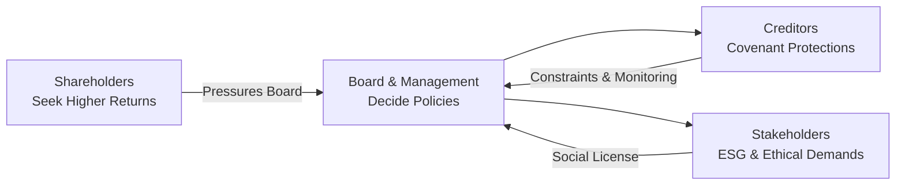

## Introduction
Have you ever been in a meeting where everyone at the table wants something different—maybe one person wants to maximize their bonus right away, another wants to safeguard the family business for the next generation, and someone else insists on philanthropic endeavors that cut into short-term profits? Well, corporate finance can feel like that. When dealing with the interplay among shareholders, creditors, and broader stakeholders, each group has its own interests and demands. In this section, we’ll explore these often-competing priorities, how robust governance policies guide decision-making, and what it means for a firm’s long-term value creation.

Let’s keep it real though—companies can’t always please everyone perfectly. Yet, by carefully balancing financial returns, obligations to creditors, and social responsibilities, they can enhance overall corporate resilience. As you prepare for the CFA exam, you’ll see many vignette-style questions about how these interests collide, especially when companies face big strategic decisions like mergers or highly leveraged repurchases. Understanding these conflicts (and how to handle them) is crucial for making sound corporate finance decisions.

## Sources of Conflict Among Shareholders, Creditors, and Stakeholders
Shareholders want maximum returns, creditors want to ensure that their loans are repaid on time, and other stakeholders—like employees, suppliers, and communities—are concerned about ethical practices, sustainability, and business continuity. Sometimes, these groups are aligned. For instance, a profitable firm is generally good news for everyone. But often, they diverge.

• Shareholders typically seek profit growth (e.g., higher dividends, share buybacks, or capital appreciation). If the firm takes on more debt to finance strategic acquisitions or share repurchases, those shareholders might benefit from a short-term boost in share price.  
• Creditors, however, may fear that higher leverage increases the risk of default. They impose restrictions (see “Debt Covenants” below) or demand higher interest rates.  
• Stakeholders at large—employees, customers, and the local community—may emphasize stability, environmental responsibility, or fair labor practices. Such measures can modestly increase costs in the short run but can build trust and “social license to operate” over time.

So, there’s a built-in tension. If a company invests heavily in green technologies, immediate profits could suffer. But it might win regulatory goodwill, reduce long-term environmental liabilities, and even attract more socially conscious investors.

## The Mediating Role of Governance
A firm’s governance structure helps reconcile these differing pressures and reduce agency conflicts. Think of the board of directors as a conductor, guiding the orchestra’s various instruments to (hopefully) play in harmony. When a board is balanced—independent directors with strong oversight, committees that scrutinize executive actions, transparent voting rights structures—shareholders, creditors, and other stakeholders tend to have more trust in the firm’s decisions.

Good governance policies can:

• Set transparent guidelines for dividend distributions and share buybacks, giving creditors confidence that cash outflows remain within reason.  
• Foster a governance culture that values both financial performance and social responsibility, which can attract more diverse funding sources and reduce reputational risk.  
• Ensure management compensation is tied to long-term, not just short-term, objectives. That way, managers don’t chase quarterly incentives at the expense of stakeholder relationships.  

In many jurisdictions, national codes like the G20/OECD Principles of Corporate Governance lay out best practices: independent boards, robust disclosure, and investor rights. When properly observed, these measures reduce the risk that executives or major shareholders will make decisions that jeopardize the interests of other parties, including creditors and community groups.

## Debt Covenants as Creditor Protections
Creditors understand that shareholders might favor using company cash to enrich owners or undertake expansions that risk default. That’s why many loan agreements and bond indentures include strict conditions—debt covenants—that limit certain corporate actions. For instance, covenants can restrict:

• Dividend payouts above a specified threshold  
• Additional borrowing beyond a certain leverage ratio  
• Asset sales without creditor approval  
• Mergers or acquisitions without maintaining certain credit metrics  

Imagine you’re a bondholder, and you see a firm is about to distribute a massive special dividend that will drain the firm’s liquidity. You’d likely get nervous, right? Covenants provide a safety net by ensuring that management, even under shareholder pressure, doesn't overextend the company to the point of default risk.

### Example: Impact of a Share Repurchase on Covenants
Suppose a company’s operating income is stable at $200 million annually, and it carries long-term debt of $1 billion with an interest coverage ratio covenant of 3.0×. That basically means EBITDA / Interest must remain above 3.0. If a share repurchase requires drawing additional debt, interest obligations increase. If that push reduces the coverage ratio below 3.0×, the company violates the covenant. Violations can lead to penalties, higher interest rates, or even immediate debt repayment. So, creditors strongly incentivize management to weigh short-term equity returns against the possibility of tripping a covenant.

## Stakeholder-Oriented Corporate Strategies
When a firm invests in employee training programs or commits to sustainable supply-chain operations, the immediate expense can reduce near-term profits. But over the longer run, these expenditures often enhance the company’s brand, reduce turnover costs, and position the business for stable growth. This emphasis on broader stakeholder interests might not always be popular with shareholders who are fixated on the next quarter, but it builds corporate resilience.

I once consulted for a manufacturing firm that provided extended healthcare benefits for its workers. The CFO initially worried about the short-term cost. Yet, after a few years, the firm saw reduced absenteeism, lower turnover, and, ironically, an improvement in operating margins. Customers also took note of how well the firm treated its workforce, which led to better supplier relationships. That’s the intangible power of stakeholder trust. So, the takeaway is that intangible returns—employee loyalty, brand reputation, community goodwill—can fortify a firm’s bottom line over time.

## Corporate Actions and Shifting Risk
Major corporate moves—mergers, leveraged buyouts, spin-offs—can greatly shift the balance of gains and risks among shareholders, bondholders, and stakeholders. We saw in Chapter 10 that LBOs (Leveraged Buyouts) often provide short-term gains for equity owners but escalate default risk for creditors.

### Mergers and Acquisitions
• A merger that creates synergies might please shareholders expecting higher EPS, but it could also accumulate debt, raising default risk for creditors.  
• If the merged entity rationalizes redundant assets, employees and communities may lose out in the short term. Yet a stronger combined business might mean more job security in the long term.

### Spin-Offs and Divestitures
• Spin-offs can unlock value for shareholders if the market perceives the new entity as more focused.  
• Bondholders may worry that the parent company has diminished its asset base, affecting debt coverage.  
• Employees might benefit if the spin-off fosters a more entrepreneurial culture—unless of course, it leads to layoffs.  

## Balancing Economic and Social Expectations
So, how do we find that elusive equilibrium? Corporate finance professionals often propose an “enlightened shareholder value” approach—where shareholder returns remain a central metric, but decisions reflect the needs of other stakeholders too. Policy recommendations for balancing these interests include:

1. Creating clearly defined payout policies that align with maintaining liquidity and compliance with debt covenants.  
2. Structuring executive compensation so that managers consider the firm’s long-term interests, thereby aligning with stakeholder-focused strategies.  
3. Implementing robust disclosure practices. By informing bondholders of material changes, you reduce the risk of friction or mistrust.  
4. Building stakeholder engagement programs. By listening to employees, communities, and supply-chain partners, firms can better anticipate long-range challenges.  

In the short run, this approach might mean forgoing some opportunities that maximize near-term dividends or share repurchases. But over the long haul, it often leads to a more stable and less conflict-ridden enterprise—proving that balancing everyone’s needs is not only ethically appealing but also financially sensible.

## Practical Visualization
Below is a simple Mermaid diagram showing how these interests interact:

As you can see, the board sits at the center of pressures from shareholders, creditors, and stakeholders. A healthy governance framework ensures that none of these voices goes unheard.

## Glossary of Key Terms

• Debt Covenant: A provision in a bond indenture or loan agreement aimed at protecting creditors by limiting certain borrower actions.  
• Agency Conflict: A conflict of interest between two parties, commonly shareholders vs. managers or shareholders vs. creditors, arising when one group’s goals differ from the other’s.  
• Stakeholder Management: Efforts by a company’s leadership to address the varied interests of all parties who can impact or be impacted by the firm.  
• Social License to Operate: The intangible acceptance or approval granted by a community or other stakeholders that allows a company to operate with minimal backlash.  
• Bondholder Risk: The exposure bondholders have to the company’s credit risk and potential changes in capital structure that might threaten repayment.  
• Principal Payment: Repaying the original amount borrowed on a debt instrument.  
• Corporate Resilience: The capacity of a corporation to sustain profits, adapt to regulatory changes, manage crises, and evolve amid shifting market conditions.  
• Governance Policy: Formal and informal rules guiding the board of directors and management in their decision-making processes.

## Conclusion
Balancing multiple interests—those of shareholders, creditors, and stakeholders—is often more of an art than a science. Firms that embrace transparent governance, respect creditor protections, and acknowledge stakeholder concerns often find themselves on a path toward sustainable long-term growth. It’s not always the easiest route, especially in the face of short-term earnings pressures. But from a risk management perspective, this holistic approach can protect a firm from reputational failures, covenant breaches, and disgruntled communities or employees.

As you tackle vignette questions in the CFA® Level II exam, keep these dynamics in mind. Ask yourself: “Who benefits from the proposed action, and who bears the risk?” Understanding how to navigate these trade-offs will give you an edge in analyzing real-life corporate finance scenarios.

## References & Further Reading
• Jensen, Michael C., and Meckling, William H. “Theory of the Firm: Managerial Behavior, Agency Costs and Ownership Structure.” Journal of Financial Economics.  
• CFA Institute Level II Program Curriculum, Corporate Issuers: Stakeholder Management Examples.  
• “G20/OECD Principles of Corporate Governance” at https://www.oecd.org/corporate/.

## Test Your Knowledge: Balancing Shareholder, Creditor, and Stakeholder Interests



### A corporate board elects to pay a large special dividend to shareholders. Which stakeholder is most likely to see their risk increase immediately?
- [ ] Shareholders
- [x] Creditors
- [ ] Consumers
- [ ] Regulators

> **Explanation:** Large payouts deplete company cash and can breach debt covenants or reduce the cushion available to service debt. This increases the credit risk faced by bondholders or lenders.

### Which of the following is a typical feature of debt covenants that aims to protect creditors?
- [ ] Guarantees on future stock prices
- [x] Restrictions on dividend payments
- [ ] Mandatory increases in management compensation
- [ ] Requirements that shareholders must approve mergers

> **Explanation:** Covenants often limit dividend distributions so the firm maintains liquidity to service debt. They do not guarantee stock prices or mandate management compensation increases.

### From a stakeholder management perspective, which action most directly strengthens a firm’s social license to operate?
- [ ] Increasing the share buyback program
- [x] Investing in sustainable community development projects
- [ ] Implementing a cost-cutting plan that reduces employee benefits
- [ ] Using short-term debt financing to enlarge the capital structure

> **Explanation:** Supporting local communities fosters goodwill and aligns with broader social and environmental objectives, thereby enhancing stakeholder trust.

### Assume a firm’s total debt is $800 million, and it plans to undertake a leveraged acquisition funded partly by new loans. Creditors are likely to be most concerned if:
- [ ] The firm concurrently issues new equity.
- [ ] The firm’s board has many independent directors.
- [ ] The economy is showing strong growth.
- [x] The acquisition jeopardizes existing debt covenants.

> **Explanation:** From a creditor’s standpoint, the biggest threat is that higher leverage and added debt might push the firm’s coverage ratios below covenant thresholds, increasing the risk of default.

### Which statement best defines an agency conflict as it relates to shareholders and creditors?
- [ ] An internal battle among managers over bonuses.
- [ ] A disagreement between minority shareholders and the board over compensation.
- [x] A conflict where shareholders prioritize returns, potentially increasing credit risk for bondholders.
- [ ] A conflict where employees demand greater health benefits.

> **Explanation:** Agency conflicts between shareholders and creditors arise when shareholders pursue actions (often involving risk-taking or large payouts) that increase the firm’s default risk, to the detriment of bondholders.

### Under an “enlightened shareholder value” approach, management would:
- [ ] Exclusively focus on maximizing this quarter’s earnings per share.
- [x] Make decisions that balance short-term profitability with long-term stakeholder interests.
- [ ] Issue as much debt as possible to fund share repurchases.
- [ ] Reduce transparency to avoid negative publicity.

> **Explanation:** Enlightened shareholder value stresses long-term sustainability and risk mitigation by incorporating stakeholder considerations into decision-making.

### What is a key motivation behind implementing governance policies such as independent board committees and transparent voting structures?
- [ ] To guarantee short-term profits for shareholders.
- [ ] To reduce the company’s reliance on external financing.
- [x] To mitigate agency conflicts between shareholders, creditors, and management.
- [ ] To shift risk from bondholders to consumers.

> **Explanation:** Independent oversight and clarity in governance reduce the chance of self-serving actions by executives or dominant shareholders, thus lowering potential conflicts.

### Which of the following is the most direct advantage to the firm of including employee representatives in governance discussions?
- [ ] Greater access to capital
- [x] Promotion of long-term employee morale and reduced turnover
- [ ] Immediate reduction of debt interest rates
- [ ] Higher dividend payouts

> **Explanation:** Including employees in governance can provide insight into workforce needs, potentially reducing turnover costs and improving morale, which supports long-term value.

### A firm in a sensitive industry (e.g., mining) invests heavily in environmentally friendly technology at the expense of immediate profits. Which rationale best supports this decision from a corporate finance perspective?
- [ ] The board wants to suppress short-term earnings so executives can receive bigger bonuses.
- [x] Such investment can mitigate regulatory risks and protect the firm’s long-term viability.
- [ ] The firm is unconcerned with profitability and tries to lower shareholder returns.
- [ ] Shareholders enjoy lower stock liquidity in the short run.

> **Explanation:** Adopting sustainable, eco-friendly practices can avert reputational damage, reduce potential regulatory fines, and secure broader stakeholder acceptance, enhancing long-term endurance.

### If a firm is forced to prioritize payment to creditors over stakeholder initiatives, it’s primarily because creditors:
- [x] Have a legally binding contract requiring interest and principal payments.
- [ ] Are typically significant shareholders of the same firm.
- [ ] Demand no input on corporate governance matters.
- [ ] Are more interested in philanthropic efforts than in debt servicing.

> **Explanation:** Creditors provide capital under explicit contracts that require repayment, ranking ahead of discretionary stakeholder initiatives, which are more implicit obligations.


