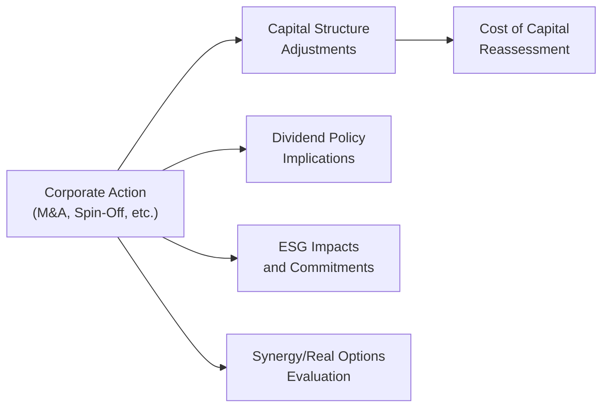

## Corporate Actions in a Broader Context

Corporate actions can be exciting, right? Mergers, acquisitions, share repurchases, spin-offs—these all feel a bit larger-than-life, maybe because they symbolize a company on the move. But at a more practical level, each of these moves actually ties back to many of the “everyday” topics we’ve tackled in corporate finance: capital budgeting, cost of capital, and even environmental, social, and governance (ESG) responsibilities. In this section, we’ll explore how various corporate actions intersect with these foundational areas and how they might ripple across the broader landscape of a firm’s payout policies, debt covenants, capital structure, and stakeholder perceptions.

Anyway, let’s dive in. You might have encountered these topics individually—like if you recall rummaging through a dividend policy case study or performing a cost of capital calculation in a vicarious example. Here, though, we bring everything together to see how a single corporate action can trigger changes (or at least a chain of re-evaluations) across multiple dimensions of the firm.

## Impact on Capital Structure and Cost of Capital

One of the most significant concerns when a corporate action arises is, “How will this affect our capital structure?” And often, “How might that shift our overall cost of capital?” Let’s say a firm announces an acquisition. Perhaps it’s a cash deal funded by issuing new debt. Immediately, the firm’s debt-to-equity ratio changes, right? That has direct implications for their Weighted Average Cost of Capital (WACC). If you increase your leverage by taking on more debt, you might reduce your WACC if the after-tax cost of debt is significantly lower than the cost of equity—at least up to a point. Beyond a certain debt load, the cost of debt can rise steeply, plus there are bankruptcy risks to consider. 

Now consider the opposite: the firm finances the acquisition by issuing common shares. That might keep the debt ratio stable, but the new shares potentially dilute existing shareholders’ positions. The cost of equity might shift because new shareholders will have new expectations or require a different market return. It may also affect your firm’s tail risk—especially if the market believes the firm bit off more than it can chew in the acquisition, leading to a higher cost of equity to compensate for the perceived risk.

Don’t forget about share splits and share repurchases as well. A share split won’t directly affect capital structure the same way a new debt issuance or a stock issue would, but it can influence market perceptions of liquidity and affordability for retail investors (which might indirectly affect the firm’s equity cost of capital). Meanwhile, a share repurchase lowers the number of outstanding shares, potentially changing EPS, but if funded with additional debt, it can shift the debt mix and thus the overall WACC.

## Influence on Dividend Policy and Payout

A central question for many corporate actions is: “What happens to the payout policy?” For instance, you might have seen companies that carefully maintain a stable dividend track record. But a major acquisition can force them to rethink everything. Will they still generate enough free cash flow to sustain a high dividend? Or do they need to retain those funds for debt service?

• Dividends: A newly levered firm post-acquisition may scale back or suspend dividends to ensure compliance with debt covenants. Or the integrating entity may desire to maintain a generous dividend if synergies quickly boost free cash flow.  
• Share Repurchases: Sometimes, a share repurchase might be paused if the firm needs to preserve liquidity for M&A integration or new capital budgeting projects. Alternatively, if a spin-off is planned, the parent might use share repurchases to optimize the capital structure once it’s rid of a non-core subsidiary.  
• Spin-Off Effects: After a spin-off, the newly independent entity and the original firm might each adopt new payout policies tailored to their unique risk profiles. The spin-off might be a growth-oriented entity that reinvests earnings rather than paying dividends, while the parent might maintain a shareholder-focused dividend policy.

It can feel like a juggling act. The key is that each corporate action reevaluates the firm’s leftover cash or changes the firm’s operational profiles, which in turn can support (or maybe threaten) current and future dividends or buybacks.

## Real Options and Synergies

When an M&A transaction or strategic alliance is on the table, real options become highly relevant. Let’s say you’re acquiring a smaller firm that has a brand-new technology platform. Even if the immediate financials aren’t blockbuster, you might be getting the real option to expand that technology in the future at scale, or pivot it into new markets. These expansions can create synergy—unexpectedly bigger outcomes from combining two organizations than from running them separately.

Synergies are not limited to expansions, though. Cost reduction synergy might come from shared resources, combined distribution channels, or cross-licensing. However, synergy realization can be tricky. An overestimation of synergy is a common reason for post-merger performance issues. This is where capital budgeting re-enters the conversation; synergy-based projects often have to be evaluated thoroughly, with scenario and sensitivity analyses to ensure that forecast cost savings or revenue growth is realistic.

Mermaid diagram below shows how a single corporate action—namely, a merger—can create ripple effects across capital structure, payout policy, synergy planning, and ESG concerns:

## ESG Considerations in Corporate Actions

Nowadays, it’s no longer enough to just do acquisitions based purely on the numbers. Stakeholders, especially large institutional investors, care about how a deal might affect a firm’s environmental footprint, social obligations, and governance structure. If the target firm has a poor ESG track record, the acquirer might need to invest more time and capital to bring it up to par. That could mean heavier compliance costs, new sustainability initiatives, or even changes in governance practices like board diversity or stricter oversight.

Debt financing decisions can also shift ESG priorities if the lenders require the company to maintain certain standards (e.g., green bond issuance with sustainable triggers). If, for instance, the target firm has different sustainability efforts—maybe it invests heavily in alternative energy or has progressive labor policies—the combined firm might adopt or adapt those ESG polices across the organization. All of this can then feed back into cost of capital. In some markets, “green financing” actually offers lower interest rates if the firm meets or exceeds sustainability metrics.

## Post-Merger Integration and Stakeholder Management

I remember one big post-merger meltdown: a major consumer products firm acquired a niche brand but completely overlooked cultural fit—everyone was excited about synergy, synergy, synergy, but no one toyed with the question: “Do these companies share the same approach to product development or employee engagement?” The brand synergy was overshadowed by internal strife, resulting in missed synergy targets. 

So, post-merger integration (PMI) can be huge. The standard tasks might include unifying HR policies, aligning the IT backbone, and consolidating supply chains. But from a financing lens, PMI also means reevaluating the combined firm’s capital budgeting priorities. You might have new projects or overlapping projects. Some might be cut. Others might see new synergy expansions. In addition, existing debt covenants and rating agencies may want to see a cohesive plan to ensure the combined firm remains (or becomes) creditworthy. 

On the ESG side, stakeholder management typically calls for consistent communication with employees, suppliers, community representatives, and environmental groups—especially if the new entity has a greater footprint or a changed governance structure. Investors want transparency, too. Disclose the relevant synergy drivers, the synergy timeline, and how the firm plans to handle potential layoffs or resource reallocation.

## Impact on Debt Covenants and Legal Agreements

Mergers and acquisitions—particularly if financed with new debt or a leveraged buyout—almost always prompt a recheck of existing debt covenants. Creditors set specific thresholds, such as coverage ratios or maximum leverage ratios, that limit a firm’s ability to take on big corporate actions. If a firm is already near one of these limits, it might need to renegotiate covenants or secure a waiver from the lenders. Sometimes the acquirer or combined firm must pay off existing debt entirely if “change of control” provisions are triggered.

Even share repurchases can raise red flags if the firm uses borrowed money to buy back shares. On the other hand, share splits usually won’t violate covenants (since they don’t typically alter capital structure in a big way), but the mechanical changes in share count might affect certain equity-based performance metrics spelled out in legal agreements or executive compensation plans.

## Vignette-Style Scenario

Imagine an established manufacturer, Acme Corp, that decides to acquire BetaTech, a smaller rival with cutting-edge technology in environmentally friendly components. Acme sees synergy potential: BetaTech’s IP could help it expand into new energy-efficient product lines. Hoping to realize cost synergies by combining supply chains, Acme finances the acquisition primarily with debt. Now Acme’s capital structure becomes more leveraged. Their WACC might remain stable or even go down if the interest rate is favorable, but it also might go up if the market perceives heightened risk. Meanwhile, shareholders wonder whether dividends are safe.

Turns out BetaTech’s workforce is used to a flexible remote working culture and invests heavily in sustainable packaging. Acme’s culture is more traditional. Post-merger, employees at BetaTech are anxious about losing autonomy. On the ESG front, BetaTech’s strong environmental profile actually lifts Acme’s overall sustainability rating, but only if Acme embraces BetaTech’s practices. That might require capital investments in brand-new supply chain components or an expanded R&D budget. 

At the same time, the CFO must keep a close eye on debt covenants. The spike in leverage might reduce short-term capacity to spend on share repurchases. If BetaTech’s synergy is realized earlier than expected, the combined cash flow might allow for resuming repurchases or possibly boosting the dividend. But if synergy lags or the cost of capital spikes, the dividend or repurchase plan might stay on hold, risking negative investor reactions.

This scenario highlights the interwoven nature of corporate actions. A single deal can simultaneously affect cost of capital, synergy realization, dividend policy, ESG commitments, and employee morale. 

## Exam Tips and Best Practices

• Always question how financing methods change a firm’s capital structure and WACC. Watch for the intersection with tax implications in different jurisdictions.  
• Tie your synergy assumptions to realistic capital budgeting techniques (e.g., NPV, IRR). If synergy is inflated, the entire M&A rationale unravels.  
• Keep an eye on the interplay with ESG standards. A corporate action might open new opportunities or highlight conflicting stakeholder interests.  
• Don’t forget about short-term liquidity. Even if synergy looks great in the long run, the firm must still handle day-to-day cash flows, pay down debt, and manage working capital.  
• Recognize that share splits, spin-offs, and share repurchases can be strategic signals. They may change investor sentiment or highlight managerial intent beyond the purely mechanical effect on share prices.  
• For post-merger integration, thoroughly map cultural alignment and governance issues—especially with an ESG lens.  
• Ensure compliance with existing debt covenants (or renegotiate them if needed). This is a prime area where exam vignettes might suddenly reveal a hidden covenant breach if you’re not careful.

## References

• CFA Institute Level II Program Curriculum, Corporate Issuers: Corporate Actions and Synergy Analysis  
• Brealey, R. A., Myers, S. C., & Allen, F. (Latest Edition). Principles of Corporate Finance.  
• Harvard Business School Publishing. M&A and Advanced Case Studies. Available at:  
  https://hbsp.harvard.edu/

## Testing Key Applications of Corporate Actions



### Acme Corp is acquiring a smaller rival using cash raised by issuing new debt. Which of the following is most likely to occur?

- [ ] The weighted average cost of capital remains identical to pre-acquisition because equity remains constant.
- [ ] The firm’s dividend payout ratio will automatically increase.
- [x] The firm’s financial leverage ratio will rise, possibly raising the cost of equity.
- [ ] The acquisition will have no effect on the firm’s capacity for future investments.

> **Explanation:** Issuing additional debt raises Acme Corp’s financial leverage, which can push up the cost of equity as investors perceive increased risk. While the cost of debt might be lower than equity in absolute terms, the higher leverage and potential changes in credit quality can alter the firm’s overall risk profile.

### Which best describes a “real option” in the context of acquisitions?

- [x] It is the future choice to expand or change the acquired target’s operations for additional gains.
- [ ] It is the legal right to walk away from the merger without penalty.
- [ ] It is a guarantee of immediate synergy value post-acquisition.
- [ ] It is the collateral used to secure financing for the transaction.

> **Explanation:** Real options in M&A refer to strategic choices embedded in a transaction, such as the option to expand operations, switch technologies, or enter new markets. They are not guaranteed gains but strategic privileges that could be exercised if conditions become favorable.

### Following a spin-off, which outcome is most likely for the spun-off subsidiary?

- [ ] It must adopt identical dividend policies as the parent company.
- [ ] It cannot list on a public stock exchange.
- [x] It may develop its own capital structure and payout policy, potentially distinct from the parent’s.
- [ ] It faces mandatory use of the parent’s existing board of directors.

> **Explanation:** After a spin-off, the newly independent entity typically has the freedom to create its own payout policy and capital structure. It also appoints a separate board of directors and can pursue listing independently, if desired.

### What is one direct advantage of financing an acquisition with stock (rather than cash)?

- [ ] It guarantees higher EPS for existing shareholders.
- [x] It may help preserve cash for other needs and reduce immediate leverage increases.
- [ ] It disqualifies the new entity from paying dividends.
- [ ] It eliminates post-integration cultural differences.

> **Explanation:** Issuing new shares to finance a deal can preserve the acquirer’s liquidity and keep leverage lower than if it took on debt. However, it may dilute existing equity holders, and it does not eliminate cultural or operational differences.

### A firm that buys back its shares using significant new debt will likely experience:

- [ ] An automatic boost in its credit rating.
- [x] A rise in leverage, possibly triggering higher interest costs or revised covenants.
- [x] Potential changes in EPS if net income is unaffected but the share count decreases.
- [ ] An immediate increase in DPS funded by the borrowed proceeds.

> **Explanation:** Taking on significant new debt raises leverage and potentially heightens interest expenses or covenant scrutiny. Meanwhile, repurchasing shares generally lowers share count, which can lead to higher EPS if net income remains constant.

### Why might a firm suspend its dividend right after a major acquisition?

- [x] To preserve cash flow needed for integration costs or debt obligations.
- [ ] To signal that it disapproves of shareholder returns.
- [ ] Because dividend payments spike regulatory triggers.
- [ ] Because dividend payments are never feasible post-acquisition.

> **Explanation:** After a large acquisition, the company may need to conserve cash to fund integration or meet debt service, prompting a dividend suspension or reduction. This does not automatically indicate a dislike of shareholder returns but rather a short-term strategic choice.

### In a merger, how can differing ESG practices become a financial concern?

- [ ] ESG practices never affect a merged entity’s performance.
- [x] The acquirer may need to invest resources to align the target’s ESG policies, affecting costs or synergies.
- [ ] ESG mismatches automatically nullify the deal.
- [ ] The target’s ESG rating merges with the acquirer’s with no financial consequences.

> **Explanation:** The acquirer often must commit resources to harmonize ESG standards and practices. This can impact expected cost synergies if additional spending is required to remedy differences in environmental, social, or governance policies.

### How does a high level of synergy expectation affect acquisition valuation?

- [ ] It reduces the bidder’s willingness to pay.
- [x] It typically raises the bidder’s perceived fair price, risking overpayment if synergy fails to materialize.
- [ ] It guarantees post-merger success.
- [ ] It has no impact on fair value calculations.

> **Explanation:** If synergy expectations are high, acquirers may be willing to pay a premium. Overestimation of synergy is a classic reason for paying too much and subsequently encountering goodwill write-downs or disappointing returns when synergy falls short of forecasts.

### Under a “change-of-control” provision in debt covenants, which scenario might occur?

- [x] Existing debt can become immediately due if the firm is acquired by another entity.
- [ ] Creditors must permanently lower the interest rate for the new entity.
- [ ] The acquiring firm inherits the target’s debt with no changes.
- [ ] All remaining covenants become void.

> **Explanation:** Many debt agreements have provisions that if ownership control shifts, creditors can demand immediate repayment or renegotiate terms. This protects lenders who might not wish to finance a merged or newly leveraged entity.

### A “hostile takeover” is best described as:

- [x] An acquisition attempt opposed by the target company’s management and board.
- [ ] A friendly negotiation where all parties agree on deal terms.
- [ ] A minor corporate action with no effect on governance.
- [ ] A spin-off orchestrated by the target’s shareholders.

> **Explanation:** A hostile takeover occurs when the acquiring firm pursues ownership of the target despite opposition from the target’s management or board, often by going directly to shareholders or using other takeover tactics.


