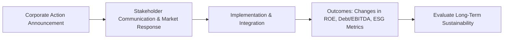

## Introduction

Well, let’s face it: corporate finance can feel like an abstract web of theories—ROE, WACC, net debt/EBITDA, synergy, you name it. But once you see how real companies navigate (or stumble through) big decisions, these metrics and concepts come to life. We often end up with a front-row seat to how balancing ESG commitments, payout policies, and growth initiatives can be quite the juggling act. In this section, let’s walk through some memorable real-world examples that tie everything together—from big acquisitions to ESG-driven reorganizations—to show how Corporate Issuers topics mesh seamlessly and sometimes clash spectacularly.

Just so we’re on the same page, you’ll see references to concepts we’ve tackled throughout this Volume (Chapters 1 through 10). Think of this section as a final synthesis exercise—one that highlights best practices, typical pitfalls, and the synergy of corporate finance strategies. I remember being at a finance conference where a CEO vividly compared balancing stakeholder interests to “riding a unicycle while juggling flaming torches.” It stuck with me because it highlights just how dynamic and tense corporate finance decisions can be in the real world.

## Why Use Real-World Case Studies?

Sometimes, the best way to learn is by seeing how actual, high-stakes decisions unfold. Real-world case studies offer:

• A deep look into a firm’s strategic thinking, including how it tackled (or overlooked) capital structure, dividend policy, or share repurchases.  
• Actual financial metrics like Return on Equity (ROE) and Debt/EBITDA Ratio before and after key corporate events.  
• A glimpse at how press releases, stakeholder communication, and market perceptions shape outcomes.  
• Lessons on integration risk, especially after major mergers or acquisitions—where synergy can be either realized or remain a pipe dream.  
• Cautionary tales of legal/reputational repercussions that remind us ethics is never optional.

## Case Study 1: A High-Profile Technology Acquisition

### Background
A few years ago, a leading tech giant (let’s call them “Galactica Tech”) acquired a smaller cloud-based software firm. Galactica Tech positioned this acquisition as part of a broader plan to upgrade its product line, reduce fierce competition, and unify the developer ecosystem under one brand. The deal was announced via a lengthy press release, filled with synergy buzzwords, strategic rationales, and promises of minimal disruption to existing operations.

### Key Financial Metrics
Before the acquisition:  
• ROE = ~15%  
• Net debt/EBITDA = 1.8x  
• WACC = ~8.5%

Shortly after the acquisition closed, Galactica Tech undertook a partial share repurchase program—aiming to return excess cash to shareholders, keep the stock’s momentum going, and signal confidence in the combined entity’s future. 

### Post-Acquisition Results
• ROE soared to ~18% within two years. Part of this jump was attributed to cost synergies, improved operating margins, and some share buybacks that effectively reduced equity.  
• Net debt/EBITDA climbed to 2.6x initially (due to funding the acquisition) but later fell to 2.0x as synergy savings kicked in and EBITDA expanded.  
• The market recognized synergy potential, but the new cloud-based solutions required heavier R&D expenses than originally projected. That meant the share repurchase pace had to slow down after a year to preserve some liquidity for further innovation.

### Lessons Learned
1. A well-communicated vision can smooth out post-merger integration risk. Stakeholder communication was consistent and forward-looking.  
2. A balanced approach to payout policy (dividends plus prudent buybacks) preserves flexibility while still rewarding shareholders.  
3. Maintaining or improving ROE in the aftermath of an acquisition signals operational and strategic success.  

That being said, Galactica Tech also had to scale back expansions in other areas, highlighting the reality that synergy benefits often come with trade-offs.  

### ESG Angle
Interestingly, Galactica Tech’s CEO pointed out in quarterly calls how the combined company aimed to lower energy consumption in its data centers—a nod to environmental considerations. While the immediate synergy focused on cost savings, the integration plan included ESG-driven optimizations (e.g., using renewable energy for servers). This fosters sustainable growth and improved brand perception—a small but crucial detail that captured the attention of long-term ESG investors.

## Case Study 2: A Retailer’s ESG-Driven Restructuring

### Background
Picture a prominent retailer—let’s refer to it as “Urban Fields”—struggling with flat sales. The Board identified consumer demand for socially responsible products as a strategic pivot. They decided to restructure the supply chain to adopt more ethical sourcing and slash carbon emissions. Alongside these moves, Urban Fields also slashed its dividend temporarily. Ouch, that was a bold choice.  

### Key Financial Metrics
Before restructuring:  
• ROE = 12%  
• Net debt/EBITDA = 3.2x  
• Dividend yield ~3%  

### Path to Sustainable Growth
Urban Fields installed new sustainability programs, partnered with local producers, and allocated capital to green initiatives. Despite the initial sting of cutting dividends, the plan was to bolster consumer loyalty, reduce reputational risk, and lower operational costs in the long run (like less waste, more energy-efficient logistics).

After two years:  
• ROE = 9% (it dipped due to higher restructuring costs and decreased net income)  
• Net debt/EBITDA = 2.9x (slightly improved through cost-saving measures)  
• Dividend partially restored (yield ~1.8%)  

### Stakeholder Communication
Urban Fields faced significant pushback from yield-focused investors when they cut their dividend. The CFO held numerous press releases and analyst calls to explain the rationale: the short-term dividend reduction would fund the long-term shift to ESG-based competitiveness. Over time, negative sentiment faded as new, eco-conscious consumers flocked to the brand.  

### Lessons Learned
1. ESG considerations may demand up-front costs, but they can create new pockets of growth—particularly in brand loyalty.  
2. Clear and proactive communication to stakeholders reduces backlash. You can’t just drop the dividend and vanish.  
3. Debt usage in the short term can rise while you fund new initiatives, and that’s not necessarily bad if it positions the company for sustainable growth.  

## Case Study 3: The Share Repurchase Program That Backfired

### Background
Now, not all share repurchases go as planned. A manufacturing conglomerate—let’s call it “Titanic Consol”—observed robust cash flows in one division and decided to launch an aggressive open market buyback program. The intention was to prop up the share price and boost EPS quickly. Sound glamorous? Possibly. But the underlying fundamentals were a bit shaky—specifically, Titan’s other divisions were weighed down by cyclical downturns.  

### Key Financial Metrics
Before the buyback spree:  
• ROE = 14%  
• Net debt/EBITDA = 2.0x  
• EPS = $2.50  

### The Spiral
Management ramped up the buyback during what turned out to be the peak of the market cycle for their core products. Shortly after, commodity prices plummeted, and demand for their equipment slowed. The debt-financed repurchases pushed Net debt/EBITDA to 3.6x, straining liquidity. EPS initially rose to $2.80 (fewer shares outstanding), but as earnings decelerated, the share price cratered.

The Board eventually suspended the buyback and cut the dividend to preserve cash. Titanic Consol’s reputational standing also took a hit because stakeholders felt misled by management’s overly optimistic statements.

### Lessons Learned
1. Timing matters—repurchases close to cyclical market peaks can lead to higher risk if the underlying business weakens.  
2. Over-leveraging can damage financial flexibility, especially when external factors (like commodity swings) strike.  
3. Transparent stakeholder communication (and perhaps lower repurchase volumes) might have averted steep reputational repercussions.

## Common Themes and Best Practices

A handful of themes emerge across these case studies:

• Integration Risk. Acquiring or merging companies must align goals, cultures, and processes. Post-merger synergy is rarely automatic.  
• Clear Stakeholder Communication. Whether it’s cutting a dividend or launching a new ESG initiative, transparent rationale builds trust.  
• Balanced Capital Allocation. Dividends, share repurchases, or capital for ESG and innovation—finding that sweet spot is more art than science.  
• Sensitivity to Market Cycles. For cyclical industries, timing is everything in major capital decisions.  
• Governance and Oversight. A well-structured board can help keep management’s more “adventurous” impulses in check.  

And let’s not forget legal/reputational repercussions: once you lose trust, it’s very tough to get it back, and that can translate into higher WACC, depressed share price, or even lawsuits.

## A Systematic Approach for Analysts

Suppose you’re trying to dissect a press release or a 10-K filing about a major corporate event. Consider this framework:

1. Identify the Corporate Action  
   – Merger, repurchase, dividend change, ESG-driven restructuring, or something else.

2. Gather Key Metrics  
   – Pre-event and post-event ROE, WACC, Net debt/EBITDA, etc.

3. Assess Strategic Objectives  
   – Is this about synergy, brand building, cost savings, stakeholder alignment, or growth?

4. Examine Funding Sources  
   – Debt-financed or equity-financed? Are there major changes to the capital structure?  

5. Evaluate Communication & Governance  
   – Did management and the board provide transparent, timely updates? How did investors respond?

6. Monitor Short- and Long-term Outcomes  
   – How did the share price, earnings, and stakeholder sentiment evolve over time?

This systematic approach keeps you grounded, ensuring you’re not swayed by big headlines or fancy synergy talk alone. Remember that sustainable growth demands that you weigh all stakeholders’ interests while keeping an eye on the financial fundamentals.

The above diagram is a straightforward way to visualize how a corporate action flows from announcement to real outcomes—and how each step can be pivotal in ensuring lasting value creation.

## Bringing It All Together

In each of these scenarios, we observe distinct outcomes shaped by how proactively or hastily management tackled capital structure, payouts, ESG, and integration risk. Case studies like these remind us that financial metrics are more than just formulas: they represent real companies making real decisions that affect employment, the environment, and investor portfolios.

Whenever you see a major corporate announcement, slip on that analyst’s hat. Look at the published press release. Note the buzzwords (synergy, ESG alignment, returning capital, etc.). Then dig deeper—check the company’s stakeholder communication track record; see if the stated synergy is plausible given the companies’ cultures and markets; look for changes in official guidance for ROE or net debt/EBITDA. Above all, compare the newly proposed strategy to the firm’s historical risk appetite, governance structure, and brand or ESG commitments.

And that leads us nicely into the simplest but most overlooked piece of advice: keep a healthy dose of skepticism. Markets can get pretty excited about big M&A deals or large share repurchases. But hype rarely replaces well-grounded, data-driven analysis.  

## References & Further Reading

• CFA Institute Level II Program Curriculum, Corporate Issuers: Case Study Analyses.  
• Kaplan, Robert S., and Norton, David P. “The Balanced Scorecard: Translating Strategy into Action.”  
• McKinsey & Company, “M&A Practice,” https://www.mckinsey.com/business-functions/strategy-and-corporate-finance  

---

## Test Your Knowledge: Synthesis and Best Practices in Corporate Finance



### Which of the following is the MOST critical component for ensuring a smooth post-merger integration?

- [ ] Rapidly increasing the post-deal dividend.
- [x] Transparent stakeholder communication throughout all stages.
- [ ] Immediately issuing a large share repurchase program.
- [ ] Strictly maintaining the old capital structure.

> **Explanation:** While payout policies and capital structure are important, they do not directly mitigate integration risk as effectively as clear, transparent stakeholder communication. Earnings synergy often relies on integrating operations smoothly, and investor confidence hinges on receiving timely, transparent updates.

### In the context of Case Study 1 (Galactica Tech’s acquisition), which outcome best illustrates effective synergy realization?

- [ ] A decline in EBITDA accompanied by a stable share price.
- [x] The rise in ROE following cost efficiencies and successful integration.
- [ ] A major debt issuance that increased net debt/EBITDA significantly.
- [ ] The immediate discontinuation of share repurchases.

> **Explanation:** Cost savings and complementary assets led to higher operating margins for Galactica Tech, which translated into a notable ROE improvement. Increasing debt or discontinuing share repurchases might be part of the strategy, but they don’t necessarily prove synergy realization.

### A company that issues a significant share repurchase program at the peak of a cyclical market is MOST likely to:

- [ ] Reduce its Debt/EBITDA ratio.
- [ ] Strengthen its liquidity position.
- [x] Face a risk of overleveraging if revenues decline.
- [ ] Immediately boost its ROE without any downside risk.

> **Explanation:** Buying shares at a market peak can be costly. If revenues later decline—as often happens in cyclical industries—the company’s debt burden may become unsustainable, exposing it to liquidity risk.

### Which of the following statements about ESG-driven restructuring is TRUE based on Case Study 2 (Urban Fields)?

- [ ] ESG transformations have zero impact on liquidity.
- [x] ESG improvements can initially depress ROE due to restructuring costs.
- [ ] High dividend payouts are always maintained during ESG overhauls.
- [ ] ESG efforts only matter if they are mandated by regulators.

> **Explanation:** Urban Fields had to cut its dividend and endured a temporary ROE dip, showing that ESG transitions can require significant upfront costs before long-term benefits arrive.

### Which ratio is MOST likely to be impacted by an acquisition financed largely with debt?

- [x] Net debt/EBITDA
- [ ] Cash flow coverage ratio (CFO ÷ interest payments)
- [ ] Current ratio (current assets ÷ current liabilities)
- [ ] Total asset turnover

> **Explanation:** When a firm finances an acquisition with debt, its liabilities increase, causing net debt to climb relative to EBITDA. This ratio is often watched by credit analysts and ratings agencies as an indicator of leverage.

### A “systematic approach” to analyzing a major corporate event typically includes:

- [x] Identifying the event, assessing key metrics, understanding strategic objectives, and evaluating short- and long-term impact.
- [ ] Immediately inferring that synergy claims are accurate and endorsing management’s narrative.
- [ ] Focusing only on the share price movement in the days following the announcement.
- [ ] Relying solely on the company’s press release without seeking further data.

> **Explanation:** A methodical assessment demands deeper due diligence: reading filings, press releases, linking metrics to strategic goals, and gauging the long-range outcomes.

### Which factor is MOST important in assessing whether a dividend cut could benefit long-term sustainable growth?

- [ ] High short-term share price volatility in the market.
- [ ] Immediate distribution of the saved cash to senior executives.
- [x] The strategic reinvestment of retained earnings into growth or ESG initiatives.
- [ ] Using the funds for a self-tender share repurchase program exclusively.

> **Explanation:** Cutting a dividend can be advantageous in the long run if the cash is used productively—like reinvesting in technology, ESG improvements, or expansions that strengthen a firm’s competitive position.

### When management prioritizes ESG initiatives that require significant capital investment, which of the following is likely TRUE?

- [x] During early-stage ESG adoption, ROE may temporarily decrease as costs rise.
- [ ] ROE instantly jumps because markets always reward ESG developments.
- [ ] Payout policies typically remain unaffected.
- [ ] The firm’s net debt/EBITDA ratio automatically falls.

> **Explanation:** Substantial ESG capital outlays may reduce short-term profits, thus pushing key metrics (like ROE) lower. In the long run, cost savings and brand loyalty may boost returns and reduce financial risk.

### Which of the following best describes the potential outcome if a firm neglects integration risk after a major M&A?

- [ ] Immediate improvement in EPS and ROE.
- [ ] Decreased volatility due to reduced complexity.
- [x] High possibility of operational disruptions, culture clashes, and unmet synergy targets.
- [ ] Automatic cost savings that surpass preliminary estimates.

> **Explanation:** Overlooking integration risk can wreak havoc—process inefficiencies, cultural disconnects, and synergy shortfalls can easily happen, derailing the entire M&A rationale.

### True or False: Legal and reputational repercussions from ill-managed corporate actions often lead to an elevated WACC in subsequent years.

- [x] True
- [ ] False

> **Explanation:** Negative publicity, lawsuits, and regulatory scrutiny can undermine investor trust, increasing the firm’s risk profile and pushing up its required returns on both debt and equity—i.e., a higher WACC.


