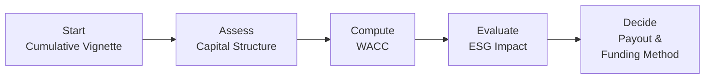

## Introduction and Objectives

Cumulative vignettes can sometimes feel, well—daunting. You’re reading through what seems like pages of text, reviewing a pile of exhibits and footnotes, and then, as if that weren’t enough, you’re told, “Now go compute a revised weighted average cost of capital, incorporate a new carbon emissions regulation, and propose a share repurchase plan—but watch out for stakeholder backlash!” It’s a mouthful. And it’s precisely this type of integrated scenario you should expect in the Corporate Issuers portion of the CFA® Level II exam.

In this section, we’ll tackle sample practice sets that mirror the real test environment. We’ll integrate topics like capital structure, payout policy (dividends vs. share buybacks), ESG (Environmental, Social, and Governance) considerations, M&A synergy forecasts, cost of capital adjustments, and stakeholder trade-offs. Our goal is to help you adapt quickly to “twists” (unexpected changes like new regulations or negative press) and maintain an exam-focused approach. So let’s dive in.

## Integrating Multiple Corporate Issuers Concepts

CFA Level II rarely tests concepts in isolation. Instead, you’ll find that capital structure decisions are tangled up with payout policy, or that an ESG factor triggers changes in a cost of capital estimate. In real life, corporate finance decisions are interconnected—one move impacts the rest. These cumulative vignettes intentionally replicate that complexity.

• Capital Structure: Think of how a firm balances debt and equity, especially when new expansions or leveraged buyouts (LBOs) are on the table. Debt affects the firm’s weighted average cost of capital (WACC), while equity gets diluted or enriched by share issuances and buybacks.  
• Payout Policy: A firm’s choice of dividend distribution or share repurchase resonates deeply with signals it sends to the market and the push-pull between satisfying shareholders vs. retaining capital for growth.  
• ESG Considerations: As explored in Chapters 5 and 6, environmental and social regulations can alter everything from capital budgeting priorities to brand reputation. If a company is required to invest in greener technology by 2030, that’s going to shape the firm’s cash flow projections—and possibly even payout decisions.  
• Stakeholder Management: Corporate finance decisions should account for everyone: employees, creditors, regulators, and of course, shareholders. A large share repurchase might be music to shareholders’ ears yet create friction with creditors concerned about rising leverage.  
• Regulatory Twists: Regulatory changes (like heightened carbon emissions regulations) can knock your best-laid forecasts completely off track. Being ready for dynamic reassessment—scrapping old assumptions and recalculating new ratio benchmarks—is a key skill at Level II.

Below, we explore a structured approach to cumulative practice vignettes. We’ll talk about best practices, major pitfalls, and how to manage your time so you’re not deep in the weeds when that exam clock ticks relentlessly.

## Structure of a Cumulative Vignette

Typically, a cumulative vignette may begin with an overall scenario describing the company’s background and the strategic challenges it faces. Then it dives into data exhibits—financial statements, ratio snapshots, cost of capital estimates, or recent market data. It might round out with extra “twists” that require rethinking your initial assumptions:

1. Company Overview:  
   A short narrative about the firm—industry focus, ownership structure, and any upcoming major projects or expansions.

2. Existing Financial Statements:  
   Summaries of the income statement, balance sheet, cash flow statement, and possibly footnotes revealing additional complexities (like convertible debt or intangible assets from a recent acquisition).

3. Proposed Corporate Actions:  
   Items such as share repurchase, new bond issuance, a dividend hike, or an acquisition. You might also see references to an LBO, meaning the acquisition is financed with a big chunk of debt.

4. ESG Considerations:  
   Mentions of regulatory compliance or environmental rules. This might include carbon emission targets or social governance policies that require certain board structures.

5. Stakeholder Pressures:  
   Possibly a mention of creditors pushing back against higher leverage, or activists demanding a different payout policy.

6. Time-Sensitive Updates:  
   Early in the vignette, you might see a plan for a new product launch. Midway, you might find a twist—maybe the government introduced new carbon emissions regulation, or the market turned south, slashing the firm’s stock price. This can change the entire cost of capital picture.

Ultimately, you’ll be asked to combine these factors and produce recommended actions—like adjusting the capital structure or reevaluating a share repurchase plan. The exam expects quick, accurate computations and well-structured logic.

## Practical Example: “GreenValley Corporation”

Let’s simulate a simplified version. (In the final exam, expect extra pages of data, but we’ll keep it a bit more concise here.)

GreenValley Corporation (GVC) is a mid-sized consumer-goods manufacturer with an emphasis on eco-friendly packaging. They’re considering a significant new investment in biodegradable technology that requires heavy capital expenditures. Meanwhile, GVC is also pondering whether to buy back shares given recent cash accumulation. At the same time, GreenValley faces a fresh wave of carbon emissions regulation that mandates all manufacturers reduce their carbon footprint by 40% in the next five years.

### Financial Snapshot

• Current Debt: $200 million in 5% coupon bonds maturing in ten years. GVC’s bond rating is BBB+.  
• Equity: 50 million shares outstanding, trading at $20 per share → Market cap is roughly $1 billion.  
• Current EPS: $1.75.  
• Dividends: $0.50 per share annually.  
• Beta: 1.2 (equity risk premium assumed at 5%). Risk-free rate: 2%.  
• Current WACC Estimate (before new regulation): 8%.  
• Debt/Equity Ratio: 0.20 (book values).  

Based on these numbers, GVC’s cost of equity (rE) using CAPM is 2% + 1.2(5%) = 8%. If the firm’s tax rate is 25%, the after-tax cost of debt is 5% × (1 – 0.25) = 3.75%. Weighted by the capital structure, we get WACC near 8%. Currently, the firm has a comfortable interest coverage ratio, and credit agencies are neutral on its leverage.

### Considering a Share Repurchase

Management is exploring a share buyback of $50 million, about 5% of current market cap. The CFO hopes this signals confidence to investors and lifts the stock price. But there’s a rub: if regulators impose a new requirement (like carbon taxes or mandated eco-tech capital spending), the firm’s free cash flow might shrink, raising questions about the prudence of returning cash to shareholders now.

### Impact of Carbon Emissions Regulation

The newly proposed **carbon emissions regulation** requires bigger investments in eco-friendly machinery—an upfront cost of $80 million. GVC might fund this with new debt at 6% or tap internal cash. Either way, the firm must weigh the net impact on future operating cash flows and consider the brand benefits of going green, especially in a consumer goods market increasingly sensitive to sustainable practices.

### Stakeholder Management

Shareholders are excited about buybacks but supportive of GVC’s green goals. Creditors, on the other hand, are cautious about new borrowing. Meanwhile, several large institutional investors have strong ESG mandates: if GVC doesn’t move aggressively on the green front, those funds might reduce their holdings. The board is stuck in the middle—trying to keep everyone happy while maintaining healthy financial ratios.

### Dynamic Reassessment

Midway through Q2, GVC experiences a negative press wave about alleged waste management issues at one of its factories. The stock dips from $20 to $17. The CFO’s share repurchase plan might now be an opportunity to buy shares “on the cheap.” However, there’s also a new sense of urgency about cleaning up the firm’s environmental record. This is what we call a **dynamic reassessment**. You may need to re-crunch your ratio projections, re-forecast the cost of equity (possibly beta changes if negative press raises perceived risk), and consider additional capital expenditures.

At times, I recall seeing CFOs debate for days on end—should we go bigger on ESG initiatives to restore trust or maintain a robust buyback program? Under exam conditions, though, you have minutes to make that call. So, let’s outline a method.

## Recommended Approach Under Exam Time Constraints

• Skim the Big Picture First: What’s the overall story? High debt or low debt? Large capex? Tense relationships with creditors or regulators?  
• Identify Key Numbers and Formulas: Spot the cost of capital data, capital structure ratios, and any forecasted changes to free cash flow. Write them down or highlight them.  
• Perform Calculations Systematically: If you need to recalculate WACC, do it carefully. If you need to test share repurchase effects on EPS or book value per share, do that next.  
• Watch for Twists: Re-check your assumptions if you see a “market downturn” or “new regulation.” The exam often requires you to pivot mid-scenario.  
• Propose a Strategy: The exam might ask for your recommended course of action—e.g., “Should GVC proceed with the share buyback or invest more in carbon reduction technology?” Provide the “why,” referencing ratio analysis and cost of capital changes.  
• Justify in Writing: Offer a concise bullet-point rationale. For instance, “By funding the new emissions project with internal cash, GVC can continue paying a stable dividend while smoothing credit metrics—a balanced approach to stakeholder interests.”

## Best Practices in Ratio Analysis and Forecasting

When you see the phrase **ratio analysis** in a cumulative vignette, be prepared to compute or interpret:

• Leverage Ratios: Debt/Equity, Debt/EBITDA, Interest Coverage.  
• Liquidity Ratios: Current Ratio, Quick Ratio, Cash Flow from Operations to Debt.  
• Profitability Ratios: Net Margin, Return on Equity (ROE), Return on Invested Capital (ROIC).  
• Market Ratios: P/E, Dividend Yield, Price/Book.

If you detect a major shift in capital structure—like a big share buyback financed by debt—leverage ratios will jump, which might affect bond ratings. Similarly, if the company invests heavily in new green initiatives, you might see a short-term dent in profitability ratios or immediate free cash flow, but an uptick in intangible brand value or investor goodwill.

For **scenario-based forecasting**, you apply best-guess assumptions to every scenario:

1. High Leverage Scenario: Suppose GVC borrows most of the funding for new machinery. That raises interest expense, lowers coverage ratios, and might push the cost of debt higher if credit rating agencies react negatively.  
2. Low Leverage Scenario: GVC uses mostly cash on hand plus a modest equity issuance. This helps preserve credit metrics but dilutes existing shareholders.  
3. Mixed Funding with ESG Grants: Perhaps there’s a government program providing partial grants or tax breaks for carbon reduction equipment, offsetting some capital costs.

Under exam conditions, watch for details about interest rate changes or the firm’s adjusted cost of capital after a rating upgrade (or downgrade). Rarely does the exam wait for you to figure these out from scratch; it typically nudges you with data in an exhibit.

## Multiple Stakeholder Perspectives

**Stakeholder management** is crucial. Larger share repurchases might annoy creditors if the firm’s interest coverage becomes precarious. By contrast, major expansions into carbon neutrality could please ESG-minded shareholders but might cause short-term hits to dividends. The exam might ask you to weigh these competing viewpoints and state which option maximizes shareholder value without excessively harming creditors or employees.

Remember, sometimes the “best” solution in a question might not be the highest returning scenario in an immediate sense, but rather the one that balances the **risk–reward trade-off** across time. The firm’s long-term viability matters— especially in a world increasingly vigilant about environmental footprints.  

## Visualizing the Flow

Below is a simple flowchart highlighting how capital structure, cost of capital, ESG, and payout decisions interrelate:

It’s a bit simplified; in a real exam scenario, you might bounce back and forth as new info emerges. Nonetheless, it’s a decent mental map to keep track of the big pieces.

## Leveraged Buyouts (LBOs) in Practice

One scenario you may see is a prospective **Leveraged Buyout (LBO)**. This typically involves a private equity firm acquiring GVC with borrowed money, possibly loading the target’s balance sheet with debt. LBOs highlight the interplay of:

• Financing: The new owners might refinance at different rates, affecting cost of debt.  
• Payouts: Post-LBO, the new owners might extract dividends (dividend recapitalization) or reduce them to focus on debt repayment.  
• Governance: The new owners typically exercise tight control; ESG might rank differently in their priorities.  
• Risk: Creditors face heightened default risk if the LBO is highly leveraged.

On the CFA exam, you might calculate post-transaction leverage ratios, interest coverage, or synergy estimates. You might also see a twist: negative press coverage about “job cuts” or “disregard for ESG,” forcing a reevaluation of brand risk.

## Putting It All Together: Efficient Exam Strategy

1. **Read Once, Summarize Quickly:** Don’t get lost in every detail on the first pass. Mark up the key numbers, formulas, or triggers for ratio calculations.  
2. **Identify Repeated Clues:** The exam might mention “dividend yield is a priority for shareholders” more than once, or “creditors are concerned about coverage falling below certain covenants.” These are hints.  
3. **Perform Calculations Step-by-Step:** If you hurry too fast, you’ll mix up your cost of equity or forget to incorporate the new regulation’s effect on free cash flow.  
4. **Stay Alert for Twists:** The entire scenario can shift if you skip a line about a credit rating downgrade or new environmental penalties. Revisit your initial computations accordingly.  
5. **Express Sound Judgment:** The final question often says something like, “Based on the data provided, recommend the best approach for….” That’s your chance to shine. Integrate cost of capital results, ratio changes, stakeholder concerns, and ESG ramifications into a cohesive argument.  
6. **Time Awareness:** Resist the urge to over-explain. Provide enough reasoning to justify your choice. The exam is about correctness and clarity, not lengthy novel-writing.

## Common Pitfalls

• **Ignoring Data Updates:** Failing to notice that the WACC changed when the risk-free rate was updated in the exhibit footnotes.  
• **Forgetting Taxes:** Overlooking tax implications on cost of debt or net cash flows.  
• **Misjudging ESG Costs/Benefits:** Excessively penalizing a project for green investments without factoring intangible benefits (like brand loyalty or avoided penalties).  
• **One-Sided Stakeholder Analysis:** Pandering solely to stockholders or creditors instead of balancing.  
• **Overlooking Non-Financial Twists:** Negative public relations or regulatory fines can have real financial consequences, even if they’re not neatly labeled on the statements.

## Final Thoughts on Cumulative Vignette Mastery

These vignettes are intentionally multifaceted, so approach them systematically. In real-world corporate finance, managers must juggle big questions about capital allocation while navigating uncertain environments. The exam tries to reflect this reality by testing not just your memorized formulas (although you need those) but also your ability to adapt, recalculate, and evaluate the bigger picture. Mastering these integrated item sets is vital for success at Level II.

It’s normal to feel pulled in different directions—should you emphasize buyback or ESG investments? Should you keep debt moderate or leverage up? The best approach: examine the trade-offs quickly, weigh your stakeholder impacts, and pick the rationale that best fits the data.

---

## References & Further Reading

• CFA Institute Level II Program Curriculum, Complete Review of Corporate Issuers Topics.  
• Schweser, Kaplan. “CFA Level II Practice Exams & Mock Exams.”  
• “Environmental Regulations and Corporate Strategy,” Journal of Corporate Finance.  

---

## Test Your Mastery: Cumulative Vignette-Style Questions



### 1. GreenValley Corp. intends to fund a major eco-friendly plant upgrade using $80 million of debt at 6%. Its current WACC is 8%. Which immediate effect is most likely?

- [ ] A decrease in total debt and improved credit rating.  
- [x] An increase in leverage ratios and potential interest coverage concerns.  
- [ ] A direct drop in the firm’s cost of equity.  
- [ ] No effect on stakeholder relationships.  

> **Explanation:** By borrowing $80 million, the firm increases its total debt, which boosts its debt ratios. This can raise concerns about interest coverage and possibly impact the credit rating.  

### 2. Following an LBO announcement, which is the primary risk for existing bondholders?

- [ ] Increased liquidity for bondholders.  
- [ ] Higher future dividends to current shareholders.  
- [x] Elevated default risk stemming from higher leverage.  
- [ ] Improved ESG performance of the target firm.  

> **Explanation:** LBOs typically add substantial debt to the target’s balance sheet, heightening default risk for existing bondholders.  

### 3. In a scenario where a sudden market downturn eliminates the firm’s free cash flow, what does an ongoing share repurchase typically imply?

- [ ] It means the firm’s debt load is automatically lowered.  
- [ ] It proves the firm’s credit rating will be maintained.  
- [x] It can strain the firm’s liquidity and heighten stakeholder conflicts.  
- [ ] It eliminates the need for cost of capital adjustments.  

> **Explanation:** If free cash flow declines, continuing a share buyback can cause liquidity pressures, triggering concerns among creditors or other stakeholders about solvency.  

### 4. An unexpected regulatory change raises the corporate tax rate. How would this directly affect the after-tax cost of debt?

- [ ] It reduces the interest tax shield, leading to a higher after-tax cost of debt.  
- [ ] It has no impact on bond coupon rates.  
- [x] It increases the interest tax shield, leading to a lower after-tax cost of debt.  
- [ ] It raises the cost of equity but not the cost of debt.  

> **Explanation:** Higher corporate taxes increase the tax shield on interest expense, thus reducing the after-tax cost of debt.  

### 5. If a regulatory body mandates a 40% carbon emission reduction, which statement most accurately represents the potential capital budgeting impact?

- [ ] The project’s NPV automatically becomes negative.  
- [ ] Capital structure is unaffected.  
- [x] Additional capital expenditures might temporarily lower free cash flow and shift the firm’s capital allocation decisions.  
- [ ] The firm can ignore taxes in these calculations.  

> **Explanation:** ESG-driven regulations often require fresh investment (capex), which reduces free cash flow in the short term and impacts how the firm allocates capital.  

### 6. A company’s board is weighing a large share buyback against an increase in dividends. In a cumulative vignette scenario, which factor most influences the final decision?

- [ ] The CEO’s personal preference.  
- [ ] Regulatory disclosure requirements alone.  
- [x] The respective impacts on EPS, cost of capital, and stakeholder expectations.  
- [ ] Whether the CFO has free time to manage repurchases.  

> **Explanation:** Payout policy decisions revolve around financial impacts (EPS, WACC effects) and stakeholder attitudes. A buyback can boost EPS; a dividend increase may cater to income investors.  

### 7. Hygro Corp. just performed a leveraged recapitalization, issuing new debt to finance a special dividend. What is the immediate effect on the debt-to-equity ratio?

- [x] It rises, reflecting increased debt.  
- [ ] It remains unchanged, as dividends do not impact capital structure.  
- [ ] It falls, reflecting new equity issuance.  
- [ ] It eliminates credit risk.  

> **Explanation:** A leveraged recapitalization typically increases total debt, pushing the debt-to-equity ratio higher.  

### 8. When negative press coverage increases a firm’s beta from 1.2 to 1.4, how is the cost of equity affected under CAPM (assuming a 2% risk-free rate and 5% market premium)?

- [ ] New cost of equity = 2% + 1.2(5%) = 8%.  
- [ ] No change in cost of equity if dividends remain constant.  
- [ ] New cost of equity = 3%.  
- [x] New cost of equity = 2% + 1.4(5%) = 9%.  

> **Explanation:** CAPM states rE = RF + Beta × Market Risk Premium. A higher beta raises the cost of equity, here to 9%.  

### 9. Which outcome from an environmental regulation twist is most plausible in a cumulative vignette?

- [x] The firm revises capital structure plans to accommodate new eco-investment.  
- [ ] Organic free cash flow automatically doubles.  
- [ ] LBO financing disappears entirely.  
- [ ] Shareholders cease to care about returns.  

> **Explanation:** An unexpected environmental rule (like stricter carbon limits) often forces the firm to adjust its plans. This could mean new financing needs or reconsideration of existing debt levels.  

### 10. True or False: In cumulative vignettes, final exam recommendations should consider both quantitative metrics (like WACC and EPS) and qualitative ESG/stakeholder factors.

- [x] True  
- [ ] False  

> **Explanation:** The CFA Level II exam emphasizes applying financial metrics alongside stakeholder and ESG insights. A purely quantitative view can miss vital governance or environmental dynamics.


