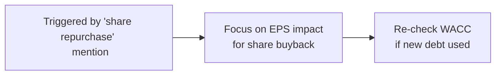

## Introduction

Complex, multi-topic item sets can feel like a labyrinth—one moment you’re calculating cost of capital and the next you realize the vignette has an ESG twist that modifies the firm’s payout policy. It can be, um, overwhelming. In my first go at a CFA mock exam, I distinctly remember fumbling through a question that merged a share repurchase plan with an M&A synergy analysis. Let’s just say I wasted a ton of time because I didn’t have a systematic plan. But don’t worry: by strategically breaking down the vignette into smaller sections and building a structured approach, you can save yourself a headache on exam day.

Below, we’ll look at methods for scanning vignettes, identifying key data, segmenting the reading, and linking calculations. We’ll also discuss common pitfalls, from missing a subtle footnote on tax implications to breezing past a line about environmental compliance costs. In other words, you’ll have a concise plan of attack for item sets that throw everything and the kitchen sink at you.

## Understanding Multi-Topic Vignettes

Before diving into specific strategies, let’s step back and see why multi-topic vignettes are a big deal in the CFA Level II Corporate Issuers space. These question sets often blend concepts like:

• Capital structure changes (equity vs. debt financing).  
• Dividend or share repurchase intricacies.  
• M&A restructuring synergies.  
• ESG considerations such as governance or environmental stewardship.  
• Cost of capital modifications (tax changes, new market data, or expansions abroad).  

When these ideas appear together, the synergy—or confusion—runs high. Missing one small detail (like citing the wrong interest expense in your WACC calculation) can ripple across every subsequent answer. And guess what? The exam loves to test you on exactly those interdependencies.

## Step-by-Step Approach to Complex Item Sets

### Step 1: Prepare

Before you even read the vignette, refresh your mind on the core Corporate Issuers concepts. This is where your understanding of capital structure (Chapters 7 and 8), dividend policy (Chapters 2 and 3), and ESG frameworks (Chapters 5 and 6) come into play. You know that big topics in Corporate Issuers often feed into each other. A great first step is creating a mental “toolkit” of formulas and concepts:

• Weighted Average Cost of Capital (WACC) nuances.  
• Dividend discount model (DDM) for traditional valuations, plus variations like the H-model.  
• Agency costs affecting payout policies.  
• ESG risk metrics—particularly if there’s an effect on the firm’s financing or reputation.  

Have these at your fingertips so you’re not scrambling to recall them.

### Step 2: Scan the Vignette

When you see the item set, do a quick scan. I used to circle or highlight key phrases like “leverage,” “bond issue,” “repurchase plan,” or “common shares outstanding.” These words are basically your triggers telling you which concept is about to get tested. Watch out for footnotes too. Sometimes the difference between a correct and incorrect answer lies in a small detail in the fine print: “an additional $5 million interest expense from convertible bonds” or “a partial year dividend distribution due to mid-year share issuance.”

This initial pass isn’t about solving anything. It’s more like getting your bearings—like walking into a museum, seeing the exhibits, and noting which ones you want to revisit first. If the vignette references multiple corporate actions (e.g., a proposed acquisition plus an ESG-driven product shift), mentally note that you could confront synergy calculations, environmental compliance costs, or adjustments to free cash flow.  

### Step 3: Systematize Your Reading

Now, go back through the vignette in an orderly fashion. Some people love color-coding: for instance, you might underline all cost-of-capital data in green, highlight any mention of dividends in yellow, and circle references to synergy in red. Another approach is using margin annotations. I’ve found simple margin notes—like “EPS calc here,” “check synergy,” or “ESG disclosure?”—to be super valuable and less distracting than a rainbow of highlighters. The key is to ensure that when you return to each paragraph, you know exactly which data points matter.

### Step 4: Segment the Text

Often, the vignette is already segmented for you (e.g., a short background, a data table, footnotes, and concluding remarks from management). Consider each of these segments:

• Background: Typically gives the setting (firm history, ownership structure, business lines).  
• Financial Data and Tables: Contains raw numbers you might use for calculations (EBIT, share count, interest expenses, dividends, synergy estimates).  
• Strategy Discussion: Management’s statements about potential acquisitions, ESG initiatives, or capital budgeting decisions.  
• Footnotes: Additional clarifications that might alter your calculations—like tax rates only applying to certain subsidiaries, or partial-year ownership for synergy benefits.  

Matching each segment to likely question areas is essential. You might label them in your mind or on scratch paper as “Segment A – general firm details,” “Segment B – current financials,” “Segment C – planned transactions,” and “Segment D – footnotes for adjustments.”

### Step 5: Formulate Potential Solutions

As you read, start brainstorming the formulas or frameworks you’ll need:

• For a question about the effect of share repurchases on EPS, you might remember:  
  – New EPS = (Net Income – Additional Costs) / (Shares Outstanding – Shares Repurchased).  

• If you see references to synergy (especially in M&A or restructuring contexts), recall synergy valuation approaches:  
  – Synergy = NPV (combined firm’s cash flows) – NPV (acquirer’s existing cash flows + target’s existing cash flows).  

• For cost of capital changes, keep your WACC formula at the ready. If the firm’s capital structure is shifting, you may need to recalculate WACC with updated debt or equity proportions.

Here’s a tiny diagram showing how triggers can link to specific focus areas. Notice how one detail can quickly lead you down multiple paths:

### Step 6: Evaluate Interdependencies

Now for the tricky part. Maybe the company is issuing debt to fund a share repurchase, which changes its capital structure and, by extension, WACC. If you’re not careful, you might do your EPS calculation ignoring the new interest expense. Or maybe you nail the synergy math but forget the synergy might be taxed in the target’s jurisdiction, which changes the approach to net cash flows.

A quick internal checklist can help:

• Do new decisions change previous calculations?  
• Are there any expansions that alter tax rates or regulatory conditions?  
• Will an ESG constraint shift the firm’s net profitability or cost of financing?

Examine how one puzzle piece affects another. This is especially critical when you get to the final question in a set, which might integrate everything.  

### Step 7: Prioritize Straightforward Questions First

In a multi-topic item set, there’s often a “shorter” or more direct question. Like, “What is the new EPS if the firm buys back 1 million shares at $50 each?” That’s typically more intuitive (number-based, formula-driven) than “Assess how the firm’s revised ESG policy might affect its sustainable dividend payout ratio.” Answering simpler ones gives you momentum and ensures you don’t run out of time.  

### Step 8: Reassess the Question Stem

After solving a question, quickly revisit the question prompt. Check if any newly uncovered detail or assumption might shift your calculation. I had a practice vignette once that introduced a partial-year effect in the footnotes, but it was only relevant to the last question. That partial-year detail would have actually changed the effective number of shares outstanding for the entire set of questions. So, yep, I had to backtrack and correct earlier answers. That’s the kind of scenario we want to avoid by cross-checking frequently.

### Step 9: Verify Consistency

Take a final look at your calculations to ensure that, as you’re reusing variables or referencing prior solutions, everything lines up. If you get a question about synergy gains and have to incorporate them into your cost-of-equity or discounted cash flow analysis, make sure your synergy figure is consistent with the earlier synergy question. Consistency is king—these item sets are designed to gauge whether you can integrate multiple vantage points into one coherent analysis.

### Step 10: Refine Your Time Allocation

Let’s be realistic: these item sets can be time-consuming. One approach is to allot a maximum of (for example) 15 minutes for a multi-topic question set that includes 6 or so questions. Aim for 2–3 minutes per question, plus a small cushion to review. If you sense you’re stuck, note your best guess, mark it, and move on. You can come back if you have spare time later.  

## A Practical Example (Mini-Case)

Imagine a firm named GreenTech Solutions that’s planning a share repurchase and also wants to integrate an ESG-friendly manufacturing process. The vignette highlights:

• Current capital structure: 60% equity (10 million shares at $20 each) and 40% debt.  
• Net income: $15 million; interest expense: $2 million.  
• Proposed share repurchase of 1 million shares at $25 each, financed by new debt that adds $1 million to annual interest expense.  
• ESG project cost of $3 million upfront with an expected $600k annual savings from energy efficiency— but only after Year 2.  
• The synergy question: The new process might give them a small synergy with a partner firm that supplies raw materials (leading to a 1% cost reduction in materials cost).  

Let’s see how these interact:  
• The share repurchase changes the equity base and total debt, so WACC might increase slightly.  
• The synergy from the ESG partnership could reduce cost of goods sold, impacting net income.  
• The synergy might be partially offset by higher interest expense.  

If you link all these details incorrectly or skip the synergy note, you might blow the final question on overall net earnings. That’s the essence of a multi-topic item set.  

## Common Pitfalls

• Skimming or missing critical footnotes about partial-year calculations.  
• Overlooking new interest expenses in share repurchase questions.  
• Forgetting that synergy gains can be taxed differently if an M&A is cross-border.  
• Mixing up total shares outstanding after a repurchase (especially if buyback occurs at different share prices throughout the year).  
• Omitting the effect of ESG-type changes on cost structure or revenue growth.  

## Exam Day Tips

• Read carefully. The extra minute spent up front can save you from redoing math later.  
• Identify trigger words quickly. They’re your signposts.  
• Don’t fixate on one question. You can come back.  
• Watch out for big “but wait!” signals in question stems like “subsequent to the announcement” or “additional interest expense.”  
• Use a margin checklist: “Is my WACC updated?” “Did I recast net income for synergy or cost savings?”  

## References & Further Reading

• CFA Institute 2025 Level II Curriculum, Corporate Issuers.  
• Ross, Westerfield, Jaffe, & Jordan, Corporate Finance—thorough coverage of synergy valuation, cost of capital.  
• CFA Institute Blog: “Practicing Active Reading to Improve CFA Exam Performance.”  

## Test Your Knowledge: Complex Multi-Topic Item Sets



### Suppose a company issues debt to fund a share repurchase. Which of the following is a likely effect on the Weighted Average Cost of Capital (WACC)?

- [ ] WACC remains constant because the proportion of equity to debt does not change.  
- [ ] WACC decreases due to the additional interest tax shield.  
- [x] WACC might increase or decrease depending on interest rates and changes in capital structure.  
- [ ] WACC is unaffected by share repurchases.  

> **Explanation:** The new debt potentially boosts the tax shield, which could reduce WACC, but it also increases financial risk. Any change in WACC depends on numerous factors: cost of debt, cost of equity changes, and the new capital structure mix.

### A firm announces a share repurchase halfway through the year, leading to a significant reduction in outstanding shares. What is the most common pitfall when calculating the firm’s annual EPS?

- [ ] Forgetting to include synergy benefits in net income.  
- [ ] Confusing EBIT with net income for EPS calculations.  
- [x] Ignoring partial-year effects for the repurchase.  
- [ ] Double counting interest expense.  

> **Explanation:** Many candidates overlook that the share repurchase occurs mid-year. The annual EPS might have to average share counts or weigh them by the time they were outstanding.

### When analyzing the synergy of a proposed merger, which of the following is typically part of the synergy calculation?

- [x] The difference between the combined firm’s cash flows and the sum of each separate entity’s standalone cash flows.  
- [ ] Only the tax shields realized from new debt issuance.  
- [ ] The proportion of capital contributed by each firm.  
- [ ] The cost of issuing new shares to finance the merger.  

> **Explanation:** Synergy generally reflects additional net benefits in cash flow that result from merging the two firms, over and above what they would earn separately.

### A company’s management references a brand-new ESG initiative that will reduce future costs by 5% starting next year. Which immediate step is most relevant for your analysis of payout policy?

- [ ] Compare the firm’s current dividend yield with the industry.  
- [ ] Recalculate the firm’s historical free cash flow.  
- [ ] Inspect current liabilities for any short-term financing risk.  
- [x] Assess how the cost reduction might boost future free cash flows and dividend capacity.  

> **Explanation:** The key is that ESG-driven cost savings can eventually lead to higher free cash flow, which can in turn support greater payouts.

### A multi-topic vignette has several footnotes referencing updated tax codes for foreign sales. What is the best practice for approaching these notes?

- [ ] Immediately apply the new tax rate to all domestic income.  
- [ ] Ignore the footnotes unless you see a direct mention in the question stem.  
- [ ] Incorporate the new rates into synergy calculations but not into WACC computations.  
- [x] Determine exactly which portion of income or synergy the new rates affect before recalculating.  

> **Explanation:** Footnotes can be crucial. You must clarify which parts of earnings or synergy are subject to the updated tax code and adjust calculations accordingly.

### Which of the following best describes “interdependency” in a complex vignette?

- [ ] When a single question references multiple footnotes but does not unify them.  
- [x] A relationship where calculating one metric (e.g., net income) depends on another (e.g., synergy or interest changes).  
- [ ] The separate items within a data table that have no impact on one another.  
- [ ] All data is relevant only to one question.  

> **Explanation:** Interdependency means variables or calculations in one question affect or are affected by those in another, creating a web of relationships across the vignette.

### An examiner’s final question in a multi-topic set requires a net present value (NPV) analysis that includes synergy benefits and incremental interest expense. How should a candidate structure the solution?

- [ ] Recognize synergy but exclude incremental interest expense to simplify.  
- [ ] Convert synergy to an after-tax figure and disregard the new interest impact on the cost of debt.  
- [x] Incorporate synergy in incremental cash flows and adjust cost of capital for new debt.  
- [ ] Calculate synergy separately but do not unify it with the cost of capital.  

> **Explanation:** Both synergy and incremental interest expense have to be included. Synergy affects future cash flows; the new interest expense might skew cost of capital.

### You encounter a question referencing a combined effect of ESG constraints on the company’s net margin. Which approach is advisable?

- [ ] Focus only on the net margin data provided in the financial statements.  
- [x] Check how ESG constraints alter both revenue growth and expenses over multiple periods.  
- [ ] Assume ESG constraints reduce net margin by a flat rate.  
- [ ] Treat ESG constraints as immaterial for the overall analysis.  

> **Explanation:** ESG initiatives may affect several line items (e.g., lower energy costs, brand reputation, or supply chain changes). A multi-year perspective is key.

### After reading a multi-topic vignette, you discover a new footnote revealing a half-year depreciation method for newly acquired fixed assets. The question references net income. How should you address this?

- [ ] Increase net income by removing depreciation expense.  
- [ ] Assume no change to net income because partial depreciation is standard.  
- [x] Adjust net income modestly to reflect partial-year depreciation expense.  
- [ ] Ignore depreciation because it is a non-cash expense.  

> **Explanation:** Partial-year depreciation expense directly reduces net income, so it must be factored in. Even though it is non-cash, it affects reported income.

### True or False: When confronted with multiple integrated concepts within one item set, it’s typically faster to solve the most complex question first to ensure accuracy.

- [ ] True  
- [x] False  

> **Explanation:** You’ll generally tackle straightforward (or shorter) calculations first to secure quick wins and avoid losing too much time on a single complex question early on.



---

By following this systematic approach—carefully scanning, annotating, double-checking footnotes, and interrelating all subtopics—you’ll navigate complex, multi-topic item sets much more confidently. Good luck, and remember: consistent practice with real-life examples is key to developing the “feel” for how synergy or ESG can pop up unexpectedly in a share repurchase question. When exam day comes, you’ll be ready to handle each twist.
