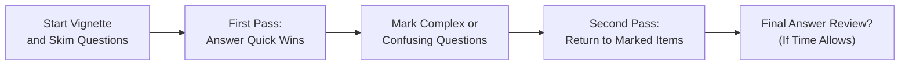

## Introduction

Time management can feel like the secret sauce (or maybe the mysterious sauce) of exam success. I remember, during my own CFA Level II attempt, I'd sometimes reach the last five minutes of a morning session and still have two items flagged—and that dreaded sense of panic would set in. You absolutely don’t want that. So, let's unpack some practical ways to handle the Corporate Issuers vignettes with a clear head and a steady clock.

The CFA® Level II exam typically presents item sets (vignettes) of around six questions each, and it’s recommended you spend roughly 18–20 minutes per set. That includes reading the scenario, extracting data, computing relevant figures, and answering all questions. Ready to figure out how to stay within that window? Let’s dive in.

## Target Time Per Vignette

A good starting rule: spend about 18–20 minutes on each 6-question vignette. Stick to this schedule—like glue—during your mocks. If you finish a set with extra time left, congrats, you’re ahead of the game (possibly meaning you can review or catch your breath). If you notice you’re consistently pushing over 20 minutes, it’s a friendly signal to speed up or refine your approach.

• Why 18–20 minutes? Because that’s your fair share of the total exam clock.  
• If you start hitting 25 minutes on a single item set, you might be depriving yourself of precious minutes to handle the rest.

## The Two-Pass Strategy

The “two-pass approach” is a classic time-management hack. On your first pass, answer all questions that are quick wins—those that either require straightforward qualitative knowledge or short calculations. Then circle back on a second pass to handle heavier or more involved questions.

Here’s a quick peek at how it works:

This ensures you bag the easy points without getting bogged down in a single complicated question that becomes a “time sink.” If something is complex or starts pulling you into a deep drone of calculations, mark it and move on.

## Reviewing Question Stems Before the Data

Before you start reading every detail in the vignette, read the question stems. That’s right—check out what’s being asked first. This approach helps you figure out which pieces of data in the vignette are crucial for your solutions. Think of it like rummaging for the puzzle box cover before you pour out the pieces.

• If you know one question involves the Weighted Average Cost of Capital (WACC), you can go on a “WACC hunt” in the vignette.  
• If another question is about dividend policy signals, you’ll know to pay attention for references to announcements, payouts, or management’s comments on dividends.  

This process saves time because you’re reading the vignette with a purpose—and trust me, purposeful reading is a life-saver in an exam environment.

## Concise Scratch Work

Some folks love to write out every single calculation step on scrap paper, and while that’s thorough, it can also eat away at your clock. Sketch out only what you need—and keep it tidy. An organized mini-table or quick bullet points are easier to reference if you need to revisit your math. The last thing you want is to bury yourself in a sea of pencil scribbles.

### Helpful Pro Tip

If you’re calculating something like an expected synergy in a corporate restructuring question, note down only the essential formula:  
Synergy = (Value of Combined Firm) – (Sum of Separate Values)

Jot a quick partial calculation or two, but don’t go overboard. If you see that you’re turning the page into a novel of arithmetic, that’s your cue to tidy up and keep moving.

## Recognizing When to Move On

I’ve personally experienced that sinking feeling where you cling to a single question, hoping for a magical number to emerge. That can be a huge trap—“time sink” city. The best tactic:

• If you’re stuck for more than a minute or two and can’t sense a breakthrough, mark the question.  
• Move on to the next question rather than let panic set in.  

You can always come back if time allows. The worst outcome is losing chunks of time on that single question while letting the other 59 or so slip by.

## Maintaining Composure Under Pressure

Let’s say you turn to a question about share repurchases integrated with an ESG angle, and it’s not something you heavily prepared for. The immediate reaction might be, “Uh oh, I have no clue.” That’s normal. Take a breath, dissect the question systematically:

1. Identify any core formulas or theories (like the effect of buybacks on earnings per share).  
2. Spot potential references to ESG frameworks in your materials.  
3. Start bridging them together.  

Even if it’s unfamiliar territory, rational breakdown is your friend. If you let anxiety take over, you’ll lose track of time. Instead, steady yourself and move forward. Sometimes you’ll realize that, ironically, these “unexpected combos” are just re-labeled versions of concepts you already know.

## Effective Use of Your Standardized Calculator

The BA II Plus or HP 12C is your buddy for the CFA exam. If you have certain factor conversions or standard discount factors memorized, that can be an enormous time-saver. Some candidates even memorize partial discount rates or certain present value sums they use repeatedly in capital budgeting or bond valuation.

### Quick Example: 
Many candidates memorize that a 6% annual discount rate over 10 years has a factor of roughly 7.36 for an annuity (this is an approximation of the Present Value of $1 for 10 periods at 6%). Over time, that can shave off precious seconds when you’re pressed for speed. Just be sure your approximations remain within a sensible margin of error.

## Plausibility Checks

Have you ever come up with a synergy or dividend growth rate so large that it would make your calculator spit out an “Error 5”? If your synergy figure is bigger than the entire existing market cap of the company, that might be a sign you made a slip somewhere—or that the question is testing whether you’ll second-guess an outlandish number.

• Always give yourself a mental “Does this number make sense?” check.  
• If your interim result is impossible or leads to a negative payout ratio, you might need to revisit your last step.  

This stops you from forging ahead down the wrong path. Sometimes a quick reality check prevents a disastrous chain of mistakes.

## Planned Breaks and Clock Checks

The exam environment can feel suffocating, so do a quick clock check halfway through each session. If you set mental markers (like “I want to finish the first 5 vignettes in 90 minutes”), you’ll know whether you need to speed up or if you can proceed at a calm pace. 

Short mental breaks—just a few seconds to close your eyes and exhale—can also do wonders for your concentration. Some candidates find it helps to do a quick mental reset after every couple of item sets.

## Final Thoughts and Encouragement

Time management isn't just about micro-optimizations. It’s also about staying calm, trusting your strategy, and letting your knowledge steer the ship. The two-pass approach, question-stem scanning, concise calculations, and periodic reality checks all help to safeguard your limited exam minutes. And if you find yourself flustered, remember you’ve practiced exactly how to handle that scenario—managing your time and your composure is as much a part of the exam as knowledge of cost of capital or payout policies.

May your exam day pacing mirror the calm confidence you’ve built in your study sessions!

## References and Further Reading

• CFA Institute Exam Tips: Official guidance on pacing and time management strategies.  
• Investopedia: “Time Management in Financial Certifications” – helpful overview of effective test-taking.  
• Kaplan Schweser Blog: “Exam Day Strategies for CFA Level II” – includes real-life candidate stories and pacing advice.

## Test Your Knowledge: Time Management & Exam-Day Tactics



### Which of the following best describes the “two-pass approach” in the context of the CFA Level II exam?

- [ ] Answer all complex calculation questions first before moving to the easy questions.  
- [ ] Skip every question that seems complicated.  
- [x] Address straightforward questions on the first sweep, mark difficult ones for a second sweep.  
- [ ] Answer questions in random order to reduce predictability.  

> **Explanation:** The two-pass approach focuses on tackling quick, simpler questions first, then returning to more complex or time-consuming ones in a later pass.

### What is a sensible target time allocation for each 6-question vignette on the CFA Level II exam?

- [x] 18–20 minutes  
- [ ] 25–30 minutes  
- [ ] 10–12 minutes  
- [ ] 30–35 minutes  

> **Explanation:** The recommended guideline is 18–20 minutes per 6-question vignette to stay on track with the total exam time.

### What is the main reason for reading question stems prior to the vignette text?

- [ ] It allows you to skip reading the vignette entirely.  
- [x] It helps identify key information in the vignette and focus your reading.  
- [ ] It reduces the chance of missing individual questions.  
- [ ] It allows you to guess the answers more quickly.  

> **Explanation:** By scanning the question stems early, you can read the vignette more purposefully, extracting only the data you need.

### In time management for the exam, a “time sink” is best described as:

- [ ] A short break taken between vignettes.  
- [x] A single question or task that consumes disproportionate time.  
- [ ] An advanced financial function on your calculator.  
- [ ] A well-known exam strategy.  

> **Explanation:** A “time sink” refers to a question or activity that consumes more than its fair share of the overall exam time, potentially jeopardizing other questions.

### What is the primary benefit of “concise scratch work” during calculations?

- [x] Reduces confusion and saves time when you need to revisit partial answers.  
- [ ] Ensures you have a complete written record for exam graders.  
- [x] Lowers the risk of arithmetic mistakes by keeping data organized.  
- [ ] Allows you to skip reading the question thoroughly.  

> **Explanation:** Keeping scratch work clear and minimal helps you find answers quickly and confirm them without sifting through messy computations.

### When you realize a question is far more difficult than expected, which approach is recommended?

- [x] Mark it to revisit later, then move on to other questions.  
- [ ] Guess immediately and never look back.  
- [ ] Attempt to solve it for 10 minutes, even if the rest of the exam is delayed.  
- [ ] Ignore the question entirely and move on.  

> **Explanation:** If you encounter a time-consuming question, it’s best to mark it and come back later, ensuring you don’t lose valuable minutes for other items.

### A quick “plausibility check” on a numeric result helps you:

- [x] Determine if your calculation is realistic within the context of the question.  
- [ ] Guarantee that your answer is correct.  
- [x] Dismiss the need for further verification.  
- [ ] Automatically eliminate all the incorrect answer choices.  

> **Explanation:** A plausibility check helps you sense whether the result is in a reasonable range. It doesn’t guarantee correctness but can catch glaring errors.

### A periodic clock check (e.g., halfway through a session) is performed mainly to:

- [x] Gauge if you need to adjust your pacing or maintain your current speed.  
- [ ] Distract yourself from difficult questions.  
- [ ] Check if other candidates are behind schedule.  
- [ ] Assess the final grade.  

> **Explanation:** Monitoring the clock at strategic intervals helps you manage your pacing to avoid running short on time late in the session.

### Which statement most accurately describes a potential challenge of the two-pass approach?

- [ ] You might answer too many questions prematurely.  
- [ ] You get permanently stuck on every question in the first pass.  
- [x] You could run out of time if you don’t carefully manage how long you spend on the first pass.  
- [ ] You won’t have any time left to review your correct answers.  

> **Explanation:** While the two-pass strategy is useful, you need to keep an eye on the clock to ensure you leave enough time to tackle the difficult questions in your second pass.

### True or False: Memorizing certain present value factors or discount rates is never recommended due to potential rounding errors.

- [x] True  
- [ ] False  

> **Explanation:** Many candidates find it beneficial to memorize approximate discount factors to save time. While approximations can introduce rounding, they are often within an acceptable error range for the exam’s multiple-choice format.


