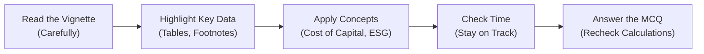

## Introduction and Purpose

So, let’s be honest—sometimes, the best way to tackle Corporate Issuers at the CFA Level II exam is by diving right into full-length practice item sets (vignettes) that mimic the real thing. You know, those six to eight-question narratives that can be both enthralling and terrifying. If you’re like me, you’ve probably underestimated the complexity of these item sets at one point or another. I remember my very first mock exam, flipping through the Corporate Issuers set and thinking, “Well, I’m sure I’ve got this.” Then I realized I was short on time, and it all spiraled! In this section, we’ll explore how to build, use, and review mock vignettes so you can avoid (or at least manage) that panic.

This article compiles advanced practice item sets, complete with multi-dimensional questions that cover a range of Corporate Issuers topics. We’ll also outline the significance of replicating actual exam conditions, mapping subtopics, and performing a detailed debrief. Ultimately, the goal is not just to test knowledge but to refine your approach and boost your confidence.

## Designing Effective Mock Vignette Sets

Corporate Issuers at Level II is broad. It touches on dividend policy, share repurchases, ESG concerns, restructuring, cost of capital calculations, and plenty more. A great mock vignette weaves these elements into a single storyline—just as the real exam attempts to do—forcing you to switch gears quickly.

### Incorporating Multiple Facets

• Payout Policies: Test your ability to analyze and differentiate between dividend increases, share repurchases, and how each affects EPS, capital structure, or investor signals.  
• Capital Structure and Cost of Capital: Integrate data requiring weighted average cost of capital (WACC) calculations, cost of debt adjustments, or forward-looking equity risk premium estimates.  
• ESG Factors: Slip in questions on governance, board composition, or an environmental policy that alters financing or payout decisions.  
• M&A and Synergies: Build short narratives that require synergy calculations or highlight changes in capital structure post-merger, perhaps with an LBO twist.

### Crafting the Narrative

A typical approach might give you one to two pages of text with financial exhibits:  
• Company background—industry, outstanding shares, and capital structure.  
• Proposed corporate actions—maybe a share repurchase plan, a dividend re-evaluation, or an acquisition.  
• Tabular data—financial statements, interest rates, synergy estimates, or EPS projections.  
• Footnotes—these can include disclaimers about tax rates, one-off charges, or assumptions behind synergy forecasts. Those little footnotes often hide key details that can push your analysis in a certain direction.

### Example Layout

You might see something like:

1. A short paragraph explains a mid-cap technology firm is considering an acquisition to bolster its ESG credentials.  
2. A table outlines the acquiring firm’s cost of capital components, debt covenants, and new equity issuance details.  
3. Footnotes reveal intangible synergy potential if the acquisition is successful and references a capital budgeting approach using Real Options.  
4. A second table shows prospective synergy calculations and revised capital structure if the firm raises debt.

This sets you up for 6–8 questions that cover everything from synergy valuation to intangible ESG benefits, as well as how the new capital structure might alter required returns.

## Emulating Real Exam Conditions

### Timed Practice

Try 18 minutes per item set (roughly 3 minutes per question). Lock your phone in a drawer—or at least turn notifications off—because it’s imperative that you replicate the pressure. Also, be mindful of the CFA-approved calculator policy. If you’re used to your advanced graphing calculator, set it aside and adapt to the BA II Plus or HP 12C.

### Isolating from Help

At Level I, you might have allowed yourself a quick peek at notes if stuck. Here, resist that temptation. Real exam conditions mean zero references and zero friend “hints.” This discipline helps you internalize formulas and approaches.

### Tracking Performance

Record your performance meticulously. Ask yourself:

• Did you run out of time on a question or two?  
• Which concepts lingered in your mind or caused you to overthink (e.g., synergy computations, forward-looking ERP adjustments)?  
• Did you read the footnotes carefully, or did you realize halfway through that you missed a crucial assumption?

## Subtopic Mapping

Let’s be systematic about linking each question to specific Corporate Issuers concepts. Below is a simple example of how you might map questions within a single vignette:

| Question # | Subtopic                 | Concept Tested                        |
|------------|--------------------------|---------------------------------------|
| 1          | Dividend Policy          | Dividend clientele effect             |
| 2          | Share Repurchase         | Impact on EPS and book value          |
| 3          | ESG Considerations       | Governance structure, stakeholder mgmt|
| 4          | Cost of Capital          | WACC calculation and tax shield       |
| 5          | M&A Synergy Analysis     | Valuation of synergy PV               |
| 6          | Real Options in M&A      | Expansion vs. abandonment options     |

Building such a table helps you see immediate holes in your knowledge and design targeted review sessions.

## Recording Thought Processes

You might feel goofy doing this at first, but trust me, writing down your immediate “brain chatter” after each question is invaluable. Note if you second-guessed yourself on a synergy formula or if you blindly applied a formula without checking assumptions. Sometimes, your mistakes lie not in calculation but in reading the question too quickly or failing to separate normal EPS from adjusted EPS after a share buyback.

## Scoring and Debriefing

### Score Beyond Right or Wrong

Yes, correctness is vital, but time efficiency matters. If you have an error but corrected it in 7 minutes, that’s not as good as if you answered it correctly and swiftly. Don’t forget, the exam is time-pressured. A thorough post-exam debrief is where the real learning happens. Evaluate:

• Did I interpret the question exactly as intended?  
• Did I skip important footnotes?  
• Did I mix up Weighted Average Cost of Capital (WACC) with cost of equity in synergy discounting?  
• Did I handle the capital structure changes properly (e.g., using new proportion of debt and equity after a share issuance)?

### Common Pitfalls and How to Overcome Them

• Ignoring Footnotes: Overlooking taxation nuances or a detail about debt structure in footnotes can derail your entire solution.  
• Overcomplicating Formulas: Many calculations, especially synergy valuation, are straightforward if you keep your approach systematic.  
• Failing to Distinguish Concepts: Dividend vs. share repurchase, synergy vs. stand-alone valuations—be sure you apply the right framework.  
• ESG as an Afterthought: The exam might embed ESG factors that affect cost of capital or stakeholder decisions. Don’t dismiss them.  
• Time Management: All the knowledge in the world won’t help if you only get through half of the item set. Check the clock.

## Sample Vignette Snippet

Below is a highly compressed illustration of a single-vignette portion. In the actual exam, expect fuller paragraphs, and possibly additional footnotes and exhibits.

––––––––––––––––––––––––––––––––––––––––––––––  
Example Vignette (Excerpt)

AlphaTech Inc. is a mid-sized software developer planning to acquire GreenSolutions, LLC, a clean-energy startup. AlphaTech believes the acquisition will enhance its ESG profile and drive future growth.

Exhibit 1: AlphaTech Capital Structure  
• Debt (market value): $200 million  
• Equity (market value): $300 million  
• Cost of debt (pre-tax): 6%  
• Required return on equity: 10%  
• Marginal tax rate: 25%

Exhibit 2: Synergy Assumptions (Discount Rate = WACC)  
• Year 1 incremental FCF: $10 million  
• Year 2 incremental FCF: $12 million  
• Year 3 incremental FCF: $15 million  
• Terminal value (end of Year 3): $20 million  

Footnote: All synergy CF figures assume successful integration of GreenSolutions’ intellectual property.

––––––––––––––––––––––––––––––––––––––––––––––

You’d then see 6–7 questions typically referencing synergy calculation, capital structure post-acquisition, or the intangible ESG impacts. For synergy, you might evaluate:


\text{WACC} 
= \frac{D}{D+E}\times r_d(1 - t) 
+ \frac{E}{D+E}\times r_e


Then present value of synergy:


\text{PV (Synergy)} 
= \sum_{t=1}^{3} \frac{\Delta \text{FCF}_t}{(1 + \text{WACC})^t} 
+ \frac{\text{Terminal Value}}{(1 + \text{WACC})^3}


## Visual Guide to Tackling a Mock Item Set

Here’s a quick flowchart that shows how you might handle each question step-by-step:

This visual approach can help you remember to systematically parse the entire scenario before diving into the question specifics.

## Glossary

• Mock Item Set: A practice vignette plus multiple-choice questions modeled closely on CFA exam format.  
• Subtopic Mapping: Tagging each question to the relevant concept—dividend policy, cost of capital, synergy, governance, etc.  
• Debrief: Structured review of did-well vs. messed-up points.  
• Real Options: Capital budgeting expansions of scope—like if you can expand a project later or abandon it—factoring possible future outcomes into the present valuation.  

## References and Further Reading

• CFA Institute’s Learning Ecosystem Question Bank — Official practice and mock item sets that echo real exam style.  
• Wiley’s “Focus Notes” — Summaries of key corporate finance concepts.  
• AnalystForum.com — Discussions on tricky Corporate Issuers questions and synergy calculations.  
• Corporate Finance: A Valuation Approach by Benninga & Sarig — Additional theoretical depth.  

## Final Exam Tips

• Practice Under Real Constraints: Timer, no external resources, using only allowed calculators.  
• Focus on Reading Details: Don’t let the footnotes undercut your entire approach.  
• Create a Structured Method: Use the same approach for each item set—read, highlight, compute, confirm.  
• Debrief at the End: Turn every mistake into a learning point.  

## Corporate Issuers Mock Exam Quiz



### 1. Which of the following is the most likely benefit of practicing mock item sets under timed conditions?

- [ ] Achieving maximum partial credit on essay questions  
- [ ] Reducing the need to read footnotes thoroughly  
- [x] Improving time management and mirroring exam pressure  
- [ ] Minimizing conceptual errors by allowing external references  

> **Explanation:** Timing is everything for the CFA exam. Practicing under test-like time pressure helps you manage each question deliberately and reduces the risk of running short of time.

---

### 2. A company has $400 million in total capital, split evenly between debt and equity. Pre-tax cost of debt is 7%, required return on equity is 11%, and the marginal tax rate is 25%. What is the firm’s WACC?

- [ ] 8.0%  
- [x] 8.25%  
- [ ] 9.0%  
- [ ] 9.5%  

> **Explanation:**  
> WACC = (D/(D+E)) × r_d × (1 – t) + (E/(D+E)) × r_e  
> = (0.5 × 0.07 × (1 – 0.25)) + (0.5 × 0.11)  
> = (0.5 × 0.07 × 0.75) + (0.5 × 0.11)  
> = 0.02625 + 0.0550 = 0.08125 or 8.125% (8.13%). Rounded to 8.25% is the closest choice.

---

### 3. A firm’s synergy calculation for an acquisition produces an incremental cash flow of $5 million in Year 1, $6 million in Year 2, and $7 million in Year 3, plus a $10 million terminal value. If the discount rate is 10%, which amount is closest to the present value of the synergy?

- [ ] $20.1 million  
- [ ] $21.3 million  
- [ ] $22.8 million  
- [x] $23.6 million  

> **Explanation:**  
> PV = 5/1.10 + 6/(1.10^2) + 7/(1.10^3) + 10/(1.10^3).  
> This sums (approximately) to around $23.6 million.

---

### 4. In a vignette discussing new corporate governance rules, which of the following ESG factors is most likely to reinforce effective capital structure decisions?

- [ ] Reduced transparency with shareholders  
- [x] Increased board oversight and accountability  
- [ ] Prioritizing short-term gains over sustainable growth  
- [ ] Ignoring environmental liabilities  

> **Explanation:** Governance guidelines that boost board oversight align corporate decisions (including debt and equity issuance) with long-term shareholder value.

---

### 5. A firm is deciding between a share repurchase and a dividend initiation. The CFO is primarily worried about the potential signals to the market. Which concept best describes this concern?

- [ ] Pecking order theory  
- [ ] Agency cost of equity  
- [x] Signaling theory  
- [ ] Trade-off theory  

> **Explanation:** Corporate actions like dividends or share repurchases can signal management’s outlook on a company’s future. This is the essence of signaling theory in capital markets.

---

### 6. When preparing a mock item set that tests both capital budgeting and corporate restructuring, which subtopic is least likely to be relevant?

- [ ] Real options in project expansion  
- [x] Technical analysis of short-term stock price trends  
- [ ] Synergy estimates in an M&A scenario  
- [ ] WACC adjustments post-spin-off  

> **Explanation:** Technical analysis of stock price trends is more typical in market analysis, not corporate issuers. Items about cost of capital, synergy, or real options are central to Corporate Issuers.

---

### 7. A candidate often misreads footnotes in the Corporate Issuers vignettes. What is the recommended best practice to overcome this challenge?

- [x] Annotate or highlight the footnotes after the first reading of the vignette  
- [ ] Skip footnotes initially and review them only if time allows  
- [ ] Focus solely on the last footnote related to capital structure or synergy calculations  
- [ ] Use footnotes only to confirm the initial guess  

> **Explanation:** Footnotes often contain crucial assumptions or clarifications. Best practice is to systematically highlight or annotate them on your first pass.

---

### 8. Company X is considering issuing new debt to fund a share buyback. If WACC decreases as a result, this is primarily due to:

- [ ] The decrease in total capital  
- [x] The increase in the proportion of cheaper financing (debt)  
- [ ] The increase in equity financing  
- [ ] The firm paying fewer dividends consistently  

> **Explanation:** Introducing more debt (if cheaper than equity and tax benefits exist) can reduce WACC, provided the firm does not take on excessive financial risk that would raise the cost of debt.

---

### 9. Which of the following best characterizes a “debrief” after a mock exam session?

- [ ] Simply checking correct answers vs. your answers  
- [ ] Memorizing the correct formulas without further analysis  
- [x] Systematically reviewing each question to identify misunderstanding, conceptual oversights, or test-taking errors  
- [ ] Reviewing only the questions you guessed incorrectly  

> **Explanation:** A debrief is a structured, thorough post-exam review that focuses on why errors were made, ensuring they are corrected before the real exam.

---

### 10. True or False: Incorporating ESG factors into a firm’s payout policy decisions can impact both the firm’s reputation and cost of capital.

- [x] True  
- [ ] False  

> **Explanation:** Yes, strong ESG practices can affect investor perceptions and risk assessments, improving (or deteriorating) cost of capital and overall market reputation.


