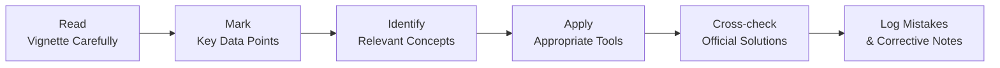

## Overview of Detailed Solutions and Common Errors

Sometimes, you finish analyzing a tough item set, flip to the official solutions, and just go: “Um, well… that’s not how I did it.” Sound familiar? You’re definitely not alone. In this part of your Corporate Issuers studies, we’re taking a magnifying glass to the official solutions and exploring exactly what traps are set for us unsuspecting test-takers. We’ll be honest: there are lots of ways to stumble—especially if you skip seemingly tiny details like partial-year discounting periods or footnotes disclosing extraordinary items that might alter a payout policy ratio. 

If you’ve already looked at the question solutions and exclaimed, “Wait, where does this synergy multiple come from?” or “But how did they handle that restricted stock in the diluted share count?”—this section is for you. We’ll talk you through the typical mistakes, tie them to key concepts from your reading, and offer a step-by-step approach for both problem-solving and post-solution reflection. 

## Methodical Approach to Official Solutions

One of the greatest hidden skills you can master for the Level II exam is how to dissect solution sets methodically—rather than speedily scanning them. After all, it’s easy to gloss over a detail in your solution approach, only to discover that a small oversight rippled through your entire answer. Let’s explore a framework that merges official solutions and your personal problem-solving style:

• First, compare formulas. Did the official solution apply a multi-stage cost of equity approach (like an expanded CAPM) when you stuck to a single-stage approach? If so, is it because the question indicated changing risk-free rates over time?  
• Second, confirm data usage. Check if the official solution used partial-year discounting for a mid-year cash flow. Sometimes you might see a factor such as (1 + r)^(0.5) if the synergy or dividend arrives halfway through the year. If you missed that half-year discounting, you could be off by more than a rounding error.  
• Third, ensure synergy multiples align with assumptions. In many M&A vignettes, synergy valuations might be capitalized at a specific multiple. If you missed the mention of expected synergy in Year 2 (rather than Year 1), or if you used the wrong industry multiple, your synergy’s net present value (NPV) might be miscalculated.  

### Flowchart: Evaluating Solutions Step-by-Step

Below is a quick mermaid diagram that shows how to systematically evaluate an official solution:

This flowchart might look straightforward, but the trick is to not skip the methodical cross-checking step or the final step—actually logging your mistakes in a systematic way.

## Common Pitfalls and Their Underlying Causes

Let’s talk about some of the most frequently observed mistakes. You might find yourself saying, “Ah, yeah, I’ve done that,” or “Wait, that’s me!” Don’t worry. Recognizing them is your first big win.

• Ignoring a Footnote on Extraordinary Items:  
  Some vignettes tuck away disclaimers about extraordinary gains or losses in footnotes. If those items affect net income or the firm’s payout policy, ignoring them can lead to an incorrect dividend coverage ratio or net cash flow figure.

• Accidentally Omitting the Tax Shield Effect:  
  The effect of tax-deductible interest in cost of debt calculations is crucial. Many item sets expect you to carry that tax shield through synergy valuations in M&A or in cost of capital computations. Missing it skews your WACC or synergy NPV.

• Underestimating Restricted Stock Implications:  
  See “restricted stock” in a footnote? You might need to recalculate the diluted share count for a share repurchase scenario or a dividend distribution. This is notoriously easy to miss when you’re juggling multiple steps.

• Synergy Multiples vs. Market Averages:  
  In an M&A scenario, synergy multiples might be higher or lower than the standard industry average, depending on if the synergy is “enhanced” or if there’s a strategic investor advantage. If you just default to the average multiple, you might get the synergy valuation completely wrong.

• Partial-Year Discounting:  
  The exam loves partial-year adjustments. If a synergy only starts contributing in the middle of the year, or a second dividend is paid three quarters into the fiscal year, you might see (1 + r)^(0.75) creeping into your calculations. Miss that detail and you’re done for.

These pitfalls often show up in item sets that mix capital structure changes, share-based compensation, or M&A synergy analyses. They’re guaranteed to show whether you truly read the fine print or you’re just rushing.

## Constructing a Mistake Log

A “Mistake Log” is more than just a personal confessional. It’s your powerful data-analytics tool, letting you spot patterns across numerous practice questions. Here’s how to make it work:

• Record the Error: Write out how your answer diverged from the official approach. Was it a conceptual shortfall (not applying the synergy multiple) or a calculation slip (a decimal place error)?  
• Identify the Cause: Are you confused about restricted stock treatment for diluted EPS? Did you misread the question’s timeline?  
• Reference the Official Learning Outcome: Match your mistake to a relevant LOS or concept from earlier chapters (like the cost of capital from Chapter 7 or synergy multiples from Chapter 10). This helps you target your revision.  
• Action Plan: Write a quick note about how you’ll avoid the same mistake next time—maybe highlight synergy footnotes, double-check partial-year discounting, or reread the question’s footnotes more carefully.

Over time, this log becomes your personal corporate finance coach. You’ll start noticing your repeated sins (like ignoring the tax shield or messing up the synergy timeframe) and, hopefully, you’ll never repeat them again come exam day.

## Advanced Corporate Finance Knowledge in Action

Some of the steps in an official solution require more advanced knowledge. We see that a lot in:

• Multi-Stage Cost of Equity Calculations:  
  When you see transitions in a firm’s expected risk profile—perhaps from an emerging market risk premium to a stable market premium—solutions often break the cost of equity into distinct stages. Each stage might use a different equity risk premium before combining them in a piecewise discounting method.

• Synergy Multiples in Complex M&A:  
  Different synergy types (cost synergies vs. revenue synergies) might have distinct multiples. Also, synergy flows could require separate discounting rates. The official solution might break out synergy streams, apply appropriate multiples, then sum them. If you do a single-lump synergy approach, you can miss key details.

• Share-Based Compensation Overhang:  
  Let’s say a firm’s management has massive restricted stock grants that are due to vest next year. So, if you’re calculating next year’s expected EPS or next year’s expected total shares outstanding for a buyback scenario, you often have to incorporate those new shares, which dilutes all your per-share metrics.

• Partial-Year Interest Costs or Depreciation:  
  In multi-step item sets involving new equipment financing or short-term debt changes, the official solution might do something sophisticated, like partial-year depreciation plus partial-year interest expense. If you simplify everything to a full-year assumption, your net income or free cash flow calculations become inaccurate.

## Cross-Referencing with the Official Curriculum

The official CFA Program Curriculum typically provides end-of-chapter solutions and references for these tricky areas. If you find yourself repeatedly stuck on synergy calculations or partial-year discount factors, create a direct cross-reference to that reading section. For instance, if synergy multiples keep biting you, go back to Volume 3, Chapter 10 (Restructuring in Depth: M&A, LBOs, and More) for synergy valuations. If your cost of capital is off, bounce back to Chapters 7 and 8 on WACC and advanced cost of capital. 

## Teaching to Reinforce Solutions

As a little bonus tip: once you figure out these tricky solutions, teach them to someone else. Explaining synergy valuations or partial-year discounting clarifies your own understanding. It’s like that time you tried to show a friend how to tie a double Windsor knot. Suddenly you realized the mechanics better than you had in years.

If you’re comfortable, join a study group or post your reasoning in a forum. If your logic is questionable, a peer might jump in and set you straight. It’s a cool synergy (pun intended).

## Practical Example: Common Corporate Finance Vignette Issues

Let’s walk through a quick scenario. Suppose you have an M&A vignette:

• Company A is acquiring Company B.  
• There’s a footnote specifying that synergy benefits of $5 million are expected in the second half of Year 1 and $10 million in Year 2.  
• The synergy multiple for cost savings is 5×, but the synergy multiple for revenue growth is 7×. The problem also mentions a partial-year discount factor for Year 1 synergy.  
• Then the question sprinkles in mention of restricted stock that will vest in six months, increasing total shares by 1%. 

If you rush, you might just say: “$5M + $10M = $15M total synergy; let’s apply a 6× synergy multiple (maybe an average?), so synergy is $90M.” Official solution might actually break out cost synergy from revenue synergy, apply separate multiples, and discount the partial-year synergy at half-year. Something like:

1) $3 million in cost synergy (Year 1 half) × 5 = $15 million, discounted for 0.5 years.  
2) $2 million in revenue synergy (Year 1 half) × 7 = $14 million, discounted for 0.5 years.  
3) $10 million synergy (Year 2 full), further broken down into cost synergy ($6M × 5) and revenue synergy ($4M × 7), each discounted back to present.  
4) Incorporate extra shares from restricted stock so you don’t overstate synergy per share.  

Missing any piece inflates or deflates your synergy number. And the official solution might look cryptic if you didn’t read the footnotes carefully.

## Conclusion

Detailed solution analysis isn’t about memorizing the official approach blindly—it’s about systematically discovering where you went wrong, why it happened, and how to close the gap. Keep that robust Mistake Log. Read footnotes like your exam depends on it (because it kind of does). And always cross-check concepts like synergy multiples, partial-year discounting, and restricted stock vests that might impact your final share count or net cash flows. By embracing a disciplined approach, you’ll be leaps ahead when you turn to future practice vignettes and, ultimately, the real exam.

## References & Further Reading

• Official CFA Program Curriculum, Corporate Issuers (Volume 3): End-of-Chapter Solutions  
• Kim and Tanner (CBE–Life Sciences Education): “Teaching as a Learning Tool”  
• M&A Synergy Measurement Studies: Collegiate case studies that delve deeper into synergy valuations and advanced synergy multiples  
• Chapter 7 and 8 of this Volume: Revisiting the Cost of Capital for advanced nuances  
• Chapter 10 of this Volume: Restructuring in Depth—M&A, LBOs, and More  

--------------------------------------------------------------------------------

## Test Your Solutions Mastery and Pitfall Awareness



### In reviewing official solutions, which of the following is the primary goal of a mistake log?

- [ ] To keep track of formulas you've memorized.
- [ ] To record exam day stress levels.
- [x] To identify error patterns and corrective steps.
- [ ] To compare your mistakes with peers' mistakes.

> **Explanation:** A comprehensive mistake log focuses on identifying your error patterns, understanding the root causes, and establishing corrective strategies. It’s more than just a list of errors—it’s a record that points you to the specific concept or calculation to revisit.

### A vignette includes a half-year synergy of $2 million discounted at 8%. The official solution applies (1 + 0.08)^(0.5). You used (1 + 0.08). What is the likely outcome?

- [ ] Overestimating the present value.
- [x] Underestimating the present value relative to a half-year discount factor.
- [ ] Correctly calculating the synergy, because partial-year discounting is negligible.
- [ ] None of the above.

> **Explanation:** If you discount for a full year rather than half a year, your discount factor is larger, reducing the synergy’s present value too much. Official solutions typically specify partial-year discounting accurately.

### Which of the following best describes a common error related to restricted stock in item sets?

- [ ] Understating synergy multiples due to ignoring a synergy premium. 
- [ ] Double discounting synergy flows in year one. 
- [ ] Overcounting the tax shield cost for interest. 
- [x] Miscalculating diluted shares outstanding because of vested stock.

> **Explanation:** Restricted stock (especially when it’s about to vest) increases total shares, diluting per-share metrics. Missing that can throw off EPS or share-based payout calculations.

### You see a footnote in a vignette mentioning “extraordinary losses of $1 million this year.” Which of the following is the main pitfall if you ignore it?

- [x] Incorrectly calculating net income or payout ratios.
- [ ] Underestimating the synergy multiple for next year.
- [ ] Failing to apply partial-year discounting for dividends.
- [ ] Misapplying the weighted average cost of capital.

> **Explanation:** Extraordinary items can significantly impact net income, thereby affecting ratios like EPS, payout, or coverage. Ignoring this footnote leads to an incorrect bottom-line figure.

### In official solutions, synergy multiples for cost reduction vs. revenue enhancement are often different because:

- [ ] Cost synergies are typically intangible and have no multiple.
- [x] They may reflect different levels of risk or consistency in future benefits.
- [ ] Revenue synergies are always discounted at the cost of debt.
- [ ] Multiples are used only for value-destructive synergies.

> **Explanation:** Cost-reduction synergies often have different risk profiles than revenue-enhancement synergies. As a result, the multiples might vary to account for stability and likelihood of synergy realization.

### What is the best strategy to ensure you handle partial-year calculations correctly?

- [ ] Assume all cash flows occur at the end of the year.
- [x] Check if the item set explicitly specifies a mid-year or quarterly arrival of cash flows.
- [ ] Use a rolling 3-year average for discount rates.
- [ ] Use a synergy multiple of at least 5×.

> **Explanation:** Exam vignettes often specify the timing of cash flows, especially if they occur mid-year. Always verify the exact timeline to determine the correct discount factor or fraction of a year.

### Which approach best helps you master official solutions after you identify your error?

- [ ] Memorize the official approach without revisiting your own method.
- [ ] Move on immediately to the next vignette to save time.
- [x] Re-solve the problem with the correct methodology, then compare step by step.
- [ ] Use a random formula from the text until the numbers match.

> **Explanation:** Actively re-solving the question using the official approach builds deeper understanding. Comparing each step cements the correct logic in your mind and helps avoid repeating errors.

### When a firm merges with another and you see “interest tax shield saving of $300,000,” which error might cause an incorrect synergy valuation?

- [ ] Adding the savings, then discounting by the target’s capital structure.
- [ ] Applying a synergy multiple only to the merged firm’s net income.
- [ ] Stopping to factor in intangible assets.
- [x] Failing to incorporate the tax shield effect into the synergy’s NPV.

> **Explanation:** The interest tax shield is an essential part of many synergy valuations. If you don’t factor it in, you’ll likely undervalue synergies in an M&A scenario.

### Which of the following best describes the “learning by teaching” strategy?

- [x] Explaining concepts to another person to reinforce your own understanding.
- [ ] Practicing official solutions in isolation.
- [ ] Skipping footnotes because you can guess the content.
- [ ] Relying exclusively on a synergy multiple approach.

> **Explanation:** Teaching or explaining a solution to a peer or study group forces you to articulate each step clearly. That process strengthens your grasp of the material.

### True or False: A mistake log should be broadly categorized by question type (e.g., “Dividend Policy,” “Share Repurchase,” “Synergy Calculation”), with detailed notes on each specific error.

- [x] True
- [ ] False

> **Explanation:** This form of categorization helps you see patterns in your errors (like recurring synergy mistakes or repeated footnote oversights) and streamline your review process.  


