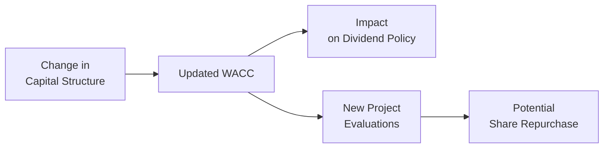

Before we wrap up your Corporate Issuers journey, let's take a bit of a breath—seriously, I remember my own frantic last-minute reviews, and trust me, it’s easy to get overwhelmed. Sometimes you stare at a formula or a concept and go, “Uh, do I even remember what I read?” That’s totally normal! So let’s do this together: we’ll consolidate the key takeaways, revisit must-have formulas, and build a “mental muscle memory” for your final push.

If you’ve been following along with Chapters 1 through 12, you’ve seen it all—from basic dividend policy to advanced restructuring. So let’s focus on the highest-impact tasks that can maximize your confidence in that final mile. You’ll see references back to earlier chapters—feel free to jump around if you want a refresher on the specific details!

## Essential Focus Areas

Capital structure, payout policy, restructuring, cost of capital, and ESG considerations are definitely huge for Level II. But at this point, you want to be sure you can switch contexts fast to handle those item set vignettes. Let’s concentrate on the big ones:

• Capital Structure and Leverage  
• Dividend Policies versus Share Repurchases  
• Cost of Capital (WACC and cost of equity)  
• Restructuring (M&A, LBOs, synergy valuation)  
• ESG Essentials and Corporate Governance  
• Working Capital and Short-Term Financing  

When you read a vignette, try to connect these threads. For example, a question about a share repurchase might actually revolve around how a new debt issue changes the capital structure, which then affects the cost of capital (see Chapters 3, 7, and 8).

## Memorizing Key Formulas

I know we all love memorizing formulas—well, maybe “love” is too strong a word. But we do it because they’re quick references. Here are four “must-know” ones:

1) Weighted Average Cost of Capital (WACC)


\text{WACC} \;=\; \Bigl(\dfrac{D}{D + E}\Bigr) \times r_d \times (1 - t)\; +\; \Bigl(\dfrac{E}{D + E}\Bigr) \times r_e 


Where:  
• D = Market value of debt  
• E = Market value of equity  
• t = Tax rate  
• r_d = Required return on debt  
• r_e = Required return on equity  

2) Share Repurchase Impact on EPS  

If a company repurchases a portion of its shares, its earnings stay the same (ignoring interest expense on any new debt incurred, if relevant), but the share count drops. The immediate effect:

New EPS ≈ Old EPS × (Old number of shares / New number of shares)

In practice, watch for details on how they financed the repurchase (e.g., used cash on hand or issued new debt). Changes in interest expense or lost investment income can tweak net income and therefore EPS.

3) Synergy Value in M&A  

Your synergy from combining two firms is typically something like:

Total Synergy = PV(Revenue Synergies + Cost Savings + Other Benefits) - Merger Integration Costs

Sometimes, you’ll get a synergy formula that looks like:


\text{Synergy} = V_{A+B} - \bigl(V_A + V_B\bigr)


where \\(V_{A+B}\\) is the value of the combined firm, and \\(V_A\\), \\(V_B\\) are their stand-alone values.

4) Convertible Securities Dilution  

If you’re analyzing convertible bonds/preferred shares, keep an eye on the potential increase in share count when the securities convert. Watch out for:

• Convertible Debt: The new equity from the bond conversion impacts both net income (no more interest expense) and total shares outstanding.  
• Convertible Preferred: After conversion, dividends may disappear but new shares will appear in the denominator when calculating EPS.  

## Creating Quick-Reference Flashcards

This might sound old-fashioned, but flashcards. They are your best friend the night before the exam—I can’t even count how many times flipping through them helped me in those final hours.

• On each card: Put the formula (like WACC or synergy).  
• On the backside: A short example problem. For instance: “Company X raises $100 million in debt at 5% before tax. Tax = 25%. Equity cost = 12%, D/E ratio = 1:1. What’s WACC?”  

This helps keep you nimble so you’re not just memorizing but practicing. If you prefer digital flashcards, that works too—just be sure you can review them quickly.

## Bullet-Point Summaries of Each Major Topic

Sometimes the easiest way to approach last-minute prep is a bullet-point approach. For instance, when you think about Share Repurchases (see Chapter 3), your bullet list might look like this:

• Methods: Open market, fixed-price tender, Dutch auction, negotiated.  
• Key impacts on EPS: Often increases it if repurchase < fair value, but watch changes in interest expense.  
• Effect on Shareholder Value: If shares are undervalued, buybacks can add value; if overvalued, it can destroy value.  
• Typical exam angles: Calculation of EPS post-repurchase, comparison with dividend, effect on share price, signaling.

Similar bullet points can be made for:

• Dividend Policy Theories (Chapter 2)  
• Capital Budgeting and Post-Audit Analysis (Chapter 14)  
• M&A structures (cash vs. stock transactions, synergy, tax angles—Chapters 9 & 10)  
• ESG and corporate governance factors (Chapters 5 & 6)  
• Cost of debt vs. cost of equity (Chapters 7 & 8)

Let’s keep it direct and easy to reference.

## Cross-Linking Concepts

You might remember from Chapter 7 and 8 that capital structure influences WACC; well, that also feeds directly into how a firm sets its dividend policy. If a firm’s WACC is low, it might have extra capacity to fund expansions or share buybacks. And that same firm might see a synergy-driven acquisition as more attractive because they can finance it cheaply. Another example: convertible bond issuance can reduce immediate interest expenses but might lead to more shareholders down the line (see Chapter 16). The main idea is to see each topic as part of an interconnected web rather than isolated bits. That’s the key to tackling Level II item sets quickly.

Below is a simple Mermaid diagram illustrating how changing capital structure interacts with cost of capital and ultimately flows into decisions about payout policies and corporate expansions:



In exam item sets, you might see a scenario like “A firm is considering issuing convertible bonds to fund a partial share repurchase. Evaluate how this affects EPS, leverage ratios, and future dividend capacity.” That’s precisely the cross-topic synergy we’re talking about.

## Relaxation and Strategic Time Management

Hey, I know it’s stressful. In my last run-up to the exam, I realized I was burying myself in new material at 11:00 p.m. the night before reading about advanced convertible arbitrage, which was probably not a good idea. Resist that temptation:

• Don’t learn brand-new stuff at the last moment. Focus on refining what you already know.  
• Instead, schedule short timed quizzes—10 or 15 minutes to do a micro-drill on a few item-set style questions.  
• Then quickly review what you got wrong, confirm your knowledge corner cases, and move on.

Arrive early at the exam center, get rest, and be sure your financial calculator is loaded up with fresh batteries and set to the right decimal convention (can’t tell you how many folks in my test center realized too late they were in chain mode or had unexpected decimal places).

## Final Practical Example: WACC Under Stress

Here’s a quick scenario that might appear in a vignette:  
Company Z is 50% financed by equity (cost: 10%), and 50% financed by debt (before-tax cost: 6%). The corporate tax rate is 25%. The CFO is considering a share repurchase funded by new debt that will change the mix to 30% equity and 70% debt. You may need to:

1) Calculate the old WACC.  
2) Calculate the new WACC.  
3) Determine how that new WACC might affect the firm’s future dividend policy or project expansions.

Let’s do a quick run:  

Old WACC:  
Debt portion = 0.5, Equity portion = 0.5  
r_d (1 - t) = 6% × (1 - 0.25) = 4.5%  
WACC = 0.5 × 4.5% + 0.5 × 10% = 2.25% + 5% = 7.25%  

New WACC (assuming the cost of debt remains 6%—but be mindful that too much debt can push up the interest rate):
Debt portion = 0.7, Equity portion = 0.3  
r_d (1 - t) = 6% × (1 - 0.25) = 4.5%  
WACC = 0.7 × 4.5% + 0.3 × 10% = 3.15% + 3% = 6.15%  

Interestingly, that new WACC is lower in this simple example. But in the real world if your credit rating drops with more leverage, the cost of debt might jump, so your net effect could be different. This is precisely the type of question you can expect in your final item sets—recognizing that more debt can work both ways.

## A Small Python Snippet for a Quick Calculation

If you find yourself wanting to run a quick check on WACC for multiple capital structures, you could do something like this at home (never at the exam, obviously):

```python
def calculate_wacc(debt_ratio, cost_of_debt, cost_of_equity, tax_rate):
    after_tax_debt_cost = cost_of_debt * (1 - tax_rate)
    equity_ratio = 1 - debt_ratio
    wacc = debt_ratio * after_tax_debt_cost + equity_ratio * cost_of_equity
    return wacc

scenarios = [(0.5, 0.06, 0.10, 0.25),
             (0.7, 0.06, 0.10, 0.25),
             (0.3, 0.08, 0.12, 0.25)]

for s in scenarios:
    dr, rd, re, t = s
    print(f"Debt Ratio={dr}, WACC={calculate_wacc(dr, rd, re, t):.3%}")
```

It’s a quick sanity check for different capital structures and cost-of-capital assumptions. Perfect if you’re practicing “what-if” scenarios. But obviously, keep all such computations conceptual for the exam.

## Trust Your Preparation

You’ve done the practice vignettes, studied the synergy formulas, double-checked your share repurchase math, and squared away your definitions for convertible securities. At this point, it’s all about confidence, calmness, and methodically reading each item set. If you get stuck, move on, come back later—time management is essential.

And if your mind goes blank, recall your bullet points. Rely on the fact that you’ve done your due diligence. The exam is about spotting triggers in the story that connect to your prepared mental frameworks.

## References and Further Exploration

• CFA Institute Candidate Resources (official guidelines, exam-day checklists, do’s and don’ts).  
• Brealey, Myers, and Allen – Principles of Corporate Finance (classic text for conceptual clarity).  
• Kaplan Schweser’s Final Review Pack – Great for formula summaries and condensed outlines.  
• Chapters 1–11 in this volume – Revisit the item set examples and vignettes presented.  

Finally, keep in mind that a fresh perspective and a calm approach will serve you well. You’ve got this!

---

## Test Your Knowledge: Essential Corporate Issuers Review



### A firm is contemplating a large share repurchase using freshly issued debt. Which of the following best describes a key impact on financial statements?

- [ ] Decreased financial leverage and a higher cost of equity.
- [x] Increased financial leverage and potentially higher interest expense.
- [ ] Lower cost of debt and decreased WACC.
- [ ] No change to any financial ratios because share count drops.

> **Explanation:** Issuing new debt to repurchase shares raises the firm's debt load, increasing financial leverage. This will also raise interest expense, possibly affect credit ratings, and potentially alter WACC.

---

### When convertible preferred shares are converted into common stock, which of the following statements is generally TRUE?

- [ ] The number of shares outstanding decreases.
- [x] Common shareholders may experience ownership dilution.
- [ ] Net income increases due to conversion.
- [ ] The firm’s retained earnings balance increases.

> **Explanation:** Conversion of preferred shares into common stock increases the total number of common shares outstanding, diluting existing shareholders. Net income itself does not automatically rise just because of the conversion.

---

### Which of these best summarizes the synergy concept in a merger scenario?

- [x] The combined value of the new entity surpasses the sum of the individual firms due to cost savings or revenue enhancements.
- [ ] The new entity’s book value strictly equals the sum of separate book values.
- [ ] The merged entity’s share price automatically goes up by the synergy amount.
- [ ] Synergy only comes from combining intangible assets.

> **Explanation:** Synergy arises when the combined firm is more valuable than the sum of the separate parts due to revenue growth, cost reductions, or other strategic advantages.

---

### In calculating WACC, which factor is NOT directly considered?

- [ ] After-tax cost of debt
- [ ] Required return on equity
- [ ] Proportions of debt and equity
- [x] Market price of a firm’s products

> **Explanation:** WACC incorporates cost of debt, cost of equity, and the firm’s capital structure proportions. The market price of a firm’s products is not explicitly included in the WACC formula.

---

### A firm is evaluating whether to pay a special dividend or conduct an open-market share repurchase. Which is most likely an exam-relevant question?

- [ ] “Will the CEO receive a pay raise if the dividend is issued?”
- [x] “How will each option affect EPS, share price, and overall cost of equity?”
- [ ] “Is it ethical to distribute money to shareholders?”
- [ ] “Are the stocks visually appealing to investors?”

> **Explanation:** In exam scenarios, questions typically revolve around how different payout policies affect financial metrics (EPS, cost of equity) and possibly shareholder value.

---

### A firm with stable cash flow wants to lower its cost of capital. Which approach is generally used, if feasible?

- [x] Increase debt financing since interest is tax-deductible.
- [ ] Reduce debt to zero and fund only with equity.
- [ ] Cease all dividend and repurchase plans permanently.
- [ ] Issue convertible securities to avoid paying any interest.

> **Explanation:** Increasing debt (up to a reasonable limit) can reduce WACC because interest expense is tax-deductible, thereby lowering the after-tax cost of debt. However, there’s a capital structure trade-off, so too much debt may backfire.

---

### In a Level II vignette about corporate restructuring, you might see synergy estimated as:

- [x] The combined present value of post-merger benefits minus integration costs.
- [ ] The total revenue of the acquired firm multiplied by total revenue of the acquirer.
- [ ] The difference in capital structure between two firms.
- [ ] The sum of both firms’ operating expenses.

> **Explanation:** Synergy is usually presented as the present value of the merger’s expected incremental benefits (e.g., revenue, cost savings) minus the costs to integrate or restructure.

---

### If management issues convertible debt at a price below fair value, what might be a concern?

- [x] Potential dilution of existing shareholders if conversion occurs at a cheap conversion price.
- [ ] No effect on shareholder equity because it’s just debt.
- [ ] Guaranteed improvements to the cost of equity.
- [ ] Elimination of interest expenses forever.

> **Explanation:** If the conversion price is set too low, existing shareholders can suffer dilution when bondholders convert. Also, convertible debt initially carries interest expense until conversion occurs.

---

### A short recap quiz before exam day should:

- [ ] Introduce completely new concepts.
- [ ] Replace thorough reading of official curriculum.
- [x] Reinforce known concepts and highlight weaker areas for review.
- [ ] Use only highly complex LBO models to test knowledge.

> **Explanation:** A short, final recap quiz or timed practice helps reinforce already-learned material and pinpoints any lingering weaknesses. Trying to learn new, complex material at the last minute increases stress and confusion.

---

### True or False: A final, effective last-minute review strategy is to create links across topics like dividend policy, capital structure, and cost of capital to see how changes in one area affect the others.

- [x] True
- [ ] False

> **Explanation:** Cross-linking topics is essential for Level II. Changes in capital structure affect WACC, which influences dividend policy decisions and project viability, among other interconnected factors.


