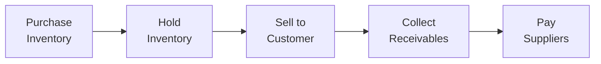

## Strategic Importance of Working Capital Management

Working capital is often viewed as the lifeblood of any corporation. Unless you’ve actually watched a friend’s business struggle with short-term liquidity, it can be easy to underestimate just how crucial it is. Um, let's be honest, in the midst of all the big talk about capital structure and M&A deals, paying attention to day-to-day finances can feel less glamorous. But ignoring working capital can leave you flat-footed when those unexpected bills roll in. Working capital ensures a firm can respond to challenges quickly—particularly those inevitable “oh no!” moments in short-term funding.

Working capital refers to the net of current assets and current liabilities. It’s essentially the capital that’s used to handle daily (and near-daily) operations. A well-structured working capital strategy is about balancing enough liquidity to comfortably meet near-term obligations versus not tying up too many funds in unproductive current assets. Too much cash on hand? Great for liquidity, but returns could suffer. Not enough? You might fail to capture sales opportunities or, worse, fail to pay your suppliers on time.

Anyway, your approach to working capital can be conservative or aggressive. In a conservative policy, you hold bigger cash or inventory buffers. You’re definitely reducing the risk of running out of essential items, but you might also be dragging on profitability. On the flip side, an aggressive policy attempts to minimize idle funds and push the business’s operational cycle to the edge—maximizing returns but also raising the risk that even a small hiccup might disrupt your daily operations.

Ultimately, the goal is to structure working capital so that your firm consistently meets its short-term obligations, invests efficiently in growth opportunities, and positions itself to respond to shocks (like supply chain delays or abrupt changes in customer demand). Getting this right is a key to building sustainable corporate success.

## Key Components of Working Capital

Working capital is more than just “cash in the bank.” It’s a collection of current assets and current liabilities, each with its own rhythm and cycles:

• Cash and Marketable Securities: These are your most liquid resources. They can be used immediately to settle obligations or reinvest in operational needs. Marketable securities (like T-bills) can generate a small return but remain highly liquid.  
• Accounts Receivable (A/R): Money owed by customers. If you ask me, it’s basically the “promised land of incoming cash.” It also happens to be a massive driver of working capital needs if you have generous credit terms.  
• Inventory: Items or raw materials you hold for production or sale. Inventory ties up capital until it’s sold. Overdoing it? You might find yourself short on cash. Underdo it? You may lose sales if you can’t fulfill orders promptly.  
• Accounts Payable (A/P): Money you owe to suppliers. Typically, you get a bit of “free” financing here—suppliers provide goods or services before you have to pay. Push them too far, though, and your relationships or credit standing could deteriorate.  
• Short-Term Liabilities: Includes accrued expenses and other payables that need to be carefully scheduled to avoid payment delays or penalties.

By understanding how these elements shift throughout the firm’s operating cycle, you can figure out which ones are most influential at any given moment. Even minor changes in one component—like a slight extension of credit terms to customers—can significantly affect your cash inflows. That’s why it’s key to track them at a granular level and see how they interact.

## Operating and Cash Conversion Cycles

Many CFOs keep a close eye on the operating cycle (OC) and the cash conversion cycle (CCC). Picture them as two yardsticks that measure how long it takes from the start of producing a product or service until you see the cash come back in.

• The Operating Cycle (OC) is the time from the purchase of inventory to the collection of cash from the sale. It’s basically your “buy inventory → sell inventory → collect on sales” loop.  
• The Cash Conversion Cycle (CCC) is the time it takes to convert resource outlays into cash inflows. Specifically:

  
CCC = DSO + DOH – DPO  
  
Where:  
• DSO = Days Sales Outstanding (average length of time customers take to pay)  
• DOH = Days of Inventory on Hand (average time inventory sits before being sold)  
• DPO = Days Payables Outstanding (average time you have to pay suppliers)

Graphically, you can visualize the flow of the firm’s working capital something like this:

The difference between the time you collect from customers (step D) and when you pay suppliers (step E) is effectively your “float” or short-term financing advantage. But if your customers pay you too slowly or you have to pay your suppliers too fast, that advantage shrinks or even becomes negative, forcing you to bridge the gap with external financing.

### Real-World Example of CCC

Let’s say you’ve got this high-flying electronics firm, “QuickChip.” They have:  
• Days Sales Outstanding (DSO) = 30 days  
• Days of Inventory on Hand (DOH) = 25 days  
• Days Payables Outstanding (DPO) = 20 days  

So, CCC = 30 + 25 – 20 = 35 days  

This means QuickChip has 35 days where its cash is tied up before it’s replenished by customer payments. If the firm’s executives realize that’s too high, they might impose stricter credit terms or arrange for faster inventory turnover, thereby bringing the DSO or DOH down.

## Aggressive vs. Conservative Policies

Now, how do you actually position your working capital strategy on the risk-return spectrum? We typically talk about “aggressive,” “moderate,” or “conservative” working capital policies. If you’re adopting an aggressive posture:

• You try to keep inventory levels at bare minimum.  
• You might let your accounts payable stretch as far as possible (without harming relationships with suppliers, obviously).  
• You may also keep limited cash reserves, relying on short-term borrowing if something unplanned occurs.

In a conservative approach:

• You carry higher-than-normal inventory to cover potential demand spikes and avoid stockouts.  
• You pay bills relatively quickly to secure favorable terms or simply maintain solid goodwill.  
• You hold larger cash reserves to buffer any operational disruptions.

Neither approach is strictly “right” or “wrong.” In my opinion, it depends on your firm’s risk tolerance, industry norms, and market conditions. A fast-growing startup might pivot quite aggressively, while a stable, long-established business might see more value in being conservative. 

## Liquidity Ratios and Net Working Capital

Measuring the effectiveness of your working capital strategy is crucial. While you can dig deeper into lines like the length of the CCC or specific days of receivables, there are also some standard ratios:

• Current Ratio = Current Assets ÷ Current Liabilities  
• Quick Ratio (Acid Test) = (Current Assets – Inventory) ÷ Current Liabilities  
• Net Working Capital (NWC) = Current Assets – Current Liabilities  

A current ratio > 1 suggests that a firm’s current assets exceed its current liabilities. But if the firm holds large amounts of slow-moving inventory, that might inflate the current ratio without being super helpful in a liquidity crunch. That’s where the quick ratio is more discerning—it excludes inventory from the numerator. Net working capital, meanwhile, is a simple expression of how much more (or less) current assets the firm has relative to current liabilities. 

### Pitfalls and Cautions

• A dangerously high current ratio might indicate inefficient use of resources. But it could also signal that the firm is building liquidity because it’s expecting an upcoming shortage in the supply chain or a downturn in sales.  
• A quick ratio around or above 1 is often a comfortable signal, but watch out for artificially high accounts receivable if your customers are struggling to pay you.  
• A negative net working capital can sometimes be acceptable (think of high-turnover retail companies with robust daily cash sales) but is typically a red flag in manufacturing.  

## Techniques to Reduce (or Extend) the Cash Conversion Cycle

Firms have multiple tools for adjusting their CCC to align with strategic goals:

1. Accounts Receivable Management:  
   - Offering early-payment discounts.  
   - Encouraging prompt or electronic payments.  
   - Factoring invoices (selling A/R at a discount) to get quicker cash.  

2. Inventory Management:  
   - Tight ordering systems, perhaps using just-in-time (JIT) techniques.  
   - Consignment arrangements with suppliers who own the goods until final sale.  
   - More accurate sales forecasting to avoid overstock or understock.  

3. Accounts Payable Management:  
   - Negotiating extended terms with suppliers (without incurring hefty late fees).  
   - Consolidating orders to potentially secure volume-based discounts.  

The net effect is to minimize the length of time cash is locked up in operational processes. However, you might choose to extend your CCC under certain circumstances—like if you can negotiate early-payment discounts from suppliers that more than offset the financing cost of paying them quickly.

## Cash Budgeting and Short-Term Financing

Another vital piece of the puzzle is the cash budget. It’s basically a forecast of your cash inflows and outflows. If you do this monthly or weekly, you’ll see (pretty clearly) whether your short-term financing needs are covered. 

Here’s one simple approach to making a cash budget:

1. Project all inflows (customer payments in the upcoming period, short-term investments maturing, any other frequent sources).  
2. Project all outflows (payroll, rent, supplier payments, interest expenses, etc.).  
3. Subtract outflows from inflows. If negative, you may need additional funding or to tap a line of credit. If positive, you might invest surplus cash in short-term marketable securities.  

To handle these inflows and outflows, you can rely on a mixture of short-term and long-term financing. The matching principle states that short-term assets (like inventory that you’ll sell within months) are best financed with short-term liabilities (like short-term loans or lines of credit), while long-term assets (like property or big capital equipment) are better financed with long-term debt or equity.

However, if you’re extremely risk-averse, you might finance some short-term assets with more stable (but also more expensive) long-term financing. That’s basically a conservative route. An aggressive route, ironically, often uses more short-term borrowing because it’s cheaper, albeit riskier.

## Integrating Forecasts and Stress Testing

A critical piece of strategy is the ability to see around corners. That means integrating sales forecasts, production schedules, and supplier terms into one coherent plan. By analyzing historical patterns—like how quickly customers pay or how seasonal demands shift—you can refine your working capital policies to get rid of unnecessary “fat” but still avoid liquidity crises.

Stress testing is also essential. Think about times when demand collapses or supply chain partners fail to deliver. A strong working capital strategy keeps a cushion so you can weather these storms. That might mean carrying a bit more cash on the balance sheet or ensuring access to an emergency credit line. It might also mean staggering your supplier payments so that a disruption in one link of the chain doesn’t paralyze your entire operation.

## Best Practices and Common Pitfalls

• Maintain an Accurate Forecast: I can’t stress enough how easy it is to overestimate sales or fail to project sudden cost increases.  
• Monitor Payment Terms: If you treat your suppliers poorly, you run the risk of damaging relationships and losing future bargaining power.  
• Be Alert to Customer Credit Risk: Sometimes an overly generous credit policy can backfire if the economy sours and customers can’t pay.  
• Avoid Over-Reliance on Short-Term Debt: Interest rates can change or lenders can pull credit lines. In a pinch, you might find yourself stuck (and probably at the worst possible time).  
• Monitor Inventory for Obsolescence: Particularly in tech or fashion, inventory can lose value shockingly fast.  

## Exam Tips for CFA Candidates

• Quantify the CCC Components: Be ready to break down a company’s DSO, DOH, and DPO. The exam loves to test your ability to compute these under slightly tricky scenarios.  
• Identify Policy Trade-Offs: You might see a vignette describing a new CFO’s move to cut inventory in half or to extend credit terms to achieve higher sales growth. Expect to weigh in on the effect on liquidity, profit, or stakeholder relationships.  
• Evaluate Ratios in Context: A ratio is only meaningful in comparison to historical results, industry peers, or some normative benchmark.  
• Consider the Matching Principle: Watch for subtle clues in a vignette. For instance, is the company financing short-term expansions in inventory with a 10-year bond? Evaluate whether that approach is advisable.  
• Work the Numbers: The exam item sets often come with short tables of financial statement data. Practice quickly extracting what you need—like average daily cost of goods sold or average daily sales—to feed into your calculations.  
• Time Management: Don’t get bogged down in small details. In the real exam environment, speed and accuracy on these calculations can make a huge difference.

## References and Further Reading

• CFA Institute Program Curriculum (Corporate Issuers), current edition.  
• Brealey, R., Myers, S., & Allen, F. – Principles of Corporate Finance.  
• “Working Capital Management” series, Harvard Business Review.  
• McKinsey & Company – Valuation: Measuring and Managing the Value of Companies (Chapters on Liquidity and Cash Flow).  

## Working Capital Strategy Knowledge Check



### A firm's main working capital components typically exclude which of the following?

- [ ] Cash
- [ ] Marketable securities
- [ ] Inventories
- [x] Long-term debt

> **Explanation:** Working capital focuses on current (short-term) assets and liabilities. Long-term debt is not generally included in this category.

### Which ratio is a more stringent measure of short-term liquidity because it excludes inventory?

- [ ] Current ratio
- [x] Quick ratio
- [ ] Cash ratio
- [ ] Net working capital ratio

> **Explanation:** The quick ratio (or acid test) omits inventory from the numerator, providing a more conservative view of the firm’s ability to cover short-term liabilities.

### Which scenario is most consistent with an aggressive working capital policy?

- [ ] High cash balances, permissive customer credit terms, and longer average payment periods
- [x] Low cash balances, tighter customer credit terms, and delayed payments to suppliers
- [ ] Higher-than-normal inventory buffers, quick payments to suppliers, and minimal short-term borrowing
- [ ] Quick ratio significantly above 1 and more reliance on long-term financing

> **Explanation:** Aggressive policies minimize idle balances and extend payables, increasing return but also increasing risk.

### Firm X wants to shorten its cash conversion cycle. Paying suppliers faster to obtain a 2% discount on early payments would likely:

- [ ] Increase Days Sales Outstanding (DSO)
- [ ] Increase Days of Inventory on Hand (DOH)
- [ ] Reduce DSO
- [x] Reduce overall CCC

> **Explanation:** Although paying suppliers faster decreases DPO, if the discount more than offsets the cost of capital, the net effect can be a beneficial reduction in overall cash costs, effectively improving the net cash cycle.

### When evaluating net working capital (NWC), an unusually large dollar amount of inventory could cause:

- [x] Overstated current assets that may not be easily converted to cash
- [ ] An understated current ratio
- [x] A misleading sense of liquidity if the inventory is obsolete
- [ ] A stronger quick ratio

> **Explanation:** Large or obsolete inventory can inflate the current ratio, making a firm appear more liquid than it really is. Note that this does not affect the quick ratio, because inventory is excluded in that calculation.

### Under the matching principle, how should a company optimally finance seasonal increases in inventory?

- [x] Using short-term credit lines or loans
- [ ] Issuing long-term bonds
- [ ] Issuing new equity
- [ ] Drawing down retained earnings only

> **Explanation:** Seasonal or short-lived asset needs are best financed by short-term liabilities, matching the life of the asset with the financing duration.

### Which of the following actions would typically decrease a company's DSO?

- [x] Offering an early-payment discount to customers
- [ ] Extending credit terms from net 30 to net 45
- [x] Increasing collection efforts or implementing stricter credit policies
- [ ] Switching to a consignment-based model for inventory

> **Explanation:** Providing incentives (like an early-payment discount) or enforcing stricter credit policies can shorten the time customers take to pay, thus reducing DSO.

### A negative net working capital on the balance sheet could indicate:

- [x] A potential liquidity risk if the firm cannot meet short-term obligations
- [ ] Excess cash that should be invested in long-term assets
- [ ] A guaranteed sign of insolvency
- [ ] A form of “free financing” from customers

> **Explanation:** Negative NWC means current liabilities exceed current assets. While this can sometimes be managed (e.g., in fast-turn retail), it often signals potential short-term liquidity issues.

### The cash budget is important because it allows a company to:

- [x] Forecast future cash deficits or surpluses effectively
- [ ] Eliminate all forms of short-term financing
- [ ] Stop monitoring inventory levels
- [ ] Replace all ratio analysis

> **Explanation:** Cash budgeting helps identify upcoming cash shortfalls or surpluses in advance, enabling better decision-making on whether to secure financing or invest surplus cash.

### True or False: A conservative working capital policy is always better for shareholder returns than an aggressive policy.

- [x] False
- [ ] True

> **Explanation:** A conservative policy may reduce risk, but it can also result in lower returns. The “best” approach depends on the firm’s risk tolerance, industry context, and strategic goals.


