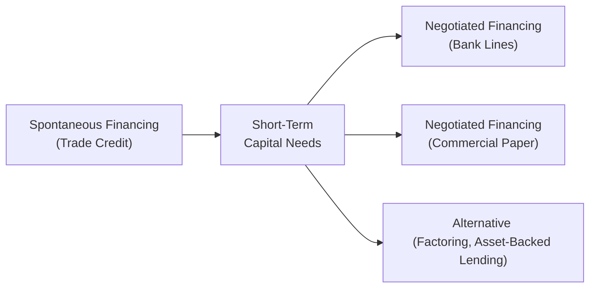

## Introduction and Overview

Let’s be honest: short-term financing might feel a bit mundane at first, especially when compared with the thrill of big merger deals or eye-popping dividend announcements. But short-term obligations—like paying raw material suppliers or funding daily operations—are where many firms either thrive or get stuck in a cash crunch. You know, I once worked with a small tech startup that had a wonderful, cutting-edge product, but they nearly missed payroll three times because they didn’t keep a close eye on their short-term borrowing lines. It was stressful, to say the least.

In this section, we’ll dive into the nitty-gritty of financing short-term obligations. We’ll cover spontaneous financing (aka trade credit), negotiated financing (like bank lines of credit and commercial paper), and some more specialized routes (factoring, asset-backed lending). We’ll also talk about things like cost of trade credit, how to manage and mitigate rollover risk, and the importance of keeping up a robust credit risk management system. By the end, you’ll see why short-term funding is pivotal for a healthy liquidity profile.

## Spontaneous Financing: Trade Credit

Spontaneous financing refers to the natural, automatic extension of credit from vendors and suppliers. Often, it’s the largest single source of short-term financing for many companies—especially in industries where inventory turnover is fairly rapid.

### The Basics of Trade Credit
Trade credit occurs when a supplier delivers goods or services without requiring immediate payment. For instance, a supplier might issue an invoice stating “2/10, net 30,” which implies a 2% discount if the purchaser pays within 10 days, or the full invoice amount due in 30 days if the discount isn’t taken. That difference can have significant implications for the firm’s financing costs.

### Cost of Trade Credit
It might be tempting to skip paying early and hold onto your cash. But, oh boy, the implied cost of ignoring that discount is often surprisingly high.

A common approach to calculating the annualized cost of trade credit is:

(1) Identify the discount percentage (d).  
(2) Identify the discount period (n) and the total credit period (N).  
(3) Plug into a formula that annualizes the opportunity cost of forgoing the discount:


\text{Cost of Trade Credit} 
= \left(\frac{d}{1 - d}\right) \times \left(\frac{365}{N - n}\right).


For example, if the terms are 2/10, net 30, then:  
• d = 2% (i.e., 0.02).  
• n = 10 days.  
• N = 30 days.  

So,


\text{Cost of Trade Credit} 
= \left(\frac{0.02}{1 - 0.02}\right) 
\times \left(\frac{365}{30 - 10}\right) 
\approx 37.24\%.


That’s a steep implied interest rate. If your firm can secure short-term financing at a rate lower than ~37.24%, you’d want to pay the supplier within 10 days to capture the 2% discount.

### Trade Credit in Vignettes
You might see a vignette describing a company’s dilemma: pay suppliers quickly and take advantage of discounts, or use that cash to fund near-term operating needs. Pay special attention to the implied rate. Many candidates overlook the significance of a discount’s annualized cost, so this is a common pitfall.

## Negotiated Short-Term Financing

When spontaneous financing isn’t enough, or when it proves too costly, companies turn to negotiated financing. Here, the two primary examples are bank lines of credit (revolving credit facilities) and commercial paper for larger, higher-credit-quality issuers.

In the diagram below, we show an overview of how a firm’s short-term financing sources might be structured:

### Bank Lines of Credit
A classic is the bank line of credit, which might be either committed (formal agreement, a higher fee) or uncommitted (less formal, easier to revoke). Firms can draw down as needed, up to the agreed-upon limit, for a specified time. For bigger sums, many corporations rely on revolving credit facilities (revolvers)—these are syndicated among multiple banks to share the risk.

#### Key Considerations
• Interest Rate Structure: Often based on a benchmark plus a spread, e.g., SOFR + 150 bps.  
• Commitment Fees: You might pay a small fee on the unused portion.  
• Covenants: Banks may require financial ratios or restrict certain corporate actions.  
• Collateral: In some cases, lines of credit can be secured.  

Scenario analysis is wise here: imagine a sudden interest rate increase. If the line is floating rate, your interest costs might jump drastically, affecting your short-term profitability. In exam item sets, look out for how a change in benchmark rates can ripple through your cash flow forecasts.

### Commercial Paper
Commercial paper (CP) is short-term, unsecured paper typically issued by firms with strong credit ratings. Because it’s unsecured, the rating matters—a lot. The interest rate on CP is typically lower than a bank loan if you have top-tier credit status. But there’s also rollover risk: CP is usually issued for very short maturities (like 30 days), and if the market seizes up or the firm’s credit worsens, renewing maturing paper can become quite the headache.

A neat formula for computing the annualized yield on commercial paper if you see discount pricing:


r_{CP} = \left(\frac{\text{Face Value} - \text{Purchase Price}}{\text{Purchase Price}}\right) \times \left(\frac{360}{\text{Days to Maturity}}\right).


Yep, it’s conventionally done on a 360-day basis in many money markets.

### Non-Bank Financing: Factoring and Asset-Backed Lending
Some firms don’t have easy access to capital markets or might have cyclical cash flow needs. In these cases, factoring or asset-backed lending (ABL) can be a lifeline.

• Factoring: The company sells its accounts receivable to a factor (third party) at a discount, receiving immediate cash. The factor then collects on the invoices from customers in the normal course. The discount is effectively the financing cost, which can be quite high if your receivables have elevated default risk or if you have minimal bargaining power.  
• Asset-Backed Lending: Using inventory or receivables as collateral, you might obtain a secured loan. The interest rate is partly driven by the collateral’s liquidity and quality. 

In exam scenarios, factoring might appear in vignettes about a small or mid-sized firm that needs quick liquidity. You’ll evaluate whether the factoring fee plus discount is cheaper than alternative financing. Sometimes the intangible benefits—like outsourcing credit and collections—can be an added plus.

## Managing Credit Risk and Rollover Risk

Short-term financing is all about bridging gaps in cash flow. But to maintain a healthy liquidity buffer, you must manage two big categories of risk:

1. Credit Risk: The risk that lenders might increase your rates or withdraw credit if your firm (or the market at large) sees a credit deterioration.  
2. Rollover Risk: Specifically relevant for commercial paper, but also for short-term loans. If the market environment shifts (or your credit fundamentals worsen), you could lose access to short-term markets.

### Credit Risk Management System
Many firms implement a robust credit risk management system to track credit metrics—both their own and that of key lenders or counterparties. For instance, if your primary lender has its own capital constraints, they might reduce your available credit line just when you need it most. Monitoring rating triggers, covenant thresholds, and market conditions helps you avoid nasty surprises.

## Fixed vs. Floating Rate Short-Term Financing

When you negotiate short-term financing, you often face a choice: fix the interest rate or link it to a floating-rate index. The decision depends on your outlook for interest rates, your firm’s risk tolerance, and overall hedging strategy.

• Floating Rate: Typically based on LIBOR (phasing out in favor of SOFR in many markets), or another index plus a spread. If rates remain stable or decline, a floating-rate loan might reduce overall interest expense. However, if rates spike, your short-term financing cost can spike, too—no fun if you have thin operating margins.  
• Fixed Rate: Offers certainty over the interest cost for the financing term. It’s advantageous in volatile interest rate environments if you expect rates to climb. On the other hand, if rates unexpectedly drop, you’re stuck paying a higher rate.

Within a CFA exam item set, you might see a question about how changes in rates affect interest coverage or about deciding which rate structure best aligns with your strategic forecast. Don’t forget to consider the maturity mismatch: if you have floating-rate obligations but your revenue streams are relatively fixed, you might run into difficulties.

## Negotiating Favorable Terms

Beginners sometimes assume that short-term financing is a take-it-or-leave-it proposition. Actually, negotiation matters—especially for large, reputable firms:

• Fees and Collateral Requirements: Banks might impose line fees and require collateral. You can negotiate these based on your credit rating or relationship.  
• Covenant Restrictions: Certain bank credit facilities or commercial paper back-up lines come with covenants. Skilled treasury teams push back on overly restrictive covenants to maintain flexibility.  
• Maturity Extensions: Firms might negotiate renewal provisions or extension options to reduce rollover risk.  

On the exam, watch for any clues that the firm’s management might have leverage to secure better rates or fewer restrictions based on strong relationships or unique credit standing.

## Scenario Analysis for Liquidity Gaps

Nobody can predict the future with certainty—especially if macroeconomic conditions shift quickly. Building scenario analyses into your treasury function is a staple of advanced corporate finance. You’ll want to model:

• A baseline scenario of stable operations and credit markets.  
• A downside scenario with higher borrowing rates, lower revenues, or supply-chain disruptions.  
• A severe stress scenario that addresses extreme credit market freezes (like 2008 or 2020).  

Exam item sets might reference these scenarios to test your ability to determine the best short-term financing approach. For instance, if interest rates jump 2% in a downside scenario, can your firm still service the debt under a floating-rate arrangement, or is a fixed-rate solution safer?

## Practical Examples and Best Practices

Below is a simplified example of how a treasury department might assess short-term financing choices for a three-month working capital need of $5 million:

| Financing Option        | Approx. Annualized Rate | Notes                                           |
|-------------------------|--------------------------|-------------------------------------------------|
| Trade Credit (No Disc.) | 37% (implied)           | Based on 2/10 net 30 discount, quite expensive. |
| Bank Revolver (Floating) | 5.5% (SOFR + 3.0%)      | Low fees, but interest might rise if SOFR spikes. |
| Factoring Receivables   | 9% - 12%                | Quick cash; higher cost, but offloads collections. |
| Commercial Paper        | ~3.5%                   | Only if strong credit rating; watch rollover risk. |

In a real-world scenario, you’d also evaluate intangible factors like relationships with banks, administrative complexity, and how quickly you can secure the funds. If you anticipate stable interest rates and have great credit, commercial paper looks attractive. If you have less stellar credit or fear a liquidity freeze, a well-negotiated revolving line might be safer.

## Exam Insights and Pitfalls

• Ignore trade credit discounts at your own peril—foregone discounts generally carry high implied interest.  
• Don’t assume short-term means “cheap”— negotiated deals can come with hidden fees or covenants.  
• Rollover risk can be catastrophic if you rely too heavily on short-term paper.  
• Always interpret discount rates carefully—money market instruments often quote on a 360-day basis, whereas trade credit might use a 365-day basis.  
• In a Level II item set, expect multi-step calculations or scenario-based comparisons. Practice reading carefully and grabbing the right data from the vignette.

## Glossary

• **Trade Credit:** Short-term credit extended by suppliers; one of the largest sources of spontaneous financing.  
• **Commercial Paper (CP):** A short-term, unsecured promissory note issued typically by high-credit-quality corporations.  
• **Line of Credit/Bank Credit Facility:** An agreement allowing a firm to borrow up to a specified limit as needed over a set period.  
• **Rollover Risk:** The risk that an issuer may be unable to renew or replace maturing commercial paper or short-term debt.  
• **Factoring:** The practice of selling accounts receivable to a third party (factor) at a discount to accelerate cash inflows.  
• **Floating Rate:** An interest rate that fluctuates based on a benchmark, such as LIBOR or SOFR.

## References and Further Reading

• Liquidity Management and Short-Term Financing, CFA Institute Program Curriculum.  
• Ross, S.A., Westerfield, R.W., & Jaffe, J., Corporate Finance (selected chapters on Short-Term Finance).  
• The Journal of Corporate Finance (articles on short-term debt structures and market access).  

---

## Test Your Knowledge: Financing Short-Term Obligations



### A company has a trade credit term of 1/10, net 30. Which is closest to the approximate annualized cost of foregoing the early payment discount?

- [ ] 12%
- [ ] 25%
- [ ] 37%
- [x] 18%
  
> **Explanation:** Using the approximate formula (d / (1–d)) × (365 / (N–n)), you get roughly (0.01 / 0.99) × (365 / 20) which is about 18.5%. This is an approximation; the exact figure can vary slightly depending on conventions and rounding.

### Which factor most distinguishes “spontaneous” short-term financing from “negotiated” short-term financing?

- [ ] The speed of obtaining the funds
- [x] Whether or not it arises automatically from normal business operations
- [ ] The duration (days versus months)
- [ ] Interest rate variability
  
> **Explanation:** Spontaneous financing (like trade credit) arises automatically because of everyday business operations (buying goods on credit from suppliers). Negotiated credit (like a bank line) requires a formal arrangement.

### What best explains why commercial paper typically carries lower interest rates than bank loans?

- [ ] Commercial paper is always secured.
- [x] Only firms with high credit ratings typically issue CP.
- [ ] CP is guaranteed by government agencies.
- [ ] CP cannot be rolled over.
  
> **Explanation:** Commercial paper is unsecured and is usually limited to highly rated firms, so investors perceive lower credit risk and accept a lower yield compared to bank loans offered to riskier borrowers.

### Company XYZ wants to use factoring. Which scenario most likely indicates factoring is beneficial?

- [ ] Receivables have minimal credit risk.
- [ ] It has a robust internal collection system.
- [ ] It has plenty of cash on hand already.
- [x] It needs immediate cash and wants to outsource collections.
  
> **Explanation:** Factoring helps improve immediate liquidity and outsources the collections process. Firms often use it when they need cash quickly or don’t have strong internal collection processes.

### A firm is deciding between a floating rate and fixed rate on its short-term loan. Which is the main advantage of choosing a floating rate?

- [x] Potential to benefit from declining interest rates
- [ ] Elimination of interest rate risk
- [ ] Lower coupon if credit rating deteriorates
- [ ] Guaranteed interest cost for the period
  
> **Explanation:** A floating rate can move down if benchmark rates decline, thus saving on interest. It does expose the firm to interest rate risk, though.

### Which term refers to the risk of not being able to replace maturing debt with new debt at a reasonable cost?

- [ ] Basis risk
- [x] Rollover risk
- [ ] Inflation risk
- [ ] Counterparty risk

> **Explanation:** Rollover risk is specifically the risk that maturing debt, including commercial paper, cannot be refinanced or rolled over.

### What is a common implication of ignoring trade credit discounts?

- [ ] Reduced brand recognition
- [ ] Higher invoice accuracy
- [x] Implied financing cost that can exceed alternative borrowing rates
- [ ] Lower short-term debt usage

> **Explanation:** Forgoing trade credit discounts can result in a very high implied interest expense, often higher than other financing sources.

### Which of the following best describes a committed line of credit?

- [ ] An unconditionally assured source of funds without fees
- [ ] A short-term arrangement with no legal backing
- [x] A formal agreement where the bank is obligated to lend up to a limit (with a fee)
- [ ] A guarantee by the government for short-term funds

> **Explanation:** A committed line of credit is formally agreed upon between the borrower and lender, often with a commitment fee, and the bank is contractually obligated to fund up to the limit.

### In a scenario analysis, a firm wants to test the effect of a 200-basis-point rise in interest rates on its floating-rate credit facility cost. This analysis best helps in assessing:

- [ ] Marketing strategy
- [ ] Inventory management
- [ ] Dividend policy
- [x] Liquidity risk under adverse conditions

> **Explanation:** Scenario analysis of interest rate hikes helps measure how adverse rate movements could affect liquidity or coverage ratios.

### True or False: Asset-backed lending usually does not require collateral because it is short term.

- [ ] True
- [x] False

> **Explanation:** Asset-backed lending by definition uses assets (often receivables or inventory) as collateral to secure the loan.  


