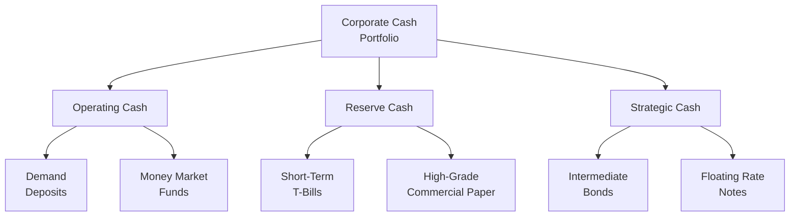

## Introduction
Ever get that feeling when you glance at your corporate bank account—maybe it’s flush with cash, maybe it’s looking a bit skinny—and you think, “Hmm, maybe I should invest some of this idle money?” But then you worry about draining your checking account for an investment right when your CFO reminds you of a major payment. Yep, this balancing act can be tricky. That is precisely why we take a portfolio approach to corporate liquidity. 

In a nutshell, corporate liquidity management is about more than just stashing cash in a single money market fund. Instead, we try to segment our funds into different “buckets”—each with its own purpose, risk tolerance, and return goals. Let’s dive deeper into how you can structure these liquidity portfolios, pick appropriate short-term instruments, and reduce risk along the way.

## Embracing a Portfolio Mindset for Liquidity
At first glance, calling it a “portfolio” might sound like we’re complicating things. But a portfolio approach simply means that we’re classifying our total cash into logical segments (often described as operating, reserve, and strategic). By doing this, we can better align each pool of funds with the right investment horizon and risk profile.

The key principles:
• Recognize that near-term liquidity needs—like paying suppliers or making payroll—should be in highly liquid instruments.  
• Reserve or “rainy day” funds can take on a little more risk in exchange for slightly higher yields because they won’t be touched unless there’s an emergency.  
• Strategic cash (for acquisitions, expansions, or special projects) can be invested in longer-dated securities or relatively higher-yielding options.  

## Segmenting the Firm’s Cash
Let’s take a look at the three typical “tranches” or categories of corporate liquidity. This segmentation is more of an analytical framework than a rigid rulebook, so adapt it as needed:

### Operating Cash
Operating cash is like the household checking account. You need that money for day-to-day bills, inventory purchases, payroll, and everything else that comes with running the business. It’s best to keep this portion in extremely liquid assets, so you don’t risk a shortfall at crucial operational moments. Examples of instruments:
• Demand deposits (checking and savings accounts)  
• Money market funds with very short maturities  
• Overnight repurchase agreements or especially short Treasury bills  

We typically aim for minimal risk with operating cash. After all, you don’t want your employees or vendors waiting on checks because you chased an extra 0.10% yield and ended up with a liquidity squeeze.

### Reserve Cash
Reserve cash is kind of like that emergency fund your parents told you to keep under your mattress—except a corporate version, obviously. It’s used for unanticipated outflows, such as emergency repairs or sudden dips in revenue. This category can stand to take on slightly more risk than operating cash because it will be tapped less frequently.

Suitable instruments might include:
• Short-term Treasury bills or notes with maturities up to six months or a year  
• High-grade commercial paper  
• Short-duration bond funds (especially if your credit risk tolerance allows)  

One friendly warning, though: it’s still “safe money,” so keep the risk on the lower end. You don’t want a severe market downturn undermining your safety cushion.

### Strategic Cash
Now, strategic cash is a little more interesting. This cash is earmarked for future acquisitions, new product development, expansion into new markets, or significant capital expenditures. You may hold it for some months—or even a couple of years—before making use of it. Because of the longer time horizon and moderate risk tolerance, you can chase higher returns than with operating or reserve cash.

Investment ideas could include:
• Short-to-intermediate bond funds  
• Longer maturity Treasury bills or notes  
• High-quality corporate bonds with short-term durations  
• Potentially some floating-rate notes or other near-cash instruments  

In practice, many corporations structure lines of credit or rely on commercial paper markets when bridging liquidity for major projects. But still, it often helps to keep some strategic cash on hand to avoid the cost or complexity of external financing.

Below is a simple Mermaid.js diagram to visualize these three tranches and their corresponding investment options:



## Evaluating Permissible Investment Vehicles
Corporate treasurers often have a range of allowable investments laid out in a formal policy. Common permissible vehicles include:

• Treasury Bills (T-Bills): Extremely safe, highly liquid, but typically offer lower yields. Maturities range from a few days up to a year.  
• Commercial Paper: Short-term debt from corporations. Typically yields more than T-bills, but with added credit risk.  
• Certificates of Deposit (CDs): Bank-issued interest-bearing instruments with specified maturities—often used for operational or reserve liquidity.  
• Money Market Funds: Offer daily liquidity and a diversified portfolio of money market instruments, though they carry some risk of “breaking the buck.”  
• Short-Term Bond Funds: Potentially higher yield than money markets, but subject to interest-rate risk and credit risk.  

In evaluating these investments, you’ll consider credit risk (e.g., the credit rating of the issuer), interest-rate risk, liquidity, and yield. The firm’s liquidity policy generally prescribes maximum maturities, credit quality thresholds, and diversification guidelines to contain these risks.

## The Diversification Imperative
Just like you wouldn’t put all your personal savings into one type of stock, a company shouldn’t concentrate its liquidity in a single instrument or with a single counterparty. Diversifying across instruments, maturities, and issuers helps ensure that a single negative event (like a default or an unexpected regulatory shift) doesn’t kneecap the entire liquidity portfolio.

### Key Diversification Dimensions
• Instrument type: e.g., T-bills, commercial paper, CDs, and so forth.  
• Issuer or counterparty: avoid overweighting a single bank or a single corporate issuer.  
• Maturity distribution: stagger maturities so that you always have funds coming due in a laddered format.  

## Balancing Liquidity and Yield
Arguably the biggest challenge is balancing the ease of conversion to cash with the desire for incremental yield. Greater liquidity often translates to lower returns. For instance, money sitting in a checking account rarely earns anything significant. Conversely, if you lock your cash away in a longer-term investment to pick up yield, you risk having to exit early at a loss if an unexpected cash need arises.

This trade-off is typically addressed by aligning each segment (operating, reserve, and strategic) with suitable maturities:
• The operating bucket invests only in highly liquid, nearly risk-free instruments.  
• The reserve bucket invests in short-duration but slightly higher-yielding assets.  
• The strategic bucket can take on modest interest-rate risk or credit risk to earn higher yields.  

### Sample Portfolio Allocation Example
Let’s imagine a scenario. Suppose your corporation holds $100 million in total cash:

• Operating cash: $40 million (demand deposit and a small slice in a money market fund).  
• Reserve cash: $30 million (laddered T-bills, commercial paper).  
• Strategic cash: $30 million (short-term bond funds, floating-rate corporate notes).  

This distribution might shift with your firm’s specific outlook, upcoming capital needs, or risk appetite. If you see a big capital project on the horizon, you might temporarily keep a larger portion in more liquid forms.

## Liquidity Risk Management: Protocols and Practices
Managing liquidity is often about planning for the unexpected. Daily liquidity stress tests, scenario analyses, and forecasting help keep you prepared. A few best practices:

• Daily/Weekly Forecasting: Keep a rolling cash forecast that identifies probable inflows and outflows.  
• Stress Testing: Model “what-if” scenarios—like delayed receivables or accelerated payables—to see if you might run short.  
• Contingency Funding: Identify backup lines of credit or overdraft facilities to cover extraordinary liquidity shortfalls.  
• Ongoing Monitoring: Track credit ratings of issuers in which you invest. If a once-high-grade credit starts slipping, shift away sooner rather than later.

If you’re more quant-minded, you can incorporate scenario analysis in Python (or Excel) to estimate potential shortfalls under stressed conditions. Here’s a tiny Python code snippet showing how you might simulate daily net cash flows:

```python
import numpy as np

np.random.seed(42)

# with mean = 0.5 million, std = 2.0 million
daily_flow = np.random.normal(loc=0.5, scale=2.0, size=365)

start_cash = 40.0  # Operating cash in millions
cumulative_cash = start_cash + np.cumsum(daily_flow)

threshold = 20.0
days_below = np.sum(cumulative_cash < threshold)

print(f"Number of days below threshold: {days_below}")
```
This quick simulation can highlight how many days in a year you might risk dropping below a comfortable cash minimum, prompting you to refine your portfolio or arrange contingency financing.

## Guidelines on Maturities and Credit Quality
Well-crafted investment policies establish:
• Maximum maturity: e.g., no more than 12 months for reserve cash.  
• Target duration: e.g., the weighted-average maturity for strategic cash might be 6–12 months.  
• Credit rating floors: e.g., instruments should be rated A–1 (short-term) or A– (long-term).  
• Concentration limits: e.g., no more than 5% in any single issuer.  

Such guidelines protect you from creeping into riskier assets in search of yield. They also make it easier to maintain discipline amid changing market sentiments.

## Reviewing and Rebalancing the Portfolio
It’s easy to “set it and forget it,” but your liquidity portfolio needs regular reviews. Cash flow forecasts change, your company’s strategic goals evolve, and market conditions move daily. A monthly or quarterly rebalancing process can be used to:

• Re-align each segment of cash with its dedicated risk/return profile.  
• Harvest gains or cut losses from underperforming instruments.  
• Respond to changes in interest rates or credit conditions (e.g., a significant shift in the yield curve).  

Formalizing this approach—often in an approved treasury policy—ensures you remain proactive.

## Practical Anecdote: The “Forgotten” Reserve
I once worked on a treasury team where we inadvertently neglected a substantial “rainy day” fund for over a year. We were so focused on daily operations (the “urgent stuff”), that we forgot to optimize the $10 million set aside for “just in case.” Had we just laddered simple T-bills, we would have earned a decent risk-free return. Instead, the money sat in a low-interest saving account. Although it wasn’t catastrophic, it was a missed opportunity that taught me to pay attention to all segments of the liquidity portfolio—no matter how “out of sight” they seem.

## Glossary
• Liquidity Portfolio: A pool of cash and near-cash assets managed attentively for short-term obligations and strategic flexibility.  
• Marketable Securities: Financial instruments that can be quickly converted to cash, such as T-bills or high-quality commercial paper.  
• Operating Cash: Cash required for day-to-day operations, payroll, and immediate expenses.  
• Reserve Cash: Cash set aside for unanticipated outflows or emergency uses.  
• Strategic Cash: Cash held to fund future acquisitions, investment opportunities, or debt maturities.  

## References and Further Reading
• CFA Program Curriculum (Corporate Issuers): Sections on Asset Management Policies.  
• Fabozzi, F. (ed.). Handbook of Finance: Investments, Liquidity, and Capital Markets.  
• “Treasury Management,” Association for Financial Professionals (AFP).  

These materials explore liquidity-management fundamentals, security selection in short-term investing, and advanced treasury management strategies. They’re definitely worth checking if you want to dive even deeper.

## Test Your Knowledge: Portfolio Approach to Corporate Liquidity



### A corporate treasurer wants to manage cash by segmenting it into operating, reserve, and strategic tranches. Which statement best describes why this approach is beneficial?
- [ ] It focuses only on maximizing yield across all cash balances.  
- [ ] It eliminates interest-rate risk for short-term cash balances.  
- [x] It aligns different portions of cash with distinct liquidity and risk-return needs.  
- [ ] It guarantees positive returns in all market environments.  

> **Explanation:** By breaking down total cash into segments for different needs (operating, reserve, strategic), companies align each portion with an appropriate time horizon and risk profile.  

### When choosing between Treasury bills and commercial paper for reserve cash, which of the following is the primary differentiating factor?
- [x] Credit risk  
- [ ] Maturity  
- [ ] Liquidity  
- [ ] Regulatory risk  

> **Explanation:** Commercial paper involves corporate credit risk, whereas Treasury bills are backed by the government and considered virtually risk-free, making credit risk the major differentiator here.  

### Which statement most accurately describes the main drawback of keeping too large an amount of operating cash in a checking account?
- [ ] It can cause suppliers to reject payments.  
- [x] It earns virtually no return and may represent an opportunity cost for the firm.  
- [ ] It becomes disqualified for FDIC insurance.  
- [ ] It immediately triggers heavy tax consequences.  

> **Explanation:** Operating cash typically earns minimal interest in a checking account, so large balances beyond daily operational needs can result in an opportunity cost.  

### An organization that invests only in one-year Treasury bills for all its liquidity needs is most exposed to what type of risk?
- [ ] Reinvestment risk  
- [x] Interest-rate risk on outflows if rates shift significantly  
- [ ] No risk, because T-bills are risk-free  
- [ ] Currency risk  

> **Explanation:** While default risk is minimal for T-bills, the firm could face interest-rate risk in the sense that if it needs to liquidate holdings early in a rising rate environment, the market value of those bills could decline.  

### How does diversifying the short-term investment portfolio across maturities help a corporation?
- [ ] It significantly increases the overall yield in all cases.  
- [x] It ensures that cash flows back to the firm at different intervals, reducing reinvestment risk and risk of illiquidity.  
- [ ] It enables the use of derivatives in a more effective manner.  
- [ ] It allows the corporation to incorrectly classify commercial paper as long-term.  

> **Explanation:** Laddering maturities ensures that cash is coming due periodically, providing smoother liquidity management and reducing the risk of being locked into a single maturity point.  

### A firm uses daily scenario analysis to test unexpected outflows in its short-term investments. What is the primary goal?
- [ ] To ensure maximum possible yield in the portfolio.  
- [x] To identify potential liquidity gaps and plan for contingency funding.  
- [ ] To capture unrealized gains in the portfolio.  
- [ ] To judge the creditworthiness of each issuer.  

> **Explanation:** Daily scenario analysis helps identify when outflows might exceed the firm’s available liquid resources, allowing treasurers to arrange backups or credit lines.  

### Which of the following is NOT a typical guideline found in a corporate investment policy for short-term liquidity management?
- [ ] Maximum maturity constraints  
- [ ] Credit rating requirements  
- [ ] Concentration limits  
- [x] Mandatory investments in only high Beta stocks  

> **Explanation:** An investment policy for managing short-term corporate liquidity would usually limit risky equity allocations; high Beta stocks are generally not in scope for short-term liquidity management.  

### A corporation holds “strategic cash” meant for a possible acquisition in 18 months. Which instrument might be the most suitable?
- [ ] Overnight repos  
- [x] Short-to-intermediate maturity bond funds  
- [ ] Demand deposit accounts  
- [ ] 30-year government bonds  

> **Explanation:** Strategic cash with an 18-month horizon can take on slightly more interest-rate risk for higher yield. Short-to-intermediate bond funds match this time frame better than overnight or very long maturities.  

### Which is the greatest benefit to setting credit quality floors (e.g., at least A–1 for short-term investments) in a liquidity portfolio?
- [x] It mitigates default risk by limiting exposures to only higher-quality issuers.  
- [ ] It increases yield by restricting the universe of investable assets.  
- [ ] It provides unlimited liquidity in all circumstances.  
- [ ] It ensures daily mark-to-market is never required.  

> **Explanation:** Setting credit rating requirements shrinks the investable universe to higher-quality issuers, reducing the likelihood of default and preserving liquidity.  

### A firm laddering maturities in its liquidity portfolio is:
- [x] True  
- [ ] False  

> **Explanation:** True. Laddering maturities means investing in instruments that mature at staggered intervals to facilitate consistent liquidity over time.  


