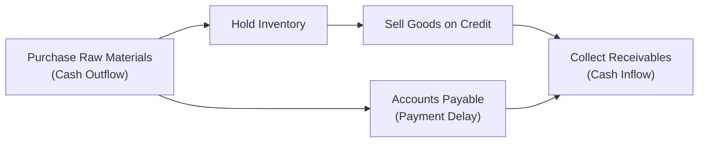

## Introduction
Working Capital Management often feels like that juggling act we see at local street fairs: you’ve got your assets up in the air, and if you’re not careful—boom—down everything comes, right? Anyway, this section aims to make that juggling act a tad less scary. We’re exploring a comprehensive real-world style vignette that highlights key working capital components—think inventory turnover, receivables collection, payables terms, and short-term financing. You’ll see how each piece interacts, plus how small tweaks in daily processes can have enormous impacts on a firm’s liquidity position and strategic flexibility.

We’ll dive into a fictional mid-size manufacturing firm, “Sunnyvale Manufacturing,” created to mimic real-world complexities. You’ll learn to pick out vital data points for net working capital analysis, consider short-term alternatives (like lines of credit vs. commercial paper), and propose ways to optimize that good old cash conversion cycle (CCC). By the end, you’ll be ready to answer vignette-based multiple-choice questions—just like on exam day.

## The Sunnyvale Manufacturing Vignette
Picture a mid-size manufacturing company named Sunnyvale Manufacturing, which produces specialty automotive parts. They have a global supply chain, but their principal operations are located in Europe and North America.

Over the last 12 months:

• Sunnyvale’s average inventory turnover has slowed from 8× to 6×.  
• Receivables collection period (Days Sales Outstanding, DSO) inched up from 45 days to 52 days.  
• Payables terms mostly remain net 30, but management is contemplating negotiations for extended terms to net 45.  
• The company financed short-term working capital needs primarily with a revolving line of credit from a local bank, but they’re now eyeing a commercial paper program to reduce interest expense.  
• Because of changing customer demand cycles, production can swell unexpectedly, which ties up more working capital in inventory.  

Sunnyvale’s CFO is concerned about short-term liquidity and how these changes might affect the firm’s credit rating. While the CFO is impressed by the possibility of cheaper funding, issuing commercial paper can carry stricter credit rating requirements. On top of all that, the CFO is exploring hedging solutions beyond currency forward contracts—perhaps interest rate swaps or even short-term foreign exchange hedges—amid volatility in exchange rates and rates markets.  

Sitting in the CFO’s office, you’re asked to review potential improvements in working capital strategy. You have the following questions swirling around:

• Should the firm renegotiate credit terms with suppliers?  
• Is it feasible to push for faster receivables collection without damaging client relationships?  
• Are there hidden pitfalls in switching from a line of credit to commercial paper?  
• Which metrics should Sunnyvale track to make sure any changes translate into real performance gains?  

## Key Data Points and Their Implications
In a typical item set (vignette), you’d see a table or snippet of the firm’s financials. Let’s break down the variables we’d likely look for and how they matter:

• Days of Inventory on Hand (DOH):  
  Measures how long (in days) inventory stays in stock before it’s sold.  
  It is calculated as  
  
    \text{DOH} = \frac{\text{Average Inventory}}{\text{Cost of Goods Sold per Day}}
    
  If this number is creeping upward—like from 45 days to 60 days—it indicates you’re tying up more capital in stock.  

• Days Sales Outstanding (DSO):  
  Reflects how quickly receivables are collected. A rising DSO can signal loosening credit practices or slower customer payments.  
  
    \text{DSO} = \frac{\text{Accounts Receivable}}{\text{Credit Sales}} \times 365
    

• Days Payables Outstanding (DPO):  
  Measures how long it takes a firm to pay its suppliers. Extending supplier credit terms can improve cash flow in the short term, but be sure it doesn’t become so long that it strains supplier relationships or triggers higher prices.  
  
    \text{DPO} = \frac{\text{Accounts Payable}}{\text{Purchases per Day}}
    

• Cash Conversion Cycle (CCC):  
  The “lifeblood” of working capital management, CCC = DOH + DSO – DPO. The shorter this cycle, the more efficient your working capital usage.  

Below is a simple Mermaid diagram showing the typical flow of the cash conversion cycle:

As you can see, the faster you move through inventory, sell products, and collect on receivables, the better. Delaying payables responsibly can also improve your liquidity position—just be mindful of reputational or relationship costs.

## Analyzing Sunnyvale’s Challenges
Sunnyvale’s inventory turnover slip from 8× to 6× is a big red flag. Why is that happening? Maybe customers want more customization, so the firm holds more materials on hand. Or maybe they’re purchasing raw materials earlier than needed to lock in lower commodity prices. Whatever the reason, an extra chunk of capital is probably tied up in inventory.  

Additionally, the jump in DSO from 45 days to 52 days signals that customers are taking longer to pay. This time extension could be from new, larger clients that demanded friendlier credit terms, or perhaps from existing customers who are simply delaying payments. Either way, that equates to delayed cash inflows.  

On the payables side, Sunnyvale’s typical terms are net 30, and they’re exploring net 45. Sure, if the suppliers go along, it might reduce the near-term cash outflow. But can Sunnyvale maintain good relations with vendors, or will suppliers charge more for the 15-day extension?

Finally, the CFO sees a potential interest expense benefit from commercial paper, which typically offers lower rates than a bank line of credit—assuming you have a strong enough credit profile. However, multiple variables come into play: fees, ongoing compliance checks, credit rating thresholds, and the need for market acceptance of Sunnyvale’s paper.  

## Short-Term Financing Considerations
When deciding between a line of credit and commercial paper, you want to balance cost and flexibility:

- Revolving Line of Credit:  
  • Pros: Quick setup, flexible, relationship-based, often no rating agencies needed.  
  • Cons: Historically higher interest rates compared to commercial paper, possible restrictive covenants.  

- Commercial Paper (CP):  
  • Pros: Often lower interest rates, feasible for short-term financing of working capital, brand credibility (if credit rating is strong).  
  • Cons: Requires high credit ratings to keep costs low, might involve fees for backup lines of credit, potential liquidity risk if the CP market tightens.  

If Sunnyvale is rated BBB, for instance, it can probably tap the CP market, but it’ll pay a premium compared to an A-rated issuer. They also need to maintain a backstop facility in case they can’t roll their maturing commercial paper. So maybe the CFO is right to consider CP, but we have to do that cost-benefit analysis thoroughly.

## Improving the Cash Conversion Cycle
Let’s be honest: the best improvements often come from operations, not just from financial engineering. Sunnyvale could shorten its DOH by streamlining production or adopting just-in-time (JIT) methods—if the supply chain is reliable. They could also refine their demand forecasting, so they don’t keep unnecessary buffer stock.  

To speed up receivables collections, Sunnyvale might incentivize early payments—if it’s worth the discount. They might also reevaluate credit terms: is a big portion of sales going to clients with historically late payments? Maybe it’s time to tighten policies, or invoice digitally to reduce bureaucratic bottlenecks.  

If Sunnyvale can nudge up their DPO from, say, 30 days to 40 days without incurring penalties or straining relationships, that’s 10 extra days of “interest-free” financing. But you can’t push it too far, or you might lose supplier goodwill.  

Finally, the CFO’s desire to hedge interest rate or currency fluctuations is a good call—especially if input costs or sales are in multiple currencies. Tools like short-term forward contracts or interest rate swaps can guard against big hits to net income from exchange rate or rate spikes.  

## Recommended Metrics to Track
A continuous improvement approach demands consistent tracking. Here are some suggestions for Sunnyvale:

- DSO (Days Sales Outstanding): Weekly or monthly measurement to see if collection tactics are working.  
- DOH (Days of Inventory on Hand): Break it out by product category or region if helpful.  
- DPO (Days Payable Outstanding): Ensure you’re paying suppliers within agreed terms.  
- CCC (Cash Conversion Cycle): The single composite measure.  
- Line of Credit Utilization: If you keep it around 40–60% usage, you can handle spikes in demand or unexpected shortfalls.  
- Commercial Paper Rates vs. Revolving Rates: Ongoing comparison to confirm the decision to issue CP remains optimal.  

## Practical Tips and Potential Pitfalls
• Negotiation Skills: Extending payables or accelerating receivables can be tricky. You don’t want to alienate your long-term partners or best clients.  
• Overreliance on CP: If Sunnyvale commits to commercial paper but the market seizes up (like in 2008), rolling over maturing obligations can become daunting or expensive.  
• Credit Rating Sensitivity: A minor downgrade from BBB to BB+ could skyrocket costs and hamper CP issuance.  
• Inaccurate Forecasting: If you hold less inventory to reduce DOH but demand suddenly spikes, you can’t fill orders on time—and that might hurt your reputation.  
• Hedging Mistakes: Hedging is great until it’s not. Setting up an interest rate swap or FX hedge incorrectly could backfire and lock you into adverse rates.  

A personal anecdote: I once worked with a mid-size manufacturer that offered extended credit terms to a major client without adjusting their own supply chain. Suddenly, their payables cycle was still locked at net 30, but they had a new net 60 arrangement for receivables. The firm’s CFO was appalled at the ballooning bank fees until they quickly restructured each side of the equation to maintain balance. It was a bit of a scramble, but they learned the importance of coordination among sales, finance, and supply chain teams.

## Conclusion
Working capital management is no small feat. It involves an intricate dance between inventory, receivables, payables, and short-term financing. Sunnyvale’s vignette shows real-world dilemmas faced by a mid-size firm, and the complexities of adopting new financing tools like commercial paper. At the end of the day, the best approach is a balanced strategy: keep the CCC in check, maintain healthy relationships with customers and suppliers, and ensure you have robust, flexible financing. Remember, the CFO’s job is not just about cutting costs but also ensuring the business can respond quickly and effectively to market twists.

If you can pick out the key data, interpret shifts in DSO, DOH, or DPO, and incisively evaluate short-term funding alternatives, you’ve pretty much nailed the core skills that help you succeed in exam vignettes—and, ultimately, in real-world finance roles.

## Test Your Knowledge: Working Capital and Short-Term Financing



### Which metric directly measures the speed at which a firm collects on its credit sales?

- [ ] DOH (Days of Inventory on Hand)
- [ ] DPO (Days Payable Outstanding)
- [x] DSO (Days Sales Outstanding)
- [ ] Cash Conversion Cycle (CCC)

> **Explanation:** DSO focuses on receivables. It calculates the average number of days needed to collect payment after a sale.

### A drop in inventory turnover from 8× to 6× indicates:

- [ ] The firm is selling inventory faster than before.
- [ ] The average inventory level has declined.
- [ ] Cash is freed up earlier in the cycle.
- [x] More capital is tied up in unsold inventory.

> **Explanation:** A decline in turnover means inventory stays on the shelves longer, requiring the firm to invest more in inventory.

### Sunnyvale is considering switching from a bank line of credit to commercial paper. Which of the following is most accurate?

- [ ] Commercial paper always has higher interest rates.
- [ ] Commercial paper has no effect on credit rating considerations.
- [x] Commercial paper generally offers lower interest rates, but requires a high credit rating.
- [ ] Bank credit lines and commercial paper are functionally identical.

> **Explanation:** Commercial paper typically yields lower costs, but it demands consistent market access and good credit ratings.

### To shorten the cash conversion cycle, a firm might:

- [x] Decrease inventory levels and reduce the receivables collection period.
- [ ] Extend customer payment terms significantly and pay suppliers earlier.
- [ ] Push buyers to pay later and suppliers to accept early payments.
- [ ] Stop measuring DSO, DOH, and DPO.

> **Explanation:** A shorter CCC implies quicker inventory turnover and faster collections, not extended receivables.

### If Sunnyvale extends its payables by 15 days, which of the following is a potential downside?

- [ ] It will automatically reduce the firm’s credit requirements.
- [x] Suppliers might impose higher prices or revoke discounts.
- [ ] It immediately creates a hedge against interest rate risk.
- [ ] Customers might be negatively affected.

> **Explanation:** Pushing out payables is beneficial for liquidity, but suppliers might penalize you with higher prices or lost discounts.

### The CFO is worried about currency fluctuations affecting short-term transactions. A practical hedging approach would be:

- [x] Using a short-term forward contract to lock in exchange rates.
- [ ] Taking out a fixed-rate 30-year bond in foreign denominations.
- [ ] Eliminating all foreign customers to avoid the issue.
- [ ] Relying on a credit default swap (CDS) for currency risk.

> **Explanation:** Short-term forward contracts effectively manage currency risk tied to near-term imports/exports or payables/receivables denominated in foreign currency.

### If the collections period rises from 45 days to 60 days, how might the firm compensate without raising additional external capital?

- [ ] Reduce payables to suppliers.
- [x] Decrease inventory levels or renegotiate payables terms.
- [ ] Increase the dividend payout ratio significantly.
- [ ] Issue new equity shares.

> **Explanation:** Freeing up capital by controlling inventory or postponing payables can mitigate the strain from slower collections.

### Which of the following best describes the benefit of monitoring a line of credit utilization rate?

- [x] It helps ensure the firm has room to handle short-term spikes in funding needs.
- [ ] It directly measures how quickly customers pay their bills.
- [ ] It reveals the maximum allowable commercial paper issuance.
- [ ] It is irrelevant to working capital management.

> **Explanation:** Monitoring utilization gives companies a sense of their headroom for borrowing if unexpected cash needs arise.

### A firm that consistently delays supplier payments beyond agreed terms faces which most likely outcome?

- [ ] Lower days payable outstanding (DPO).
- [x] Damaged supplier relationships or potential supply disruptions.
- [ ] An immediate upgrade in its credit rating.
- [ ] Reduced net working capital requirements forever.

> **Explanation:** While extending payables can help liquidity, doing so beyond agreed terms can harm relationships, potentially risking supply chain stability.

### True or False: A shorter cash conversion cycle always results in lower profitability for the firm.

- [ ] True
- [x] False

> **Explanation:** A shorter CCC usually frees up cash more quickly, potentially enhancing profitability by reducing financing costs.



---

References and Further Reading:  
• CFA Institute’s Official Curriculum—Corporate Issuers.  
• Company Annual Reports (e.g., manufacturing firms) for real-world examples of working capital disclosures.  
• Professional mock exams and item sets focusing on short-term funding, liquidity management, and working capital metrics.  
• Vaughn, M., “Working Capital Strategies,” Journal of Corporate Finance, 2020.  
• Bragg, S., “Business Ratios and Formulas,” 3rd Edition, Wiley.  

Remember: Working capital management is not just about pumping up metrics—it’s about sustaining healthy financial relationships across the value chain. Keep practicing with vignettes like Sunnyvale’s to build the muscle memory for your real CFA exam day. Good luck!
