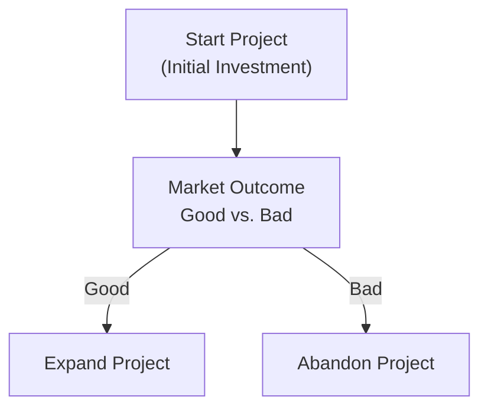

## Introduction

Let me start by confessing that, a few years back, I had this grand idea about investing in a small agribusiness. And I was super excited—until I realized the future demand for certain crops was a massive question mark. Any unexpected shift in consumer preferences or regulatory changes, and my capital outlay would have been at serious risk. That’s exactly when I discovered “real options.” Real options gave me the flexibility to expand if demand soared or cut my losses (abandon) if demand never materialized.

Real options revolve around strategic decisions embedded in real (i.e., nonfinancial) assets. Sure, you’ve probably heard of financial options on stocks or commodities. But real options live within capital budgeting: the right, not the obligation, to alter your project in response to market conditions. At the end of the day, the presence of these options can significantly boost the overall project value because they allow you to be proactive—grabbing favorable scenarios and mitigating downside risk.

In this section, we explore four main real options (expansion, abandonment, timing, and flexibility), how to incorporate them into standard net present value (NPV) analysis, and why real options are critical to shaping a firm’s broader corporate strategy.

## Understanding the Essence of Real Options

Real options differ from traditional financial options in that they refer to tangible investment or operational choices that managers can make. Whereas a financial option might allow you to buy a stock at a certain price, a real option might let you postpone the launch of a new product line, expand a factory, or shut down an underperforming segment. The crux is the same: real options confer rights but not obligations.

Traditional discounted cash flow (DCF) analysis assumes that once you greenlight a project, you’re pretty much locked in. But real options open the door to dynamic decision-making when the world changes. And trust me, the world always changes. This added flexibility has monetary value—commonly known as “option premium” for real options.

## Key Types of Real Options

### Expansion Options
Imagine you build a pilot plant for a new chemical process. Suppose it becomes wildly popular, and your brand is suddenly shining with unstoppable demand. In that case, you have the option to scale up production capacity (take on bigger footprints, hire more labor, invest in extra machinery). This “expand” option is valuable because you can leverage a favorable environment.

• Why it matters: You capture upside potential if the market is better than anticipated.  
• How to identify it in vignettes: Keywords like “additional capacity,” “scaling up,” or “incremental capital outlay” are classic hints.

### Abandonment Options
Then there’s the flip side: the option to abandon. Let’s say you launch a product, but it ends up as a total flop. Instead of sinking capital into a sinking ship (pardon the pun), you can cut your losses by selling or repurposing the assets. This “abandon” option effectively sets a floor under the project’s value. You might recoup some salvage value or at least eliminate future losses.

• Why it matters: It mitigates downside risk and places a lower bound on the project’s value.  
• How to identify it in vignettes: Watch for phrases like “exit strategy,” “dispose of,” or “sell the assets early.”

### Timing Options
Sometimes, the best move is simply to wait. Go back to my agribusiness example. If I can’t predict next year’s demand for a certain specialty crop, it might be wise to delay investing in equipment until I have better information—like a consumer preference survey or new dietary guidelines. This timing option can be priceless if you suspect near-term volatility or if the technology is rapidly evolving.

• Why it matters: You gather more information and reduce uncertainty before committing big money.  
• How to identify it in vignettes: Words like “deferral,” “delay,” or “postpone investment decisions” are your signal that a timing option is lurking.

### Flexibility Options
Flexibility options let you change production processes, switch inputs, or alter output mixes based on market conditions (you know, pivot from donuts to bagels if sugar regulations heat up). You can also think about fuel flexibility (e.g., a power plant that can burn coal, gas, or biomass).

• Why it matters: Helps you respond to ongoing shifts in consumer demand, commodity prices, or regulatory policies.  
• How to identify it in vignettes: Look for references to “adjusting the product line,” “switching suppliers,” or “varying output mix.”

## Valuing Real Options: Incorporating Option Premium into NPV

Let’s say you have a base-case NPV from your standard DCF approach. Now you suspect there’s extra value (or safety) from the presence of a real option. Instead of ignoring it, you should quantify that option. The total project value might look like:

KaTeX formula for conceptual illustration:


\text{Project Value with Options} = \text{Base-Case NPV} + \text{Option Premium}


The option premium is sometimes referred to as the incremental value. This premium accounts for the fact that management can steer the project to a better path or abandon it if the outlook goes sour.

One way to estimate the option premium is:

1. Compute the project’s NPV without the option (the usual approach).  
2. Model the scenarios in which the option is exercised—like expansion or abandonment—and calculate the plausible payoffs under each scenario.  
3. Weight these outcomes by probabilities (or run scenario analyses) to arrive at an expected payoff from the option.  
4. Discount that payoff at the appropriate risk-adjusted discount rate or use a binomial or other option pricing technique.

Your final answer is:


\text{Option Premium} = \text{Expected value of option outcomes} - \text{(Cost of having that option)}


Yes, there can be a cost to real options (e.g., building capacity or designing flexible systems might cost extra up front).

## Decision Tree Analysis and Binomial Models

Decision trees help illustrate how real options might play out. Let’s visualize a basic expansion-or-abandon scenario:

• In the “Good” branch, you might enjoy a high payoff if you exercise the expansion option.  
• In the “Bad” branch, you salvage some value by abandoning, rather than continuing a losing venture.

A binomial approach has a similar logic but uses discrete up and down moves over multiple periods. It’s reminiscent of how you’d price a financial call option, except the underlying asset is your project instead of a stock. If the project’s “value” can move up (u) or down (d) each period, you can iteratively find the option value at each node and discount backward to get the present value.

## Scenario and Sensitivity Analysis

No real options discussion is complete without scenario and sensitivity analyses. Market demand, production costs, competition, or regulatory changes can shift the probability of “good” vs. “bad” outcomes. How do you incorporate these changes?

• Scenario Analysis: Lay out best-case, base-case, and worst-case scenarios. For each scenario, determine whether you’d exercise the option (expand, abandon, etc.). Then multiply each scenario’s payoff by its probability and sum.  
• Sensitivity Analysis: Vary one input (say, the price of raw materials) over a range and see how the real option value changes. Some inputs have a much bigger effect than others on your final project valuation.

## Strategic Integration with Corporate Planning

Real options don’t live in a vacuum. They often sync up with a firm’s overall strategic vision. For example:

• Expansion options might align with large-scale growth strategies, especially if your corporate strategy is to become the market leader.  
• Abandonment options might align with your risk management approach, ensuring you don’t bleed money from non-core or nonprofitable ventures.  
• Timing options integrate with your competitive strategy: yes, deferring invests might yield better info, but you risk losing first-mover advantage. Finding that sweet spot is an art (some folks call it “managerial intuition,” but let’s just say it’s a well-informed guess!).  
• Flexibility options can drive synergy across different product lines or geographies, letting you respond quickly to local demand shifts.

## Putting It All Together: Incremental Value Justification

Real options can be the deciding factor in whether a capital project is a “go” or “no-go.” You might see a negative or borderline NPV project that suddenly turns acceptable once you add the option premium. That’s because the ability to pivot or expand can inject upside, while the right to abandon can preserve capital if the project goes poorly. So, next time you see a borderline DCF analysis, ask yourself: “Is there a real option hidden here?”

• Project’s Base-Case DCF: $500,000  
• Real Option Premium (e.g., expand if things go well): $250,000  
• Final Project Value: $750,000  

It’s that extra $250,000 that might justify your initial capital outlay.

## Alternative Real-Option Models

In practice, you can estimate real options via:

• **Binomial tree approach**: Great for capturing discrete steps and potentially big market swings.  
• **Simulation-based approach**: Monte Carlo simulations model a distribution of outcomes for uncertain variables (like sales growth, costs, or market share). You then spot how often the option pays off and in which states.  
• **Closed-form models**: Rarely, you might see an adaptation of the Black–Scholes formula for certain real option applications, but that’s trickier to calibrate because real assets don’t always behave like tradable securities.

Use whichever approach aligns with how uncertain your environment is and the data you have. No matter which you pick, proper modeling can reveal that real options are a powerful synergy between finance and corporate strategy.

## Best Practices and Common Pitfalls

• **Best Practices**  
  1. Identify the existence of real options upfront in the capital budgeting process.  
  2. Use scenario and sensitivity analysis to ensure you’re not ignoring hidden upside or downside.  
  3. Align real options with corporate strategy—don’t treat them as purely mechanical add-ons.

• **Common Pitfalls**  
  1. Overvaluing the option: Not everything is “expandable” or “abandonable”; operationally, you might face constraints.  
  2. Underestimating the cost to build flexibility: Additional design or engineering costs can erode part of the option’s theoretical value.  
  3. Failing to recognize time constraints: Timing options are worthless if your window of opportunity is too short or you lose first-mover advantage.

## References and Further Reading

- CFA Institute. “Capital Budgeting,” Level II Curriculum (latest edition).  
- Mun, Johnathan. “Real Options Analysis: Tools and Techniques for Valuing Strategic Investments.”  
- Damodaran, Aswath. “The Promise of Real Options,” NYU Stern.  
  (http://pages.stern.nyu.edu/~adamodar/)  
- Trigeorgis, Lenos. “Real Options: Managerial Flexibility and Strategy in Resource Allocation.” MIT Press.  

## Test Your Knowledge: Real Options in Capital Budgeting



### Which of the following best describes a real option in capital budgeting?
- [ ] A par value bond that can be converted into the firm's stock.  
- [x] The right, but not the obligation, to alter a project based on market conditions.  
- [ ] A financial contract allowing managers to short-sell a derivative security.  
- [ ] An investment in intangible assets such as patents.  

> **Explanation:** Real options give managers the flexibility to change project decisions—like expanding or abandoning—based on how future events unfold.

### A project that initially looks marginal from a traditional DCF perspective could become attractive if it has:
- [ ] Operating expenses that are fully tax deductible.  
- [x] Significant real options that allow management to expand or abandon.  
- [ ] A guaranteed minimum salvage value equal to plant costs.  
- [ ] No fixed asset requirements.  

> **Explanation:** Real options can enhance a project’s value by incorporating strategic flexibility, turning a borderline NPV into an acceptable one.

### Which real option typically grants an investor the option to commence a project at a later date?
- [ ] Abandonment option.  
- [ ] Expansion option.  
- [x] Timing option.  
- [ ] Flexibility option.  

> **Explanation:** A timing option allows one to wait for more information before initiating a project, thus reducing uncertainty.

### The decision to permanently shut down a project—with possible salvage value recovery—is an example of:
- [ ] A timing option, because it defers potential losses.  
- [ ] A flexibility option, because it modifies plant output.  
- [ ] An expansion option, because it invests in future capacity.  
- [x] An abandonment option, because it effectively ends the project.  

> **Explanation:** Abandonment options let a company cut losses by stopping the project and recovering salvage value if the outlook is poor.

### When might a binomial model be more appropriate than a single-step DCF approach for real-option valuation?
- [ ] When the project has no uncertainty.  
- [x] When there are multiple periods with potential up or down movements in value.  
- [ ] When the project has a standard fixed interest rate.  
- [ ] When the project is guaranteed to yield stable returns.  

> **Explanation:** A binomial model (multi-period) captures the evolution of project value over time with discrete up/down states, aligning with real options that can be exercised at different points.

### In applying real option techniques, scenario analysis primarily helps managers:
- [x] Assess the project’s performance under various future states.  
- [ ] Estimate the market risk premium.  
- [ ] Determine a fixed dividend payout ratio.  
- [ ] Negotiate bond covenants with creditors.  

> **Explanation:** Scenario analysis examines different future states and how the optionality could be exercised under each scenario, revealing the project’s sensitivity to changes.

### If a project includes the flexibility to switch between two types of raw materials, it is known as a:
- [ ] Timing option, since management can delay or proceed.  
- [ ] Abandonment option, since it stops the project in one material and starts another.  
- [x] Flexibility option, since it provides an ability to switch inputs.  
- [ ] Expansion option, since it increases overall capacity.  

> **Explanation:** Flexibility options let the firm adjust its operating inputs, products, or processes in response to market shifts.

### A real option adds the greatest value in an environment characterized by:
- [ ] Low volatility, predictable cash flows, stable input prices.  
- [x] High uncertainty, shifting consumer demand, fluctuating product prices.  
- [ ] No intangible assets and no growth opportunities.  
- [ ] Perfectly inelastic demand and zero inflation.  

> **Explanation:** The value of flexibility rises with uncertainty. Being able to pivot or abandon in a volatile market is especially valuable.

### An "option premium" in real options parlance is best described as:
- [ ] The added discount rate for intangible assets.  
- [ ] The amortization expense for intangible assets.  
- [x] The incremental value a real option provides on top of the project’s base-case NPV.  
- [ ] The cost of capital for the project.  

> **Explanation:** The option premium is the extra boost in project value resulting from managerial flexibility embedded in the project.

### True or False: Real options can sometimes justify a greater initial investment, because the potential upside from timing or expansion flexibility is factored in.
- [x] True  
- [ ] False  

> **Explanation:** Real options can significantly increase a project’s expected value, making a larger initial outlay worthwhile if the potential benefits are large enough.


