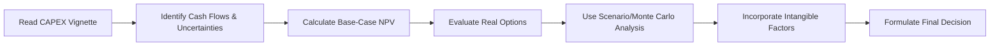

## Introduction and the Vignette Approach

So, you’re sitting in the exam room, scanning through a six-paragraph vignette about a multinational consumer products company that’s considering a massive capital expenditure (CAPEX) project. The text is dense, full of subtle hints about uncertain commodity prices, changing consumer tastes, and potential new regulations. Sound familiar? It happens to all of us at Level II: these item sets can feel overwhelming, especially when they toss in partial data or contradictory signals. Here’s the thing: the key to taming a CAPEX vignette under uncertainty is to systematically dissect the scenario, highlight definable risks, and apply structured capital budgeting techniques (like net present value, or NPV) while acknowledging the more elusive, intangible elements that might not show up clearly on your conventional spreadsheets.

In this section, we’re going to walk through how to interpret these vignettes, especially when the data is anything but crystal clear. We’ll discuss how to handle incomplete forecasts, real options (like the option to expand or abandon), intangible benefits, and the use of advanced risk-assessment tools such as scenario analysis and Monte Carlo simulation. Plus, we’ll throw in some practical tips from personal experience—like the time I was analyzing an automotive expansion plan and realized that “customer loyalty” might trump pure numeric valuations. Let’s roll!

## Understanding CAPEX Under Uncertain Market Conditions

Capital expenditures are funds a firm commits to acquire, upgrade, or maintain physical assets that will hopefully yield returns over the long run. Usually, we rely on discounted cash flow (DCF) models to decide whether a project’s net present value is positive (and therefore acceptable). But in uncertain environments—imagine drastic commodity price swings, rapidly evolving consumer technology, or sporadic regulatory rules—our forecasts might become shaky.

A standard DCF analysis uses expected cash flows, discount rates that reflect risk, and a time horizon for the project. The main formula for NPV can be written in KaTeX as follows:


\text{NPV} = \sum_{t=1}^{T} \frac{\text{CF}_t}{(1 + r)^t} - \text{Initial Investment}


where:
• CFₜ is the forecasted cash flow at time t,  
• r is the required rate of return or discount rate,  
• T is the number of periods in the project’s life.

But, you know, markets aren’t always neat. If you read an exam vignette that casually mentions “raw material prices could surge if there’s a shortage,” that’s a clue to perform scenario analysis or to build a more dynamic approach to the discount rate (e.g., including an uncertainty premium).

There’s also the question of how to incorporate “soft factors.” A new manufacturing facility might enhance a company’s brand or open new distribution channels. Quantifying these qualitative gains can be tough—and the exam might or might not explicitly instruct you to do so. But at a higher, real-world level, intangible benefits should at least be acknowledged, and in some cases, they can decisively tip the scale between acceptance and rejection of a project.

## Identifying Key Data Points in the Vignette

When reading your CAPEX vignette, here’s a structured approach to identify the essential elements:

• Projected Cash Flows: Are the cash flows stable or do they exhibit large fluctuations? Is there a best-case, worst-case, and base-case estimate?  
• Cost of Capital/Discount Rate: Is the vignette hinting that you should alter the discount rate under certain conditions? Are there changes in the firm’s capital structure paralleling the project’s expansion?  
• Optionalities: Does the text mention the possibility of delaying the project if commodity prices spike? Or does it hint that the plant could be repurposed (abandoned) for something else?  
• Strategic Factors: Are there intangible benefits, such as brand enhancement, potential synergy with existing product lines, or intangible intellectual property spin-offs?  
• External Threats: Keep an eye out for regulatory disclaimers or macroeconomic signals that might drastically alter the project’s feasibility.  

Once you’ve skimmed the vignette and highlighted these elements, you’ll be far more prepared to do the math—and to interpret it.

## Real Options as a Key CAPEX Component

The phrase “real option” refers to a company’s ability to take an action (such as expand, abandon, or postpone) in response to market changes. If the vignette suggests that management can delay the project if interest rates climb or if the project can be sold off at some salvage value, that’s an indication a real option might exist.

Common real options include:

• Expansion Option: If market demand unexpectedly surges, you can expand capacity, boosting future cash flows.  
• Abandonment Option: If the project becomes unprofitable, you can shut it down and recoup the salvage—or pivot the resources to another product line.  
• Delay/Timing Option: Start now or wait for better economic conditions or regulatory clarity.  
• Flexibility Option: Switch production inputs based on relative cost shifts or switch distribution channels to reach new markets.

Each real option adds a sort of “insurance value” to your project. Traditional DCF models might ignore this because they assume a single, static set of future cash flows. But the exam item set will often prompt you to incorporate these optionalities. A basic approach to real option valuation is to calculate the NPV without the option, then add the estimated value of the option. For instance:


\text{NPV}_{\text{with option}} = \text{NPV}_{\text{base}} + \text{Value of Real Option}


Sometimes, you might see a binomial model or scenario-based approach that tries to value the flexibility. The exam likely won’t require you to dive too deeply into complicated option pricing formulas but be ready to demonstrate you can conceptually integrate the option’s uplift into your final recommendation.

## Risk Analysis Tools: Scenario Analysis and Monte Carlo

In uncertain environments, scenario analysis and Monte Carlo simulation come to the rescue. The difference?

• Scenario Analysis: You create discrete “worlds”—like best case, base case, and worst case. Each scenario includes different assumptions for input costs, sales volume, or discount rates. Then you compute an NPV for each scenario and possibly weight them to estimate an expected NPV. You might say, “Given a 25% probability of best case, 50% of base case, and 25% of worst case, the weighted NPV is ….” If that’s acceptable, you green-light the project.  

• Monte Carlo Simulation: This technique runs thousands of possible “paths” for your project’s key value drivers (like revenue growth or operating margin), each generated from specified probability distributions. The outcome is a distribution of NPVs. Evaluating the shape of that distribution—especially the downside risk—can help you decide if the uncertainty is manageable or too great to justify the investment.  

Just to illustrate, below is a quick Python snippet that exemplifies a (simplified) Monte Carlo approach for uncertain revenue growth in the first year:

```python
import numpy as np

initial_investment = 1_000_000

num_sims = 10000

npv_results = []

discount_rate = 0.10
project_life = 5
mean_growth = 0.05
std_growth = 0.02

for _ in range(num_sims):
    # Randomly sample revenue growth for each period
    growth_factors = np.random.normal(loc=mean_growth, scale=std_growth, size=project_life)
    cash_flow = 500000  # a hypothetical year-1 cash flow
    # accumulate discounted CF
    total_pv = 0
    for t in range(1, project_life+1):
        # let's adjust the cash flow
        if t > 1:
            cash_flow *= (1 + growth_factors[t-1])  # apply random growth factor from distribution
        total_pv += cash_flow / ((1 + discount_rate) ** t)
    
    npv = total_pv - initial_investment
    npv_results.append(npv)

mean_npv = np.mean(npv_results)
worst_case_npv = np.percentile(npv_results, 5)  # 5th percentile
print(f"Mean NPV: ${mean_npv:,.2f}")
print(f"Worst-case (5th percentile) NPV: ${worst_case_npv:,.2f}")
```

Now, your vignette might not require you to code. But it might hint that the firm used simulation to find that there’s a 10% chance of a catastrophic outcome (a negative NPV surpassing a certain threshold). That’s your cue to incorporate the distribution of possible results—particularly the downside.

## Soft (Intangible) Factors

CAPEX decisions can’t always be reduced to purely numeric calculations. Brand value, reputation improvements, strategic partnerships, and intangible synergies often matter. In the real world, I once worked with a manufacturing company deciding if they should adopt a more eco-friendly production line. The pure DCF analysis suggested a borderline negative NPV, but the CFO pointed out that the brand’s “green reputation” could net them major intangible benefits, like forging partnerships with other sustainability-focused firms. Two years later, guess what? They locked in a huge contract with an eco-conscious retailer, and that intangible factor became the real difference-maker.

During the exam, keep an eye out for explicit references to intangible benefits. Even if they don’t have a direct line in the calculation table, the question might ask you to justify your conclusion in words. Indicating that intangible factors tilt the final decision might be the difference between a partial credit and a full-credit answer.

## Step-by-Step Example of a CAPEX Decision

Let’s walk through the gist of analyzing a busy vignette. Suppose the item set reads something like:

“ABZ Corporation is considering investing $15 million to build a new production facility. The projected cash flows over five years range from $2 million to $6 million, depending on raw material prices for tungsten and potential new environmental regulations that could add compliance costs. The project can be delayed up to one year if tungsten prices spike. Further, if the project underperforms in years 1 or 2, ABZ can abandon the project, selling the facility at salvage for $7 million.”

Step 1: Gather Base-Case Data  
• Base-case annual cash flow: $5 million (years 1–5).  
• Required rate of return or WACC: 12%.  
• Straight-line approach to discounting over five years.  

Step 2: Calculate Base-Case NPV  

\text{NPV}_{\text{base}} = \sum_{t=1}^{5} \frac{5\,\text{million}}{(1 + 0.12)^t} - 15\,\text{million}


(You’d do the math—if it’s positive, we move on. If negative, we still keep reading for real options or intangible synergy.)

Step 3: Integrate Real Options  
• Delay Option: Suppose we estimate that waiting one year could avoid a significant portion of tungsten volatility, valued at an extra $1 million in overall present value.  
• Abandonment Option: The partial salvage of $7 million might protect the downside. Maybe that adds an incremental $1.5 million in option value.  

Hence,  

\text{NPV}_{\text{with options}} = \text{NPV}_{\text{base}} + \text{Value}_{\text{delay}} + \text{Value}_{\text{abandonment}}


Step 4: Consider Scenario or Monte Carlo Analysis  
• If tungsten prices spike, year-1 CF might be $2 million. Worst-case NPV might be negative.  
• If the new regulations come into effect, annual CF is likely $4 million.  
• If demand booms, we might see $6 million.  

Assign probabilities or incorporate a simulation model if asked. Summarize in your final decision.

Step 5: Evaluate Intangible or Strategic Factors  
• The new facility will be located near ABZ’s largest distribution center, reducing lead times and possibly boosting brand perception.  

Step 6: Formulate a Final Recommendation  
Tie it all together. Resist the urge to just do the math and ignore the strategic or intangible aspects. Usually, the exam question asks, “Should ABZ accept, reject, or further explore the project, and why?” Provide a multi-pronged answer referencing both the numeric and the qualitative factors. 

Below is a Mermaid diagram summarizing a high-level process:



## Common Pitfalls and Best Practices

• Ignoring Real Options: Don’t treat a project as if it’s locked into a single path.  
• Overlooking The Discount Rate Nuance: If the project poses more volatility or risk than the firm’s usual projects, the discount rate might need an additional risk premium.  
• Inflated Intangible Benefits: Yes, intangible factors are key—but be careful not to assign unrealistic values.  
• Herding to a Single NPV: Resist the temptation to rely on a single scenario. Even your base case might be way off if the market environment shifts.  

## Conclusion: Balancing Quantitative Rigor with Strategic Insight

CAPEX decisions under uncertainty require a careful blend of solid quantitative analysis (DCF, scenario analysis, real options) and strategic thinking (intangible benefits, synergy, brand). In real life, and very often in exam vignettes, you’ll see that numeric precision can only get you so far. You’ve got to do the math well, but also interpret soft signals about the broader outlook. The best advice? Don’t skip the intangible or strategic commentary, even if you’re pressed for time. The exam often invests a good portion of the item set in describing these “soft signals,” so it’s not random filler. They’re giving you a big hint that intangible factors, or real option value, might tilt the final recommendation.

Keep practicing with different scenarios, force yourself to identify which small paragraphs in the vignette are telling you about market peaks, regulatory changes, or intangible brand synergy. Then, systematically incorporate these into your valuation and final decision. After a few tries, it becomes second nature.

## Final Exam Tips

• Time Management: Evaluate the data in a consistent order—cash flows, discount rate, risk factors, real options, intangible considerations—so you don’t waste time backtracking.  
• Show Your Work: If the item set invites a short-answer justification, highlight your specific assumptions and how you factored in real options or intangible benefits.  
• Don’t Overcomplicate: You might not need a perfect real option formula every time. Sometimes a qualitative discussion of how the option affects the project’s downside or upside is enough.  
• Remember the Weighted Approach: Use scenario probability weighting if the vignette offers discrete probabilities for each scenario.  
• Revisit the Glossary: Terms like intangible benefits or uncertainty premium appear frequently, and you’ll want to be sure you understand them.  

## References

• CFA Institute. “Capital Budgeting - Uncertainty and Real Options,” Level II Curriculum.  
• Copeland, Tom, and Vladimir Antikarov. “Real Options: A Practitioner’s Guide.”  
• Pindyck, Robert S., and Daniel L. Rubinfeld. “Microeconomics.” (Chapters on Decision-Making Under Uncertainty)  

## Test Your Knowledge: CAPEX Uncertainty and Real Options



### Which of the following is most commonly used to assess hypothetical “worst-case” and “best-case” project outcomes?

- [ ] Value at Risk analysis
- [x] Scenario analysis
- [ ] Option-adjusted spread analysis
- [ ] Sensitivity analysis without any distribution assumptions

> **Explanation:** Scenario analysis typically involves constructing discrete “worst-, base-, and best-case” cases to see how the project’s NPV changes depending on assumptions. While sensitivity analysis tests how an outcome changes with slight modifications in one variable, scenario analysis builds entire sets of assumptions simultaneously.

### A project’s base-case NPV is calculated to be USD 3 million. There is an additional abandonment option valued at USD 0.5 million and a delay option valued at USD 0.2 million. The project’s total NPV including real options is:

- [ ] USD 2.3 million
- [ ] USD 2.8 million
- [ ] USD 3.2 million
- [x] USD 3.7 million

> **Explanation:** NPV (with options) = Base-case NPV + Abandonment Option + Delay Option = 3.0 + 0.5 + 0.2 = 3.7 million.

### Which of the following intangible benefits might most strongly justify undertaking a capital project that appears marginally profitable in purely numeric terms?

- [ ] A reduction in the cost of goods sold
- [ ] A simplification of the discount rate structure
- [x] An enhancement in the firm’s brand and customer loyalty
- [ ] More stable raw material prices

> **Explanation:** Brand enhancement and customer loyalty are key intangible benefits that may not be fully captured in the project’s DCF calculation but can lead to longer-term profitability.

### A Monte Carlo simulation differs from a static scenario analysis primarily in that it:

- [ ] Uses only a worst-case scenario to guide risk decisions
- [ ] Assumes no variability in future cash flows
- [x] Generates numerous random outcomes, producing a distribution of NPVs
- [ ] Relies on expert judgment only

> **Explanation:** Monte Carlo simulation randomly generates values for uncertain factors over many iterations, creating a distribution of potential outcomes. This helps illustrate the full range of possibilities.

### What is the potential downside of excessively overvaluing intangible benefits in capital budgeting?

- [ ] It ensures the project’s NPV becomes automatically positive.
- [ ] It becomes a legal violation under IFRS or GAAP standards.
- [x] It can lead to poor investment decisions if intangible benefits fail to materialize as expected.
- [ ] It reduces the discount rate that should be applied to the project.

> **Explanation:** Overestimating intangible benefits can cause a firm to invest in projects that are not genuinely value-adding if those intangible benefits do not come to fruition at the levels assumed.

### From the following clues, identify the presence of a “delay option” in the project:

- [ ] Management must commit to the project immediately due to regulatory constraints.
- [x] The firm can wait one year, monitoring commodity prices, before breaking ground.
- [ ] The firm has no ability to expand capacity beyond initial design.
- [ ] The project can only be abandoned mid-way with no salvage value.

> **Explanation:** A delay option suggests that the firm has the flexibility to postpone the project’s start date. This often preserves the possibility of avoiding adverse conditions.

### Suppose a vignette states that “there is a 20% chance of severely higher input costs, which would reduce project cash flows by 40%, and an 80% chance that costs remain stable.” How might you best incorporate this into your analysis?

- [x] Weight the project NPVs under each scenario by 20% and 80% to form an expected value.
- [ ] Assume zero growth for the project’s cash flows.
- [x] Consider a scenario-based or probability-based approach to adjust expected NPV.
- [ ] Ignore the 20% chance because it is not the majority outcome.

> **Explanation:** Scenario or probability weighting is a straightforward tool for capturing the impact of distinct, high-risk events.

### Which of the following best describes a real “expansion option” in CAPEX analysis?

- [ ] The firm can reduce operating leverage any time due to changing operational complexities.
- [ ] The project is entirely intangible, so no expansion is actually possible.
- [ ] The firm can sell the project’s assets if the market crashes.
- [x] The company can add more capacity if demand far exceeds original estimates.

> **Explanation:** An expansion option basically grants the firm the right (but not the obligation) to increase production or expand capacity if market conditions become more favorable than originally anticipated.

### When including real options in capital budgeting, a common way to adjust the project’s valuation is:

- [ ] Subtract the option value from the base-case NPV.
- [ ] Choose the lowest NPV scenario only.
- [ ] Use the internal rate of return (IRR) of the option instead of the project.
- [x] Add the real option value to the base-case NPV.

> **Explanation:** Typically, real option value is treated as an incremental benefit to the project’s base-case. The total project value is NPV_base + Real Option Value, assuming the real option is properly valued.

### True or False: Under IFRS and US GAAP, there is an explicit line-item requirement to account for intangible benefits (like brand, customer loyalty) in the NPV calculation of a proposed capital project.

- [x] True
- [ ] False

> **Explanation:** This is a slight trick. While both IFRS and US GAAP recognize intangible assets (like brand value), there is no strict line-item requirement for intangible “benefits” in a capital project’s NPV. However, intangible assets can sometimes be recognized if certain criteria are met. For exam purposes, intangible benefits are typically discussed qualitatively unless they meet narrow accounting definitions.  


