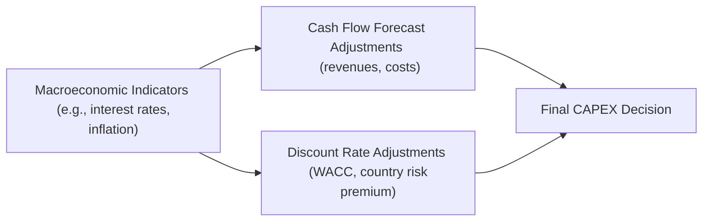

## Introduction and Context

Sometimes, when we think about capital budgeting, the conversation feels narrowly focused on a single project’s internal rate of return (IRR) or net present value (NPV). But guess what? The outside world rarely stays static. Interest rates change, inflation creeps up (sometimes more than we’d like), and exchange rates love to dance around unpredictably. That’s real life, and it can make or break the success of a major capital investment. The idea here is to understand how macroeconomic shifts ripple through our capital budgeting decisions. If you’ve seen some of your carefully laid-out forecasts go haywire because of, say, a sudden rate hike, you’ll know exactly what we’re talking about.

In this section, we’ll explore all those big-picture factors—interest rates, inflation, monetary and fiscal policies, economic indicators—and how they can alter your project’s cost of capital, future cash flows, payback periods, and more. We’ll talk about how to keep projections “real” in both nominal and real terms (pardon the pun), and we’ll see how currency volatility might affect a multinational’s big new factory in a foreign currency zone. Because let’s be real: a shiny new plant might look fantastic on paper, but if the local currency plunges 20% right after you open the doors, things quickly get interesting.

## Understanding Key Macroeconomic Factors

### Interest Rate Changes

Interest rates are the lifeblood of corporate finance—maybe that’s a bit dramatic, but, hey, it’s sort of true. When central banks tighten monetary policy (like hiking rates to contain inflation or slow an overheating economy), borrowing costs rise. That could mean new bond issues, syndicated loans, or other financing channels become more expensive.

• Higher Interest Rates: If your project’s cash flows remain the same but your discount rate creeps upward because your weighted average cost of capital (WACC) rises, your NPV might drop precariously. Sometimes that can turn a borderline “invest” decision into a “maybe later” verdict.  
• Lower Interest Rates: Lower rates reduce the cost of debt financing and may lower the required returns on equity, sometimes fueling a wave of CAPEX expansions (kind of like we often see when central banks slash rates to spur economic growth).

### Inflation

Inflation has a knack for jumping into capital budgeting decisions uninvited. It affects both your projected revenues (demand might drop if your prices rise) and your expenses (input costs can surge faster than you can pass them through to customers—if at all).

• Nominal vs. Real Cash Flows: If you’re using nominal WACC, you need nominal cash flows. If you’re using real WACC, you need real cash flows. Mixing them is a quick ticket to flawed analysis.  
• Inflation Pass-Through: How much of rising costs can you pass on to your customers? In some industries, the pass-through is almost automatic (like certain commodity-based products). In others—particularly consumer discretionary goods—it’s not so straightforward.  

I remember chatting with a CFO friend who was outraged about their budget overrun due to unexpected spikes in raw material costs, all because inflation soared more than he had (very optimistically) forecasted. Plans had to be reworked. The moral? Always embed at least a mild inflation correction in your sensitivity analysis, or you’ll end up explaining cost overruns to bewildered board members.

### Exchange Rate Fluctuations

When you’re looking at multinational operations, exchange rate risk is huge. A strong domestic currency might hurt your exports, but it can also lower the cost of imported raw materials. Conversely, if you operate in a country with a weak or depreciating currency, your input costs might skyrocket (particularly if they’re imported), while your products might become cheaper to foreign buyers.

Features to Consider:

• Currency Denomination of Revenues and Costs: A mismatch (like revenues denominated in USD while costs are in local currency) can create major volatility in your project’s net cash flows.  
• Exchange Rate Exposure: You want to watch how much of your revenues or expenses are in a foreign currency. Are you naturally hedged (for example, paying for raw materials in the same currency in which you sell your goods)? Or is there a big mismatch that might require derivatives or operational hedges?

### Fiscal and Monetary Policy Shifts

Policies can change quickly—especially in times of economic crisis or political transition—and they can have unexpected ripple effects. Suppose a government decides to offer capital investment tax credits, or maybe they slash corporate tax rates as part of a stimulus plan. That can obviously boost a project’s after-tax cash flows. On the flip side, if a new administration raises corporate taxes, you might see a decline in your net operating cash flows.

Also consider broad economic policies:

• Monetary Policy: Central bank actions determine interest rate levels and money supply growth—huge influences on your discount rate.  
• Fiscal Policy: Government spending and taxation can affect aggregate demand, consumer spending patterns, and even currency values (which circle right back into your cost of capital if there are big deficits or surpluses).

## Integrating Macroeconomic Factors into Discount Rates

When you bring macroeconomic shifts into your models, the discount rate is often the first place you look. The Weighted Average Cost of Capital (WACC) or your project-specific discount rate might be adjusted for:

• Country Risk Premium: If you’re investing in emerging markets, you might add a premium for political risk, restricted repatriation of funds, or potentially volatile exchange rates.  
• Expected Inflation: If your forecast is for higher inflation, you’ll often see that priced into both debt and equity markets, thereby raising the nominal cost of capital.  
• Shifts in the Risk-Free Rate: Typically, the risk-free rate (e.g., yield on government bonds) is a key input in the Capital Asset Pricing Model (CAPM). If policymakers push up the yield curve, your cost of equity is going up, all else being equal.

Mathematically, you might see your cost of equity (via CAPM) as:


\text{Cost of Equity} = R_f + \beta (R_m - R_f) + \text{Country Risk Premium}


where:
• \\( R_f \\) is the risk-free rate (which can fluctuate with interest rates).  
• \\( (R_m - R_f) \\) is the market risk premium, potentially also influenced by economic conditions.  
• The Country Risk Premium is the additional premium for operating in higher-risk markets.

If interest rates are rising, your \\( R_f \\) moves higher, feeding directly into your cost of equity. Likewise, your cost of debt is also likely to jump, shifting the entire capital structure cost upward.

## Building Macroeconomic Forecasts into Cash Flow Projections

### Top-Down Approach

One approach is to start with a macroeconomic forecast: for instance, the IMF might project moderate GDP growth in your target region. That suggests stable consumer spending, possibly stable corporate expansions, etc. Based on that, you might forecast moderate growth in product demand, set moderate inflation assumptions, and then refine your revenue and cost outlook. This top-down approach can be particularly handy when you’re trying to gauge broad demand changes—like if your industry correlates heavily with GDP.

### Bottom-Up Approach

Alternatively, you could build out your own model from a micro perspective, then test the macro assumptions as a stress test or scenario analysis. For instance:

1. You detail your best guess for pricing, volume, input costs, etc.  
2. Then you overlay various macro conditions (recession, stable growth, high inflation, etc.) to see how each scenario might shape your future cash flows.

### Scenario and Sensitivity Analyses

Scenario analysis is arguably the best way to incorporate uncertain macroeconomic conditions:

• Best Case: Suppose interest rates stay low, inflation remains moderate, and currency is stable. What does your NPV look like?  
• Base Case: A middle-of-the-road scenario that incorporates moderate inflation, slightly higher interest rates, normal GDP growth.  
• Worst Case: High interest rates, a recession hits, your currency depreciates, and your input costs soar.

You might discover that your project’s NPV can vary wildly, which begs the question: do you have a strategy to mitigate some of those macro risks? Could you use forward contracts or other hedges to manage currency exposure?

## Adapting Capital Budgeting Models Across Macroeconomic Environments

Let’s talk about a few distinct economic cycles and how your capital budgeting approach might shift in each. It’s a bit simplified, but it’ll illustrate the concept:

• Recession: Capital is likely tighter. Cash flow forecasts become more pessimistic in the short run. Companies might demand higher returns to compensate for uncertainty, or they might simply postpone major CAPEX until signs of recovery emerge.  
• Recovery: Business optimism picks up. Financing might not yet be super cheap, but it’s getting better. You might see a wave of smaller expansions or strategic new ventures.  
• Expansion: With strong demand, you might be investing heavily in capacity, but watch out for inflation and rising interest rates. This can be a time of robust risk-taking, but also the moment to include some caution flags in your analysis.  
• Slowdown or Contraction: If growth starts tapering off, interest rates may eventually come down, but both revenues and margins might face pressure. Also, a slowdown might shift your project’s risk profile.

## Monitoring Global Economic Indicators

Often, big macro changes are telegraphed by certain leading indicators:

• GDP Growth Rates: Faster GDP growth often signals a robust consumer market, so that might mean your top-line revenue forecasts can track upward. Meanwhile, a slowdown might prompt you to revise them downward.  
• Consumer Confidence Index: If consumers feel bullish, they may spend more, especially on discretionary items.  
• Sector-Specific Indicators: For instance, if you’re building a new copper mine, you might watch Chinese manufacturing output or global construction data.  
• Commodity Prices: If your input costs are heavily commodity-based (oil, metals, etc.), your capital budgeting analysis could hinge on where you think those prices are headed.

These all feed into your demand forecasts, your cost structure, and possibly your discount rate if they affect overall market risk appetites.

## Real vs. Nominal Analysis

In an inflationary environment, the difference between real and nominal analysis is crucial:

• Nominal Cash Flows: Future cash flows that include the impact of expected inflation.  
• Real Cash Flows: Cash flows in today’s purchasing power, effectively stripped of inflation.  

The general rule is that you either use real cash flows with a real discount rate or nominal cash flows with a nominal discount rate. Mixing them up is a common pitfall. For instance:


\text{Real Discount Rate} \approx \frac{(1 + \text{Nominal Rate})}{(1 + \text{Inflation Rate})} -1


But oh boy, if you use nominal cash flows with a real discount rate (or vice versa), you might incorrectly inflate (or deflate) your project’s prospective returns.

## Example: Factoring in Inflation and Exchange Rates

Say you have a project in a country with an annual expected inflation of 8%. You’ll likely forecast your nominal cash flows to go up by around 8% a year (assuming you can pass cost increases to your customers). But your discount rate also has to reflect that inflation. So if your domestic risk-free rate is 3% in a lower-inflation environment, but you’re in a high-inflation country, your required rate might be significantly higher—maybe 14%—once you factor in the local inflation premium plus any added country risk.  

Let’s say your nominal cash flows are:

Year 1: \$10 million  
Year 2: \$10 million × (1 + 8%) = \$10.8 million  
Year 3: \$10.8 million × (1 + 8%)... and so on.

You then discount these by your nominal WACC of about 14%. If you used a 5% discount rate from your home country’s low-interest environment, that wouldn’t be telling you the real story.

## Visual Illustration: How Macroeconomic Shifts Influence CAPEX

## Common Pitfalls and Best Practices

• Ignoring Exchange Rate Risk: Multinational firms sometimes proceed as though currency fluctuations are minor. That’s a mistake.  
• Mixing Real and Nominal: Don’t do it! Keep your discount rate consistent with your cash flow assumptions.  
• Overlooking Policy Risk: Sudden changes in taxation or monetary policy can disrupt your best-laid capital budgeting plan. Build a margin of safety.  
• Single-Scenario Tunnel Vision: The real world is uncertain. Scenario and sensitivity analyses are your friends.  
• Underestimating Country Risk: Higher political or economic instability means your discount rate should include a premium.

## Conclusion

Macroeconomic conditions can turn a promising project into a risky bet—or vice versa—faster than we might like. By understanding and, more importantly, quantifying these factors in your capital budgeting analysis, you can make better-informed decisions. Whether it’s adjusting your forecast for inflation, layering in a country risk premium, or running scenario analyses for currency volatility, these steps help align your project’s expected returns with the economic reality.  

When you’re reading a CFA Level II vignette, watch for cues about rate changes, inflation data, or big policy shifts buried in the text. Then incorporate that into discount rates, cost forecasts, or revenue growth assumptions. It can make the difference between a correct answer and a costly oversight.

## Glossary

• Macroeconomic Forecast: A projection about future economic conditions such as GDP growth, unemployment rates, and inflation.  
• Nominal vs. Real Cash Flows: Nominal cash flows include inflation effects; real cash flows are adjusted to exclude inflation.  
• Country Risk Premium: An additional return required for investing in countries with higher political or economic risks.  
• Exchange Rate Exposure: The risk arising from fluctuating currency values when a firm’s operations span multiple countries.  
• Inflation Pass-Through: The extent to which rising input costs are transferred to consumers through higher sales prices.

## References and Further Reading

• CFA Institute. “Global Economic Factors in Corporate Finance,” Level II Curriculum.  
• IMF World Economic Outlook data. [Link](https://www.imf.org/en/Publications/WEO)  
• Bodie, Zvi, Alex Kane, and Alan J. Marcus. “Investments.” McGraw-Hill.

## Test Your Knowledge: Macroeconomic Shifts in Capital Budgeting



### Which of the following best describes the impact of higher interest rates on a firm's capital budgeting process?

- [ ] They lower the firm's cost of debt, thereby increasing project NPVs.  
- [x] They raise the cost of both debt and equity, reducing project NPVs.  
- [ ] They automatically boost the firm's expected cash inflows due to economic expansion.  
- [ ] They make no significant impact on discount rates when evaluating projects.  

> **Explanation:** Rising interest rates typically increase both the cost of debt and equity. As the discount rate rises, the NPV of future cash flows decreases, potentially leading to the rejection of projects that might otherwise have been accepted.

### Assume a firm is analyzing a project in a country with higher inflation. Which approach is most appropriate for consistency in analysis?

- [ ] Use real cash flow forecasts but discount them using a nominal rate.  
- [x] Use nominal cash flows and discount them using a nominal cost of capital.  
- [ ] Use nominal cash flows but apply a real discount rate to adjust for inflation.  
- [ ] Use real cash flows and a nominal discount rate, since the difference is negligible.  

> **Explanation:** You want to compare like with like. If cash flows are forecasted in nominal terms, the discount rate should also be nominal. Mixing nominal and real can lead to biased results.

### In a multinational capital budgeting scenario, which factor is most likely to affect both revenues and costs in the same direction?

- [x] Exchange rate change between the home currency and the foreign operation’s currency.  
- [ ] A one-time tax credit in the home country.  
- [ ] The firm’s shift to a new market segment.  
- [ ] An unexpected product recall.  

> **Explanation:** Exchange rate movements can alter both revenues (if sales are denominated in a foreign currency) and costs (if inputs are purchased in a foreign currency). Other factors may not simultaneously affect both revenues and costs to the same degree.

### Which macroeconomic indicator typically provides insight into consumer optimism or pessimism, directly influencing demand forecasts?

- [ ] Producer Price Index (PPI)  
- [x] Consumer Confidence Index  
- [ ] Durable Goods Orders  
- [ ] The unemployment rate  

> **Explanation:** While the unemployment rate or PPI may also provide economic insights, the Consumer Confidence Index specifically measures how optimistic or pessimistic consumers are about future economic conditions, which has a direct bearing on spending.

### When adjusting capital budgeting to reflect country-specific risk in emerging markets, which component is commonly added to the CAPM cost of equity calculation?

- [x] A country risk premium  
- [ ] A lower market risk premium  
- [ ] A negative beta offset  
- [ ] A deflationary factor  

> **Explanation:** When operating in higher-risk environments, it’s standard practice to add a country risk premium to reflect political, economic, and currency risks that exceed those in developed markets.

### In an environment of monetary tightening, which of the following is the most direct consequence for a firm's capital budgeting decisions?

- [ ] Lower required returns on equity  
- [ ] Easier access to cheap debt financing  
- [x] Higher WACC, leading to fewer acceptable projects  
- [ ] A decrease in market volatility  

> **Explanation:** Monetary tightening often raises interest rates, thus increasing the cost of debt and potentially the cost of equity. As a result, the WACC rises, and fewer projects may meet the required rate of return.

### Suppose a firm operates in a HIGH inflation environment. Which statement is most accurate about the treatment of inflation in capital budgeting?

- [ ] Real and nominal approaches can be used interchangeably if inflation is high enough.  
- [ ] Nominal numbers typically ignore all inflation impact on cash flows.  
- [ ] A firm should always use a real approach, regardless of inflation.  
- [x] A firm can use either a nominal or real approach but must ensure consistency between cash flows and the discount rate.  

> **Explanation:** The key principle is consistency. You can structure the analysis in real or nominal terms but do so consistently; otherwise, you will double count or omit inflation effects.

### A firm with global operations is worried about volatile currency swings. Which method is most appropriate for incorporating this risk into the capital budgeting decision?

- [ ] Ignoring the exchange rate impact, since net income is translated back to the home currency anyway.  
- [ ] Incorporating only a single currency forecast provided by the central bank.  
- [x] Using scenario or sensitivity analysis to test various possible exchange rate outcomes.  
- [ ] Setting one flat exchange rate for the entire project timeline.  

> **Explanation:** Scenario or sensitivity analysis is crucial for capturing the uncertainty around currency fluctuations, especially when exchange rates can be volatile.

### During which stage of the economic cycle are capital budgeting decisions most likely to include higher inflationary assumptions and the potential for rising interest rates?

- [ ] Recession  
- [ ] Early recovery  
- [x] Expansion  
- [ ] Depression  

> **Explanation:** In an expansionary phase, demand heats up, potentially driving inflation upward. Central banks may respond by raising interest rates, leading firms to factor in higher borrowing costs and inflation risks.

### True or False: Mixing real cash flows with a nominal discount rate in a capital budgeting analysis typically understates the true cost of capital.

- [x] True  
- [ ] False  

> **Explanation:** Using real cash flows with a nominal discount rate will likely inflate your project’s NPV because you’re not consistently accounting for inflation in both the cash flows and the discount rate.


