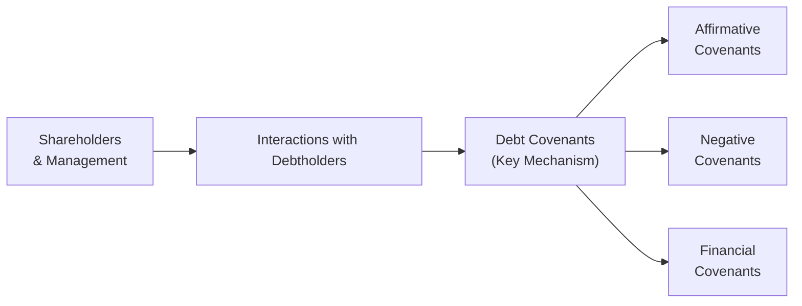

## Introduction

Debt covenants. They might sound a little intimidating at first, right? But trust me, once you get the hang of how these specific contractual clauses work, you’ll see they actually keep everybody—debtholders, management, and shareholders—on the same page. I remember the first time I encountered a negative covenant. I was helping a friend evaluate a loan agreement that basically said, “No dividends unless your debt-to-EBITDA stays below 3.0.” That triggered a moment of, “Ah, so this is how lenders keep a firm’s risk in check!” 

In this section, we’ll explore the key types of debt covenants, why they matter for corporate governance, how they can be enforced or renegotiated, and what trade-offs they present. We’ll also peek into typical exam-style vignettes. By the end, you’ll have a thorough understanding of how covenants relate to capital structure, managerial decision-making, and overall firm strategy—plus a few survival tips for that dreaded scenario of a potential covenant breach.

## Understanding the Purpose of Debt Covenants

At their core, debt covenants are contractual promises embedded in loan agreements or bond indentures that specify what the borrowing company (the issuer) can and cannot do. Lenders use covenants to mitigate troublesome risks—like managers taking on massive leverage, selling off strategic assets, or distributing all the firm’s resources as dividends. In other words, covenants limit managerial actions that might weaken the debtor’s ability to repay.

From a corporate governance viewpoint, debt covenants help align stakeholders by reducing moral hazard. Think of moral hazard in this context as the borrower’s temptation to behave riskily once the lender’s money is in hand. Debt covenants shift this dynamic by imposing accountability and transparency measures. As a result, creditors gain confidence that the firm’s actions will remain within agreed parameters.

## Types of Covenants: Affirmative, Negative, and Financial

While there are countless ways to structure a covenant package, three general categories are widely recognized:

### Affirmative Covenants
Affirmative covenants require the borrower to do something. These might include:
• Maintaining insurance coverage for key assets.  
• Providing timely audited financial statements.  
• Upholding ethical or legal standards in operations.  
• Keeping certain assets in good working condition.  

An affirmative covenant is essentially a set of “must-do” items. They’re almost like daily chores lenders want you to perform to keep the house running smoothly: Pay insurance, mow the yard (the yard being your asset base), and so on. If you skip these chores, you may be in covenant breach, triggering penalties or even default.

### Negative Covenants
Negative covenants place explicit restrictions on the company. Common prohibitions include:
• Limits on selling or pledging assets.  
• Caps on issuing additional debt of a certain type or seniority.  
• Restrictions on paying dividends beyond a specified threshold.  
• Bans on mergers or acquisitions without lender approval.  

I once encountered a firm operating in an industry with high asset turnover that was subject to a negative covenant severely limiting the sale of assets. Management always had to double-check the contract before even contemplating disposing of older equipment. Essentially, negative covenants are the “don’t-do-that” rules.

### Financial Covenants
Financial covenants revolve around ratio-monitoring. These typically ensure the company’s financial health remains robust. Some examples:

• Minimum interest coverage ratio or fixed-charge coverage ratio.  
• Maximum debt-to-EBITDA ratio.  
• Minimum tangible net worth requirements.  
• Debt incurrence tests that restrict taking on new debt unless performance metrics stay above certain thresholds.  

Financial covenants are perhaps the strictest from a quantitative perspective. They say, “Hey, your numbers better look like this or you’re in trouble.”

Below is a short Mermaid diagram illustrating how these covenant categories fit into the broader corporate governance framework.

## Covenant Breaches, Penalties, and the Domino Effect

Breaching a debt covenant is a serious event. I’ve personally seen situations where even a minor ratio slippage set off panic among management and investors. Why? Because once you’re in default—or even “technical default”—the lenders hold a variety of powerful tools, including:

• Accelerated repayment, demanding the principal due immediately.  
• Increased interest rates (known as penalty rates or default rates).  
• Restriction of further borrowing until the breach is remedied.  
• Imposition of additional monitoring or more stringent terms.  

### Cross-Default Clause
One of the scariest provisions for borrowers is the cross-default clause, which says that if you default on one debt instrument, you’re considered in default on all others—sometimes across different lenders. This can create a chain reaction, turning a single small covenant breach into a multi-loan meltdown. If you’re an exam taker, watch out for vignettes referencing a minor bond default that suddenly escalates into a broader default under a bank facility. That is the cross-default clause doing its job.

## Enhancing Corporate Governance Through Covenants

Debt covenants can actually improve governance in ways that pure shareholder oversight sometimes struggles to accomplish:

• Accountability: They oblige managers to maintain specific policies, making it harder to conceal financial deterioration or mask unscrupulous behavior.  
• Timely Disclosure: Affirmative covenants requiring regular statements ensure lenders stay informed.  
• Discipline: Negative covenants act like guardrails, preventing overextension into risk-laden ventures.  
• Reduced Agency Conflict: By crafting an environment that aligns the interests of debt and equity holders, overall agency costs decline.

Tighter covenants can thus become a form of “outsourced oversight,” effectively substituting for or supplementing the supervision typically provided by the board of directors. In some high-profile cases, lenders have even insisted on board seats or observation rights—a particularly strong mechanism for direct governance influence.

## Tighter vs. Looser Covenants: A Cost-Benefit Analysis

There’s a trade-off between strict and lenient covenants:

• Strict Covenants: 
  – Benefits: Lower cost of debt, lower moral hazard risk for lenders, narrower interest rate spreads, and clearer operational boundaries for managers.  
  – Drawbacks: Reduced corporate flexibility, possibly hampering strategic moves such as acquisitions, asset sales, and big share repurchases.  

• Covenant-Lite (Looser Covenants):  
  – Benefits: Greater managerial freedom to pivot quickly, borrow more, or distribute dividends.  
  – Drawbacks: Higher cost of capital, potentially more investor skepticism, and more room for risk-taking that can adversely affect credit quality.

In bullish economic times, management often leans toward covenant-lite deals, especially in leveraged loan markets, to maintain wide strategic autonomy. In tougher markets, however, the presence of strict covenants can be seen as a safety net that reassures lenders—and potentially lowers interest costs.

## Covenant Restructuring or Renegotiation

When times get rough—like a big drop in earnings that threatens a covenant breach—management will often try to negotiate with lenders before the actual violation occurs. You might see:

• Waivers or consents temporarily suspending the covenant requirement.  
• Amend-and-extend deals that push out maturity in exchange for a higher spread or an upfront fee.  
• Revisions to ratio thresholds (e.g., relaxing the maximum debt-to-EBITDA from 3.0 to 3.5).  
• Additional collateral posting to compensate for the increased risk.

Renegotiation is obviously easier if the borrower has a good track record and lenders believe the setback is short term. However, if the situation is dire—like an underfunded pension liability or a dramatic drop in commodity prices—lenders may impose significant concessions. Exam vignettes about covenant renegotiation often hinge on whether the borrower’s financial distress is cyclical or more structural in nature.

## Investor Interpretation of Covenant Tightness

Investors, both debt and equity, interpret covenant tightness as a signal of:

• The firm’s intrinsic risk profile: Highly leveraged or volatile firms usually face tighter covenants.  
• Lenders’ negotiating power: More stringent requirements reflect strong lender influence.  
• Corporate governance quality: Tight covenants can convey robust creditor protections and managerial discipline.

In markets where transparent disclosure is lacking, or where big rating agencies can’t provide a fully confident assessment, covenant details become an important lens for discerning the firm’s creditworthiness.

## Bank Loans vs. Public Bonds: Covenant Packages

While bonds usually have standardized indentures, bank loans—especially syndicated loans—tend to have more customized and stringent covenant structures. That’s partly because banks often maintain closer relationships and direct oversight of borrowers. Banks might do monthly compliance checks, whereas bondholders typically rely on annual or semiannual reports.

Below is a hypothetical comparison:

| Feature                   | Bank Loan                                      | Public Bond                                   |
|---------------------------|------------------------------------------------|-----------------------------------------------|
| Typical Covenant Rigor    | More stringent (detailed coverage, leverage)   | Relatively standardized, fewer line items     |
| Monitoring Frequency      | Higher (monthly/quarterly)                     | Lower (annual/semiannual)                    |
| Renegotiation Process     | More flexible, direct discussions with lender  | Less flexible; changes require bondholder votes |
| Typical Borrower Profile  | Smaller or mid-market firms, or large syndicated deals | Large corporations seeking broad market funding |

## Covenants, Capital Structure, and Corporate Actions

Whether a company can freely undertake certain strategic moves—like paying high dividends, buying back shares, or engaging in M&A—may hinge on existing covenant restrictions. Consider:

• Dividend and Share Repurchase Constraints: Many negative covenants set restricted payment baskets, limiting how much cash can go to equity holders.  
• Leverage Caps and M&A: If an acquisition pushes the debt-to-EBITDA ratio above a stated covenant, the transaction might be disallowed or require special approval.  
• Asset Sale Proceeds: Negative covenants may force the borrower to repay existing debt with the proceeds from disposing of assets.  

In short, covenants shape the firm’s strategic roadmap. A big share buyback might be off the table if you blow through your interest coverage ratio post-repurchase. 

## Typical Exam Vignette Structures

For the CFA exam, you may see vignettes describing:

1. A rumored covenant violation: You’re given partial financial data indicating the firm’s interest coverage ratio is dangerously close to the required 2.5x.  
2. A proposed corporate action: The firm wants to issue new debt or pay a special dividend. You must check if that triggers a breach.  
3. A cross-default scenario: One bond is in technical default due to a missed financial covenant, raising concerns for the entire debt stack.  
4. Renegotiation angles: The CFO is seeking to renegotiate the covenant, and the question might ask about the best path forward or the potential ramifications on cost of debt.

In each case, you’ll want to practice quickly sifting through the data to see whether a breach is imminent and what that means for the company’s governance and capital structure.

## Best Practices, Potential Pitfalls, and Exam Tips

• Read the Fine Print: In real life and on the exam, carefully parse each covenant to catch the big “gotchas.”  
• Watch Out for Cross-Default: A small breach in a minor loan can escalate quickly if cross-default clauses are present.  
• Use Ratio Analysis: Make sure you recall how to calculate coverage and leverage ratios under both IFRS and US GAAP. Minor differences in how EBITDA is measured, or how leases are accounted, might affect whether you’re in breach.  
• Ethical Considerations: The CFA Institute Code of Ethics emphasizes full and fair disclosure. Concealing a likely breach from creditors can violate your professional responsibilities.  
• Time Management in Vignettes: Don’t spend too long on extraneous details. Pinpoint the ratios and covenant thresholds quickly.  
• Contrasting Covenants: Affirmative vs. Negative vs. Financial. Know that negative ones usually show up in the data as “the firm may not exceed X.” Affirmative are “the firm shall maintain Y.” And financial revolve around ratios.

## References

• Ross, S., Westerfield, R., & Jaffe, J. “Corporate Finance,” McGraw-Hill.  
• Berk, J., & DeMarzo, P. “Corporate Finance,” Pearson.  
• CFA Institute Level II Curriculum, Corporate Issuers (2025 Edition).  
• Fabozzi, F. J. (Ed.). “The Handbook of Fixed Income Securities,” McGraw-Hill.  

---

## Test Your Knowledge on Debt Covenants and Corporate Governance



### A firm must maintain a minimum interest coverage ratio of 3.0 and provide quarterly financial statements to its lenders. Which statement is accurate regarding these requirements?

- [ ] Both are negative covenants.
- [x] One is a financial covenant and the other is an affirmative covenant.
- [ ] Both are affirmative covenants.
- [ ] Both are financial covenants.

> **Explanation:** Providing quarterly reports is an affirmative covenant (a must-do action), while maintaining an interest coverage ratio is a financial covenant.

### A company’s bond indenture prohibits the sale of significant assets unless proceeds are used to repay existing debt. Which type of covenant does this exemplify?

- [ ] Affirmative covenant
- [x] Negative covenant
- [ ] Financial covenant
- [ ] Material adverse change clause

> **Explanation:** This is a negative covenant because it restricts the firm from selling assets freely unless specific conditions are met.

### A cross-default clause primarily serves to:

- [ ] Prohibit the borrower from making dividend payments beyond a certain threshold.
- [x] Trigger default on other debts if the borrower defaults on one debt.
- [ ] Allow the borrower to pay less interest if it defaults.
- [ ] Automatically extend the maturity date of the loan under default.

> **Explanation:** A cross-default clause means that a default on one debt instrument can trigger defaults on others, effectively protecting lenders against selective defaults.

### Management notices it is at risk of breaching a covenant requiring a debt-to-EBITDA ratio below 3.5. Which approach is most likely if management wants to avoid default?

- [ ] Ignoring the covenant to preserve corporate autonomy.
- [ ] Paying dividends early before the ratio is officially tested.
- [x] Seeking a waiver or renegotiating the covenant terms with lenders.
- [ ] Informing shareholders without notifying creditors.

> **Explanation:** The practical and ethical response is often to approach lenders for a waiver or renegotiation, demonstrating proactive management and avoiding stealth breaches.

### Which of the following is not typically considered a financial covenant?

- [ ] Minimum interest coverage ratio
- [x] Restriction on acquiring a large competitor
- [ ] Maximum debt-to-EBITDA ratio
- [ ] Minimum net worth requirement

> **Explanation:** Restricting acquisitions is better classified as a negative covenant rather than a ratio-based financial one.

### Tighter covenants in a loan agreement will generally:

- [x] Decrease the cost of debt for the borrower but reduce flexibility.
- [ ] Increase the cost of debt for the borrower while limiting risk for lenders.
- [ ] Have no impact on the cost of debt.
- [ ] Automatically make the firm more profitable.

> **Explanation:** Strict covenants often let lenders price the loan at lower rates, but they limit the borrower’s operational and financial flexibility.

### In which situation is a material adverse change (MAC) clause most likely to be invoked?

- [ ] The borrower pays dividends to shareholders for two consecutive quarters.
- [x] A severe drop in the borrower’s financial condition, reducing its ability to meet obligations.
- [ ] The borrower acquires a smaller subsidiary.
- [ ] The borrower achieves record operating profits.

> **Explanation:** MAC clauses protect lenders if there is a significant, negative shift in the borrower’s financial health.

### A covenant that obliges the borrower to maintain adequate property insurance is best classified as a(n):

- [ ] Negative covenant
- [ ] Financial covenant
- [x] Affirmative covenant
- [ ] MAC clause

> **Explanation:** An obligation imposing active measures on the borrower (like maintaining insurance) is an affirmative covenant.

### If a corporation has high leverage and uncertain cash flows, how is it likely to affect its covenant package?

- [x] Lenders will demand stricter covenants to mitigate risk.
- [ ] Lenders will offer covenant-lite terms to encourage borrowing.
- [ ] Covenant strictness won’t change regardless of risk profile.
- [ ] The corporation will automatically receive lower interest rates.

> **Explanation:** Borrowers with higher risk profiles are usually subject to more rigorous covenant conditions.

### True or False: Bank loans typically have fewer covenants than public bonds because banks have less monitoring capacity than public bondholders.

- [ ] True
- [x] False

> **Explanation:** Bank loans usually have more covenants because banks can and do perform more frequent monitoring. Public bonds tend to have standardized, less stringent covenant packages.


