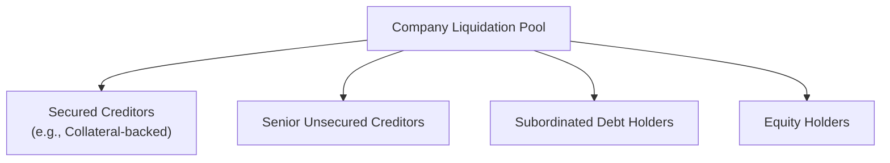

### Introduction and Core Concepts

I still remember my first big “Aha!” moment about corporate debt. I was fresh out of school, and I couldn’t quite get why two bonds—both issued by the same corporation—might have drastically different coupon rates. Turns out, it had everything to do with collateral: once you realize that some lenders have a direct claim on specific corporate assets (in other words, the debt is secured by something of tangible value), a whole new lens opens up. Secured versus unsecured corporate debt is a cornerstone in the world of credit analysis, shaping not only how we evaluate interest rates but also how we measure risk and prioritize claims when things go wrong.

Here, we’ll explore the distinctions between secured and unsecured debt, illustrate how collateral can influence a company’s overall cost of capital, and emphasize the important role that seniority plays in liquidation. We’ll also introduce some real-world examples like mortgage bonds and equipment trust certificates. Let’s dive in.

### Collateral and Investor Protections

Secured corporate debt demands a tangible claim on corporate assets. You might see this as a lien on a building, aircraft, or even receivables. In simple terms, the corporation pledges these assets so that if they default, the lender can seize the specific collateral and recover at least part of their investment.

• Secured Debt: Often referred to as asset-backed or collateralized debt, these instruments come with a lower yield because the risk is smaller. Investors enjoy a “safety net”; if the firm defaults, they obtain first claim over the pledged assets.

• Unsecured Debt: No specific asset stands behind these obligations. Creditors must rely on the issuer’s general creditworthiness and the leftover value—if any—after all secured claims are satisfied. Consequently, unsecured (or debenture) holders face higher risk, usually receiving a higher coupon in exchange.

### Ranking in Liquidation

When a corporation experiences financial distress—a scenario we never want to see but must always consider—secured debt holders secure the first bite at the apple. They have a direct claim on the pledged assets and get paid from the proceeds of liquidating those assets:

• Secured Creditors: Repaid first, to the extent that the collateral covers their principal plus interest.  
• Senior Unsecured (or Debenture) Holders: Next in line. They share what remains after the secured folks have been fully repaid.  
• Subordinated Debts: Subordinated holders rank even lower than senior unsecured. Basically, they get something only if there’s money still left on the table.  
• Equity Holders: Often last in line, typically salvaging what remains (if anything) after all other claims have been fulfilled.

### Risk-Return Trade-Offs

You know the saying: “No pain, no gain.” Well, in bond investing, that usually translates to: “No risk, no extra yield.” Because secured debt is backed by collateral, it’s safer. Investors in these bonds will accept a lower yield. Meanwhile, unsecured bondholders—facing harsher potential losses if the issuer defaults—demand and receive higher interest rates. The differential in yields reflects a risk premium. The bigger the perceived risk, the larger the premium.

To illustrate with approximate numbers: Suppose a firm issues a 5-year secured bond at 4% while the same firm might issue a similar 5-year unsecured debenture at 4.6%. That 60-basis-point difference compensates investors for the additional default risk. In times of market crisis, you can expect that spread to balloon as investors become far more anxious about companies honoring obligations.

### Strategic Considerations for Companies

Why would companies choose one over the other? After all, from a CFO’s standpoint, lower yields are obviously attractive. But pledging assets can complicate future financing endeavors:

• Asset Encumbrance: When a company pledges specific property or equipment as collateral, those assets are now “spoken for.” They cannot be easily used to secure additional debt, which limits the company’s flexibility if another financing need arises.

• Cost of Borrowing: Secured debt issuance generally leads to lower interest expense, which might be a big plus for corporations with stable, valuable assets. But the reduced financial flexibility can become a disadvantage later.

• Signaling: Sometimes, issuing unsecured debt conveys a certain level of confidence in the corporation’s creditworthiness. The market may interpret that management is comfortable borrowing without collateral because their credit risk is relatively low.

### Subordinated Debt

Adding a twist to the hierarchy, subordinated debt is unsecured debt that works like a “second-tier” claim within the unsecured category. For example, if we had to rank them from top to bottom:

1. Secured Debt  
2. Senior Unsecured Debt  
3. Subordinated Debt  
4. Preferred Stock  
5. Common Stock  

Subordinated bondholders walk into the deal knowing that they are especially vulnerable if the issuer goes belly-up. In exchange, they can typically bargain for higher yields. Think of it like standing at the end of the cafeteria line: you might not get much if food runs out, so you deserve a little extra incentive to stay in line.

### Examples of Corporate Pledges

• Mortgage Bonds: Secured by a lien on real estate. If your favorite corporate giant issues mortgage bonds, it probably used prime real estate or buildings it owns to attract lower borrowing costs.  
• Asset-Backed Bonds: Secured by receivables, such as credit card debt or auto loans. A company might “bundle” these receivables and use them to back a bond issue, theoretically matching cash inflows (payments on the receivables) to service the bond’s interest and principal.  
• Equipment Trust Certificates: Common in capital-intensive industries like airlines or rail, where planes, trains, or cargo ships serve as collateral.

### Potential for Conflicts and Re-Hypothecation

One potential snag with issuing multiple layers of secured debt is the question: “Exactly which assets are being pledged, and is there any potential overlap?” If a firm wants to re-pledge or re-hypothecate an asset in multiple transactions, creditors could end up fighting among themselves to establish which claim in which asset is truly valid. Intelligent bond indentures usually have strict provisions that define:

• Which assets are pledged.  
• The order of claims if the firm must sell those assets.  
• Conditions under which additional secured debt may be issued.

### Exam Vignette Observations

In a CFA-style vignette, you might see a corporate scenario describing an issuer’s capital structure. The question might ask you to identify how the potential recovery value changes for each class of creditor if the corporation defaults. You could encounter details on:

• Calculating Recovery Rates: Based on the liquidation value of specific collateral. Often, exam questions provide data such as “Machinery is valued at $20 million in a liquidation scenario, and the outstanding secured debt is $15 million.”  
• Interpreting Senior vs. Subordinated: Expect to see a question on applying the correct capital structure waterfall. For instance, if the total unsecured claims exceed $100 million and the firm only has $40 million left in free assets after secured debts are repaid, how much might subordinated holders receive? Typically, the answer might be “zero” or something quite minimal.

### Bringing It All Together

Secured versus unsecured debt is pivotal in corporate finance. From an investor standpoint, the presence (or absence) of collateral shapes both the risk profile and yield expectations. From a corporate perspective, you want to balance achieving a lower cost of capital with maintaining flexibility for future financings. Subordinated debt takes these dynamics a step further, offering even greater potential yields—at a higher risk. 

By mastering these concepts, you’ll be well-prepared to interpret vignettes that delve into collateral arrangements and creditor seniority. So whether you’re analyzing leveraged buyouts or evaluating day-to-day financing decisions, keep your eyes peeled for whether an asset is pledged, and remember precisely who holds the first claim on a firm’s prized assets.

### References

• Brigham, E., & Ehrhardt, M. “Financial Management: Theory & Practice,” Cengage Learning.  
• Damodaran, A. “Corporate Finance: Theory and Practice,” Wiley.  
• CFA Institute Level II Curriculum, Corporate Issuers.  

---

## Practice Questions: Secured vs. Unsecured Corporate Debt



### Which creditors have a direct claim on specific pledged assets in the event of default?

- [ ] Unsecured creditors  
- [ ] Subordinated creditors  
- [x] Secured creditors  
- [ ] Equity holders  

> **Explanation:** Secured creditors are backed by specific collateral, which can be seized if the borrower defaults.

### Which type of debt typically carries a higher coupon rate due to increased risk?

- [ ] Secured bonds  
- [x] Unsecured bonds  
- [ ] Treasury bonds  
- [ ] Inflation-linked bonds  

> **Explanation:** Unsecured bonds are riskier than secured bonds because there is no specific collateral. Thus, bondholders require a higher coupon to compensate.

### What are mortgage bonds primarily secured by?

- [ ] Equipment  
- [ ] Receivables  
- [x] Real estate or property  
- [ ] Inventory  

> **Explanation:** Mortgage bonds are secured by liens on real estate, distinguishing them from asset-backed securities secured by other forms of collateral.

### Subordinated debt refers to obligations that rank below which of the following?

- [x] Senior unsecured debt  
- [ ] Preferred equity  
- [ ] Secured debt only  
- [ ] Convertible bonds  

> **Explanation:** Subordinated obligations are paid after senior unsecured debts. They thus assume greater default risk and typically bear higher interest rates.

### Suppose a company's secured debt is fully collateralized by equipment with a liquidation value of $60 million, while the face value of that secured debt is $50 million. At liquidation, how much is theoretically left for unsecured creditors from that equipment?

- [x] $10 million of potential available value  
- [ ] $50 million of potential available value  
- [ ] $60 million of potential available value  
- [ ] $0 million of potential available value  

> **Explanation:** Once the $50 million in secured debt is covered by the $60 million liquidation value, the remaining $10 million in collateral value could go toward unsecured creditors (subject to total claims).

### Which of the following best describes a special risk of issuing multiple forms of secured debt?

- [x] Unclear collateral assignments can create conflicts among secured creditors  
- [ ] Lower overall cost of capital  
- [ ] Guaranteed future financing  
- [ ] Elimination of default risk  

> **Explanation:** If assets are re-pledged or not clearly assigned, multiple creditors may claim the same collateral, leading to disputes.

### In a typical capital structure hierarchy, who ranks immediately after senior unsecured creditors?

- [ ] Equity holders  
- [ ] Secured creditors  
- [ ] Preferred stockholders  
- [x] Subordinated bondholders  

> **Explanation:** The usual order (from highest priority to lowest) is secured debt, senior unsecured debt, subordinated (or junior) debt, then equity holders.

### A key disadvantage to using secured debt from a borrowing firm’s perspective is:

- [x] Reduced financial flexibility when seeking additional credit  
- [ ] Higher interest costs than unsecured debt  
- [ ] No requirement for asset pledges  
- [ ] Complete guarantee of borrowing needs  

> **Explanation:** Once assets are pledged, the firm often can’t use them again for other forms of secured borrowing, limiting future financing options.

### Which of the following is correct about subordinated debt in liquidation?

- [ ] It ranks equally with senior unsecured debt  
- [x] It ranks below senior unsecured debt  
- [ ] It always ranks above secured debt  
- [ ] It ranks alongside equity shares  

> **Explanation:** In the capital structure waterfall, subordinated debt sits below senior unsecured debt but above equity.

### True or False: Unsecured debt holders have a lower priority claim on assets than secured creditors in the event of a default.

- [x] True  
- [ ] False  

> **Explanation:** Secured creditors have first claim on the pledged collateral, whereas unsecured creditors rely on any remaining assets once secured claims are settled.


