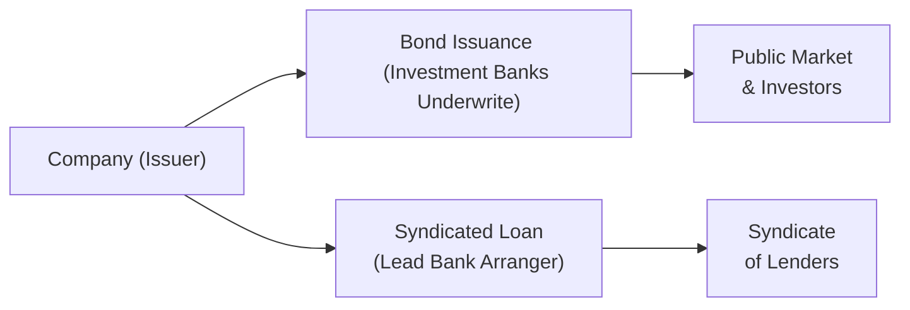

## Introduction

I remember the first time I had to decide whether to advise a company to tap the bond market or arrange a syndicate loan. Honestly, it felt a little like being a kid in a candy store—each option had its own goodies: some offered flexibility, some boasted long maturities, and some came with (pardon my language) fewer headache-inducing covenants. In real life, though, it’s not as simple as picking your favorite flavor. You have to consider your client’s financing needs, current markets, how often you want to renegotiate terms, and a boatload of other factors. Let’s break it all down here.

In this section, we’ll delve into the fundamental differences between publicly issued corporate bonds and syndicated loans, explain the processes involved in raising capital through each, and see how companies pick one (or both). Along the way, we’ll note typical maturity profiles, interest rate structures, covenant styles, and the strategic rationale for selecting short- vs. long-term instruments.

## Key Structural Differences

Corporate bonds and syndicated loans might both show up on a firm’s balance sheet under “long-term liabilities” (well, sometimes short-term if the maturity is near), but that’s about where their similarities end. Bonds are typically standardized and face the broader capital markets, whereas syndicated loans—like something out of a group project—bring together multiple lenders, each taking a slice of the total credit facility.

• Publicly Issued Corporate Bonds: Typically traded in the capital markets. Investors—ranging from pension funds to retail individuals—purchase these instruments. The bond’s documentation (indenture) outlines standard covenants, interest rates (fixed or floating), and maturity dates. There’s usually an investment bank or syndicate of underwriters that helps issue these bonds, but once the bonds hit the public market, that’s your investor base.

• Syndicated Loans: Arranged by a lead bank (or banks) that forms a syndicate. Each participant commits to a portion of the total loan. The contractual terms can be more detailed and customized to the borrower’s unique profile. This structure is appealing to large borrowers that may need big sums, but no single bank wants to bear all the risk. By splitting the loan, you spread the exposure across multiple lenders.

### Covenant Differences

As a rule of thumb, bond covenants tend to be more standardized. You’ll see standard negative pledge clauses, restrictions on certain mergers, or limitations on liens, but typically, corporate bonds—especially investment-grade ones—have less extensive covenant packages compared to leveraged or high-yield bonds, which carry more protective (or restrictive, depending on your perspective) features.

By contrast, syndicated loans can be highly customized. The lead arranger might build in specific performance-based triggers, coverage ratios, or mandatory prepayment clauses if certain asset sales occur or if the borrower exceeds certain financial thresholds.

## Syndicated Loan Arrangement

Let me share a quick story: I once worked at a mid-tier investment bank, and halfway through underwriting a syndicated loan for a manufacturing conglomerate, the CFO realized they needed more flexible covenants for planned expansion. Guess what? We could tweak the loan agreement to accommodate that. That’s one of the beauties of syndicated loans—you can tailor them more precisely than a cookie-cutter bond indenture. Of course, it meant more back-and-forth with the partner banks, but it also meant a happier borrower.

### Role of the Lead Bank

The lead bank puts in the initial chunk of capital and arranges the terms. They then invite other banks or institutional lenders to participate in the facility. Each participant bank commits a certain portion of the total loan amount, receives part of the interest based on its commitment, and shares in the credit risk proportionally.

### Term Loan A vs. Term Loan B

In the syndicated loan world, you’ll often hear about “Term Loan A” or “Term Loan B,” among other tranches.

• Term Loan A: Typically amortized over its life and placed with banks. Maturities may be around five to seven years.  
• Term Loan B: Usually has minimal amortization before maturity and ends up with institutional investors such as collateralized loan obligation (CLO) funds, pension funds, or other entities that like floating-rate returns. They often have maturities around the same range—sometimes a bit longer—but with a structure that appeals to institutional buyers seeking yield in the secondary loan market.

### Revolving Credit Facilities

Syndicated loans might also include a revolving credit facility (or “revolver”). It lets borrowers draw up to a certain limit, repay it, and redraw again, making it perfect for working capital management or short-term liquidity. So if you see that a firm has a $500 million revolver, it can borrow any portion of that amount (subject to certain borrowing base conditions) and pay interest only on the portion drawn.

## Interest Rate Differences

So, let’s talk about the big question: “Are we paying fixed or floating?” Because, in the end, interest cost is a key factor in deciding which instrument to choose.

• Bonds: Many bonds have fixed coupons—meaning the issuer commits to a set interest rate throughout the life of the bond. That can be great for locking in rates if you believe interest markets might move against you. However, floating-rate notes (FRNs) do exist. Those tie the coupon to a reference rate like SOFR (Secured Overnight Financing Rate) or another benchmark.

• Syndicated Loans: Historically, these have been tied to a floating rate, such as LIBOR plus a spread. Now that most markets have shifted from LIBOR, you’ll see references to SOFR or other local benchmark rates plus a “credit spread.” The spread reflects the lender’s view of the borrower’s credit risk, plus the competitive dynamics in the loan market. These loans re-price periodically (monthly or quarterly), which benefits or hurts the borrower depending on how interest rates move.

### Pros and Cons of Floating Rates

It’s awesome if rates are going down, because your periodic interest cost decreases automatically. If rates rise, though, you’re stuck paying more. Therefore, when a CFO is deciding between issuing a fixed-rate bond or going for a floating-rate loan, the firm’s view on future interest rates, along with its natural hedges (like having floating-rate income from some of its businesses), can tilt the choice one way or another.

## Issuance Process: Bonds vs. Loans

We sometimes say that bonds and loans are two sides of the same coin, but the process to get them to market can be quite different.

### Bond Issuance

1. Underwriting: An investment bank (or multiple banks) underwrites the bond. Essentially, they agree (at least partially) to purchase the issue from the firm and then distribute it to investors.  
2. Prospectus: The issuer prepares a prospectus or offering memorandum that outlines the company’s financials, the bond’s features, and risk factors.  
3. Marketing: The underwriters market the bond to institutional and sometimes retail investors. They also gauge market demand to set the coupon and yield.  
4. Public Offering: The bond is then sold to investors. Once the issuance is complete, the bond can trade in the secondary market, typically regulated and more transparent than the loan market.

### Syndicated Loan Issuance

1. Mandate the Lead Bank: The borrower picks a lead arranging bank. They hammer out the basic loan structure—amount, interest rate, tenure, and covenants.  
2. Syndication: The lead bank markets portions of the loan to other banks or institutional lenders (e.g., CLO managers, hedge funds).  
3. Loan Agreement: All parties sign a single credit agreement, but each lender’s share of the total facility is documented.  
4. Funding & Ongoing Administration: The borrower draws on the facility, and the administrative agent (often the lead bank) coordinates interest payments, principal repayments, and compliance checks.

Below is a simplified Mermaid diagram illustrating the process flow for each financing choice:

## Loan Market Platforms and Leveraged Loans

One fascinating aspect of syndicated loans is that they’re not just “a bunch of banks holding your IOU.” There’s an entire infrastructure of secondary loan trading, particularly for leveraged or high-yield loans. “Leveraged loans” typically refer to loans to companies with higher credit risk—often sub-investment grade. They carry higher spreads and attract institutional investors hunting for floating-rate yield.

In the secondary market, loan interests (portions of the loan) can be bought or sold, providing liquidity. This has spawned the creation of specialized products like:
- CLOs (Collateralized Loan Obligations): Pools of loans packaged as securities with different tranches of risk and return.  
- Loan mutual funds and exchange-traded funds (ETFs): Retail-focused products that invest in baskets of syndicated loans.

## Maturity Profiles

Companies also weigh maturity more than you’d think. My first real bond deal was a 30-year paper issuance. Let me tell you, that’s a long commitment. Syndicated loans, on the other hand, are more often in that three-to-seven-year window, though certain Term Loan B tranches can extend a bit longer.

• Bonds: Common tenors include 5, 7, 10, 20, or 30 years. Longer-dated bonds (like 30 years) are typically favored when rates are low, letting issuers lock in cheap funds.  
• Syndicated Loans: Usually lines up with a shorter horizon, though you can do mini-perm structures or other creative solutions. In leveraged contexts, a company might do a 7-year Term Loan B that sates its immediate acquisition or expansion capital needs but doesn’t keep it on the hook for decades.

## Decision Factors: Cost, Flexibility, and Market Conditions

Ultimately, the choice between corporate bonds and syndicated loans isn’t just about convenience. Firms must consider:

• Cost of Funds: Right now, do capital markets offer favorable spreads for your credit rating? Or is the loan market more competitive? Sometimes the bond market will be red-hot with low yields, making it cheaper to go public. Other times, syndicated loan appetite might be strong (particularly if institutional investors are hungry for floating-rate paper).  
• Covenant Strictness: If you need more operational freedom—maybe you’re anticipating big swings in your leverage ratios—a syndicated loan’s custom covenants might be either too restrictive or appropriately flexible, depending on your negotiating power. Bonds typically use standard covenants, which might be less intrusive but also less flexible if you do need to tweak them later.  
• Maturity Preference: If you want to lock in a long-term rate, go for a bond. If you’re comfortable with a shorter horizon and floating rates, a syndicated loan might make sense.  
• Complexity: Public bond issuance requires regulatory filings, ratings, and broad marketing. A syndicated loan usually involves dealing with fewer parties but can still be complex if you have many participants.  
• Market Windows: If the bond market is relatively volatile, a firm might pivot to a syndicated loan to get faster execution. Or vice versa—sometimes you can price a bond in a narrow issuance window when the market is “hot.”

## Short-Term Financing Interplay

Many large firms balance both short and long-term debt in their capital structure. For short-term financing, tools like commercial paper (CP) can be more nimble. When a company issues CP, it’s typically rolling over short-term notes at maturities of up to 270 days. But what if the CP market experiences a crisis or the firm can’t roll it over? That’s where a sponsor of a syndicated revolver might come in, giving the company a backup source of funding.

### Commercial Paper vs. Revolving Credit

• Commercial Paper: An unsecured, short-term promissory note sold typically to money market funds and institutional investors. Companies with high credit ratings can issue CP at a relatively low cost, but it’s subject to rollover risk.  
• Revolving Credit Facility: Embedded feature in a syndicated loan package, providing an on-demand liquidity line. The borrower pays a commitment fee on the undrawn portion but has the certainty of access when needed.

Often, corporations supplement a CP program with a revolving credit facility as a safety net. If they can’t roll the CP, they draw on the revolver. For exam vignettes, watch how these facilities are used in tandem, and be ready to do quick interest cost calculations or covenant checks if the firm’s short-term coverage ratio changes.

## Potential Exam Vignette Issues

Picture a typical Level II item set: you read about a CFO’s plan to refinance existing debt, with some discussion about partial redemption of existing bonds, plus a new syndicated loan to fund an acquisition. The vignette might highlight:

• Interest Rate Exposure: Does the company want to hedge floating-rate risk? Could an interest rate swap be in the picture?  
• Covenant Differences: The CFO might mention concerns about tight leverage covenants in the new syndicated loan. Meanwhile, the existing publicly traded bond has a more lenient set of restrictions.  
• Market Liquidity: If market turmoil hits the leveraged loan sector, the firm might pivot to a public bond issuance.

Be prepared to interpret the specifics in the financial statements, footnotes, or the credit agreement. They might mention a “springing maturity” clause or a mandatory prepayment after a major asset sale. The item set could also test your ability to quickly calculate how the weighted average cost of capital changes when you replace fixed-rate bonds with floating-rate debt—especially relevant if you studied the cost of capital chapters (Chapters 7 and 8).

## Best Practices and Pitfalls

• Monitor Covenant Compliance: There’s nothing like the panic of tripping a maintenance covenant. That can lead to an immediate crisis or default scenario.  
• Manage Repricing Risk: Floating-rate loans can be wonderful in stable or declining rate environments. But if central banks start hiking rates, that interest burden can become hefty fast.  
• Balance Maturities: Don’t put all your maturities in the same year; you can create a “maturity wall.”  
• Maintain Liquidity Buffers: Revolvers, CP, or cash reserves can keep the firm flexible, especially if bond or syndicated loan markets seize up.

## Example: Mid-Size Manufacturer’s Decision

Let’s say a mid-size manufacturer with a decent credit rating (BBB) is deciding between a $500 million bond issuance or a $500 million syndicated Term Loan A with a corresponding revolver. The CFO:

• Sees that bond yields for BBB are around 5% for 10-year paper.  
• The loan would price at SOFR + a 1.50% margin, currently around 6.0% all-in, with a 5-year maturity.  
• The bond locks in the rate for 10 years, while the loan’s floating rate could go up or down in year three.  
• The loan, though, includes more restrictive covenants. Meanwhile, the CFO wants to preserve flexibility for future expansions.  
• After some deliberation, the CFO might choose the bond to “fix” the cost of debt longer. But if short-term rates are attractive and they believe they can handle moderate interest rate risk, they might find the syndicated loan plus revolver the better choice.

No universal answer fits every scenario—each firm’s capital structure strategy is unique.

## Glossary (Quick Reference)

• Syndicated Loan: A loan offered by a group (syndicate) of lenders, arranged by one or more lead banks.  
• Term Loan A/B: Different tranches of syndicated loans, with distinct repayment and investor bases.  
• Revolving Credit Facility (Revolver): A line of credit allowing repeated drawing and repayment.  
• Commercial Paper: Short-term promissory notes issued by companies for working capital and short-term obligations.  
• Floating-Rate Note (FRN): A bond whose coupon resets periodically based on a reference rate plus a spread.  
• Primary Loan Market: The market in which new syndicated loans are originated.  
• Secondary Loan Market: The market in which existing syndicated loans are bought and sold.  
• Underwriting Spread: The fee paid to arrangers or underwriters who structure and distribute new debt.

## References

- CFA Institute Level II Curriculum, Corporate Issuers  
- Loan Syndications and Trading Association (LSTA), “Standard Terms and Trading Guidelines”: https://www.lsta.org  
- Fabozzi, F. J. (Ed.). “Leveraged Finance.” Wiley  

## Test Your Knowledge: Bonds and Syndicated Loans



### A borrower wants a financing structure that allows it to adapt covenants to its specific operational needs. Which form of debt is more likely to offer this flexibility?

- [ ] A public fixed-rate bond with standard covenants
- [x] A syndicated loan negotiated with a lead bank
- [ ] A zero-coupon convertible bond
- [ ] An unsecured commercial paper note

> **Explanation:** Syndicated loans are often tailored to a firm’s specific situation. Public bonds usually have standardized covenants.

### Which of the following is characteristic of the typical syndicated Term Loan B?

- [ ] Primarily held by banks and subject to high amortization
- [ ] Entirely funded by the lead bank and never sold to third parties
- [x] Minimal amortization and strong appeal to institutional investors
- [ ] Purely short-term, bridging seasonal financing needs

> **Explanation:** Term Loan B often carries minimal amortization, targeting institutional investors seeking floating-rate yields.

### In arranging a syndicated loan, the lead bank commonly…

- [x] Negotiates the loan structure and invites participant lenders
- [ ] Serves as the sole provider of funds
- [ ] Has no responsibility for covenant enforcement
- [ ] Must only work with retail investors

> **Explanation:** The lead bank arranges the deal, negotiates terms, and invites other banks/investors to participate. They often handle ongoing administrative tasks, including covenant monitoring.

### Fixed-rate corporate bonds are generally preferred when…

- [x] The issuer anticipates a rise in market interest rates
- [ ] Interest rates are volatile and expected to decline
- [ ] The company has heavy floating-rate operational revenues
- [ ] Lenders require significant covenants

> **Explanation:** Locking in a fixed coupon is typically advantageous if interest rates are expected to rise, preventing higher borrowing costs.

### What is the primary purpose of a revolving credit facility within a syndicated loan?

- [ ] To permanently retire outstanding debt upon maturity
- [x] To offer the borrower flexible, on-demand access to funds
- [ ] To pool investor funds for short-term speculation
- [ ] To replace public bond issuance for large capital projects

> **Explanation:** A revolver is a line of credit within a syndicated loan that the borrower can draw upon as needed and repay repeatedly.

### Which statement is true regarding bond covenants vs. syndicated loan covenants?

- [ ] Bonds have complex, individually negotiated covenants
- [x] Syndicated loans often include more detailed, tailored covenants
- [ ] Bond covenants are always more restrictive
- [ ] All covenants are legally unenforceable after issuance

> **Explanation:** Syndicated loans typically feature more customized covenants, reflecting detailed negotiations with the lending group.

### A key difference between the bond primary market and the syndicated loan primary market is that…

- [ ] Bond investors always hold to maturity, while loan participants actively trade
- [ ] Bond issuance has less documentation than a syndicated loan
- [ ] Syndicated loans are restricted to institutional investors only
- [x] Bond underwriting caters to public markets; syndicated loan syndication involves negotiations with multiple banks

> **Explanation:** Bond underwriting focuses on distribution to the public capital market. Syndicated loans involve a negotiated process with several banks or institutional investors.

### A company with a high credit rating wanting short-term funding for payroll and inventory management is most likely to use…

- [ ] A 30-year fixed-rate bond
- [x] Commercial paper
- [ ] A Term Loan B with a seven-year maturity
- [ ] An equity issuance

> **Explanation:** Commercial paper suits short-term funding needs for highly rated companies at a relatively low cost.

### Which of the following instruments is priced with a floating rate tied to a benchmark like SOFR plus a spread?

- [x] A common syndicated loan
- [ ] A typical 10-year fixed coupon bond
- [ ] A zero-coupon bond
- [ ] Commercial paper

> **Explanation:** Most syndicated loans reference a floating rate (commonly SOFR plus a credit spread).

### A major advantage of issuing a long-term fixed-rate bond is that the issuer…

- [x] Locks in an interest cost for an extended period
- [ ] Avoids standard disclosure requirements
- [ ] Has no default risk
- [ ] Can easily renegotiate the coupon anytime

> **Explanation:** By issuing a long-term bond at a fixed rate, the borrower stabilizes its interest expense for the bond’s lifetime.


