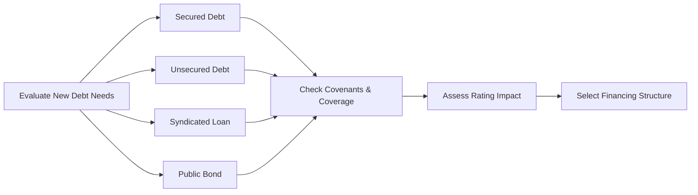

## Introduction and Context

Let’s imagine you’re the CFO of a mid-sized manufacturing company—call it Markell Inc.—looking to finance expansion plans. The board is pushing for new product lines and strategic acquisitions, but your capital structure looks a bit stretched. You’ve got to decide how to raise debt in a way that preserves (or even enhances) your credit rating, safeguards flexibility, and satisfies existing covenants. Sometimes, the tension can feel like you’re balancing on a tightrope: too much debt, and your ratings could drop; too little, and you won’t have the cash for growth.

Below, we’ll walk through realistic scenarios and highlight key concepts of corporate debt policy. We’ll explore fundamental decisions such as issuing secured versus unsecured debt, how new issuance might affect credit ratings, and the potential consequences of covenant breaches. We’ll also compare a syndicated loan with a public bond offering, illustrate the nuances of interest rate and currency risk management, and underscore the significance of corporate governance considerations (like how activist shareholders might have their say).

## Corporate Debt Policy: Key Concepts

Before diving into the scenarios, let’s clarify a few terms you’ll likely see in actual exam vignettes and real-life CFO spreadsheets:

• Debt Policy: The game plan for how a firm determines total borrowing, debt maturity, interest rate exposure, and security structure (secured vs. unsecured).  
• Incremental Debt Analysis: Evaluates how new borrowing affects metrics like Debt/EBITDA, interest coverage ratios, and the firm’s credit rating.  
• Pro Forma Financial Statements: Forward-looking statements that incorporate proposed transactions, allowing you to see how additional debt affects the balance sheet, income statement, and cash flows.  
• Capital Budgeting Interplay: Shows how the firm’s investment (e.g., building a new plant) influences the financing approach and vice versa—particularly for measuring a project’s NPV and IRR under new interest cost assumptions.  
• Liquidity Risk: The risk that the firm won’t have enough near-term cash to cover payroll, raw materials, or interest obligations.  
• Refinancing Risk: The chance that when debt matures, market conditions or the firm’s credit profile complicate securing new financing at favorable rates.  
• Scenario Analysis: Generating several “big picture” alternatives (e.g., interest rates rising vs. staying flat) to see how each possibility would impact financial results.  
• Sensitivity Analysis: Tweaking one variable at a time—like interest rates or EBITDA—to gauge the extent the firm’s coverage ratios or valuations could change.

## Vignette Scenario 1: Secured vs. Unsecured Debt

### Scenario Overview

Markell Inc. needs USD 100 million to fund an upcoming capital project (mainly expansions and equipment upgrades). They have two primary routes:

• Issue secured debt (backed by their major production facility as collateral).  
• Issue unsecured debt (based on the company’s general creditworthiness).

The CFO is leaning toward unsecured debt to avoid tying up assets. However, the underwriters warn that the interest rate premium might be steep unless the firm pledges collateral.

Let’s look at Markell Inc.’s partial historical financial data:

| Metric                           | Current (Before New Debt) |
|----------------------------------|---------------------------|
| EBITDA (in USD millions)         | 80                        |
| Debt Outstanding (in USD millions)| 200                      |
| Interest Expense (in USD millions)| 14                       |
| Interest Coverage Ratio (EBIT/Interest) | 4.0                 |
| Minimum Coverage Covenant (Required)    | 3.0                 |
| Corporate Credit Rating          | BBB                       |

Because the firm’s coverage ratio is 4.0, they are currently above the 3.0 covenant threshold. The CFO wants to see how new debt will affect coverage, cost of debt, and rating.

### Covenant Analysis and Coverage Ratios

Let’s say the new debt, if unsecured, carries an interest rate of 7.5% (compared to 6.0% if secured). Estimated incremental annual interest from secured debt would be:
  
(USD 100 million) × 6.0% = USD 6.0 million

Versus unsecured debt:

(USD 100 million) × 7.5% = USD 7.5 million

Assume no immediate change in EBITDA from the project (expansion benefits might kick in later, but for now, let’s keep it simple). The new total annual interest expense under each scenario:

• Secured Debt Scenario:  
  Interest expense = Current USD 14 million + USD 6 million = USD 20 million  
  Interest coverage ratio = EBITDA / Interest expense = 80 / 20 = 4.0  

• Unsecured Debt Scenario:  
  Interest expense = Current USD 14 million + USD 7.5 million = USD 21.5 million  
  Interest coverage ratio = 80 / 21.5 ≈ 3.72  

Under both cases, Markell Inc. stays above the minimum threshold of 3.0 for the coverage covenant. But the rating agencies might differentiate: a coverage ratio of 4.0 vs. 3.72 could nudge the rating outlook into watch territory if other factors (like total leverage) worsen.

### Rating and Cost of Capital

Markell’s current rating is BBB. Unsecured debt at 7.5% could imply higher perceived risk. If the rating agencies see the new issuance as straining the firm’s future debt capacity or if cyclical headwinds appear, a potential downgrade to BB+ might follow. That downgrade would likely increase the cost of capital further—turning into a self-fulfilling loop of higher interest rates and weaker coverage metrics.

Meanwhile, pledging assets (secured debt) might keep the effective interest cost lower and reassure the rating agencies. The trade-off? The firm’s flexibility becomes limited: if future projects emerge requiring further financing, Markell might have fewer unencumbered assets to pledge.

### Decision Factors and Board Considerations

• **Collateral Availability**: Are the assets in question easily pledgeable? Will they hinder future expansions?  
• **Flexibility**: Unsecured debt keeps assets free but may raise borrowing costs.  
• **Covenant Stringency**: A narrower coverage ratio buffer means less margin for unexpected earnings shortfalls.  
• **Governance Pressures**: Some board members—perhaps prodded by activist shareholders—want to keep the cost of capital down at all costs, while others prefer lower risk of losing assets in foreclosure.

Ultimately, Markell might choose the secured route if they prioritize interest savings over the convenience of asset flexibility. Or they might decide the intangible benefits of unsecured bond issuance—for instance, better reputation among sophisticated debt investors—outweigh the higher interest expense.

## Vignette Scenario 2: Syndicated Loan vs. Public Bond

### Scenario Overview

In a separate instance, Markell Inc. is considering a syndicated loan vs. a public bond to raise USD 150 million. This time, the impetus is an acquisition, so the financing needs to be quick, but also structured in a way that preserves short-term liquidity and long-term solvency.

• Syndicated Loan:
  – Floating rate: LIBOR + 2.5% (or if exploring a post-LIBOR world, another reference rate, such as SOFR + 2.5%).  
  – 5-year maturity, with partial amortization in years 3 to 5.  
  – Covenants: Net Debt/EBITDA ≤ 3.5; minimum Interest Coverage ≥ 2.5.  
  – Potential cross-default clauses that link any default on existing debt to default on the syndicated facility.

• Public Bond:
  – Fixed rate: 6.8%.  
  – 10-year bullet maturity (principal all due at maturity).
  – Covenants: less restrictive than the syndicated loan but includes an interest coverage covenant of 2.0 and a leverage ratio not exceeding 4.0.  
  – Possibly more complex issuance process requiring regulatory filings, marketing the issue, and broader distribution.

### Projected Interest Cost and Maturity Trade-Off

The syndicated loan looks cheaper at issuance if short-term rates remain stable. But it’s floating—meaning that if rates rise (which is always possible), you could see your cost of debt edge upward, hurting coverage. Meanwhile, a 10-year bond at a fixed 6.8% provides certainty. You know your interest costs each year, making managerial budgeting simpler—but you pay a bit more if short-term rates stay low.

When short-term rates spike, syndicated loan interest can exceed 6.8%. Firms often weigh how quickly they believe rates might move. If you think rates will remain subdued, the floating rate is compelling. However, if you worry about a hawkish central bank, a fixed-rate bond can serve as a handy hedge against rising rates.

### Covenant Implications

The syndicated loan’s covenants are tighter: interest coverage ≥ 2.5 vs. the bond’s 2.0, and Net Debt/EBITDA ≤ 3.5 vs. the bond’s 4.0. With the syndicated loan, Markell would have less room to endure downturns in EBITDA or expansions in leverage before tripping a covenant. Breaching a covenant can trigger immediate repayment demands—and in the presence of cross-default clauses, one breach might put other debt in default too.

On the other hand, a future bond refinance might coincide with a more challenging rate environment. If Markell’s rating gets downgraded or if we’re in a broader credit crunch, rolling over that bond at maturity could prove costly (i.e., refinancing risk). The tilt of trade-offs is rarely black and white.

### Rating Agency Perspective

From a rating standpoint, they’d be looking at:

• How the acquisition contributes to Markell’s cash flow profile. Is it accretive or dilutive to earnings?  
• Total leverage after raising USD 150 million.  
• Relevant coverage ratios.  
• The nature of the debt: short maturity vs. a comfortable long-dated bullet.  
• Potential operational synergies or cost-savings from the acquisition.

If rating agencies see the acquisition as too aggressive, they might impose a negative outlook, hurting the bond price in secondary markets and gradually raising the firm’s long-term cost of capital. A syndicated loan might be more adjustable if Markell renegotiates terms or decides on partial prepayments once the acquisition starts bearing fruit.

### Risk Management: Interest and Currency Factors

• **Interest Rate Risk**: With the syndicated loan’s floating rate, Markell might consider interest rate swaps to fix a portion or cap the rate if they foresee upward rate pressure. The fixed bond, by contrast, already locks in the interest payment.  
• **Currency Risk**: If the acquisition target is overseas, Markell might want local-currency borrowing. A portion of the syndicated loan could be denominated in, say, euros, if that’s where the target’s revenues are. Public bond issuances are typically in the firm’s home currency unless it issues global or eurobonds. Currency hedges (for principal, coupon, or both) might be necessary to mitigate exchange rate fluctuations.

### Governance, Shareholder Activism, and Management Compensation

In real life, management must also consider how these debt options affect corporate governance. For instance:

• Board members might prefer the shorter-term syndicated route to preserve the ability to refinance if times get better.  
• Shareholder activists could fear that management is taking on too much interest rate risk or not enough capital discipline. A bond’s bigger bullet maturity can encourage bigger acquisitions—an activist might push for financial discipline via shorter maturities and stricter covenants to keep management in check.  
• Executive compensation can be linked to earnings-based metrics. If floating-rate debt reduces short-term earnings (because interest rates popped up), that might affect management bonuses—so you might see them leaning towards a fixed-rate bond to smooth out earnings even if it means paying a premium.

## Advanced Analysis: Cross-Default Clauses

A seemingly tiny detail in these debt agreements—cross-default clauses—can become a deal-breaker. A cross-default clause states that if the firm defaults on one obligation, all other obligations automatically go into default. This can quickly escalate minor missteps (like a temporary covenant breach) into a full-blown liquidity crisis.

Firms must assess:

• Are they close to any existing covenant thresholds?  
• In a recession scenario, how likely is an earnings shortfall that might cause a covenant breach on one facility and then cascade onto others?  
• Do they have a robust cash buffer or revolving credit facility to address short-term covenant triggers before big defaults happen?

Cross-default risk sometimes nudges CFOs to limit additional covenant-laden debt, even if it’s cheaper, because the tail-risk from one breach can ripple dangerously.

## Putting It All Together: Example Calculations

Let’s illustrate how you might do a coverage ratio test after raising new debt:

1. Calculate New Interest Expense:

( Existing Interest Expense ) + ( New Debt × Interest Rate ) = Total Interest Expense

2. Compute Pro Forma EBITDA (Assuming no immediate synergy or increase in operating profit). Then:


\text{Interest Coverage Ratio} = \frac{\text{EBITDA}}{\text{Total Interest Expense}}


3. Compare the coverage ratio to the covenant threshold. If it’s near the limit, test scenario or sensitivity variations (e.g., a 10% EBITDA drop, a 100-basis-point interest rate jump) to verify your comfort margin.

4. Assess the rating implications by looking at the new Debt/EBITDA or Debt/Total Capital ratio. If the rating is borderline, consider the risk that an additional issuance might tip the scale.

5. Evaluate liquidity and maturity profiles in a simple timeline. For instance, does the firm have multiple large maturities clustering in the same year that could boost refinancing risk?

## Real-World Anecdote

Years ago, I worked (well, more like I observed from the sidelines) with a mid-tier mining company that borrowed heavily through a syndicated loan to fund a big copper mine purchase. They were so excited about the short-term “low” floating rate that they skipped the part about extremely strict covenants. Then copper prices tanked, their EBITDA sank, and—boom—they breached the leverage covenant in year two. With cross-default clauses in their bond indentures, the entire system seized up. They had to restructure the loan, endure a rating downgrade, and watch their stock price tumble. Moral of the story? Don’t let a short-term “cheap” rate overshadow the bigger picture: covenant breathability, commodity volatility, and cross-default landmines.

## Governance and Management Dimensions

A strong board champions balanced debt policy. They’ll question proposals like: “Do we really need that extra USD 50 million?” or “Is management pushing for a trophy acquisition to boost short-term compensation?” In many exam vignettes, you’ll see a manager who benefits from higher EPS short term, ignoring covenant or rating downside. Watch out for that dynamic, and always incorporate the perspective of diverse stakeholders.

## Best Practices and Common Pitfalls

• **Best Practices**:
  – Perform scenario and sensitivity analyses (stress testing coverage at lower EBITDA or higher rates).  
  – Maintain open communication with rating agencies to understand how they’re evaluating your proposed issuance.  
  – Keep track of each covenant’s definitions—especially subtle ones with adjustments to EBITDA or certain one-time charges.  

• **Common Pitfalls**:
  – Ignoring negative pledges, cross-default provisions, or hidden triggers in bond indentures or loan agreements.  
  – Overlooking short-term changes in interest rates that can drastically raise floating-rate obligations.  
  – Underestimating how new debt can hamper the firm’s ability to finance projects down the road (lack of unencumbered assets, reduced tolerance from lenders).

## Visualizing Key Decisions

Below is a simple Mermaid flowchart showing how leadership might analyze debt issuance choices:

## Conclusion

Corporate debt policy—whether it involves issuing secured vs. unsecured notes, a syndicated loan vs. a long-term bond—demands a thoughtful look at covenants, interest coverage, refinancing, rating implications, and your broader capital structure. In the real world, you’ll tweak these variables and run scenario analyses, aiming to balance short-term liquidity, long-term growth, risk management, and (of course) the firm’s ultimate mission of creating shareholder value.

It’s rarely simple. But with careful planning, ongoing communication with lenders and rating agencies, and a robust approach to covenant management, you can deploy debt strategically without crippling your firm’s financial flexibility.

## Final Exam Tips

• Read the vignette carefully for references to “covenant thresholds,” “collateral obligations,” or “cross-default triggers.” Tiny details can flip a decision from feasible to catastrophic.  
• Don’t forget partial ratio data. If the item set provides partial coverage or leverage metrics, be ready to recalculate them pro forma after raising capital.  
• Pay attention to short-term vs. long-term trade-offs. Syndicated loans often have floating rates and shorter terms, while bonds are typically fixed and longer-dated.  
• Factor rating agency signals into your cost of capital estimates. A borderline rating can unravel everything if a new issuance triggers a downgrade.  
• Think about governance: who stands to gain or lose from a certain debt structure?

## References and Further Reading

• CFA Institute Level II Curriculum, Corporate Issuers – End-of-Chapter Practice Problems.  
• “CFA Program Practice Questions” in the Learning Ecosystem.  
• Corporate case studies from The Economist, www.economist.com/business.  
• Bloomberg Market Concepts for fixed-income analytics (www.bloomberg.com).  
• IFRS and US GAAP guidance on treatment of debt disclosures and covenants.  

## Test Your Knowledge of Corporate Debt Policy Scenarios



### A firm is considering issuing secured versus unsecured debt. Which detail is most critical in determining the interest rate differential between the two?
- [ ] Total equity on the balance sheet
- [ ] Management compensation structure
- [x] The collateral the firm can pledge
- [ ] Covenant definitions for intangible assets

> **Explanation:** Secured debt typically offers lenders collateral, which lowers their risk exposure. Thus, the quality and availability of pledgeable collateral most strongly influence the interest rate spread relative to unsecured debt.

### A firm’s existing coverage covenant requires maintaining a ratio of at least 3.0. Currently, its EBITDA is USD 60 million, and interest expense is USD 18 million. It plans to take on new debt that will add USD 3 million to annual interest expense. What will be the new coverage ratio, and does it breach the covenant?
- [ ] 2.7 coverage ratio; does not breach covenant
- [ ] 2.7 coverage ratio; does breach covenant
- [ ] 2.3 coverage ratio; does not breach covenant
- [x] 2.3 coverage ratio; does breach covenant

> **Explanation:** Current coverage = USD 60M / USD 18M = 3.33. After adding USD 3M of interest, total interest = 21M, so coverage = 60 / 21 ≈ 2.86, which further reduces to about 2.86 if you keep precision. (Rounded more precisely: 2.86, or about 2.9 if approximated. This is below 3.0, thus breaching the covenant. The correct numeric value is around 2.86, so we interpret that as a breach of a 3.0 threshold.)

### Which factor is generally more restrictive in a syndicated loan agreement compared to a public bond issue?
- [ ] The ability to refinance at maturity
- [ ] Interest rate resets
- [ ] The bullet repayment structure
- [x] Covenant restrictions

> **Explanation:** Syndicated loans are typically arranged by banks with more stringent financial covenants (e.g., tighter coverage or leverage thresholds) than public bond markets, which often have simpler, less restrictive covenants.

### A company has an interest coverage covenant of 2.5 in both its existing bond and new proposed loan. Which clause could trigger a cross-default if the company breaches the coverage ratio on the loan?
- [ ] Call protection clause
- [ ] Negative pledge clause
- [x] Cross-default clause
- [ ] Make-whole provision

> **Explanation:** A cross-default clause stipulates that a default on one obligation is considered a default on all other obligations. If the loan’s covenant is breached, the cross-default clause would trigger a default on the bond as well.

### If a new project does not generate immediate EBITDA uplift, which calculation is most valuable to understand the impact of fresh debt on the firm’s financial health?
- [ ] Discounted Payback Period
- [ ] Debt Amortization Profile
- [x] Pro Forma Interest Coverage
- [ ] Net Working Capital Changes

> **Explanation:** Because the new project might not raise EBITDA in the short term, pro forma interest coverage (EBITDA/Interest) best reveals whether the firm can meet interest payments before any project returns materialize.

### A company’s CFO is worried about near-term interest rate hikes. Which financing option likely aligns best with mitigating this risk?
- [ ] A short-term floating rate note
- [x] A long-term fixed-rate bond
- [ ] A variable-rate syndicated loan
- [ ] A commercial paper program

> **Explanation:** A long-term fixed-rate bond locks in the interest cost, shielding the company from future interest rate increases.

### Which event might cause a rating agency to downgrade a firm after issuing more debt?
- [x] A significant increase in leverage without growth in operating cash flow
- [ ] An increase in the firm’s equity through a secondary offering
- [ ] A stronger than expected quarterly earnings report
- [ ] A new CFO appointment with no policy change

> **Explanation:** Ratings typically hinge on leverage and cash flows. If debt rises sharply and operating cash flow does not keep pace, that could trigger a rating downgrade.

### A firm’s board is debating between a syndicated loan and a public bond. Which factor is most likely to sway them toward the syndicated loan?
- [x] Desire for potentially faster execution and negotiation
- [ ] Lower covenant restrictions
- [ ] Longer maturity horizon
- [ ] Smaller group of bank lenders

> **Explanation:** Syndicated loans can often be arranged relatively quickly through a group of banks, which might help the firm meet time-sensitive funding needs (e.g., an acquisition). While covenant restrictions in syndicated loans are often higher than public bonds, the speed and direct negotiation can be advantageous.

### In what scenario might a cross-default clause be considered especially risky?
- [x] When a company’s existing debt has tight covenants and is nearing threshold limits
- [ ] When the firm carries no other outstanding debt
- [ ] When the firm’s EBITDA is extremely high and stable
- [ ] When the existing covenants are extremely lax

> **Explanation:** If covenants are already tight, a minor breach in one debt agreement can trigger cross-default on other obligations, exacerbating liquidity or solvency issues.

### A firm is analyzing new debt structures in a scenario where it has high uncertainty about future cash flows. True or False: “Conducting sensitivity and scenario analyses on key variables (interest rates, EBITDA) is a waste of time and highly discouraged by rating agencies.”
- [ ] True
- [x] False

> **Explanation:** Rating agencies generally encourage—and even expect—firms to evaluate various scenarios and sensitivity tests. This is integral to prudent risk management and helps ensure that the firm remains viable under a range of outcomes.


