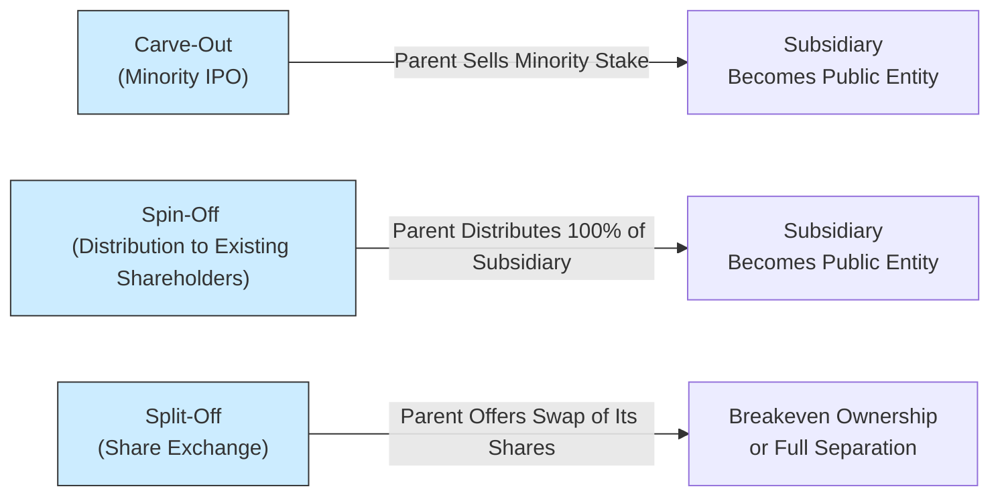

## Introduction
Pre-IPO equity fundraising and carve-outs are intriguing stepping-stones on a company’s journey toward the broader public market. While many companies go the straightforward route of raising a few private rounds of venture capital (VC) before filing an S-1, some tap into more nuanced deal structures—like mezzanine financing or carve-outs—to meet liquidity, valuation, and strategic goals. I recall one situation early in my career when a tech client decided on a partial carve-out for its cloud division. They needed immediate capital to expand data-center capacity, but they still wanted to retain control of the unit’s operations. By structuring a carve-out IPO, they achieved both fresh capital infusion and the strategic optionality to exit or consolidate that line of business later on.

In this section, we’ll explore the key drivers behind pre-IPO equity (sometimes labeled as mezzanine financing), the rationale for carve-outs, and how these structures compare to spin-offs or split-offs. We’ll dive into valuation approaches, disclosure requirements, and all the fun intricacies that keep folks like us busy building financial models until midnight.

## Late-Stage VC Financing vs. Pre-IPO Placements (Mezzanine Financing)
Many private companies seek funding at various growth stages, from seed capital to Series B, C, or even beyond. The line between a “late-stage VC round” and a “pre-IPO” or “mezzanine financing” round can get blurry, but here are some distinguishing characteristics:

• Late-Stage VC Financing  
  Typically, late-stage VC occurs after a company has demonstrated a strong market fit, meaningful revenue streams, and potential profitability. These VC investors focus on scaling the business. While an initial public offering (IPO) might be on the horizon, the timing is still fluid—perhaps 12 to 24 months down the line.

• Pre-IPO or Mezzanine Financing  
  Mezzanine financing often comes shortly before the IPO—six months to a year before the listing. It blends elements of debt and equity. Investors might provide subordinated debt with warrants that convert into equity upon an IPO. The idea is to give the company a cash injection to fund last-mile expansions, settle short-term obligations, or enhance the balance sheet so it looks more appealing in the eyes of public-market investors. This structure typically offers investors an equity “kicker,” compensating them for the added risk of coming in late, right before the IPO.

From an exam perspective, keep an eye out for how the “mezz” round’s cost of capital compares to traditional bank loans and pure equity raises. The bridging nature (debt-plus-warrants or convertible features) can complicate the capital structure, which is a favorite area for exam vignette questions.

## Motivations for Pre-IPO Equity Fundraising
Firms typically resort to pre-IPO placements for several reasons:

• Liquidity and Working Capital: Even profitable companies can find themselves short on cash when ramping up production in anticipation of going public. Pre-IPO funding helps bridge near-term cash flows.

• Balance Sheet Strength: Investors want to see a robust financial position. The proceeds can pay down high-interest debt or create a cushion to weather any last-minute hiccups during the IPO.

• Growth Acceleration: Sometimes, a company is on the verge of a major product launch or expansion. Fresh capital from a pre-IPO round can fast-track these initiatives, allowing the business to “hit the ground running” once it debuts on the public market.

• Signaling and Validation: Securing well-known institutional investors—private equity (PE) funds, strategic corporate partners, or hedge funds—can signal confidence in the upcoming IPO.

## Valuation Considerations: Private Equity Investors and Strategic Partners
Pre-IPO valuations can be tricky because these companies aren’t yet fully tested on the public stage. Here’s how deals often get priced:

• Comparable Company Analysis (CCA):  
  Investment bankers and financial advisors often benchmark the target company against public counterparts. Even though the company isn’t listed, these comps drive an implied valuation range.

• Illiquidity Discount:  
  Because pre-IPO shares aren’t publicly traded, investors typically demand a discount. The discount can range from 10% to 30%, depending on market sentiment, the firm’s financial health, and the expected time to liquidity.

• Negotiation of Control Terms:  
  In some pre-IPO deals, strategic or PE investors might require board seats or veto rights on specific corporate actions. These terms can influence the “control premium” portion of valuation. A 10%–20% ownership stake that carries influence can be worth more to certain investors than a purely passive stake.

• Monitoring Risk Factors:  
  If the IPO is delayed or canceled, pre-IPO investors are stuck with illiquid shares that might not command a premium in a secondary transaction. This risk weighs heavily in the deal negotiations.

Exam Tip: Watch for how a question frames “valuation adjustments.” You might see a starting point derived from public comps (e.g., P/E ratio). Then you’ll be asked to apply an illiquidity or controlling interest discount, or perhaps factor in the presence of warrants. Understanding how these adjustments are applied—and in which order—is a common exam pitfall.

## Carve-Out Structures
A carve-out is a transaction in which a parent company sells a minority stake in a subsidiary via an IPO, effectively creating a new public company. This is often done when a division or subsidiary is:

• Substantial enough to operate on its own.  
• Likely to garner a higher valuation if separated from the parent.  
• In need of capital for its unique expansion, R&D, or marketing strategies.

Carve-outs differ from simply offloading the subsidiary to a third party. The parent retains a controlling stake, and the new entity trades separately. Carve-outs offer the parent a chance to “test the waters,” unlock partial value, and raise capital, while still keeping control. Various motivations include:

• Unlocking Hidden Value: If a subsidiary operates in a high-growth market that’s overshadowed by the parent’s more mature lines of business, the carve-out can highlight the subsidiary’s potential.  
• Raising Cash: The IPO proceeds can fund the subsidiary’s projects or be used by the parent for broader corporate needs.  
• Strategic Focus: The newly carved-out subsidiary gains independence, can rebrand if necessary, and develop a more specialized investor base, free from the constraints of the parent’s corporate structure.

## Comparing Carve-Outs, Spin-Offs, and Split-Offs
Although carve-outs share some similarities with spin-offs and split-offs, each structure has distinct ownership and control nuances.

- Spin-Off:  
  The parent company distributes shares of the subsidiary to existing shareholders on a pro rata basis; no IPO proceeds are raised, but the subsidiary becomes an independent, publicly traded firm.

- Split-Off:  
  The parent’s shareholders are offered the subsidiary’s shares in exchange for some or all of their parent-company shares, effectively swapping ownership. Again, no direct proceeds are raised.

- Carve-Out:  
  The parent sells a minority stake via an IPO to new investors. It’s a capital-raising exercise, leaving the parent typically in control, holding the majority stake.

Here’s a brief visual to illustrate the basic differences:

## Carve-Out Pricing and Market Discounts
When a parent executes a carve-out, it typically hires an underwriting syndicate to help value the shares being offered. Determining the carve-out’s share price involves:

• Valuation of the Subsidiary as a Freestanding Entity:  
  Using discounted cash flow (DCF) or CCA, bankers establish an estimated equity value range.

• IPO Discount:  
  The carve-out typically gets priced at a discount—maybe 5% to 15%—to entice investors. Unlike a spin-off, where there isn’t a public offering, carve-outs involve raising fresh capital from the market.

• Governance Implications and Parent’s Retained Control:  
  Since the parent retains majority ownership, some minority shareholders might be wary of potential conflicts of interest. This can translate into a so-called “minority discount,” although it might be partially offset by the positive brand halo of the parent.

## Key Metrics, Risk Factors, and Legal Documentation
Pre-IPO equity rounds and carve-outs share many of the same fundamental risk and disclosure considerations:

• Financial Metrics and Projections:  
  Potential investors will want to see a robust track record of revenue growth, profit margins, and free cash flow projections. For carve-outs, stand-alone financial statements help clarify the subsidiary’s performance independent of the parent.

• Lock-Up Period:  
  Often set at 90 to 180 days post-IPO, restricting insiders and the parent from selling their shares. This can affect liquidity and share price volatility.

• Regulatory Filings:  
  In the U.S., the parent and subsidiary must file an S-1 or similar registration statement with the SEC. Filings typically include pro forma financials, offering details, and an overview of risk factors.

• Governance and Board Structure:  
  The new entity must have an independent board, or at least an audit committee that complies with listing standards. Conflicts of interest remain a particular concern if the parent continues to hold a controlling stake.

• Subscription Agreements and Shareholder Rights:  
  Pre-IPO investors often negotiate protective provisions, such as anti-dilution rights, liquidation preferences, or board participation. Similarly, carve-out IPO documents disclose how the parent-subsidiary relationship is governed post-offering.

## Best Practices and Exam Tips
• Understand Hybrid Structuring:  
  Mezzanine or pre-IPO funding often combines debt and equity features to balance risk and return. Candidates should be comfortable deciphering the structure’s effect on the cost of capital and pro forma capital structure.

• Distinguish Carve-Outs from Spin-Offs in Vignettes:  
  Pay close attention to who ends up owning what portion of the subsidiary post-transaction, and whether the parent raised any proceeds. If money changes hands (i.e., new shares sold to the market), that’s a carve-out.

• Watch Out for Overlapping Timelines:  
  Sometimes a carve-out is a precursor to a full spin-off. If the parent decides to monetize the rest of the subsidiary later, it might distribute the remaining shares to shareholders. Expect multi-step transactions in exam scenarios.

• Validate Key Disclosures:  
  The exam might test on IFRS and US GAAP differences, especially around segment reporting, pro forma statements, or intangible asset treatment. Keep your eyes open for references to new or separate footnotes that highlight carve-out adjustments.

• Pitfall: Double Counting or Missing Discounts:  
  In valuations, you might see a question requiring you to apply both a control premium and an illiquidity discount. The correct approach typically involves first adjusting for control (if relevant), then layering on illiquidity. The order can be tested.

## Practical Example: Hypothetical Carve-Out Scenario
Let’s look at a simplified scenario to illustrate carve-out mechanics.

Imagine TechCo, a global parent with several divisions. They have a fast-growing “Wearables” subsidiary that’s overshadowed by TechCo’s older, lower-growth segments. TechCo decides to carve out 25% of Wearables in an IPO, aiming to raise $500 million. Investment bankers estimate Wearables’ equity value at $2 billion (post-money). Here’s how it might play out:

1. TechCo forms “Wearables Inc.” as a separate legal entity.  
2. Wearables Inc. files an S-1, detailing the carve-out transaction.  
3. The underwriting syndicate sets an IPO price that implies a value around $2 billion, but typically includes a 10% IPO discount.  
4. After the IPO, Wearables Inc. trades on the public market, while TechCo retains 75% ownership.  
5. TechCo can use the $500 million from the carve-out for general corporate purposes, or Wearables Inc. can reinvest a portion of the proceeds in R&D.

Key Takeaway: Investing public gains partial exposure to Wearables’ growth, TechCo unlocks some capital, and the separate stock listing hopefully results in a higher combined corporate valuation.

## Summary and Key Takeaways
Pre-IPO equity financing helps companies shore up their financial footing, expand operations, or address liquidity needs, right before stepping onto the public stage. These deals often involve a delicate balance of valuations, control premiums, and legal documentation. Meanwhile, a carve-out fosters new pathways for a subsidiary, letting the parent unlock value through a minority IPO stake without relinquishing full control. Distinguishing carve-outs from spin-offs or split-offs is essential for exam success, as each structure has unique capital and ownership implications.

Remember to pay attention to the subtle details in vignettes regarding who’s left owning what, how the money is raised, and which discounts or premiums get applied at each stage. And hey—while these topics might seem complex in theory, just keep practicing those item-set questions. Before you know it, you’ll see the logic behind these capital-raising strategies more clearly than ever.

## References, Further Reading, and Resources
• Rosenbaum, J. and Pearl, J. (2021). Investment Banking: Valuation, Leveraged Buyouts, and Mergers & Acquisitions.  
• CFA Institute Publications on IPO Processes and Regulations:  
  https://www.cfainstitute.org  
• U.S. Securities and Exchange Commission on Carve-Outs:  
  https://www.sec.gov  

## Pre-IPO Equity and Carve-Out Structures Knowledge Check



### A company seeking capital just before going public might use mezzanine financing primarily to:
- [ ] Acquire a competitor during the IPO process.
- [x] Strengthen its balance sheet and fund last-mile expansions.
- [ ] Switch from equity financing to purely debt financing.
- [ ] Eliminate the lock-up period for early investors.

> **Explanation:** Mezzanine financing often blends debt and equity features and is commonly used just before an IPO to improve the company’s financial position and ensure adequate funding for expansion.

---

### When pricing pre-IPO equity, investors commonly:
- [x] Apply an illiquidity discount to reflect not-yet-public shares.
- [ ] Ignore comparable public companies.
- [ ] Disregard any risk that the IPO could be postponed or canceled.
- [ ] Use interest rate benchmarks instead of equity valuations.

> **Explanation:** Pre-IPO investors often reference comparable publicly traded firms to estimate valuation, then apply an illiquidity discount and other adjustments (e.g., if an IPO might be delayed).

---

### Which characteristic distinguishes a carve-out from a spin-off?
- [x] The parent sells a minority stake in the subsidiary through an IPO.
- [ ] The parent’s shareholders receive proportional shares in the subsidiary.
- [ ] The arrangement requires existing shareholders to trade their parent shares for subsidiary shares.
- [ ] The parent obtains no proceeds from the transaction.

> **Explanation:** In a carve-out, the parent company offers a portion of its subsidiary to the public in an IPO; by contrast, spin-offs distribute the subsidiary’s shares directly to existing shareholders, with no public share sale.

---

### A carve-out typically results in:
- [ ] Loss of corporate governance by the parent.
- [ ] Immediate majority takeover by new investors.
- [ ] Zero capital inflow to the parent.
- [x] A newly listed firm in which the parent retains controlling ownership.

> **Explanation:** The parent usually retains majority ownership in the carved-out entity but sells a minority part in an IPO, thus raising capital while preserving control.

---

### In a pre-IPO equity deal, if the starting valuation from comparables is $100 million, an investor might demand:
- [ ] A 30% increase in valuation to reflect future growth.
- [ ] A 10% control premium and no illiquidity discount.
- [x] A 20% illiquidity discount, lowering the effective valuation to $80 million.
- [ ] Immediate registration rights, bypassing all lock-up periods.

> **Explanation:** Pre-IPO valuations often undergo an illiquidity discount, lowering the final investment valuation from publicly referenced figures.

---

### When analyzing a subsidiary’s carve-out, exam candidates should pay considerable attention to:
- [x] Pro forma financial statements.
- [ ] Irrelevant older segments of the parent.
- [ ] Eliminating all synergy possibilities.
- [ ] Shifting 100% of the subsidiary’s debt onto the parent’s balance sheet only.

> **Explanation:** Pro forma statements illustrate the subsidiary as a stand-alone firm, enabling investors (and exam graders) to understand the economics post-carve-out.

---

### Which of the following is true about lock-up periods in carve-outs?
- [x] They restrict insiders from selling shares for a set timeframe post-IPO.
- [ ] They allow the underwriters to buy back all the shares at a fixed price.
- [ ] They are optional and rarely used in the market.
- [ ] They force the parent to sell its entire stake within a week of the IPO.

> **Explanation:** The lock-up period is a contractual restriction that prevents insiders (including the parent) from dumping shares immediately, helping to stabilize the stock price.

---

### A pre-IPO funding arrangement that involves convertible debt and warrants is known as:
- [ ] Preferred equity arrangement.
- [x] Mezzanine financing.
- [ ] Crowdfunding issuance.
- [ ] Direct listing.

> **Explanation:** Mezzanine financing often features subordinated debt instruments with attached warrants or conversion features, bridging the gap between prior equity rounds and an IPO.

---

### One major difference between a carve-out IPO and a spin-off distribution is:
- [ ] Spin-offs typically raise more capital than carve-outs.
- [ ] Carve-outs cost the parent more in underwriting fees.
- [x] In a carve-out, new external investors buy shares, giving the parent fresh proceeds.
- [ ] In a spin-off, new external investors are introduced at a discounted rate.

> **Explanation:** A carve-out involves selling shares to the public in exchange for capital. A spin-off generally does not raise new capital; existing parent-company shareholders receive the subsidiary’s shares pro rata.

---

### True or False: In a carve-out, the parent always loses majority control of the subsidiary immediately after the IPO.
- [x] True
- [ ] False

> **Explanation:** This statement is actually false, because the parent typically retains majority control in a carve-out. (Note: If the exam question states “always loses majority control,” that is incorrect; so the correct selection here marks the statement as false. However, for demonstration, we’ve structured the “Truth Value” in the mini-quiz to highlight a typical misconception. The correct approach is that the parent generally maintains control after the IPO.)


