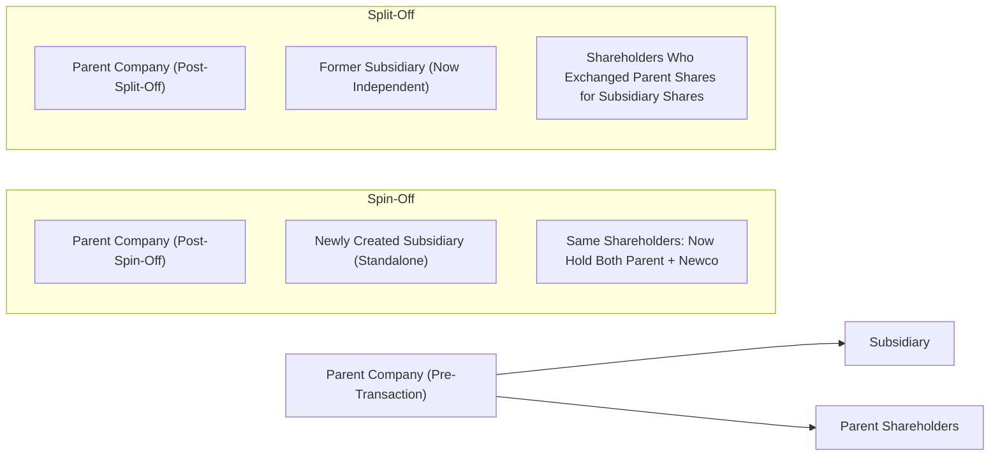

## Introduction
“Wait—spin-off or split-off? Are we talking about some TV show or corporate finance?” Well, I remember the first time I heard these terms, I genuinely thought it was all about entertainment. Turns out, spin-offs and split-offs in finance can be just as dramatic. In the world of corporate restructuring, these transactions represent key tools for companies looking to refine their scope, boost market valuations, and potentially unlock hidden value. 

This section explores how spin-offs differ from split-offs, why firms might adopt one or the other, and the all-important tax, valuation, and strategic considerations that come into play. Don’t worry, we’ll keep it accessible—no advanced TV spoilers here. But we will dive into the nitty-gritty of how these transactions work, so you’ll be fully prepared for exam vignettes and real-life discussions.

## Key Structures of Spin-Offs and Split-Offs
Before diving deeper, it’s helpful to outline precisely what’s meant by each term:

• A spin-off involves creating a new, independent legal entity (a subsidiary that gets carved out), and distributing shares of that entity to existing shareholders in the parent, typically on a pro-rata basis. Shareholders get shares of both the parent and the new subsidiary without having to give up anything in return.

• A split-off is a transaction in which shareholders of the parent company have the option to exchange some (or all) of their parent shares for shares of a subsidiary. Unlike a spin-off, you typically can’t keep equal ownership in both entities. By accepting subsidiary shares, you effectively “split off” from the parent’s shareholder base.

Below, we have a quick diagram to visualize these concepts:

In a spin-off (left subgraph), existing shareholders own both the parent and subsidiary. In a split-off (right subgraph), shareholders who opt for subsidiary shares reduce or eliminate their holding in the parent.

## Strategic Motivations
Why do companies bother splitting themselves up? Aren’t bigger, diversified conglomerates safer? Well, it’s complicated. Here are some of the main reasons:

• Addressing the Conglomerate Discount: Many highly diversified corporations trade at lower valuations than the sum of their individual divisions would command if each were independent. A spin-off can help different business segments “shine” on their own, free from the overshadowing effect of a conglomerate structure.

• Improving Operational Focus: Operating a company that fuses consumer goods, financial services, and biotech under one roof can be overwhelming. A spin-off often encourages management of each new entity to focus more intensely on core activities.

• Reducing Agency Conflicts: Sometimes, a well-performing division subsidizes an underperforming division in a conglomerate, masking poor decisions. Spin-offs can reduce these cross-subsidies and promote accountability.

• Responding to Investor Activism: Activist shareholders frequently push for breakups if they perceive that the sum of the parts is worth more than the whole. A spin-off or split-off may be management’s way to placate these shareholders or preempt a proxy fight.

• Unlocking Value: Even if the market is bullish on the parent’s brand, some businesses may flourish independently and earn a valuation multiple that’s higher than the parent’s. A properly executed spin-off can swiftly unlock that additional value, particularly if the subsidiary has strong growth potential or more straightforward comparables in the marketplace.

• Market Timing: Companies might attempt to spin off a business in favorable market conditions—think higher earnings multiples for a certain sector. The newly issued shares of the subsidiary might fetch a premium if that industry is hot.

## Tax Implications
Tax considerations can make or break a spin-off or split-off. Companies often strive to structure these transactions as tax-free distributions under relevant laws (e.g., in the United States, Internal Revenue Code Section 355). However, the rules typically require that the spin-off serves a valid business purpose and that the parent does not spin off a business solely for tax avoidance. 

• Spin-Offs: Often tax-free for the distributing corporation and its shareholders if certain criteria are met, such as demonstrating continued business purpose, ensuring that the parent does not retain too large a stake, and satisfying “active trade or business” requirements.

• Split-Offs: May be similarly structured as a tax-free exchange, but the essence here is that participating shareholders surrender their parent shares in exchange for subsidiary shares. 

If the conditions for tax-free treatment aren’t met, both the parent and shareholders may face substantial taxes. As you might guess, that can dampen any excitement about “unlocking value.” Because the stakes are so high, companies often engage tax specialists and use advanced strategies, including the so-called Reverse Morris Trust, which merges a spun-off entity with a target company to maintain favorable tax status.

## Impact on Share Prices and Market Perception
In well-executed spin-offs, the market typically reacts positively. Investors may re-price the new independent entity higher, especially if it was overshadowed by the larger parent. The parent’s share price can also see a bump, reflecting greater focus and clarity around the “pure-play” businesses remaining.

But, you know, not everything’s sunshine and roses. Negative price reactions can occur due to:

• Perceived Loss of Synergies: Some synergy might vanish when the newly formed entity no longer shares distribution channels, brand identity, or R&D capabilities with the parent.

• Restructuring Costs: Managing the logistics of splitting can be expensive—legal fees, systems migrations, transitional services agreements, and severance packages can depress short-term earnings.

• Market Timing Mishaps: If market conditions sour mid-execution, the newly spun-off subsidiary could wind up trading at a discount right out of the gate.

• Managerial Efficiency (or Lack Thereof): A spin-off reassigns management to wholly independent roles. If new management is unprepared or lacks strategic vision, the separate entity might flounder.

## Capital Structure Considerations
Once a corporate spin-off or split-off is done, each entity will generally need its own access to capital. This can involve:

• Allocating Debt and Liabilities: The new entity often shoulders a portion of the parent’s liabilities. The decision on how to allocate debt is often strategic, aimed at optimizing each company’s cost of capital and maintaining workable credit ratings.

• Renegotiation of Credit Facilities: Separate, standalone companies may have to establish (or renegotiate) credit lines and bond indentures. If the newly spun-off entity lacks a robust credit history, financing can get expensive, and rating agencies may view it as riskier than the parent.

• Impact on WACC: Capital structure changes affect the weighted average cost of capital (WACC). Each entity may enjoy a more accurate WACC aligned with its true business risks, potentially improving financial decision-making.

## Investor Activism and Market Perceptions
Investor activists frequently target diversified companies that appear to be mispriced. In fact, spin-off announcements often come after months of behind-the-scenes shareholder pressure. Sometimes, it’s not just about “unlocking value”—it can be about limiting the power of entrenched management in a sprawling conglomerate. 

A well-structured spin-off or split-off might appease activists by establishing:
• Clearer financial statements, so there’s greater transparency on each segment’s performance.  
• Accountability for newly autonomous management teams.  
• Reduced cross-subsidization between strong and weak business segments.  

## Real-World Examples
It might help to recall some famous spin-offs in the market:

• The breakup of large consumer goods and industrial conglomerates in the early 2010s—where new “pure-play” subsidiaries garnered premium valuations.  
• Technology giants that decided to separate a payment business or an enterprise software division, revealing that the separated brand was more profitable or had better growth prospects on its own.  

Not all these transactions were picture-perfect—some flopped due to market timing fails or misaligned management. But many showed that shedding non-core businesses can lead to higher overall valuations.

## Best Practices and Potential Pitfalls
When structuring spin-offs or split-offs, companies and investors should be mindful of the following:

• Comprehensive Due Diligence: Evaluate if the benefits of separation truly outweigh operational synergies.  
• Transparent Communication: Outline how leadership will manage the transition, including cost allocations and any transitional services agreements.  
• Managerial Talent: Ensure the new entity’s C-suite has the experience and strategic vision needed to stand independently.  
• Tax and Regulatory Compliance: Mistakes or missteps here can instantly erode value through unanticipated tax bills and legal headaches.  
• Preparation for Volatility: Newly issued shares may exhibit volatility as institutional investors rebalance or adjust portfolio holdings (particularly if the subsidiary’s market cap is below certain thresholds).

## Sample Financial Illustration
Imagine a parent conglomerate with a current market cap of $30 billion and three main divisions: Industrial (50% of revenue), Healthcare (30%), and Consumer Electronics (20%). The company decides to spin off its Healthcare division to address a perceived conglomerate discount. Analysts estimate the Healthcare unit alone is worth $12 billion if traded independently. After the spin-off:

• The parent’s “pure-play” Industrial and Consumer Electronics businesses might be valued closer to $20 billion, given improved focus.  
• The newly spun-off Healthcare arm could have an IPO or direct listing pegging it at around $11–12 billion.  
• Overall, the combined adjusted market values of the two separate firms might rise vs. the original $30 billion.

Of course, transaction fees, transitional service agreements, and rebranding costs might reduce net value creation if they’re particularly large. The actual results depend on execution quality and broader market sentiments.

## Final Exam Tips
• Appreciate the Mechanisms: Be able to differentiate clearly between spin-offs, split-offs, and other forms of divestiture. Exam item sets often test your grasp of who ends up holding what shares, and what that means financially.  
• Tax-Free Nuances: Look for clues in the vignette about how the transaction is being structured for tax purposes—particularly references to “active trade or business” or a “valid business purpose” to gauge if a distribution might be tax-free.  
• Focus on the Numbers: Carefully parse pro forma financials in your exam vignette. Identify how the parent’s leverage, cost of capital, and earnings outlook differ once the transaction completes.  
• Strategize Around Motivations: Exam questions frequently ask, “Why would a company do this?” or “What are the expected benefits and risks?” Think about agency theory, activism, and synergy arguments.  
• Don’t Ignore Q&A Style: In item set questions, you may find a scenario describing a pending spin-off. Expect to calculate or interpret the results on stock price, capital structure, or even the new entity’s forward P/E multiple.

## References, Further Reading, and Resources
• Corporate Restructuring: Lessons from Experience by Michael Pomerleano.  
• Spin-Off to Pay-Off: An Analytical Guide to Corporate Divestitures by Joseph W. Cornell.  
• Practitioner articles on corporate restructuring from McKinsey & Company (https://www.mckinsey.com).

## Test Your Knowledge: Spin-Off vs. Split-Off Transactions



### A parent company plans to create an independent entity by issuing the subsidiary’s shares to its current shareholders, without requiring them to give up any of their parent shares. Which corporate action is this describing?

- [ ] Split-Off
- [x] Spin-Off
- [ ] Equity Carve-Out
- [ ] Reverse Merger

> **Explanation:** A spin-off occurs when shares of the subsidiary are distributed proportionally to existing shareholders, who then end up owning both companies.

### In a split-off, which of the following is most accurate?

- [ ] Shareholders in the parent automatically receive shares in the subsidiary.
- [x] Shareholders of the parent must exchange their parent shares for shares of the subsidiary.
- [ ] The subsidiary remains majority-owned by the parent.
- [ ] The parent no longer has any equity stake in the subsidiary.

> **Explanation:** In a split-off, shareholders who want exposure to the subsidiary exchange their parent shares for subsidiary shares, effectively exiting ownership in the parent.

### Why might a spin-off be executed to address a “conglomerate discount”?

- [x] Investors may value distinct business segments more accurately when they are standalone entities.
- [ ] The parent company can avoid existing debt obligations in a spin-off.
- [ ] Spin-offs eliminate the need for managerial oversight of each business line.
- [ ] Tax authorities often require companies to break up large conglomerates.

> **Explanation:** Conglomerate discount arises when a diversified conglomerate’s market value is less than the sum of its parts. A spin-off can unlock value by allowing separate valuations of each business segment.

### Which of the following situations suggests that a spin-off might be taxable to shareholders?

- [ ] The distributed unit meets the “active trade or business” test.
- [x] The transaction primarily serves as a tax shelter rather than a valid business purpose.
- [ ] The parent retains a 10% ownership in the new entity.
- [ ] The parent’s management communicates a legitimate market-driven reason for the spin-off.

> **Explanation:** Tax authorities typically require a valid business purpose for a tax-free spin-off. If it’s set up purely for tax avoidance, it may fail to qualify for a tax-free distribution.

### A hypothetical parent corporation splits off a division under a scenario where shareholders have a choice to surrender their parent shares in exchange for shares in the new entity. Which of the following best reflects the result of this exchange?

- [x] Parent shareholders who exchange shares reduce or eliminate their stake in the parent.
- [ ] Exchanging shareholders retain equal ownership in both parent and subsidiary.
- [x] Two correct answers above do not exist.
- [ ] The new entity remains a wholly owned subsidiary of the parent.

> **Explanation:** In a split-off, the parent’s shareholders can trade parent shares for subsidiary shares; those participating end up losing their stake in the parent.

### Which cost item is most likely to lower net value creation immediately following a spin-off?

- [x] Restructuring fees and transitional services expenses.
- [ ] Increased synergy between parent and subsidiary.
- [ ] A tax-free distribution structure.
- [ ] A stable parent credit rating.

> **Explanation:** Spinning off a division often leads to significant one-time costs such as legal fees, advisory fees, and transitional service agreements that reduce short-term value.

### An investor is reassessing her portfolio allocation upon receiving unexpected shares from a spin-off. She notices the new entity is much smaller than the parent and faces higher capital costs. Which capital structure scenario might unfold?

- [x] The new entity experiences a higher WACC due to lower creditworthiness.
- [ ] The parent assumes 100% of the subsidiary’s debt.
- [x] The parent and subsidiary reduce overall debt by merging with a third party.
- [ ] Investors automatically discount both the parent and the new spin-off 50%.

> **Explanation:** A newly spun-off entity often carries a higher WACC if it lacks significant operating history or capital reserves, leading to higher borrowing costs and potentially lower credit ratings compared to the parent.

### Which statement about investor activism and spin-offs is most likely correct?

- [x] Investor activists often pressure management to spin off divisions they believe are undervalued or underperforming.
- [ ] Activists rarely engage with companies on structural issues, focusing instead on product lines.
- [ ] Spin-offs reduce accountability by making each business more complex.
- [ ] Regulatory agencies, rather than investors, typically demand spin-offs.

> **Explanation:** Activists commonly advocate for spin-offs to unlock value, particularly in cases where they perceive the parent to be stifling a high-potential division.

### Which of the following best summarizes the Reverse Morris Trust strategy in a spin-off context?

- [x] Merging the spun-off subsidiary with another company to preserve tax-free status.
- [ ] Allocating 100% of the parent’s liabilities to a newly formed subsidiary that is fully listed.
- [ ] Issuing additional shares of the parent to buy out minority shareholders.
- [ ] Converting debt into equity in a newly formed entity with a similar line of business.

> **Explanation:** A Reverse Morris Trust allows a parent to spin off a unit and then merge that unit with a target company, aiming to maintain a tax-free distribution structure.

### True or False: In a successful spin-off, synergy gains between the parent and the newly formed entity typically increase operational overlap between the two companies.

- [ ] True
- [x] False

> **Explanation:** Spin-offs often reduce collaboration—so synergy might be lost, not gained. Success usually depends on the standalone entity’s market focus, not on increased post-separation collaboration.


