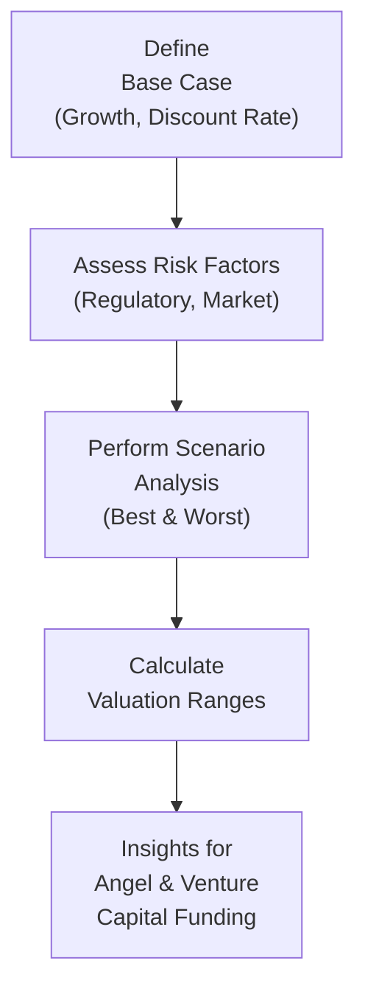

## Introduction

So, let’s talk about something that gets everyone’s adrenaline pumping—innovation financing. (Yes, that was just a tiny dash of sarcasm, but honestly, funding wildly creative ventures can be surprisingly exciting!) Whether you’re dealing with angel investors in a small startup or looking into a carve-out for next-gen breakthroughs, the process can feel kind of like being on a rollercoaster. You’ve got uncertain growth prospects, all sorts of risk factors, and the looming question of exit strategies. In this section, we’ll walk through a suite of scenario exercises that reflect the real tempered chaos that corporations face in trying to finance cutting-edge ideas.

We’ll build on the discussions from earlier parts of this chapter (especially Sections 16.1 through 16.4) where we covered venture capital, pre-IPO structures, spin-offs, split-offs, and corporate venturing. But here, we’ll get super hands-on with scenario analysis—putting all those theories into practice as we try to snag that sweet spot between unstoppable innovation and disciplined financial analysis.

## Why Scenario-Based Approaches Matter

Financing innovation isn’t a “one-size-fits-all” process. The success or failure of a new technology, product, or service can hinge on variables like regulatory policies, consumer behavior, competitor responses, and macroeconomic conditions—some of which can be truly unpredictable. While all investments carry some uncertainty, innovation financing is in a league of its own because it often depends on breakthroughs that may or may not materialize on schedule (or at all).

That’s why scenario analysis is so critical. By tweaking inputs such as cost of capital, revenue growth rates, or exit multiples, you can see how drastically the fair value of a project or spin-off might change. And if you’re presenting these analyses to executive management, you have to highlight both the upside potential (the “wow” scenario) and the downside risk (the “yikes” scenario). It’s kind of like being the meteorologist of corporate finance: you want to at least give everyone a heads-up if that storm is coming.

## Valuing a Startup Funded by Angel Investors and Corporate Venture Capital

Let’s jump into our first scenario: a multi-stage valuation model for a startup with both angel investors and corporate venture capital participants.

### Key Considerations

• Growth Stages: Typically includes an initial rapid-growth phase followed by a more stable, mature growth phase.  
• Risk Adjustments: Startups carry heightened risk, so you might use a higher discount rate or incorporate scenario-based cost of equity estimates.  
• Exit Options: Maybe an IPO, a strategic acquisition, or a buyback arrangement.  

### Building the Model

Here’s a simplified multi-stage discount model you might use:

For a projected horizon of n years:


V_0 = \sum_{t=1}^{n} \frac{FCFF_t}{(1 + r)^t} + \frac{TV}{(1 + r)^n}


Where:  
• \\( FCFF_t \\) represents the startup’s forecasted free cash flow to the firm for year t.  
• \\( r \\) is the required rate of return (often quite high for early-stage ventures).  
• \\( TV \\) is the terminal value at the end of year n, derived using a perpetual growth model or an exit multiple.  

#### Example Breakdown

Imagine a scenario where a biotech startup is developing a new gene-editing therapy. In your base case, you assume:  
• 40% annual revenue growth for the first three years, tapering to 20% by year 5.  
• A required rate of return of 18% to reflect the high risk.  
• A terminal growth rate of 3% after year 5.  

Then, run stress tests. Want to see how things look if that therapy faces regulatory delays and revenue growth drops to 15% in year 1? Or if regulatory agencies move faster, pushing revenue growth up to 60%? This is scenario analysis at work.

Here’s a tiny anecdote: I once worked with a founder who was so optimistic about hitting those “homerun” growth numbers that the base case was practically the best case. Our real scenario analysis had to recalibrate everything—especially the discount rate—once the CFO realized regulatory approvals could drag on. It paid off in the end, though, because the scenario analysis set more realistic timelines and prevented overspending.

### Visual Overview

Below is a simple flowchart for how the scenario analysis might proceed in a startup’s multi-stage valuation:

## Carve-Out Scenario with Pre-IPO Investors

Picture a large corporation that decides to carve out a division focusing on “next-generation breakthroughs.” They bring in multiple pre-IPO investors, and they’re juggling illiquidity discounts, scenario-based revenues, and all that. This scenario is especially relevant for big tech or pharma, where a portion of the business is spun off to accelerate R&D.

### Mechanical Steps

• Identify the portion of the business carved out (e.g., a discrete R&D division).  
• Estimate revenue streams under different scenarios: Will the new technology disrupt the market or might it get overshadowed by a competitor?  
• Apply an illiquidity discount in the analysis because pre-IPO shares are less liquid and carry higher risk.  

One approach is to value the carve-out as if it were a standalone firm. Then, you discount that valuation to reflect illiquidity. As time passes and the carve-out moves closer to an IPO or a strategic exit, that discount might shrink.

## Spin-Off with Heavy R&D Investment

Spin-offs can be fun to analyze, but they can also cause headaches if synergy losses are overlooked. Here, we have a scenario where a newly formed entity invests heavily in R&D. Inter-company cross-licensing might vanish, or any cost-sharing arrangement with the parent might end, which can leave the spin-off with higher overhead.

### Evaluating Post-Spin-Off Capital Structure

Note that synergy losses might result in a higher cost of capital for the spin-off—particularly if the parent was previously guaranteeing some of the entity’s debt. If you’re analyzing the spin-off for potential investment:

• Adjust the spin-off’s operating forecasts to reflect stand-alone overhead and possibly lost group discounts on raw materials.  
• Reassess the spin-off’s borrowing costs.  
• Factor in new governance structures: the spin-off’s board and executive team may have different strategic priorities.

## Collaboration Scenario: Strategic Alliances and Joint Development

Now let’s throw a bit of excitement into the mix: multiple parties forming a strategic alliance to speed up go-to-market timelines. Maybe it’s a group of automotive companies wanting to co-develop electric vehicle battery technology or a consortium of telecom giants building the next wave of 5G infrastructure.

### Cost-Sharing and IP Ownership

In these alliances, the big question is: how do we share costs, and who owns the resulting IP? Possibly, you’ll have a joint development agreement that sets out each party’s responsibilities. If one partner invests more capital, they might get a bigger slice of future royalty streams.

### Exit Provisions

Alliances can go sour or just run their course. Including scenario-based exit clauses—like buyout options or licensing transitions—can help reduce uncertainty. In your financial analysis, incorporate the cost or payoff from these potential provisions.

## Constructing Your “What-If” Analyses

Scenario analysis often starts with the base case, best case, and worst case. But for big corporate decisions, you might expand that to half a dozen plausible futures. Let’s highlight a few high-level steps:

1. Identify Key Variables: e.g., R&D success rates, regulatory approvals, market acceptance, cost overruns, and discount rates.  
2. Assign Ranges: For each variable, define a range from optimistic (best case) to conservative (worst case).  
3. Model Outcomes: Use spreadsheets or specialized software to recalculate valuations under each scenario.  
4. Summarize Results: Distill each scenario’s impact on the top line (revenue), bottom line (profit), and overall company valuation.  
5. Present to Stakeholders: Emphasize sensitivity to changes in big drivers so that executives or investors fully appreciate the range of possible outcomes.

### Monte Carlo Simulation

If you want to be extra thorough, consider using Monte Carlo simulation. This approach can generate thousands of random scenarios based on probability distributions for each uncertain input. The output is a probability distribution of possible valuations or project NPVs. Pretty cool, right?

## Interpreting Results for Executive Management or Investors

Okay, so you ran your scenarios and you have that giant spreadsheet brimming with data. Now what?

• Focus on Key Insights: Boil down complex modeling results into a handful of highlights covering risk-return trade-offs, synergy potential, and alignment with strategic goals.  
• Show Upside and Downside: Illustrating the range of potential outcomes fosters realistic expectations.  
• Timing Matters: Clarify major milestones—like expected product launch, regulatory approval deadlines, or the next funding round.  
• Summarize Risk Mitigation: If your analysis highlighted certain red-flag areas, propose risk mitigation strategies.  

It’s easy to overwhelm management with data dumps, so keep your narrative crisp. Let them see the big picture: “In the worst-case scenario, we’ll face a shortfall of $100 million by year three. In the best case, we see triple-digit percentage returns on investment.” That’s the type of headline executives understand.

## Key Terms (Quick Glossary)

• Scenario Analysis: Evaluating different possible futures by adjusting major assumptions.  
• Monte Carlo Simulation: A technique that runs a series of random inputs across thousands of iterations to produce a probability distribution of outcomes.  
• Sensitivity Analysis: Examining how changes in a single variable (like cost of capital) affect the results.  
• Cost-Sharing Agreement: A funding arrangement in which two or more parties jointly finance a project and share its benefits.  
• Joint Development Agreement: A contract for collective product/technology development, detailing cost allocations and IP ownership.  
• Strategic Alliance: A partnership among independent entities to pursue mutual objectives without merging.  
• Innovation Pipeline: The set of R&D or product development projects planned or in progress within a firm.  
• Upside/Downside Case: Describes scenarios reflecting maximum potential gains (upside) and possible losses (downside).

## Best Practices and Common Pitfalls

• Don’t Let Optimism Cloud Your Base Case: If management is super bullish, do a reality check against comparables.  
• Remember the Capital Structure: A new spin-off might have drastically different financing costs than its parent.  
• Overlooking IP Ownership Can Derail Everything: In alliances or carve-outs, nail down who owns the final product or patent.  
• Maintain Transparency: Particularly in multi-party deals, trust is paramount. Everyone has to see the same numbers.  

## Mini Case Study: Corporate Alliance for Medical Device Innovation

Let me share a short example from personal experience. I once consulted for a joint venture between a large pharmaceutical firm and a medical devices startup. The aim was to bring a groundbreaking surgical robot to market faster. Each side had its strengths—one had the R&D budget, the other had the specialized technology. But guess what emerged as the biggest stumbling block? IP ownership, especially for newly discovered tech improvements that neither side initially foresaw. Ultimately, the alliance hammered out an agreement giving each partner exclusive licensing rights in specific markets (PharmaCo for the EU and the startup for North America). Our scenario analysis modeled different regulatory pathways across jurisdictions. The best part? We used a combined approach: base, best, and worst case, plus Monte Carlo for uncertain timing of FDA approvals. That final chart, displaying a distribution of expected valuations, blew the CFO away.  

## Final Exam Tips

• Practice Time Management: In a CFA exam context, you might get a scenario describing a carve-out’s valuation. Quickly identify key inputs (growth rates, discount rates, synergy assumptions) and do a quick sensitivity check on each.  
• Prioritize the “Why” of Changes: Examiners often want to see if you understand the rationale behind adjusting discount rates or growth rates in different scenarios.  
• Organize Your Responses: If you get an item set with multiple sub-questions, tackle them systematically—don’t jump around.  
• Show Calculation Transparency: Label your formulas clearly. Partial credit can hinge on showing correct intermediate steps.

## References and Further Reading

• Russell Lundholm and Richard Sloan, “Equity Valuation and Analysis”  
• Deloitte Insights (https://www2.deloitte.com) on Scenario Planning  
• PwC Insights (https://www.pwc.com) on Corporate Innovation and Financing  
• Stefano Gatti, “Project Finance in Theory and Practice”  

## Test Your Knowledge: Scenario-Based Innovation Financing



### A corporation is planning to spin off a small division to pursue advanced R&D in autonomous robotics. Which factor is most crucial when determining the spin-off’s standalone valuation?

- [ ] The recent stock price of the parent corporation
- [x] The division’s post-spin-off capital structure and overhead costs
- [ ] The corporate tax rate of the parent
- [ ] The presence of multiple CFOs within the parent organization

> **Explanation:** Once the spin-off is standalone, it may lose benefits like the parent’s favorable borrowing rates or shared corporate overhead. Accurately assessing its capital structure and overhead post-spin is critical.

### When preparing a multi-stage valuation model for a startup funded by angel investors and corporate VCs, which commonly used approach best captures the firm’s future periods of unusually high growth followed by stable growth?

- [x] A two-phase (or multi-stage) discounted cash flow model
- [ ] Single-period dividend discount model
- [ ] Residual income method only
- [ ] Zero-growth perpetuity approach

> **Explanation:** Multi-stage DCF (often two-phase) is well-suited for early years of very high growth transitioning to a more mature growth rate.

### In a strategic alliance focusing on new product innovation, cost-sharing agreements typically:

- [ ] Allocate all cost to the party with the largest R&D facility
- [x] Distribute development expenses based on predefined ownership or usage agreements
- [ ] Defer all costs until the product is launched
- [ ] Force each partner to arrange separate financing independently

> **Explanation:** Under a cost-sharing agreement, parties share R&D expenses in agreed-upon ratios, reflecting their ownership stakes or expected benefits.

### Why might a carve-out with pre-IPO investors incorporate an illiquidity discount in its valuation?

- [x] Because the carve-out’s shares are not freely tradable, increasing the perceived risk
- [ ] Because the carve-out is forced to pay the parent company a licensing fee
- [ ] To compensate for higher synergy potential
- [ ] Because carve-outs are obligated to maintain the same dividend payout ratio

> **Explanation:** Pre-IPO investments are relatively illiquid, so investors demand a discount to reflect the added difficulty in selling those shares.

### In your base-case scenario for an innovative drug startup, you model a 30% annual growth for three years, then 10% afterward. If regulatory approval accelerates unexpectedly, doubling revenue in the first two years, which type of scenario analysis approach is illustrated?

- [ ] Duration analysis
- [x] Best-case scenario
- [ ] Stress testing
- [ ] Worst-case scenario

> **Explanation:** Doubling initial revenues is a scenario that represents an optimistic (or best-case) situation where conditions exceed typical base-case assumptions.

### A typical Monte Carlo simulation in innovation financing:

- [x] Generates a distribution of outcomes based on random inputs for key variables
- [ ] Ignores variable interdependencies
- [ ] Uses only worst-case outcomes to ensure feasibility
- [ ] Is never adapted for intangible valuations like IP

> **Explanation:** Monte Carlo simulation randomly selects input values within predefined distributions to produce a range (distribution) of possible results.

### If a newly spun-off R&D entity faces higher borrowing costs than its parent, which effect is most likely?

- [x] Increase in the discount rate used to value its projected cash flows
- [ ] No impact on its cost of capital or valuation
- [x] Lower synergy losses since it’s now separated
- [ ] Higher capital structure synergy that encourages more debt

> **Explanation:** Being on its own typically raises the spin-off’s cost of debt, which in turn increases the overall discount rate and reduces valuation, all else equal.

### When presenting scenario analysis results to executive management:

- [x] Focus on the major drivers of sensitivity and the resulting range of valuations
- [ ] Provide a single valuation for simplicity
- [ ] Hide worst-case scenarios to avoid scaring stakeholders
- [ ] Present only the mean outcome from a Monte Carlo simulation

> **Explanation:** Executives need an overview of the critical assumptions, the range of outcomes (especially worst-case), and the strongest valuation drivers.

### In a multi-party innovation partnership, ignoring IP ownership clauses can:

- [x] Lead to disputes, legal challenges, and hamper commercialization
- [ ] Always result in the largest partner automatically owning 100% of IP
- [ ] Have no effect once the final product is commercialized
- [ ] Be beneficial if the technology is open-source

> **Explanation:** Failing to define clear IP ownership leads to conflicts and may undermine the partnership’s ability to commercialize the product effectively.

### True or False: Scenario analysis is irrelevant if the project’s future cash flows are assumed to be stable and predictable.

- [x] True
- [ ] False

> **Explanation:** While you might not strictly need scenario analysis for stable, predictable cash flows, in many real-world cases (especially innovations), future cash flows are not stable, so scenario analysis typically remains quite relevant.


