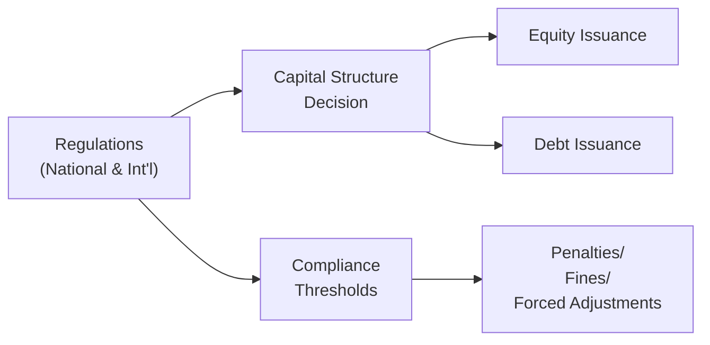

## Understanding Regulatory Constraints on Capital Structure

Sometimes, deciding how much debt or equity to issue might feel like a puzzle—one piece goes missing, or the entire image changes shape. Well, it isn’t just about balancing risk and return; it’s also about navigating a whole maze of rules from governments, stock exchanges, and international frameworks. In the real world, ignoring these laws can quickly lead to sleepless nights for CFOs worried about regulatory fines or forced capital restructurings.

In this section, we’ll explore how national and international regulations can dictate (or at least strongly influence) the types and amounts of funding firms use. We’ll also look at how industry-specific laws, capital requirements, and even cross-border limitations can reshape the financing landscape for companies. And hey, if you’ve ever witnessed a CFO scramble to find fresh equity on the market because of a new leverage ratio cap, you know exactly how vital these regulations can be.

## The Role of Regulations in Shaping Capital Decisions

Corporate issuers, regardless of industry, can’t simply issue infinite debt or stock. Instead, regulators set hurdles—sometimes subtle, sometimes explicit—to ensure companies remain solvent, protect consumers, and maintain market confidence. Rules can come from:

• Financial regulators and government entities.  
• Industry watchdogs or self-regulatory organizations (e.g., stock exchanges).  
• International bodies, such as the Basel Committee on Banking Supervision (for financial institutions).

### Why Do These Regulations Exist?

At their core, regulations aim to protect stakeholders—shareholders, creditors, and the broader financial system. For instance, governments are keen on preventing excessive risk-taking that might jeopardize financial stability. In heavily regulated sectors such as banking, excessive leverage can turn into a systemic crisis. Outside of finance, certain industries (utilities, telecommunications) must ensure continuity of essential services, so regulators keep a watchful eye on capital structure choices.

## National vs. International Regulatory Frameworks

Depending on the jurisdiction, companies might face different constraints, including explicit debt ceiling laws, caps on leverage ratios, or requirements to retain earnings. Meanwhile, cross-border debt issuance can trigger additional complexity, as local securities laws or currency controls might cap how many international bonds a firm can sell.

### Example: Debt Ceiling Laws

Imagine a large real-estate developer in Country X. There, a national regulation (often referred to as a debt ceiling law) states that corporations cannot issue total debt exceeding five times their equity. If that real-estate firm already has a debt-to-equity ratio of 4.8, it might struggle to finance a new construction project with additional bonds. Instead, the developer might have to issue more equity or bring in outside partners—potentially changing its entire strategic plan.

### Cross-Border Restrictions

Some regions impose strict limitations on foreign borrowing or have costly regulatory filings. For example, certain emerging markets require regulatory approval for cross-border bond sales. These approvals can be time-consuming and might impose maximum interest rates or maturity guidelines. Firms in these jurisdictions must carefully plan their financing timeline to avoid missing out on market windows.

## Sector-Specific Regulations and Capital Requirements

### Banking and the Basel Accords

Now, if you’re dealing with a bank, the Basel Accords pop up—these are global regulatory standards (Basel I, II, III, or even newer iterations) that stipulate capital requirements. These rules require banks to maintain a minimum level of high-quality capital (like common equity) relative to their risk-weighted assets. Banks must also hold a capital buffer to safeguard against unexpected losses.

For instance, a commercial bank with a heavy consumer loan portfolio might need to hold more equity if regulators deem those loans risky. As soon as a bank dips below the required capital ratio, it can’t freely pay dividends or repurchase shares; sometimes, it must suspend distributions until capital ratios return to compliant levels.

### Utilities and Other Regulated Monopolies

Think about utilities—electricity, water, gas, telecommunications. Regulators often require these enterprises to submit rate cases, which weigh the cost of capital (both debt and equity) to determine allowable rates charged to consumers. If the regulator sees that leverage is too high—putting service stability at risk—management may be forced to inject fresh equity or lower dividends to shore up financing flexibility.

## Government Incentives and Tax Breaks

We all love a good incentive, right? Governments sometimes offer special deals—tax incentives or subsidies—for companies that issue equity or invest in socially desirable projects (like green energy). In other instances, favorable interest deductibility rules encourage companies to load up on debt. A quick pivot in policy—say, removing interest deductibility—can radically change the cost of debt overnight:


\text{After-tax cost of debt} = r_d \times (1 - T)


If the tax rate \\( T \\) moves closer to zero, the after-tax cost of debt converges to \\( r_d \\). That might suddenly make equity financing more attractive or force companies to re-evaluate their capital structure.

## Compliance Risks: Exceeding Regulatory Thresholds

Compliance risk is no joke. It’s the “what happens if we break or approach the threshold for capital structure compliance?” scenario. Potential outcomes include:

• Fines or suspensions of operating licenses.  
• Forced deleveraging, often at unfavorable market pricing.  
• Mandated issuance of new equity to get the ratio back in line.  
• In extreme cases, government takeover or forced mergers (particularly in the financial sector).

I recall a time when I was consulting for a mid-sized bank that had stretched its loan-to-value ratio in an attempt to boost net interest margins (hello, short-term gain!). Then new stress test rules arrived, effectively lowering the acceptable ratio. The bank had to scramble for a capital injection. It turned into a marathon of investor meetings, equity roadshows, and tough negotiations with regulators. Moral of the story: ignoring or underestimating potential regulatory shifts can be catastrophic.

## Forced Deleveraging and Case Studies

### Rapid Deleveraging Under New Regulations

Imagine a global shipping giant that finances its fleet primarily through massive debt. Overnight, new regulations come into play—perhaps driven by environmental or safety standards—that significantly reduce shipping volumes. Regulators also announce they’ll be tightening leverage ratio caps for large corporations in the sector. Suddenly, the shipping firm must deleverage quickly, selling highly specialized vessels at a loss. The net effect? They realize half the price they expected, hurting shareholder value and crippling growth plans.

### Mandatory Convertible Bonds

In some cases, to avoid full-blown crises or to meet new regulatory thresholds, companies might use instruments like mandatory convertible bonds. These bonds convert into equity upon certain triggers (e.g., if leverage breaches a set ratio). It’s a way to placate regulators by saying, “Don’t worry, if we get close to that red line, our debt automatically shrinks, and our equity base expands.”

## Scenario Planning and Valuation Under Regulatory Constraints

With so many moving regulatory pieces, it’s important to build scenario analyses into your valuation models. Ask yourself:

• What if tax laws regarding interest deductibility change?  
• What if cross-border financing rules tighten or loosen?  
• Could a new capital buffer requirement emerge?  
• How would mandatory convertible bonds dilute existing equity?

By toggling these assumptions, you spot the points where your projected capital structure could hit compliance hurdles—and that’s crucial for risk management and strategic planning.

Below is a high-level illustration showing how regulations relate to the capital structure decision:

In your scenario planning, the left node represents the regulations shaping firm choices. The middle node is the firm deciding on debt or equity. The right node is the regulatory filter—once you exceed thresholds, you risk fines or forced capital structure changes.

## Common Pitfalls and Best Practices

• Pitfall: Ignoring legislative timelines. If you believe interest deductibility changes won’t happen until two years from now, you might get blindsided if the policy’s effective date is suddenly accelerated.  
• Pitfall: Over-leveraging just below the regulatory limit. Even a small downturn or updated risk weighting can push you over the threshold.  
• Best Practice: Maintain a capital buffer—keep your leverage ratio comfortably below the mandated maximum.  
• Best Practice: Diversify your funding sources (e.g., domestic bonds, foreign bonds, equity, bank loans). You never know when one well might run dry due to regulatory shifts.  
• Best Practice: Use robust scenario analyses in your financial modeling, toggling different regulatory changes to gauge potential exposure.  

## Conclusion

Regulatory constraints on capital structure aren’t just administrative hoop-jumping. They can directly shape a company’s strategic decisions on how, when, and where to raise capital. Whether it’s a national debt ceiling law, an international banking accord, or a shift in tax deductibility, these rules can have an outsized impact on the cost of capital and, ultimately, on shareholder returns.

The key is to avoid seeing regulations as a nuisance and Treat them as a crucial design feature in your capital plan. By staying informed, doing your scenario planning, and building in a margin of safety, you can keep your capital structure agile and prepared for whatever the regulators throw your way.

## Glossary

• Leverage Ratio: Indicates the proportion of debt vs. equity in a company’s capital structure.  
• Basel Accords: Global regulatory standards for bank capital and liquidity.  
• Capital Buffer: Extra capital set aside to absorb unexpected losses.  
• Interest Deductibility: The tax regulation allowing companies to deduct interest expenses.  
• Regulatory Threshold: A mandated maximum (or minimum) level for a specific financial ratio or metric.  
• Compliance Risk: Potential legal and financial repercussions of failing to meet regulatory standards.  
• Mandatory Convertible Bonds: A debt instrument that automatically converts to equity upon certain triggers.  
• Debt Ceiling Laws: Legal or sector-based caps on a firm’s total amount of borrowing.

## References and Further Reading

• CFA Institute Level II Curriculum © on Corporate Issuers  
• Brealey, R.A., Myers, S.C., & Allen, F. Principles of Corporate Finance (latest edition)  
• Basel Committee on Banking Supervision publications:  
  https://www.bis.org/bcbs/  

--------------------------------------------------------------------------------

## Test Your Knowledge: Regulatory Constraints on Capital Structure



### A company operating in an emerging market wants to issue cross-border bonds. Which of the following statements is most accurate about regulatory constraints in this scenario?

- [ ] Cross-border bonds are never permitted in emerging markets.  
- [x] Some emerging markets impose maximum interest rates or present lengthy approval processes for cross-border bond issuance.  
- [ ] Foreign markets require local currency settlement for all cross-border bonds.  
- [ ] Cross-border bond issuance is unregulated in most jurisdictions.  

> **Explanation:** Many emerging markets do allow cross-border bonds, but they impose regulations such as caps on interest rates or a requirement to obtain regulatory approval, making the process lengthier and more complex.

---

### Under the Basel Accords, why might a bank be forced to issue more equity?

- [ ] To lower its operational risk capital.  
- [ ] To meet loan-to-value thresholds.  
- [x] To comply with minimum capital ratio requirements or maintain a defined capital buffer.  
- [ ] Because debt financing is typically taxed at higher rates.  

> **Explanation:** The Basel Accords specify minimum capital ratios and capital buffer requirements. If a bank’s ratio dips below these thresholds, it typically must raise more equity (among other measures) to comply.

---

### A new law eliminates interest deductibility for corporate bonds in a particular country. How does this change typically affect the after-tax cost of debt?

- [x] It increases the after-tax cost of debt because companies no longer deduct interest expenses.  
- [ ] It decreases the after-tax cost of debt because companies issue more debt.  
- [ ] It has no effect on the after-tax cost of debt.  
- [ ] It lowers the pre-tax cost of debt but not the after-tax cost.  

> **Explanation:** If interest deductibility is removed, corporations lose a valuable tax shield. Hence, the after-tax cost of debt rises to the same level as the pre-tax cost of debt, making debt financing more expensive.

---

### Under debt ceiling laws, a firm might need to quickly issue equity if:

- [ ] Dividends are too high relative to free cash flow.  
- [x] Its debt-to-equity ratio approaches or exceeds the legal maximum.  
- [ ] Its earnings quality deteriorates.  
- [ ] Its stock price declines below book value.  

> **Explanation:** Debt ceiling laws impose a maximum allowable leverage ratio. If the firm is brushing against that limit (or exceeding it), issuing additional equity becomes one of the few ways to restore compliance.

---

### Which of the following is a best practice when preparing for potential regulatory changes around capital structure?

- [x] Running multiple scenario analyses with different regulatory assumptions.  
- [ ] Targeting 99.9% probability that no new regulations will emerge.  
- [x] Maintaining a capital buffer below required thresholds.  
- [ ] Ignoring cross-border financing implications.  

> **Explanation:** Companies should run extensive scenario analyses to consider how new regulations might affect their leverage and capital costs. Keeping a margin below mandated leverage ratios is also a recommended risk management strategy.

---

### Which term describes the likelihood and consequences of failing to meet a regulatory capital requirement?

- [x] Compliance Risk  
- [ ] Interest Rate Risk  
- [ ] Sovereign Risk  
- [ ] Treasury Risk  

> **Explanation:** Compliance risk is specifically about the potential harm when an entity fails to meet legal or regulatory requirements.

---

### Which instrument could automatically bolster a firm’s equity if it breaches a regulatory threshold?

- [x] Mandatory Convertible Bonds  
- [ ] Traditional Perpetual Bonds  
- [x] Preference Shares  
- [ ] Commercial Paper  

> **Explanation:** Mandatory convertible bonds automatically convert to equity upon certain triggers, including a breach of regulatory capital thresholds. Preference shares can also strengthen equity, though they do not always trigger automatically.

---

### A regulated utility discovers that new rules cap its allowed return on equity. This is an example of:

- [x] Industry-specific regulation affecting capital costs.  
- [ ] International cross-listing requirements.  
- [ ] Wrongful enforcement of debt ceiling laws.  
- [ ] General corporate governance regulation.  

> **Explanation:** Many utility regulators set permissible returns on equity (ROE) or impose similar constraints on capital structure, thereby directly influencing the firm’s cost of capital and financing decisions.

---

### If a country’s banking regulator imposes a higher “stress test” capital requirement, a bank may:

- [x] Suspend dividends to conserve capital.  
- [ ] Increase its dividend payout, as required by regulations.  
- [ ] Immediately convert all bonds to equity, without any triggers.  
- [ ] Face no changes to its risk-weighted assets.  

> **Explanation:** A higher stress test requirement often forces banks to retain more capital. Suspending dividends is a common measure to help meet stricter capital ratios.

---

### True or False: A firm’s capital structure strategy can remain unchanged regardless of future regulatory shifts.

- [x] True  
- [ ] False  

> **Explanation:** This is a bit tricky. Some firms may choose to ignore or downplay future regulatory changes, but it’s extremely risky. Most prudent CFOs keep an eye on future regulatory trends. From an exam standpoint, though, the statement is generally considered false, because ignoring regulatory shifts can be detrimental. However, the question as phrased might suggest that some firms do indeed “remain unchanged.” In reality, best practice dictates adjusting strategies when new regulations arise.  


