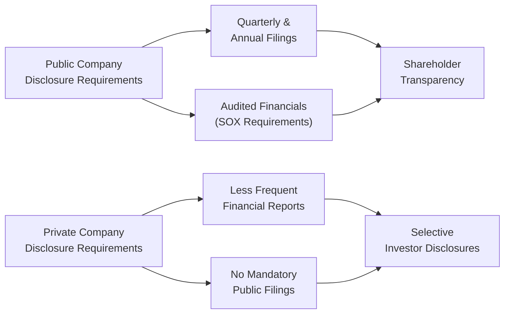

## Overview and Importance of Disclosure

So, let’s say you’re pondering whether your company should go public or remain private. One of the first things that probably comes to mind—besides all the fancy talk about IPO roadshows—is, “Wait, don’t public companies have way more paperwork?” That "paperwork" is what we call disclosure requirements. And yes—publicly traded firms are bound by a bunch of rules and regulations designed to ensure investors have timely, accurate information. Private companies, on the other hand, enjoy a significantly lighter regulatory load, but that also means there’s usually less transparency for outside investors.

This topic—public vs. private disclosure norms—goes right to the heart of corporate finance strategy. It influences not only how you report financials but also how you raise capital, manage investor relations, and position your firm in global markets. The short story is: better disclosure can enhance credibility and potentially lower your cost of capital, but it can also be expensive and time-consuming to maintain.

## Key Regulatory Differences: Public vs. Private Companies

When we talk about disclosure requirements, we often start by contrasting public and private firms. Public companies list their shares on a recognized stock exchange (e.g., NYSE, NASDAQ, LSE) and typically must register with a securities regulator. In the United States, that’s the Securities and Exchange Commission (SEC). Other regions have parallel authorities. For instance, Canada has the Ontario Securities Commission (OSC), while in the European Union, local country regulators oversee compliance with EU directives.

Private companies, by definition, are not listed on public exchanges. They face far fewer legal mandates for public disclosure. They typically share data only with select stakeholders, such as private equity investors, lenders, or major shareholders who demand financial information before committing funds. While this arrangement preserves confidentiality, it can sometimes make fundraising more challenging compared to a public entity whose disclosures are widely available.

## Minimum Disclosure Requirements for Public Entities

Public disclosure regimes revolve around standardized periodic filings. In many jurisdictions—especially in the U.S.—they include:

• Quarterly financial statements (e.g., 10-Q in the U.S.).  
• Annual audited financial statements (e.g., 10-K in the U.S.).  
• Management’s discussion and analysis (MD&A) or similar commentary, offering insight into the firm’s results, risks, and strategies.  
• Reporting of material events (e.g., 8-K in the U.S.), such as mergers, bankruptcy, changes in control, or major asset sales.  
• Detailed information on executive compensation and corporate governance structures.  

Those of you who have ever dug through a 10-K filing know it can be a dense read. But that’s the point—regulators want to ensure a level playing field, so no single investor trades on undisclosed (or “inside”) information that others can’t access.

### The Sarbanes–Oxley Act (SOX)

In the US, the Sarbanes–Oxley Act (SOX) drastically changed the landscape after corporate scandals like Enron. It introduced strict requirements on internal controls over financial reporting, CEO/CFO certifications of accuracy, and harsher penalties for fraud. These obligations can be quite burdensome for smaller public firms but help bolster investor confidence in reported numbers.

### IFRS, GAAP, and Global Standards

Outside the U.S., many markets require or encourage the use of International Financial Reporting Standards (IFRS). Some places still allow local GAAP, while others are in the midst of convergence with IFRS. Large multinational companies might have to prepare dual filings—one set under local GAAP for domestic reporting, and another under IFRS or U.S. GAAP if they’re cross-listed. This obviously adds complexity (and cost) to reporting efforts.

## Lighter Disclosure for Private Companies

Now, what happens when you’re private? Well, most countries’ laws or regulators do not require private corporations to publicly release audited financials or file extensive disclosures. Instead, private companies typically share confidential information only with major stakeholders or prospective investors (often subject to non-disclosure agreements). This dynamic allows management to keep strategic data (like pricing models or R&D projects) hush-hush. Think of a small tech startup that’s quietly pivoting until its product is ready for prime time.

Although it’s nice not to produce mountains of publicly available data, private firms may find it tougher to demonstrate transparency to potential lenders or investors. Thorough due diligence must be performed to verify a private firm’s business model, financials, governance, and risk profile, all without the road map of publicly filed documents. Private equity investors, venture capitalists, or institutional lenders usually step in with deeper investigative processes and confidentiality agreements so they can get a proper look under the hood.

## Strategic Considerations: Going Public vs. Staying Private

At a high level, deciding whether to go public often weighs the benefits of broader capital market access against the burdens of increased disclosure and regulatory scrutiny.

Some strategic points:

• Access to Capital: Public markets can bring in more capital at potentially higher valuations. However, companies may face shareholder activism and short-term performance pressures.  
• Liquidity for Shareholders: An IPO can offer liquidity to founders and early investors. Private firms don’t necessarily have that level of liquidity—transferring shares is more complicated.  
• Regulatory Costs: SOX compliance, IFRS/GAAP dual reporting, and frequent filings can strain smaller or newer companies. In a private setting, compliance costs are reduced, but investor appetite may be limited if disclosures seem too opaque.  
• Market Reputation and Analyst Coverage: Public status can improve brand recognition and encourage sell-side analyst coverage, but it also subjects the company to greater media and market scrutiny.  

In some cases, companies that go public eventually decide to delist via management buyouts or private equity takeovers, especially if they conclude that the regulatory load and short-term market pressures exceed the benefits of public ownership. Conversely, many successful private companies eventually see the IPO route as the logical next step to secure large-scale financing and portfolio diversification for early shareholders.

## What Gets Disclosed?

Regardless of whether a company is public or private—but more rigorously when it’s public—certain categories of information are traditionally disclosed:

• Financial Statements: Balance sheet, income statement, and statement of cash flows, typically audited in public companies.  
• Management Discussions (MD&A): Typically for public entities to explain and interpret the numbers.  
• Risk Factors: Potential operational, financial, or market risks that might affect the company’s performance.  
• Executive Compensation Details: Corporate governance standards increasingly require transparency around how top executives are paid.  
• Shareholder Information: Material changes in share ownership, including takeovers, major insider sales, or acquisitions.  

Private companies can selectively share elements of these reports with lenders or prospective investors, but rarely to the extent mandated for public companies.

## How Private Equity Investors Handle Limited Disclosures

Private equity (PE) investors, in particular, are well-versed in navigating scant disclosure. They usually conduct more hands-on due diligence, employing teams of forensic accountants, consultants, or sector experts. In practice:

• PE investors request or require access to internal financial records, sales pipelines, or even employee interviews.  
• Confidentiality agreements become vital to ensure sensitive data doesn’t leak outside the negotiating parties.  
• PE deals are often structured around non-publicly available information, which can lead to deeper negotiations on valuation compared to bidding on a publicly listed stock where the price is quoted daily.

## Improved Disclosure and Its Effects on Cost of Capital

It might seem counterintuitive to spend more time and money on disclosure if you don’t absolutely have to. But sometimes, improved transparency can yield tangible benefits, particularly in the realm of credit ratings and capital costs. Major rating agencies like Standard & Poor’s or Moody’s typically rate firms with robust and verifiable data more favorably. A stronger rating can help reduce interest costs and broaden the pool of willing investors.

Moreover, open disclosure counters what economists call “information asymmetry.” When external investors feel uncertain about a firm’s stability or prospects, they often charge a higher risk premium (i.e., they demand higher returns to compensate for unknowns). Transparent reporting helps lower that risk premium by assuring stakeholders you’ve nothing huge to hide. On the other hand, public disclosure can also lead to potential legal exposures, especially around forward-looking statements or risk factor omissions.

## Multinational Reporting and Dual Requirements

If your company operates globally or cross-lists on multiple stock exchanges (e.g., both the NYSE and the Tokyo Stock Exchange), you might face dual reporting duties. For instance, you could file under U.S. GAAP in the States while also submitting IFRS-based statements in Europe. Sure, you might merge those two sets of standards if your home regulator allows it, but many times differences remain. This can get complicated, leading to potential confusion among investors—or at least a big headache for your accounting team. As a result, multinational firms must carefully align their financial reporting to avoid inconsistencies and to maintain investor confidence worldwide.

The diagram above offers a simplified look at the contrast. Public firms file everything from audited annual data to quarterly management discussions, whereas private firms typically share less, often only with specific stakeholders or potential investors following confidentiality agreements.

## Reducing Information Asymmetry: Why Timing Matters

Timely disclosures—from quarterly earnings releases to on-the-spot announcements of major acquisitions—enable markets to price shares more accurately. Even in private capital markets, delivering relevant information to lenders or prospective investors on time can be essential for favorable financing. On the flip side, being slow or opaque with disclosures raises suspicion, leading to higher financing costs or missed opportunities for deals.

## Practical Exam Tips and Common Pitfalls

• Watch for Overlooked Regulations: In exam scenarios, you might get a vignette about a firm going public in multiple jurisdictions. Examine carefully which items must be disclosed under each region’s laws.  
• Be Mindful of SOX and IFRS: Sarbanes–Oxley compliance is a big deal for U.S.-listed firms, and IFRS is common outside the U.S. Evaluate how these frameworks impact the frequency and detail of disclosures.  
• Factor in the Cost of Compliance: Candidates often focus on the positives of going public but underestimate ongoing compliance costs. Look for hints in item sets about technology or staffing overhead.  
• Analyze Liquidity vs. Confidentiality Trade-Offs: If a question emphasizes the founder’s desire to keep R&D or strategic data private, that might hint at a preference to remain private rather than go public.  
• Tie Disclosure to Cost of Capital: Make sure you connect how increased transparency can lead to lower perceived risk and thus lower required returns from investors. If a vignette mentions improved credit ratings, that’s a potential exam clue.

It seems we can’t emphasize enough that for a Level II exam, you’ll likely see item sets that test your understanding of not just the rules themselves but also the strategic implications of those rules. They might give you a scenario about a firm deciding between a private placement and an IPO, then ask you about the ramifications for financial reporting, investor relations, or cost of capital. Stay alert to those details.

## Glossary

• Public Company: A company whose shares trade on a public stock exchange and must file periodic reports with regulators.  
• Private Company: A company not listed on a public exchange, commonly with fewer owners and less stringent disclosure mandates.  
• Due Diligence: An investigation or review of a target entity’s records and operations before an investment or merger.  
• SEC Filings: Official documents that public companies in the US submit to the Securities and Exchange Commission (e.g., 10-K, 10-Q).  
• IFRS (International Financial Reporting Standards): A set of global accounting standards to ensure consistent financial reporting across countries.  
• GAAP (Generally Accepted Accounting Principles): Accounting standards and procedures typically used within a specific jurisdiction (e.g., US GAAP).  
• Sarbanes–Oxley Act (SOX): US federal law imposing rigorous auditing and financial disclosure requirements on public companies.  
• Prospectus: Legal document providing details of an investment offering to the public, often used in initial public offerings (IPOs).

## Wrap-Up

Disclosure requirements shape the very core of how companies communicate with investors. Public firms operate under heavy mandates that can be both a blessing (cheaper and broader access to capital) and a curse (high compliance costs and endless regulatory red tape). Private firms enjoy more privacy and operational flexibility, but they often pay higher financing costs or must spend extra energy convincing would-be investors that they’re legit.

From a CFA Level II standpoint, keep an eye on the interplay between disclosure and valuation. Notice how limited disclosure can lead to deeper due diligence demands, whether you’re appraising synergy potential in mergers, analyzing a private equity target, or investigating a prospective high-yield bond issuance. Also, be ready to apply your knowledge in complex, multinational contexts—exam item sets might throw in cross-border listing issues or IFRS vs. US GAAP comparisons. Good luck, and remember: well-managed disclosures aren’t just about compliance—they can shape a firm’s strategic direction and market perception for years to come.

## References and Further Exploration

• CFA Institute Level II Curriculum © on Financial Reporting and Corporate Issuers.  
• The Sarbanes–Oxley Act of 2002: Full text at https://www.sec.gov/about/laws/soa2002.pdf  
• IFRS Foundation resources: https://www.ifrs.org  

---

## Test Your Knowledge: Public vs. Private Disclosure Quiz



### Which of the following documents must publicly listed U.S. firms typically file each quarter?

- [ ] An 8-K report
- [ ] An annual 10-K
- [x] A 10-Q report
- [ ] A prospectus

> **Explanation:** In the U.S., publicly listed firms file 10-Q reports every quarter, while the 10-K is filed annually. An 8-K is used to disclose significant or “material” events. A prospectus is primarily used for new offerings like an IPO.

### A primary advantage of remaining private rather than going public is:

- [ ] Greater liquidity for shareholders
- [ ] Access to broader capital markets
- [ ] Potentially stronger credit ratings
- [x] Reduced public disclosure obligations

> **Explanation:** Staying private typically means fewer regulatory filings and less public scrutiny, which can be beneficial in maintaining confidentiality. Public companies, by contrast, gain easier access to capital but must deal with more frequent and detailed disclosures.

### Under Sarbanes–Oxley regulations, which executive officers must certify the authenticity of a public U.S. company’s financial reports?

- [x] The CEO and CFO
- [ ] The COO and CTO
- [ ] The CFO and General Counsel
- [ ] The Chief Risk Officer and Corporate Secretary

> **Explanation:** Sarbanes–Oxley requires the Chief Executive Officer (CEO) and Chief Financial Officer (CFO) to personally certify financial statements to ensure top-level accountability.

### Compared to public firms, private companies:

- [ ] Must issue detailed quarterly statements to the general public
- [x] Have fewer legal requirements to disclose financial and operational data
- [ ] Typically provide 10-K and 10-Q filings to investors
- [ ] Submit audited financials to the SEC annually

> **Explanation:** Private firms generally don’t have to file quarterly and annual reports publicly. They share financial details with select parties (e.g., lenders, private investors), often under confidentiality.

### A firm aiming to lower its borrowing costs through enhanced transparency might:

- [ ] Eliminate most disclosures to reduce compliance risk
- [ ] Focus only on short-term performance metrics in annual filings
- [ ] Confidentially share its financial statements with a narrow group of investors
- [x] Adopt comprehensive, timely reporting practices to reduce perceived risk

> **Explanation:** Providing more transparent and timely disclosures can help reduce information asymmetry, potentially improving credit ratings and lowering borrowing costs.

### In countries using IFRS, public firms generally must:

- [ ] Report exclusively under local GAAP
- [x] Follow standardized global rules for financial statements
- [ ] Disclose no information about management compensation
- [ ] Use the Sarbanes–Oxley Act for daily operations

> **Explanation:** IFRS is a globally recognized set of accounting standards that public firms in many jurisdictions adopt. Sarbanes–Oxley is a U.S.-specific legislation, and local GAAP still applies in some regions, but IFRS is common internationally.

### When private equity invests in a private company with minimal disclosures, it often:

- [ ] Relies solely on publicly filed documents for due diligence
- [ ] Oversees the filing of 10-Q documents for quarterly updates
- [x] Negotiates extensive data-sharing protected by confidentiality agreements
- [ ] Publishes financial results for competitive positioning

> **Explanation:** Because private companies are not required to publicly disclose many details, PE investors typically rely on in-depth, confidential, and negotiated disclosures to conduct thorough due diligence.

### A key motivating factor for an otherwise private company to “go public” might be:

- [x] Access to larger pools of capital
- [ ] Minimizing the scrutiny by regulators
- [ ] Reducing the cost of mandated reporting
- [ ] Avoiding all compliance with financial standards

> **Explanation:** Gaining broader access to public capital markets is a major reason companies pursue an IPO, despite the more stringent and frequent disclosures required thereafter.

### If a multinational firm is cross-listed in two different countries:

- [ ] It typically only files statements in the country where it was first incorporated
- [x] It may need to comply with both countries’ disclosure and accounting standards
- [ ] It can ignore IFRS entirely
- [ ] It faces no additional regulatory burden

> **Explanation:** Cross-listed multinational companies usually must adhere to each jurisdiction’s rules, sometimes leading to dual reporting regimes or reconciliations between IFRS and local GAAP.

### Appropriate disclosures can help reduce which fundamental problem in capital markets?

- [x] Information asymmetry
- [ ] Unlimited liability
- [ ] Zero-sum negotiations
- [ ] All forms of credit risk

> **Explanation:** Timely and transparent disclosures mitigate information asymmetry, fostering trust among investors by ensuring that relevant financial and strategic data is accessible.


