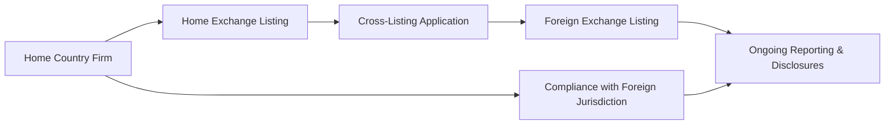

## Understanding Cross-Listing

Cross-listing—listing a firm’s securities on multiple exchanges in different countries—often feels like a big leap for corporate issuers. You can imagine the tension: a CFO might be perfectly comfortable with the local capital market, but then wonders if, by venturing abroad, they’ll create a larger headache with new compliance requirements. That hesitation is real. Yet, cross-listing can unlock a host of benefits: from expanding the investor pool and boosting liquidity to improving the firm’s global reputation. 

This discussion explores key reasons firms consider cross-listing, the regulatory roadblocks they might encounter, and strategic implications for corporate finances—especially cost of equity. We’ll also examine how cross-listing shapes corporate governance, because once you list abroad, your firm effectively volunteers for greater international scrutiny.

## The Concept and Motivations

Cross-listing means a company’s stock trades on more than one exchange—say, a U.S. food processing giant listing on the NYSE (its home market) and simultaneously on the London Stock Exchange. For some, it might feel like, “Why deal with multiple sets of regulations?” But let’s break down a few motivations.

### Broadened Investor Base

Probably the biggest draw is an expanded investor base. By listing in multiple jurisdictions, a South Korean tech firm, for instance, can attract investors in Europe or the U.S. who might have home-country biases. And because investors in those markets prefer domestic listings or depositary receipts, cross-listing bridges that gap by making the firm’s shares more accessible. Once you have a broader audience, you can generally expect better trading volumes, improved liquidity, and potentially a higher valuation.

### Enhanced Liquidity and Visibility

Cross-listing typically boosts daily trading volume. An investor in London, for example, might be more willing to invest in a Brazilian energy company if that stock is readily tradeable in London’s market hours and reported in local currency. This creates a liquidity premium—investors value a security more if they can buy or sell easily. On top of that, you’ll often see cross-listed firms gaining increased visibility in financial media, which may further lift valuations.

### Potential Reduction in Cost of Capital

Cross-listing sometimes reduces a firm’s cost of equity. The logic is that by listing in a reputable market with rigorous disclosure standards—think NYSE or LSE—a firm signals stronger governance and transparency. Investors respond by treating the stock as less risky, thereby lowering the risk premium they demand. That can translate into cheaper equity financing. It’s not automatic, of course; a cross-listing can backfire if the firm fails to comply with heightened regulatory standards.

## Additional Regulatory and Compliance Burdens

All this sounds great—until you’re up proofreading the fifth draft of your foreign market disclosure. Let’s face it: cross-listing means adopting (and continuously complying with) multiple regulatory regimes. A U.S.-listed firm that cross-lists in Hong Kong, for instance, must follow both SEC rules and HKEX guidelines. This can require additional auditing, reconciling financial statements with IFRS or local GAAP, and enhancing corporate governance structures. Is it burdensome? Yep. But many firms see it as an opportunity to signal their quality through tougher oversight.

### Meeting Different Accounting Standards

Some global exchanges require IFRS (International Financial Reporting Standards), while the U.S. demands compliance with U.S. GAAP (unless you obtain certain exemptions). Reconciling statements can be time-consuming, but it improves uniformity and comparability, helping investors trust your numbers. At the same time, multiple filings can introduce extra costs, so it’s crucial to coordinate with legal and finance teams to ensure you meet all deadlines and disclosure requirements.

### Corporate Governance Upgrades

Cross-listing might also require changes to board structure, composition of audit committees, or new policies on shareholder rights. For example, an emerging-market company listing in the U.S. may need to align with Sarbanes-Oxley requirements. Even if the home market’s governance rules are laxer, cross-listing effectively “bonds” the company to higher standards (often referred to as the bonding hypothesis). As a result, some firms intentionally list in stricter markets to enhance investor confidence and brand image.

## Impact on Cost of Equity

Does cross-listing really lower a company’s cost of equity? In many cases, yes. Financial theory tells us the cost of equity includes a premium for information asymmetry and perceived risks. By listing on a major foreign exchange, you reduce asymmetry—investors gain more timely information from your new disclosures. Meanwhile, you can tap into capital from local investors who might consider you less risky if you’re regulated by their familiar watchdog. So it’s a sort of synergy: more transparency, less perceived risk, and thus reduced required returns.

In practice, the savings aren’t always massive. But imagine your cost of equity drops by 50 basis points. Over billions in market capitalization, that difference can be huge. Many CFOs weigh these incremental conversion costs carefully, especially for large multinational firms.

## Listing Requirements Across Major Exchanges

Each major global exchange has unique listing standards. Below is a simplified illustration of some typical requirements to give you the flavor of what might be involved.

| Exchange           | Min. Market Cap (Approx.)     | Accounting Standards  | Corporate Governance Requirements                    |
|--------------------|-------------------------------|-----------------------|------------------------------------------------------|
| NYSE               | USD 100 million or more       | US GAAP or IFRS       | Independent board majority, audit committee, etc.   |
| NASDAQ             | USD 70 million or more        | US GAAP or IFRS       | Governance rules, stricter for larger companies     |
| London Stock Exch. | GBP 700,000 or more (Main Mkt)| IFRS / UK GAAP        | Comply/Explain UK Corporate Governance Code         |
| HKEX               | HKD 500 million or more       | HKFRS or IFRS         | Certain shareholding spreads, local CG code         |

The actual thresholds and rules may shift over time, and some markets have multiple tiers (Premier listings vs. Second-tier). Keep in mind, each exchange has a laundry list of specifics—like minimum share price, minimum shareholder distribution, and so forth.

## Post-Listing Reporting Obligations

After you list, the fun continues. Firms must file periodic financials, disclose material events, and comply with corporate governance codes in each listing venue. Some markets also require you to issue announcements in local languages. For instance, a Canadian firm listing in France might need to publish official press releases in French. Also, you have to watch out for:

• Insider trading rules that differ across markets.  
• Possible duplicative or conflicting deadlines.  
• Additional disclosures such as annual corporate governance statements, even if not typically mandated in your home country.

Let’s be honest; international requirements can be a headache to coordinate, but strong planning and robust internal controls go a long way.

## Foreign Exchange Controls and Dividend Restrictions

Some countries impose foreign exchange controls, limiting how much money can flow in or out. If a Chinese firm cross-lists in the U.S., it might face constraints on repatriating earnings. This can complicate dividend payouts: you might generate profits internationally but be restricted when transferring them back to the parent company. Such controls can also expose you to currency fluctuation risks or regulatory arbitrage—perhaps you park funds in a jurisdiction with favorable restrictions. It’s a delicate dance: thorough understanding of local regulations is crucial to avoid nasty surprises.

## ADRs, GDRs, and Cross-Border Share Ownership

One way companies navigate cross-border regulations is by issuing depositary receipts—like ADRs (American Depositary Receipts) in the U.S. or GDRs (Global Depositary Receipts) for broader global markets. An ADR is essentially a certificate issued by a U.S. depositary bank, representing shares in a non-U.S. company. Investors in the States can buy ADRs in dollars, receive dividends in dollars, and trade them on U.S. exchanges. Meanwhile, the underlying shares rest in a depositary bank in the company’s home market.

GDRs work similarly but can be offered in multiple markets around the globe—for instance, a bank in Europe might issue GDRs representing a Latin American firm. So if your firm is uncertain about a full-blown listing, depositary receipts can serve as a stepping stone, though you’ll still face disclosure and compliance demands from the depositary bank and relevant market regulators.

## Risk, Legal Exposure, and Multijurisdictional Actions

Cross-listing also exposes you to more potential legal actions. When you’re on a major exchange, you can be sued under that jurisdiction’s legal system—like under SEC regulations in the U.S. if you cross-list there. It’s a double-edged sword: on the one hand, the willingness to subject yourself to strict rules can improve investor confidence; on the other hand, if something goes wrong, you may find yourself dealing with lawsuits in two or more jurisdictions.

Firms operating in politically uncertain home markets often use cross-listing as a hedge. By tapping more stable markets, you might mitigate your own country’s economic or regulatory upheavals. But be prepared for the complexity of dealing with multiple legal frameworks.

## Mermaid Diagram: Cross-Listing Flow

Below is a simplified depiction of how a company in one country might establish cross-listing on a second market. The node texts are in quotes, inside square brackets, for rendering compatibility:

In short, your firm starts at the home market, applies for cross-listing, and meets the foreign exchange’s disclosures or governance rules. Going forward, you maintain ongoing reporting in both places.

## Real-World Illustrative Example

A few years back, a U.S.-based technology firm—let’s call it BearByte Inc.—saw most of its revenue growth coming from Europe. BearByte decided to list on the London Stock Exchange in addition to its NASDAQ home. After cross-listing, BearByte had to:

• Reconcile its statements—which were under U.S. GAAP—to IFRS for European investors.  
• Issue official press releases in both English (UK compliance) and keep them consistent with its U.S. SEC filings.  
• Adapt certain governance policies (like having two more independent directors to meet UK standards).  

Within a year, BearByte Inc. reported a 20% jump in trading volume combined across NASDAQ and LSE, plus an increased following by European tech analysts. Although they invested heavily in compliance staff and consultants, management observed a slight decrease in the firm’s overall cost of capital. In the CFO’s words, “It was a headache, but in the end, we believe we gained bigger global credibility.”

## Glossary

• **Cross-Listing:** A strategy enabling a company’s securities to be listed on more than one exchange in different countries.  
• **ADR (American Depositary Receipt):** A negotiable certificate issued by a U.S. depositary bank representing shares in a non-U.S. company, traded on U.S. exchanges in U.S. dollars.  
• **GDR (Global Depositary Receipt):** Similar to an ADR but can be offered in multiple markets, not just the U.S.  
• **Listing Requirements:** Standards set by an exchange defining minimum net assets, minimum number of shareholders, free float, etc.  
• **Home-Country Bias:** Tendency of investors to favor domestic equities. Cross-listing can help foreign firms attract these investors by listing locally.  
• **Regulatory Arbitrage:** Exploiting variations in regulations between countries by listing or operating where conditions are most favorable.  
• **Liquidity Premium:** The additional value investors give to securities that are easily tradeable without large price fluctuations.  
• **Foreign Exchange Controls:** Laws that limit currency transfers across borders, potentially affecting dividend payments and repatriation of earnings.

## Best Practices and Exam Applications

From a CFA Level II perspective, the complexities of cross-listing typically show up in item sets that test whether you can evaluate the cost-benefit trade-offs of listing in multiple jurisdictions. Look for questions around incremental compliance costs, liquidity effects, or how cross-listing might reduce the firm’s cost of equity. 

• Read the prompt carefully—especially for hints that highlight a firm’s governance changes or differences in accounting standards.  
• Watch for details on foreign exchange controls and how that might hinder a company’s dividend policy.  
• Don’t forget the role of depositary receipts, as it’s a common exam angle: how do ADRs or GDRs mitigate or complicate cross-border listing issues?

Also, remember that cross-listing is rarely a one-size-fits-all solution. On the exam, you may have to spot situations where cross-listing is advantageous (like broadening the investor base in a deep, well-capitalized market) or detrimental (the firm’s small, meaning compliance costs might outweigh any liquidity premium).

## References & Further Reading

- CFA Institute Level II Curriculum © – International Corporate Finance.  
- Karolyi, G.A. (2012). “Corporate Governance, Agency Problems and International Cross-Listing: A Defense of the Bonding Hypothesis.” Emerging Markets Review.  
- NYSE Listing Standards Manual: [https://www.nyse.com/publicdocs/nyse/listing/NYSEListedCompanyManual.pdf](https://www.nyse.com/publicdocs/nyse/listing/NYSEListedCompanyManual.pdf)
- LSE: Admission and Disclosure Standards: [https://www.londonstockexchange.com](https://www.londonstockexchange.com)

--------------------------------------------------------------------------------

## Test Your Knowledge: Cross-Listing and International Regulations Quiz



### When a company cross-lists, which of the following is the most direct benefit?  
- [ ] A guaranteed appreciation in its stock price.  
- [x] An expanded investor base and potentially higher liquidity.  
- [ ] Immediate reduction in taxation rates.  
- [ ] Elimination of home-market regulatory oversight.  

> **Explanation:** Cross-listing directly facilitates access to a broader set of investors, potentially boosting liquidity. Stock price appreciation, tax changes, or reduced home-market oversight are not guaranteed direct benefits.

### Which factor often contributes to a reduction in the cost of equity for cross-listed firms?  
- [x] Perceived improvement in corporate governance and transparency.  
- [ ] Mandatory reduction in management salaries.  
- [ ] Government subsidies to cross-listed companies.  
- [ ] Reduced volatility in foreign exchange rates.  

> **Explanation:** By agreeing to stricter disclosure standards and oversight, cross-listed firms can appear less risky to investors, leading to a lower required return (cost of equity).

### Which of the following best describes American Depositary Receipts (ADRs)?  
- [ ] They are shares issued by a U.S. company to trade abroad.  
- [ ] They represent debt securities of a non-U.S. firm.  
- [x] They are negotiable certificates representing shares in a non-U.S. company, traded on U.S. exchanges.  
- [ ] They are secondary stock offerings by U.S. corporations.  

> **Explanation:** ADRs are negotiable certificates issued by U.S. depositary banks, representing a foreign company’s shares, enabling them to be traded in U.S. dollars on U.S. exchanges.

### Which of the following is a typical requirement for a firm listing on multiple global exchanges?  
- [ ] Substituting IFRS with their home-country GAAP.  
- [ ] Eliminating home market financial reporting.  
- [x] Filing annual and periodic reports that meet both home and foreign market standards.  
- [ ] Paying listing fees only once, to their home exchange.  

> **Explanation:** Firms must satisfy the reporting and governance rules of each exchange they list on, which often results in dual regulatory filings.

### What is one key risk recognized for cross-listed companies?  
- [ ] Reduced brand recognition globally.  
- [x] Potential for lawsuits in multiple jurisdictions.  
- [ ] Automatic deregulation from home market authorities.  
- [ ] The inability to raise additional equity.  

> **Explanation:** Being subject to more than one regulatory regime claps open the possibility of legal actions in multiple jurisdictions if any compliance issue or corporate failure arises.

### A firm based in a country with strict foreign exchange controls cross-lists abroad. Which situation might occur?  
- [ ] Automatic removal of foreign exchange controls in their home country.  
- [x] Difficulty in repatriating earnings or paying dividends to home-country shareholders.  
- [ ] Exemption from local governance requirements.  
- [ ] Closure of the home exchange listing if foreign listing is maintained.  

> **Explanation:** Foreign exchange controls can hamper a company’s ability to move capital across borders, thus affecting dividends, cash management, or investment flows.

### Why might cross-listing be especially beneficial for smaller firms from emerging markets?  
- [x] It can enhance credibility and “bond” them to higher compliance standards.  
- [ ] It removes the need to have a board of directors.  
- [ ] It lowers their tax burden to zero.  
- [ ] It requires no additional auditing fees.  

> **Explanation:** Smaller or emerging-market firms often use cross-listing to reassure global investors of governance quality, thus potentially helping them access capital at better terms.

### Which of the following best describes the bonding hypothesis in a cross-listing context?  
- [ ] Firms bond with local suppliers to gain bulk discounts.  
- [ ] Firms choose only countries with lower tax rates.  
- [x] Firms voluntarily submit to stricter foreign regulations to gain investor confidence.  
- [ ] Firms avoid foreign regulations by issuing only local shares.  

> **Explanation:** The bonding hypothesis suggests that by listing in markets with stringent regulations, firms signal stronger governance and transparency, thus “bonding” themselves to higher standards.

### How might a cross-listing arrangement affect a firm’s corporate governance?  
- [ ] Reduce the firm’s board composition requirements.  
- [ ] Exempt the firm from all home-country controls.  
- [ ] Provide a grace period of five years for any governance changes.  
- [x] Mandate compliance with additional governance codes (e.g., new audit committee standards).  

> **Explanation:** Many exchanges require specific governance measures, like independent board committees, thus raising governance standards for cross-listed firms.

### A company that issues GDRs (Global Depositary Receipts) typically does so to:  
- [x] Access multiple foreign markets without a full direct listing in each.  
- [ ] Offer its employees discounted shares.  
- [ ] Bypass all local regulatory filings.  
- [ ] Convert its debt obligations into equity.  

> **Explanation:** GDRs offer a cost-effective way to tap wider investor bases without undertaking full direct listings. They still carry certain regulatory obligations but can be advantageous for multinational capital-raising.


