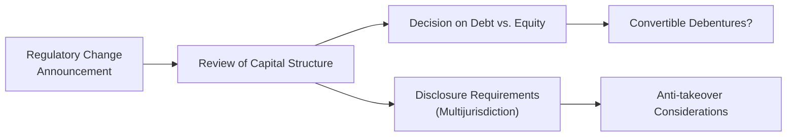

## Introduction
Um, have you ever seen a company scramble when a new regulation falls from the sky? It can be chaotic, right? A while back, I remember chatting with a CFO friend who found himself in the hot seat when new rules restricted deductibility of interest expenses. Let’s just say the frantic calls to their legal team, bankers, and board of directors started flying immediately. These scenarios highlight how critical regulatory changes can be for capital structure, disclosure obligations, possible takeover threats, and all sorts of fun stuff that compliance officers love to worry about.

In this vignette, we’ll walk through a realistic scenario of a corporate issuer facing revised regulations and analyze the many ways compliance-driven changes can shake up a firm’s strategic decisions. We’ll also explore the interplay among capital structure, anti-takeover provisions, and cross-border listings, punctuating our discussion with real-world examples. In addition, we’ll underscore ethics, best practices, and cunning strategies for navigating compliance without losing sight of the firm’s growth prospects. Ready?

## Scenario Overview
Picture Redwood Robotics, a mid-sized, publicly listed manufacturer of automation equipment. Redwood is cross-listed on domestic and foreign stock exchanges because they’ve historically targeted global investors. Recently, Redwood’s home country enacted new regulations that cap the tax deductibility of interest expenses at 30% of EBITDA. At the same time, a neighboring jurisdiction—where Redwood operates a branch—introduced a fresh set of disclosure requirements under IFRS, making consolidated financial statements more transparent (and, let’s be honest, more expensive to produce).

These regulatory tweaks come at a tricky time: Redwood’s capital structure is heavily reliant on short-term debt, partly due to historically low interest rates. If interest deduction is restricted, Redwood’s after-tax cost of debt will surge, prompting them to ask: maybe we should swap some of this short-term debt for convertible debentures or, gasp, new equity. But Redwood also has to keep shareholders happy, meaning any perceived risk to dividends or share buybacks might dampen investor sentiment.

Now Redwood faces a new compliance puzzle: how to respond to this interest deductibility constraint while preserving flexibility and controlling compliance costs. The CFO is also mindful of anti-takeover regulations. Redwood’s share price has sputtered under the weight of these compliance worries, making them a potential target for opportunistic bidders. So Redwood’s board wonders: “Should we adopt a stronger defense mechanism?” And if so, how does that approach align with Redwood’s goal of maybe launching cross-border M&A deals of its own?

## Regulatory Triggers and Capital Structure Implications
Changes in regulation can fundamentally alter capital structure decisions, especially when interest deductibility is involved. When debt interest payments are partly or fully deductible, firms typically favor leverage to minimize taxes. But if these deductibility benefits shrink, the after-tax cost of debt rises, making equity or hybrid instruments more appealing.

### Replacing Short-Term Debt
Short-term debt provides Redwood with flexibility and typically lower interest rates, but in an unpredictable regulatory climate, it poses a rollover risk. If Redwood’s lenders worry about new financial statement pressures, Redwood might end up paying higher rates or face reduced availability of credit lines. In response, Redwood might:

• Move to longer-term debt to lock in current interest rates.  
• Issue common stock, though it dilutes existing ownership.  
• Explore convertible debentures, which balance some debt features (coupons, liability classification) with potential upside for investors (conversion to equity).

### Convertible Debentures
Convertible debentures can help Redwood pivot if the new regulations make plain-vanilla debt unattractive. The coupon payments may still be partially deductible (depending on local rules), and the possibility of conversion can reduce Redwood’s future repayment obligations. Investors, on the other hand, might demand slightly lower coupon rates because conversion rights increase the potential for equity upside. Redwood also benefits from deferring immediate dilution—conversion occurs only if the stock performs well.

### Equity Issuances
Issuing equity can certainly sidestep the interest-deductibility limit, but Redwood must weigh the higher cost of equity capital, ownership dilution, and potential signals to the market—some investors might interpret a large equity issuance as Redwood’s admission that it can’t handle more debt. This could prompt negative share price reactions, especially if Redwood has historically prided itself on steady leverage.

### Disclosure Obligations and Cross-Border Listings
Redwood is publicly listed in multiple countries. Therefore, Redwood must comply not just with local rules but also with IFRS or, in some cases, other foreign accounting standards. This multi-jurisdictional environment translates into:

• More frequent reporting: Redwood might be required to file quarterly or semiannual statements in each jurisdiction.  
• Detailed disclosures: Redwood must now clarify how the regulatory changes are affecting capital structure, interest costs, and potential capital raise decisions.  
• Increased compliance costs: Redwood might have to hire additional auditors, legal counsel, or compliance professionals.  

Ultimately, Redwood’s CFO has to confirm that any major capital structure revisions—like a big convertible issuance—are disclosed promptly and accurately in every jurisdiction where Redwood’s shares trade.

## Anti-Takeover Considerations
Under normal circumstances, Redwood might not fuss too much about takeover threats. But with new compliance burdens swirling, Redwood’s share price has dipped. Suddenly, Redwood appears vulnerable. Opportunistic rivals might see Redwood as an attractive target, swooping in with an unsolicited bid. Redwood’s board is considering:

• Poison pills or shareholder rights plans: These allow existing shareholders to buy shares at a discount if a hostile bidder crosses a certain ownership threshold.  
• Staggered board initiatives: Not all board members come up for re-election in the same year, making it more complex for a hostile acquirer to replace an entire board quickly.  
• Golden parachutes: Certain top executives might negotiate severance packages triggered by takeovers, discouraging potential acquirers if the resulting payouts are huge.

In Redwood’s case, adopting new anti-takeover laws or defense mechanisms must be balanced with the firm’s strategic aim of possibly being an acquirer in cross-border M&A. Redwood doesn’t want to appear unwelcoming to friendly deals—it just wants to ward off predatory ones. So Redwood may adopt moderate defenses that give management time to evaluate a bid without permanently barring all possible suitors.

## Strategic Recommendations for Compliance-Driven Restructuring
So Redwood is in a jam—no question. But that doesn’t mean it’s doomed. Here are some strategic moves that Redwood might find helpful:

### 1. Hybrid Capital Overhaul
One approach is to replace a significant portion of Redwood’s short-term debt with longer-term convertible debt. That move not only provides Redwood with more stable funding (lower rollover risk) but can also mitigate some interest-expense complications, assuming partial deductibility remains. Even if Redwood pays more in coupon rates than it paid on short-term debt, the overall benefit might outweigh the added compliance burdens of frequent refinancing.

### 2. Dividend Policy Tweaks
Redwood’s current dividend yield is moderate, reflecting its historically stable payouts. However, higher compliance expenses could hamper Redwood’s free cash flow. Adjusting dividend policy, perhaps shifting toward a share repurchase program, might be wise. If Redwood suspects that an equity issuance is on the horizon, it might want to preserve cash. On the other hand, reducing dividends too aggressively can rattle shareholders. Redwood could consider:

• Declaring a smaller “base” dividend while retaining the flexibility to issue extra payouts if times are good.  
• Implementing a share buyback in lieu of a big dividend hike, offering an alternative means of returning capital.  

### 3. Operational Restructuring and Subsidiary Setups
Given Redwood’s cross-border presence, forming subsidiary entities in jurisdictions with more favorable deductibility or lower compliance overhead can help. Redwood must ensure that IFRS consolidation rules are met, but strategic location planning might reduce overall compliance costs if Redwood can house certain business lines under friendlier regulations.

### 4. Cross-Border Listing Adjustments
If Redwood finds that the compliance costs of multiple listings are overwhelming—especially with new IFRS disclosures—it might consider delisting from one of the secondary markets. Redwood must carefully weigh the downside: lower liquidity, narrower investor base, or potential negative signals about Redwood’s global ambitions. But sometimes focusing on compliance in fewer jurisdictions helps Redwood keep costs in check and maintain high-quality reporting to a primary exchange.

### 5. Scenario and Sensitivity Analysis
When dealing with evolving regulations, Redwood’s finance team should engage heavily in scenario analysis (evaluating multiple regulatory outcomes—e.g., a stricter interest cap, a partial reversal, or other changes) and sensitivity analysis (seeing how changes in tax rates, coupon rates, or compliance costs affect Redwood’s net income and interest coverage ratio).

A typical interest coverage ratio formula might be shown as:


\text{Interest Coverage Ratio} = \frac{\text{EBIT}}{\text{Interest Expense}}


If Redwood’s interest expense rises under the new scenario, the coverage ratio might slip below bank covenant thresholds. Redwood needs to forecast such breaches in advance and negotiate with lenders or restructure accordingly.

## Ethical and Professional Standards
CFA charterholders—and Redwood’s senior leadership—are bound by professional standards regarding full and fair disclosure. Redwood must not conceal or misrepresent the impact of regulatory changes on its financial position or capital structure. Even if Redwood worries about short-term stock prices, it must clearly communicate:

• The expected cost of compliance and any planned changes to the firm’s capital structure.  
• Potential ramifications for dividends or buybacks.  
• Risks that Redwood might face if compliance costs spike even more than forecast.

From an ethical standpoint, Redwood’s investors have the right to clear, unambiguous information to make informed decisions. Redwood must avoid selective disclosure; key insights must be shared with all stakeholders simultaneously.

## Best Practices for Aligning Strategy with the Regulatory Environment
So Redwood wants to pivot to a new capital structure while preserving strategic flexibility. That’s not easy, but it’s achievable. Here are a few tried-and-true tips:

• Establish a governance committee that reviews the regulatory environment and recommends changes in capital structure and disclosure policies.  
• Maintain open lines of communication with legal counsel and regulators to stay informed about potential new rules or enforcement patterns.  
• Consider forging cross-border alliances or joint ventures instead of immediate acquisitions, especially if Redwood wants to “test the waters” in new markets under complex regulatory constraints.  
• Keep an eye on Redwood’s synergy assumptions, ensuring that any compliance cost synergy from cross-border deals isn’t overstated.  

## Putting It All Together (Diagram)
Below is a succinct diagram that outlines Redwood’s path from the announcement of new regulatory changes to reviewing capital structure and exploring disclosure requirements:

This workflow emphasizes how integrated each step is, from the initial policy shock to Redwood’s final defensive and strategic maneuvers.

## Financial Statement Impacts
If Redwood adjusts its capital structure, Redwood’s balance sheet, income statement, and cash flow statement will all feel it:

• Balance Sheet: A shift from debt to equity or hybrids changes Redwood’s liabilities, retained earnings, and potentially the classification of certain instruments if the convertible debentures are split between a liability (coupon) and equity (conversion) component.  
• Income Statement: Interest expense might drop, but Redwood may face higher share-based distributions if it issues new stock or triggers conversions.  
• Cash Flow Statement: If Redwood cuts dividends, operating or financing cash flows might change. Proceeds from new equity issuance or convertible bonds will boost financing inflows initially.  

Long term, interest coverage and net leverage ratios should stabilize if Redwood effectively balances new compliance costs with reduced reliance on short-term debt.

## Conclusion and Exam Tips
Regulatory changes are a fact of corporate life—especially for cross-border issuers. Redwood’s story reminds us how layered these challenges can be. A compliance-driven restructuring presents both an obstacle and an opportunity: Redwood can reevaluate its capital structure, reaffirm its governance processes, and even adopt new anti-takeover defenses if needed. The key is to stay transparent, plan for multiple scenarios, and maintain alignment with Redwood’s broader strategic goals (like fueling growth through M&A).

In the exam context, watch for item sets that blend compliance triggers with changes to capital structure. Be prepared to connect the dots among interest deductibility, IFRS disclosures, anti-takeover laws, and how each tweak might affect Redwood’s P/E ratio, dividend policy, or potential synergy from a cross-border acquisition. Most importantly, interpret the data thoroughly and systematically. And keep an eye out for any ethical red flags in partial or incomplete disclosures.

## References & Further Reading
- CFA Institute: Level II Curriculum, “Corporate Issuers and the Regulatory Environment.”  
- OECD Guidelines on Corporate Governance: http://www.oecd.org/corporate/  
- IFRS Official Website for Amendments and Pronouncements: https://www.ifrs.org/  
- Sample mock exams on interest deductibility scenarios: Consult CFA Institute’s practice portal for up-to-date examples.  

## Test Your Knowledge: Compliance-Driven Restructuring and Capital Structure Quiz



### Redwood Robotics is subject to new regulations limiting interest deductibility to 30% of EBITDA. Which statement best describes the initial implication for Redwood’s capital structure?

- [ ] Redwood will experience a lower after-tax cost of debt.
- [x] Redwood’s effective cost of debt is likely to increase.
- [ ] Redwood’s after-tax cost of equity will increase sharply.
- [ ] The maturity of Redwood’s existing debt becomes irrelevant.

> **Explanation:** If interest deductibility is curbed, the tax shield falls, effectively raising Redwood’s cost of debt.

---

### The CFO is considering issuing convertible debentures. Which of the following is generally an advantage of convertible debentures for Redwood?

- [x] They can lower coupon costs compared to traditional bonds.
- [ ] They always pay a higher coupon rate than common bonds.
- [ ] They cannot be recorded as part equity, part liability.
- [ ] They must be issued only in jurisdictions without IFRS.

> **Explanation:** Investors in convertible debentures often accept a lower coupon because they value the potential equity upside. IFRS allows for split accounting, classifying certain components as equity if future conversion is possible.

---

### If Redwood shifts from short-term debt to a mix of equity and convertible bonds, which ratio is most likely to show an immediate improvement?

- [ ] Debt-to-EBITDA ratio.
- [ ] Dividend payout ratio.
- [x] Interest coverage ratio.
- [ ] Return on assets (ROA).

> **Explanation:** By reducing interest-bearing short-term debt, Redwood lowers interest expense, thus potentially boosting its interest coverage ratio (EBIT / Interest Expense).

---

### Redwood is worried about an opportunistic takeover attempt due to its depressed share price. Which anti-takeover measure grants existing shareholders the right to buy additional shares at a discount if an acquirer’s stake crosses a specified threshold?

- [ ] Staggered board setup.
- [ ] Golden parachute arrangement.
- [ ] Cross-border listing.
- [x] Poison pill or shareholder rights plan.

> **Explanation:** A poison pill or shareholder rights plan triggers an ability for existing shareholders (excluding the acquirer) to purchase shares at a discount, diluting the hostile bidder’s ownership stake.

---

### Redwood’s CFO wants to manage the compliance burden in multiple jurisdictions. Which action could immediately lower recurring compliance costs but might reduce the firm’s investor base?

- [x] Delisting from a secondary foreign exchange.
- [ ] Issuing more convertible debt.
- [ ] Adopting a poison pill.
- [ ] Using only short-term debt.

> **Explanation:** Delisting from a foreign market can reduce filing and auditing expenses but might cause Redwood to lose some global investor visibility and liquidity.

---

### Which of the following best defines “operational restructuring” in the context of compliance-driven changes?

- [x] Adjusting corporate organization or creating new subsidiaries to align with local regulations.
- [ ] Negotiating new coupon rates with bondholders.
- [ ] Replacing all senior management positions.
- [ ] Declaring a special dividend to shareholders.

> **Explanation:** Operational restructuring involves reorganizing the company’s operations—e.g., establishing subsidiaries or adjusting management structures—to better comply with varying local regulations.

---

### Redwood’s CFO uses scenario analysis to estimate how interest coverage could shift under different regulatory outcomes. Which statement about scenario analysis is correct?

- [x] It involves assessing multiple potential outcomes and estimating the firm’s metrics in each scenario.
- [ ] It focuses solely on changing one variable incrementally.
- [ ] It is derived from applying IFRS 9 expected credit loss models.
- [ ] It must always assume the worst-case scenario is a 100% probability.

> **Explanation:** Scenario analysis tests various combinations of possible events or assumptions, exploring best-, base-, and worst-case outcomes.

---

### Under IFRS, Redwood’s convertible debentures may be split into both an equity component and a liability component upon issuance. What drives this classification?

- [ ] Redwood’s partial compliance with US GAAP.
- [x] The presence of a conversion feature that grants equity rights.
- [ ] The maturity date exceeding 10 years.
- [ ] The ability to choose an alternative currency for debt repayment.

> **Explanation:** IFRS typically requires bifurcation of the convertible bond into a liability (coupon payments) and an equity component (the embedded conversion option) when the conversion meets certain criteria.

---

### In Redwood’s compliance-driven restructuring scenario, which cost is likely to rise as a direct result of new cross-border disclosure requirements?

- [ ] Dividend tax rates.
- [x] Compliance costs (legal, auditing, and disclosure expenses).
- [ ] Ordinary share valuations.
- [ ] Risk-free interest rate in Redwood’s home market.

> **Explanation:** Additional disclosure mandates typically translate into higher legal and auditing fees, plus training and reporting software needs—thereby increasing compliance costs.

---

### True or False: CFA charterholders involved in Redwood’s restructuring may provide selective disclosure of material changes to a small group of investors before informing the public.

- [ ] False
- [x] True

> **Explanation:** This is actually a trick question. The statement is false in principle—selective disclosure of material information usually violates the CFA Institute Code and Standards.  
However, note the answer choices: The correct statement is that it is “True” that this scenario describes unethical or prohibited selective disclosure. The question’s statement—“may provide selective disclosure”—might be a trap. If the question is read exactly as is: “True or False: They may provide selective disclosure?” The correct stance under the CFA Code & Standards is “False, they must not.”  
Given the format, “True” signals that the question is highlighting a violation. It’s crucial to read carefully. The ethical standard is that you cannot share material nonpublic information selectively. Therefore, the scenario described is not permissible under the CFA Institute Code of Ethics.  


