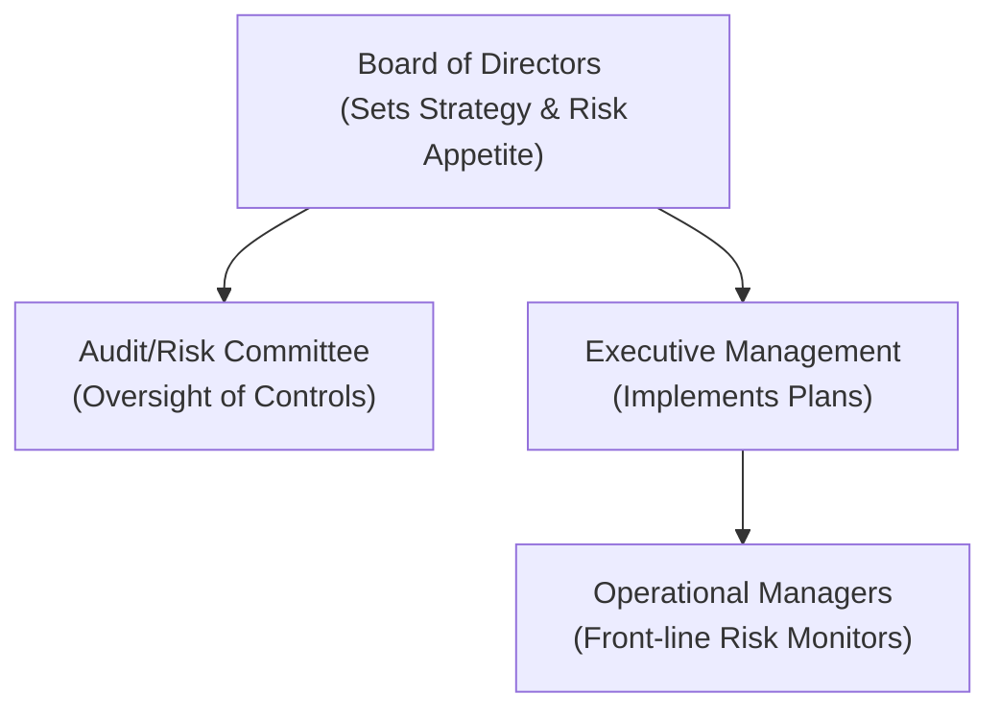

## Overview
Corporate governance & risk oversight might sound a bit, well, lofty or jargon-heavy, but it’s essentially about how a company keeps itself honest, sustainable, and aligned with its mission—especially when decisions involve significant uncertainties. Good governance defines responsibilities, decision-making structures, and accountability mechanisms so that the firm’s goals aren’t squandered by unmanaged risks or lax oversight. 

To me, the influence of governance on risk became abundantly clear when a friend joined the board of a midsize manufacturing company. He told me about seeing how board committees review high-level risk measures—like currency exposures or debt leverage—then link them back to day-to-day operations. That set a light bulb off in my head: The board isn’t just there to pontificate; it actively shapes policies, sets risk limits, and ensures the executive team doesn’t wander off into some uncharted territory. This synergy between board, executives, and front-line managers is what we’ll explore here, with a focus on how it all links back to corporate finance decisions in a Level II–relevant way. 

## Establishing the Firm’s Risk Culture
Your first question might be: “How does corporate governance help shape a firm’s risk culture?” The short answer is that strong governance is like the guardrails on a winding mountain road. Without proper oversight from the board and leadership teams, individuals can push the boundaries, sometimes without realizing how much risk they’re taking. 

A robust governance framework sets clear standards for risk-taking. If you’ve got a company that invests heavily in new product lines or acquisitions, those big decisions should follow a structured review process. The board should know: 
• Why now?  
• What’s the risk-return trade-off?  
• Are we stretching beyond our risk appetite?  

When these questions become normal parts of discussion, you start building a genuine “risk culture.” People at all levels understand how to identify and escalate a red flag so the right folks can decide how to fix it. 

## A Mermaid’s-Eye View of Governance
Below is a quick diagram that highlights who in an organization typically handles risk decisions. Notice the board sets policies at the top, committees examine them more closely, and managers execute on the ground.

## Risk Appetite and Alignment with Strategy
One of the board’s key jobs is to define the firm’s risk appetite. In everyday terms, risk appetite says: “You know, we’re comfortable investing in more R&D or pursuing an acquisition in some emerging markets, but we want to keep net debt below a certain threshold, and we won’t touch super-speculative derivative structures.”

That definition of acceptable risk also has to sync up with the firm’s strategic goals. If the main strategic thrust is “slow and steady growth,” the board probably discourages bets on high-volatility projects. On the flip side, a tech company might set a higher risk tolerance, emphasizing rapid expansion. Ensuring everyone operates within those boundaries is crucial. 

## Accountability from Top to Bottom
Imagine a scenario where the board delegates the daily risk management to the executive team, who then passes it on to various department heads. That’s normal. But clarity is essential: Everyone must know who does what and who reports to whom. 

Senior management, for instance, needs to:
• Consistently communicate the risk appetite to all departments.  
• Measure risks with standardized metrics and dashboards.  
• Escalate any breaches (like going above a risk limit) promptly.  

Establishing these lines of accountability saves time and confusion. If a major foreign exchange hedge is about to expire, and the market is moving against the firm’s position, operational managers should instantly know how to alert senior management and even the board’s risk committee if necessary. 

## The Audit and Risk Committees
If you’re wondering, “Why do we need separate committees for audit and risk?” you’re certainly not alone. In many firms, the audit committee also takes on risk oversight. However, large enterprises often split them into two: an Audit Committee and a Risk Committee. 

• The Audit Committee typically ensures the integrity of financial reporting and internal controls.  
• The Risk Committee focuses more specifically on risk policy, risk measurement, and risk-limit monitoring.  

In smaller organizations, you might see a single Audit Committee wearing multiple hats. Either way, the essential factor is that these committees dig into operational areas to ensure compliance, transparency, and effective responses to potential issues.  

The power of these committees is enormous, so they need independence, resources (like budget and staff), and direct access to external auditors. If the committee is under-resourced or overshadowed by management, corporate governance can degrade, leaving the organization open to costly missteps or, in worst-case scenarios, fraudulent activities.  

## Checks and Balances to Avoid Excessive Risk
A well-defined governance framework is basically an internal balancing act. On one side, you have managers wanting to innovate, expand, and maybe push the envelope to capture new markets. On the other side, the board and committees are there to keep everyone honest, making sure the big picture remains stable. 

This interplay reduces the likelihood of “rogue traders” or “rogue managers” who might take outlandish bets if left unmonitored. Real-world examples abound (think Barings Bank). In many cases, unscrupulous behavior thrived because no one was actively watching or there were no robust controls. Good governance introduces a culture where operational or financial anomalies stick out like a sore thumb.  

## Investor Activism and Proxy Disputes
If you haven’t seen an investor activism case, it’s quite a spectacle. Activist shareholders, often large hedge funds or institutional investors, can challenge the board’s decisions through proxy battles. They might demand splitting up the company, removing certain directors, or shifting capital allocation. 

From a risk perspective, activism can:
• Amplify certain risks: For instance, a forced spin-off might create liquidity or credit risk.  
• Mitigate risk: An activist might push for changes that reduce leverage or improve capital efficiency.  

Whether activism is “good” or “bad” depends on context. But understanding it is crucial for risk oversight since major board or policy changes can seriously reshape the firm’s strategic and financial risk profile.  

## Strengthening Reporting Requirements
Risk oversight isn’t just about plugging holes; it’s also about shining light into corners that might go unnoticed if left unexamined. Periodic risk reports typically include: 
• Financial risk metrics (e.g., VaR measures, capital adequacy ratios, liquidity buffers).  
• Operational metrics (e.g., system downtime, supply chain disruptions).  
• Environmental, Social, and Governance (ESG) indicators (e.g., carbon footprint, worker health, diversity metrics).  

Knowing how to interpret these dashboards is a sine qua non of a strong board. If something is trending off target, the board or committees can react in good time.  

## Comparing Global Governance Codes
Different jurisdictions have distinct corporate governance regulations, but the underlying principles often converge:

• Sarbanes-Oxley Act (U.S.): Emphasizes internal controls, management certifications, and oversight.  
• UK Corporate Governance Code (U.K.): Focuses on the “comply or explain” approach—companies must either adhere to the code or justify deviations.  
• Other codes (e.g., King IV in South Africa, various EU directives) often revolve around transparency, board independence, and stakeholder inclusiveness.  

For a Level II candidate, it’s key to understand these frameworks as exemplars of global best practices. On the exam, you might see a vignette referencing an internal control shortcoming or a potential breach of a governance code, and you’ll need to identify how such issues reflect inadequate risk oversight.  

## Periodic Board Evaluations and External Reviews
Boards are not bulletproof, so it’s a good idea to regularly evaluate their structure, processes, and performance. Many companies now enlist third-party consultants for external board reviews. These evaluations can reveal:

• Whether discussions about risk are robust and informed.  
• Any structural conflicts of interest.  
• Gaps in expertise (for instance, no one with a background in digital transformation or cybersecurity risks).  

If the board finds a deficiency, the next step could be reforming committees, introducing new training for directors, or even rotating out board members who may not fit the firm’s evolving risk blueprint.

## Defining Committee Roles and Escalation Protocols
Each committee—whether it’s risk, audit, or compensation—should maintain a clear charter. That’s typically a written document stating the committee’s responsibilities, reporting mechanisms, voting procedures, and access to information. Such explicit guidelines keep committees transparent and effective, reducing turf wars between them and operational management.  

Additionally, well-defined escalation protocols ensure that if a manager in risk or compliance sees something suspicious, the alarm reaches the appropriate tier. Maybe it’s a surge in default rates in some new lending product or an unexpected jump in inventory obsolescence. If the process is working, the board or a relevant committee quickly hears about it and can act accordingly.  

## Integrating Risk Oversight into Strategy
If a firm’s strategic decision-making runs totally separate from its risk assessment processes, that’s a recipe for confusion. For instance, consider a large acquisition scenario. Before greenlighting the transaction, the board and management ought to scrutinize:

• Strategic fit and synergy.  
• Potential cultural clashes.  
• Financing structure: the effect on the firm’s leverage or credit rating.  
• Exit mechanisms if the venture flounders.  

This integrated approach ensures that strategic leaps don’t compromise the firm’s stability or push it beyond its risk appetite.  

## Incentive Compensation and Long-Term Value
Remember the financial crisis of 2008, when short-term incentives arguably encouraged bigger and bigger bets to land large bonuses for certain executives? That taught us a big lesson about misaligned incentives.  

Aligning executive compensation with measured, responsible performance is a hallmark of good governance. Instead of purely short-term stock price movement or revenue targets, well-structured plans could include provisions that:

• Defer a portion of bonuses (clawback clauses allow the firm to recoup bonuses if risks materialize down the road).  
• Tie equity vesting schedules to multi-year performance.  
• Incorporate risk-related metrics (like regulatory capital ratios or compliance reports).  

When compensation is structured thoughtfully, managers have reason to keep the firm healthy over the long haul, not just inflate near-term metrics.  

## Communicating with Stakeholders
Finally, you can’t ignore the importance of honest, transparent communication. If a firm’s governance is robust but shareholders or employees remain in the dark, trust can erode. Clear disclosures about governance structures, risk management protocols, and major strategic decisions help reassure stakeholders that the company is under prudent stewardship. 

Not every stakeholder needs the same level of detail, of course. But big changes—like adopting a new risk policy or restructuring a major business unit—should be effectively communicated to avoid speculation or misinformation.  

## Final Takeaways for the Exam
For Level II, you might see an item set describing a firm with governance issues—like a conflict of interest in the board or questionable risk committee independence—and you’ll have to evaluate consequent operational or financial risks. Understanding these mechanics helps you tackle questions about how risk oversight ties into capital allocation decisions, dividend policy changes, or M&A deals.  

From an exam standpoint, be prepared to:  
• Identify who holds ultimate responsibility for risk oversight.  
• Spot misalignments or red flags in board composition or accountability.  
• Evaluate how incentive structures might exacerbate or mitigate risk-taking.  
• Apply global codes of governance to scenario-based questions.  

## Glossary
Risk Appetite: The amount of risk an organization is willing and able to accept in pursuit of its objectives.  
Board of Directors: A governing body of elected or appointed members who jointly oversee the activities of a company.  
Internal Controls: Processes designed to ensure the integrity of financial information, promote accountability, and prevent fraud.  
Audit Committee: A subcommittee of the board responsible for overseeing financial reporting, regulatory compliance, and risk controls.  
Risk Limit: A threshold that defines the maximum level of risk the organization is willing to tolerate in specific areas.  
Governance Code: A set of best practice recommendations or requirements relating to corporate governance, issued by regulatory bodies or industry associations.  
Incentive Compensation: Compensation designed to motivate certain performance levels or behaviors through bonuses, equity awards, and other rewards.  
Proxy Dispute: A situation in which shareholders try to influence or challenge the board’s decisions through proxy voting.  

## References, Suggested Readings, and Links
- Shaw, J.C. (2021). “Corporate Governance and Risk: A Systems Approach.” Wiley.  
- CFA Institute Publications: “The Report of the Asset Manager Code of Professional Conduct”:  
  https://www.cfainstitute.org/ethics-standards/codes  
- “Sarbanes-Oxley Act 2002” (United States).  
- “UK Corporate Governance Code”:  
  https://www.frc.org.uk/directors/corporate-governance-and-stewardship/uk-corporate-governance-code  

## Test Your Knowledge: Corporate Governance & Risk Oversight Quiz



### Which of the following best describes “risk appetite” in a corporate governance context?
- [ ] The total quantifiable risk a firm is exposed to at any given time.
- [ ] The threshold over which the firm must purchase external risk insurance.
- [x] The amount of risk a firm is willing and able to accept in pursuit of strategic objectives.
- [ ] The maximum leverage ratio that regulators allow for a given business.

> **Explanation:** Risk appetite describes how much uncertainty an organization is willing to accept in pursuit of its objectives. It’s set by the board and revisited periodically.

### What role should the board of directors primarily play in risk oversight?
- [ ] Handle daily transactional activities to ensure minimal fraud risk.
- [x] Set the strategic direction and risk appetite, then monitor management’s adherence.
- [ ] Conduct all internal audits to verify the accuracy of financial statements.
- [ ] Intervene in staff-level disputes over resource allocation.

> **Explanation:** The board sets the tone at the top, defining strategic objectives and risk boundaries, while monitoring that management executes accordingly.

### In a firm with strong corporate governance, how are escalation protocols typically structured?
- [x] Clearly documented so that potential risk breaches are reported quickly at progressively higher levels.
- [ ] Handled solely within the audit committee, bypassing senior management.
- [ ] Addressed by the CEO laterally through ad hoc meetings.
- [ ] Treated as an optional step that depends on the manager’s personal assessment.

> **Explanation:** Well-defined escalation protocols ensure that risk limit breaches or red flags are escalated to the appropriate authority without delay.

### Which of the following statements about the audit committee is most accurate?
- [x] It is responsible for overseeing the integrity of financial reports and monitoring internal controls.
- [ ] It is primarily responsible for establishing the firm’s strategic direction.
- [ ] It sets the required returns for new investment projects.
- [ ] It typically reports to the senior management team instead of the board.

> **Explanation:** The audit committee serves the board by ensuring financial reporting accuracy and proper internal controls. Setting strategy is the board’s broader role.

### How can investor activism serve as a risk oversight mechanism?
- [ ] It never contributes to risk oversight; it only creates boardroom conflicts.
- [x] By pushing management to address governance shortcomings or refocus on underperforming business units.
- [ ] By eliminating the need for board committees.
- [ ] By removing the financial reporting function from management entirely.

> **Explanation:** Investor activism can help highlight and remedy strategic or governance shortfalls, thereby reducing unchecked risks.

### What is a primary difference between Sarbanes-Oxley (SOX) and the UK Corporate Governance Code?
- [x] SOX is U.S.-legislated and mandates specific internal control measures, while the UK code uses “comply or explain.”
- [ ] The UK code mandates CFO certification of financials, while SOX does not.
- [ ] SOX requires a majority independent board, whereas the UK code does not address independence at all.
- [ ] They are essentially identical in terms of legislative force.

> **Explanation:** The UK code follows a principles-based approach (“comply or explain”), while SOX enforces strict rules and mandates in the U.S.

### When boards conduct an external review, what’s the primary focus?
- [x] Evaluating the board’s processes, strategic discussions, committee effectiveness, and governance structure.
- [ ] Reviewing only the CEO’s day-to-day activities.
- [ ] Determining which employees to lay off next quarter.
- [ ] Confirming that management doesn’t introduce new products without board approval.

> **Explanation:** External board reviews assess overall effectiveness in decision-making, risk oversight, and governance processes.

### Select the most appropriate reason for separating the risk committee from the audit committee:
- [ ] It doubles the number of committee meetings, providing more control.
- [x] Specialized oversight of enterprise-wide risks can be more effective if distinct from reviewing financial reporting controls.
- [ ] It’s a regulatory requirement in all developed markets.
- [ ] The board can avoid accountability by dividing committees.

> **Explanation:** Having a dedicated risk committee (apart from audit) can enhance focus on enterprise-wide risk policies and ongoing risk monitoring, especially in larger firms.

### Which of the following best reflects a misalignment between incentive compensation and prudent risk management?
- [ ] Executive bonuses that partially vest over several years.
- [x] Large short-term performance bonuses without clawback provisions.
- [ ] Equity Awards distributed based on the total shareholder return over a multi-year period.
- [ ] Balanced scorecards factoring in compliance metrics.

> **Explanation:** When executives can earn massive rewards quickly, with no recourse if excessive risks materialize, that signals a poor link between compensation and risk management.

### True or False: Communicating governance changes to stakeholders is unimportant provided internal committees are fully informed.
- [ ] False
- [x] True

> **Explanation:** This is a trick: The statement says it’s unimportant to convey changes to stakeholders if committees are informed, but that’s not correct. Governance changes must be communicated externally to maintain transparency, so the statement is indeed false. The correct choice is that the statement is false (meaning external communication is important). If you picked “True,” you are endorsing the negative statement, which is incorrect.


