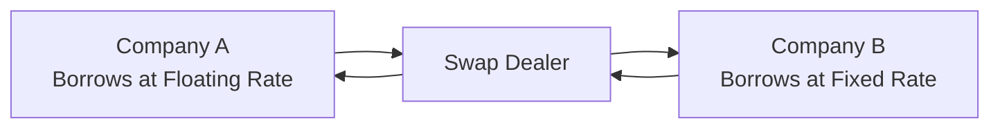

## Introduction

Well, let’s just say I once worked with a mid-sized manufacturer that imported raw materials in euros, sold products in dollars, and had bank loans denominated in Japanese yen–enough to make anyone’s head spin. They realized (almost too late) just how random currency fluctuations could wreak havoc on their cash flows: one quarter the euro soared, then yen interest rates changed, and their carefully prepared budgets basically got tossed out the window. Honestly, it was a bit stressful! But it also showed me precisely why understanding hedging strategies is so crucial for corporate managers. Sometimes, even small currency or commodity price moves can mean the difference between a profitable quarter and a big red number on the income statement.

Below, we’ll explore the key methods companies use to mitigate three primary financial risks—foreign exchange (FX), commodity price, and interest rate risk. These hedging strategies can range from simply matching the currency of costs and revenues (known as a natural hedge) all the way to using derivatives like forwards, futures, and swaps.

## Key Hedgeable Risks

Corporations face all sorts of risk exposures, but three stand out in the context of day-to-day operations and financing decisions:

• Currency (FX) Risk: Companies that transact in multiple currencies face unpredictability in exchange rates. A U.S. firm selling in Europe might receive euros. If the euro weakens versus the dollar, the company’s euro-denominated revenues effectively shrink once converted to dollars.

• Commodity Price Risk: Firms that rely on commodities—oil, metals, agricultural products—face price volatility. An airline’s fuel costs or a bakery’s wheat costs can fluctuate widely, exposing margins to unexpected shocks.

• Interest Rate Risk: When financing capital structures with variable-rate debt or issuing bonds at fixed rates, changes in market interest rates can significantly alter financing costs. A floating-rate loan tied to LIBOR or SOFR (depending on the jurisdiction) is cheaper in a falling rate environment but more expensive if rates spike.

Organizations can’t completely eliminate these risks, but hedging can reduce undesirable volatility, improve planning accuracy, and create a more stable financial profile.

## Natural Hedges vs. Financial Hedges

When we say “hedge,” it’s easy to think of fancy derivatives. But the first line of defense is often an operational or “natural hedge.” Let’s quickly define both:

• Natural Hedge: This is when a company’s operational structure inherently offsets certain risks. For example, if a multinational firm pays some expenses in euros and also earns some revenues in euros, changes in the EUR/USD exchange rate might partially cancel out. Another example is commodity producers that sell in the same commodity they consume.

• Financial Hedge: This involves using actual financial instruments—derivatives or specialized contracts—to reduce exposure. When natural hedges don’t fully offset the risk, firms often turn to tools like forwards, futures, and swaps.

As a simple illustration, if an exporter has euro-denominated revenues but no euro-denominated expenses, they’re fully exposed to the euro’s fluctuations against their domestic currency. A natural hedge might be to source some materials from eurozone countries, paying for them in euros and thus offsetting part of the exposure. If that’s not possible (or not sufficient), a forward currency contract can be used to lock in the rate at which euros will be converted back to the functional currency later on.

## Derivatives for Hedging

Derivatives allow firms to lock in future prices (or rates) and help neutralize exposure. Let’s look at the “Big Three”:

### Forward Contracts

A forward contract is a non-standardized, over-the-counter (OTC) agreement between two parties to buy or sell an asset at a specific price on a future date. They are typically used for hedging currency or commodity exposures:

• Currency Forwards: A beverage company expecting to receive EUR 1,000,000 in three months, for instance, could enter a forward contract to sell EUR 1,000,000 for USD at a predetermined forward rate. This locks in a known exchange rate, removing FX volatility.

• Commodity Forwards: A bakery worried about wheat price spikes might lock in a purchase price with a supplier for a set quantity of wheat to be delivered in six months.

Forward contracts are attractive due to flexibility in customization (maturity, notional amount, settlement terms). However, they are subject to counterparty risk because they’re OTC contracts.

### Futures Contracts

Futures are standardized contracts traded on exchanges like the Chicago Mercantile Exchange (CME). A futures contract obligates the holder to buy or sell a specified quantity of a commodity or financial instrument at a set price on a set future date. Key characteristics:

• Standardized Contract Size: One gold futures contract on a particular exchange might be for 100 troy ounces of gold, for instance.

• Mark-to-Market Every Day: Gains or losses are settled daily. This daily margining process makes futures less susceptible to accumulated credit risk.

• Highly Regulated and Transparent: Exchange-traded futures generally have lower counterparty risk because the clearinghouse stands in the middle of every transaction.

A major difference from forwards is the flexibility or lack thereof in customizing quantities and maturities. You pick from the available standardized maturities and contract sizes. For some corporates, that can be a bit limiting, but the lower credit (counterparty) risk and liquidity can be appealing.

### Swaps

Swaps are derivative contracts where two parties exchange cash flows or other financial instruments:

• Interest Rate Swaps: One party pays a fixed rate, and the other pays a floating rate. Corporations often use these to convert floating-rate debt into fixed-rate obligations (or vice versa). For instance, a company might have a floating-rate loan but prefer the certainty of fixed-rate payments, so they enter a swap. They pay a fixed rate to a counterparty and receive a floating rate, effectively canceling the floating rate on their debt.

• Currency Swaps: Parties exchange principal and interest payments in two different currencies. A firm might have USD debt but needs EUR financing for a European subsidiary. Through a currency swap, the firm can effectively shift USD-denominated obligations into euros, matching currency inflows with outflows.

Swap contracts can be quite large, and they are typically OTC instruments, meaning counterparty risk and documentation requirements are critical. They offer major customization benefits for the right corporate situation.

## Determining Exposure and Hedge Ratios

Before jumping into a hedge, managers need to know what exactly they’re exposed to:

• Net Exposure: This involves netting out any natural offsets. For FX risk, that might mean summing all euro inflows minus all euro outflows, or reconciling commodity purchases vs. sales. The resulting net figure is the fraction you might choose to hedge.

• Hedge Ratio: Commonly, firms decide whether they want to hedge all of their net exposure (a 100% hedge ratio) or only a portion (like 75%). Some prefer partial hedges, believing that 100% might be expensive or might forego potential upside. Others apply “layered hedging,” locking in gradually over time, reducing timing risk.

• Maturities and Quantities: If your exposure is spread over the year, you might want multiple smaller forward/future positions rather than one big contract. This is particularly relevant for commodity hedging, where seasonal consumption or production patterns exist.

In practice, it’s typically an iterative process: finance teams measure exposures, set a target hedge ratio according to policy, and then select instruments to achieve that ratio. As the settlement approaches, you might roll positions if the exposure continues.

## Exchange-Traded vs. OTC Derivatives

When deciding on a hedge vehicle, companies compare exchange-traded derivatives (like futures) with OTC derivatives (like forwards or swaps). Some main considerations:

• Credit/Counterparty Risk: Exchange-traded instruments typically have lower counterparty risk due to the central clearinghouse. OTC contracts depend heavily on the credit quality of the counterparty.

• Standardization vs. Customization: Futures are standardized in contract size and maturity dates. Forwards and swaps are fully customizable, which is great if you have unique maturities or amounts.

• Liquidity: Exchange-traded markets can be highly liquid for major currency pairs, interest rates, and popular commodities. But for specialized needs (like niche commodities), an OTC contract might be the only good fit.

• Collateral Requirements: Futures require margin, settled daily. Forwards might have no initial outlay, though the firm may post collateral or use credit lines. Swaps often require collateral or credit support agreements but can be negotiated.

## Basis Risk

One little phrase you’ll hear a lot is “basis risk,” which essentially means that the hedging instrument’s price might not move in perfect tandem with your exposure. For instance, a coffee roaster uses coffee futures to lock in prices, but the specific type of coffee they use has a slightly different price dynamic than the futures market grade. So price movements might not fully mirror each other. The more correlated your hedging instrument is with the underlying exposure, the lower your basis risk.

## Rolling Hedges for Long-Term Exposure

Sometimes companies have exposures far beyond the length of the available contracts—think multi-year commodity needs. In such cases, they might use a series of short-term hedges over time, known as “rolling hedges.” Each time a contract nears maturity, the company “rolls” it by closing out the expiring contract and entering a new one with a later maturity. While this approach provides some flexibility, it also adds:

• Rollover Cost: You might face pricing differences between the soon-to-expire contract and the new contract.
• Liquidity Constraints: In some cases, long-dated futures or forwards might be less liquid.
• Administrative Complexity: More transactions and more overhead.

## A Quick Glance at Hedge Accounting

Under IFRS (specifically IFRS 9) and US GAAP (ASC 815), organizations that designate derivatives as hedges must follow strict documentation and effectiveness testing requirements to qualify for hedge accounting. If done properly, hedge accounting allows companies to reflect the offsetting gain/loss on the derivative in the same period as the hedged item, reducing earnings volatility from timing mismatches.

Key guidelines often include:
• Documenting the hedge relationship, risk objectives, and strategies from the outset.
• Linking the hedging instrument to specific exposures or portfolios.
• Demonstrating hedge effectiveness on an ongoing basis.

If the hedge is deemed ineffective or insufficiently documented, derivative gains/losses might have to be recognized immediately in profit or loss, creating unwanted P&L volatility.

## Implementing a Corporate Hedging Policy

Establishing a hedging policy is usually done at the board or senior management level. This policy should specify:

• Objectives: Are you hedging to stabilize cash flows, protect profits, or maintain certain interest rate levels?
• Instruments Allowed: Some firms permit forwards and swaps but might restrict speculative or exotic derivatives that don’t match an underlying exposure.
• Hedge Ratios and Limits: The maximum or minimum hedge percentages for various exposures, possibly allowing partial or layered hedging.
• Roles and Responsibilities: Defining who measures exposure, executes hedges, reviews compliance, etc.
• Reporting and Monitoring: Continuous monitoring of hedge performance, basis risk, hedge effectiveness, and potential mark-to-market changes.

Below is a simplified example flowchart for an interest rate swap transaction that might be used by a corporate treasurer managing floating-rate debt:

In reality, the structure might involve more steps, especially regarding net settlements of only the difference between floating and fixed payments.

## Put It All Together with Scenario Analysis

A final consideration: Is hedging worthwhile? Scenario analysis can help answer that. By looking at possible future states (e.g., interest rates up 1%, down 1%; commodity prices up 10%, down 10%; currencies strengthening or weakening), managers can gauge potential outcomes with and without hedges. They can then weigh hedging costs versus the benefit of reduced volatility.

For instance, the forward price of a currency (under the cost-of-carry model) is often estimated by:

$$
F_0 = S_0 \times e^{(r_d - r_f) \times T}
$$

where:  
• \\( S_0 \\) is the current spot exchange rate.  
• \\( r_d \\) is the domestic risk-free rate.  
• \\( r_f \\) is the foreign risk-free rate.  
• \\( T \\) is time to maturity in years.

Companies can adjust or input different interest rates to see how forward rates move, then evaluate if a hedge with that forward rate helps or hinders projected cash flows.

## Best Practices and Warnings

• Avoid Speculation: A hedging program aims to reduce risk, not to gamble on market movements. Firms must be consistent with their stated risk policy.

• Document Everything: Proper hedge accounting requires thorough documentation. Keep track of exposures, hedge instruments, rationale, and effectiveness tests.

• Revisit and Adjust: Market conditions, business models, or operational exposures can shift, so you have to tweak hedge ratios and instruments accordingly.

• Communicate: Senior management, shareholders, and other stakeholders want to know how the company manages risk. Clarity helps manage expectations about earnings stability and ensures no surprises if small short-term losses arise from a hedge that offsets bigger exposures.

• Integrate with Overall Strategy: Hedging should be one piece of a broader risk management puzzle, complementing insurance, well-structured capital allocation, and robust operational planning.

## Practical Example: Hedging a Currency Exposure

Let’s do a quick numeric demonstration, focusing on a typical scenario:

• A U.S. firm expects to receive EUR 2,000,000 in three months from a European customer.  
• The current EUR/USD spot rate is 1.0500.  
• The domestic (USD) annualized risk-free rate is 4%, and the euro annualized risk-free rate is 2%. T = 0.25 years (3 months).

Using the cost-of-carry model, a quick approximation of the three-month forward exchange rate (\\( F_0 \\)) can be:


F_0 \approx 1.0500 \times e^{(0.04 - 0.02) \times 0.25} = 1.0500 \times e^{0.005} \approx 1.0500 \times 1.0050 = 1.0552


So the three-month forward price is about 1.0552 USD/EUR. If the firm locks in this forward rate, it knows it will get:


2,000,000 \times 1.0552 = \$2,110,400


Regardless of where the spot market moves over the next three months, the firm’s euro receipts will convert to about USD 2.11 million, minus any transaction costs. This is a classic forward hedge: stable but foregoes any upside if the dollar happens to weaken further in the interim.

## Exam Day Tips

• Identify Exposures in Item Sets: In the CFA® exam vignettes, they’ll often give you receipts or payments in different currencies, or references to variable-rate debt. Start by calculating the net exposure.

• Evaluate Hedge Effectiveness: Notice if they mention partial hedges, or if the commodity used is different from the futures contract.

• Watch for Basis Risk: The question might mention how the underlying commodity differs from the standardized exchange contract. That’s a red flag for basis risk.

• Know the Accounting Requirements: If the item set references IFRS 9 or ASC 815, they might ask how the hedge is documented or tested.

• Manage Time: Don’t get bogged down in excessive detail. Remember, for the Level II exam, you need a thorough but efficient approach to reading and analyzing each vignette.  

## References and Further Reading

• Hull, John C. “Options, Futures, and Other Derivatives.”  
• CFA Program Curriculum, Level II, Derivatives and Corporate Finance Readings.  
• IFRS 9 / IAS 39 regarding hedge accounting.  
• FASB ASC 815 guidance on derivatives and hedging activities.  

----------------------------

## Practice Questions: Hedging Strategies for FX, Commodities, and Interest Rates



### Question 1

An airline is highly exposed to jet fuel price swings. To reduce volatility, management decides to purchase standardized contracts on an organized exchange. These derivatives are marked-to-market daily. Which type of derivative is the airline most likely using to hedge?

- [ ] Forward Contracts
- [ ] Swaps
- [ ] OTC Options
- [x] Futures Contracts

> **Explanation:** Futures contracts are standardized, exchange-traded, and subject to daily margining, making them a common choice for hedging commodity price risks such as jet fuel.

### Question 2

A U.S.-based furniture company has a natural hedge for currency risk if:

- [ ] It pays all expenses in USD but earns revenue entirely in EUR.
- [x] It pays some expenses in the same foreign currency in which it receives revenue.
- [ ] It denominates both expenses and revenues exclusively in USD.
- [ ] It finances its operations with only floating-rate debt.

> **Explanation:** A natural hedge arises when revenues and costs occur in the same currency, thereby offsetting exchange rate movements.

### Question 3

Which best describes basis risk in a hedging scenario?

- [ ] The credit risk that one counterparty fails to deliver under a forward contract.
- [x] The risk that the price of the hedging instrument does not move in sync with the underlying exposure being hedged.
- [ ] Inefficacy that arises from a poorly documented hedge under IFRS 9 or ASC 815.
- [ ] The additional cost incurred when rolling an expiring position into a new one.

> **Explanation:** Basis risk is the mismatch in price movements between the hedging instrument and the underlying exposure, leading to incomplete offset.

### Question 4

A typical reason a company might choose an OTC forward instead of an exchange-traded futures contract is:

- [x] The firm needs a non-standard contract size or maturity date.
- [ ] They want lower counterparty risk.
- [ ] They prefer daily margin settlements.
- [ ] They aim to enter a highly liquid and standardized market.

> **Explanation:** Forwards allow customization of maturity dates and notional amounts, which can be more suitable when a firm’s exposures aren’t aligned with fixed contract specifications.

### Question 5

A firm has floating-rate debt that it wants to convert into a fixed-rate obligation. Which hedge would most directly achieve this?

- [ ] A forward contract to buy interest rates.
- [ ] A commodity swap.
- [ ] Purchasing a futures contract on an index.
- [x] Entering into a plain-vanilla interest rate swap.

> **Explanation:** A plain-vanilla interest rate swap allows the firm to pay a fixed rate and receive a floating rate, effectively converting floating-rate debt to fixed.

### Question 6

When calculating a net commodity exposure for hedging, the company identifies certain “natural offsets.” What is the main rationale for recognizing these naturally offsetting positions?

- [x] Reducing the total notional exposure that needs to be hedged with financial instruments.
- [ ] Qualifying for hedge accounting more easily under IFRS 9.
- [ ] Complying with standardized contract size on a futures exchange.
- [ ] Eliminating all cost differences among commodities.

> **Explanation:** By netting out revenues and costs in the same commodity or currency, the effective exposure is smaller, reducing how much has to be hedged financially.

### Question 7

Which of the following statements about hedge accounting is correct?

- [x] Companies must formally document the hedge relationship and test for effectiveness on an ongoing basis.
- [ ] Under IFRS 9, derivatives designated as hedges cannot be recognized until maturity.
- [ ] US GAAP does not permit hedge accounting of any derivative instruments.
- [ ] If hedge accounting is elected, derivative gains and losses are never recognized in profit or loss.

> **Explanation:** IFRS 9 and ASC 815 require proper documentation and demonstrate effectiveness. Gains and losses do eventually appear, but typically matched to the hedged item’s timing.

### Question 8

A corporation decides to hedge a multi-year exposure using a rolling hedge strategy in the futures market. Which of the following is most likely a concern?

- [ ] Inability to close out the futures position at maturity.
- [ ] Zero initial margin requirements.
- [ ] Excessively high volumes on the exchange.
- [x] Rollover costs each time the near contract expires and a new contract is initiated.

> **Explanation:** Rolling hedges involve entering new contracts as old ones expire, often incurring transaction costs and possible bid/ask or basis differentials.

### Question 9

Which situation would be considered speculative rather than hedging activity?

- [ ] Buying gold futures to lock in the purchase price of gold inventory needed in three months.
- [x] Entering a forward currency sale when the firm has no foreign currency receivables.
- [ ] Using an interest rate swap to fix the floating-rate payments on an existing loan.
- [ ] Buying put options to limit downside commodity price risk.

> **Explanation:** A position taken without an underlying exposure (like selling a currency forward without a movement of actual currency in the future) is speculative.

### Question 10

A CFO is worried about rising interest rates but also wants to maintain some benefit if rates fall. Which approach might they consider?

- [x] Partially hedging a portion of the firm’s floating-rate debt to allow some upside from falling rates.
- [ ] Hedging 100% of the exposure with a fixed-for-floating swap.
- [ ] Canceling all existing debt immediately.
- [ ] Selling call options on interest rates.

> **Explanation:** A partial hedge reduces risk while still preserving some benefit if interest rates decline, whereas a total hedge eliminates both downside and upside.


