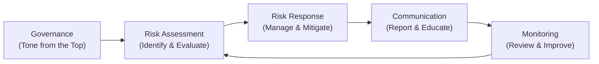
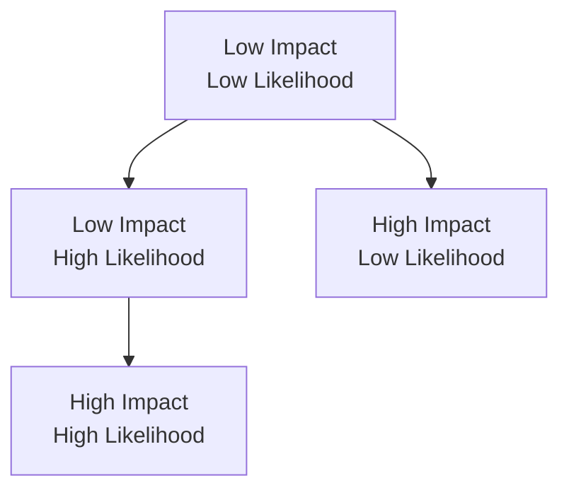

## Introduction: A Holistic View of Risk

Enterprise Risk Management (ERM) is all about seeing your company’s risks—financial, operational, strategic, or reputational—as parts of one big puzzle. Instead of dealing with risks piecemeal (like we often do when we scramble to fix a sudden compliance problem or remedy a supply chain mishap), ERM encourages us to zoom out and think: “How do all these risks link together, and how can we manage them in a way that helps achieve our strategic goals?” That’s the big-picture question.  

I remember once working at a mid-sized tech firm, where a data breach revealed vulnerabilities in not just information technology, but also in brand reputation and operational processes. At the time, we had no single framework to respond to issues in a coordinated manner. Instead, every department raced in separate directions with overlapping tasks and budgets. Let me tell you, it was chaos. That episode taught us that risk management isn’t just about having strong passwords or a good PR response—it’s about weaving risk considerations into everything you do.  

And that, in a nutshell, is what an ERM framework helps you accomplish. From the vantage point of the CFA® Program, especially at Level II, you’ll need to understand how an enterprise-wide approach aligns risk-taking with corporate objectives.  

## The Key Components of an ERM Framework

An effective ERM framework commonly features five cornerstones:

• Governance  
• Risk Assessment  
• Risk Response  
• Communication  
• Monitoring  

While different standards (COSO ERM, ISO 31000) might have nuanced ways of presenting these, the broader principles remain consistent.  

Above is a simplified depiction of how these components interact. As you can see, the process is continuous.  

### Governance

Governance encompasses the policies, structures, and oversight roles (Board of Directors, Audit Committee, Risk Committee) that set the tone for how risk is viewed and addressed at the highest levels of the organization. Senior leadership outlines risk appetite, risk tolerance, and how accountability flows throughout the organization.  

### Risk Assessment

Risk assessment is the pulse-taking stage, where organizations systematically identify, analyze, and prioritize risks. Tools used here can be both quantitative (Value at Risk, Monte Carlo simulations, scenario analysis) and qualitative (risk registers, interviews, workshops).  

### Risk Response

After identifying the main threats—including intangible or strategic exposures—companies choose a response strategy. This might be risk avoidance, risk reduction (through processes or controls), risk sharing (through insurance), or simply acceptance if the risk is part of normal operations.  

### Communication

Communication ensures all levels of the organization receive timely, relevant risk information. Picture weekly or monthly check-ins between operational staff and the Risk Committee, and annual risk updates for shareholders. Strong communication fosters a “risk culture” where employees proactively raise concerns and share risk intel.  

### Monitoring

Lastly, continuous monitoring verifies that risk measures and controls remain effective. As markets, regulations, and internal operations shift, so must risk responses. Internal audit and external audits can support these efforts by testing the effectiveness of existing controls.  

## Risk Identification Methods

Risk identification is arguably the most fundamental piece of ERM. You can’t manage what you haven’t named, right? Below are some practical approaches:  

• Risk Registers: A “living” document (or software) that captures all known risks, including potential root causes and expected impacts.  
• Risk Workshops: Interactive sessions bringing together cross-functional teams to brainstorm potential hazards (and opportunities) lurking in the organization.  
• Scenario Planning: Formally evaluating hypothetical events—like a sudden increase in the cost of raw materials or a regulatory crackdown in a key market—and exploring plausible responses.  
• Data Analytics: Checking patterns in operational data, customer feedback, and external benchmarks to spot anomalies or emerging risks.  

In the field, you’ll see many companies blend these tools—for instance, hosting risk workshops that feed into a dynamic risk register, supplemented by scenario planning results.  

## Ranking and Prioritizing Risks

Once you have a sense of your universe of risks, the next challenge is deciding which ones deserve immediate attention. Typically, organizations evaluate each risk’s likelihood of occurring and potential impact.  

One common representation is the classic two-dimensional “heat map,” where color gradations reflect the severity of combined impact and likelihood:

Risks that end up in the top-right quadrant—“High Impact, High Likelihood”—often become an immediate concern. Lower-right quadrant items might be rare “black swan” events with catastrophic impacts, which deserve scenario analysis.  

## Using Quantitative and Qualitative Assessment Tools

Some folks love complex models. Others prefer practical discussions. Truth is, you need both.  

• Value at Risk (VaR): Popular in financial contexts for measuring the maximum expected loss at a certain confidence level (e.g., 1% VaR means there’s a 1% probability losses will exceed the stated figure).  
• Stress Testing: Examining how your finances or operations respond to extreme scenarios (e.g., a 30% drop in the market, a sudden 300-basis-point interest rate hike, or a natural disaster that knocks out two major manufacturing plants).  
• Heat Maps and Risk Matrices: More qualitative, but great for focusing attention on the highest-priority risks.  
• Key Risk Indicators (KRIs): Metrics—like employee turnover rate or a capital adequacy ratio—that “warn” you of rising risk exposures.  

### Quick VaR Example

Let’s say a treasury manager at a mid-cap energy company notices that if gas prices plunge by 15% in a month, the firm might lose around USD 5 million. Suppose at the 99% confidence level, data indicates the largest expected monthly loss within that threshold is USD 6 million. That suggests a 1% chance the monthly loss exceeds USD 6 million if market conditions replicate historical patterns.  

## Designing and Documenting Risk Response Strategies

Responding effectively to risk means aligning your tactics with overarching corporate goals and risk tolerance. Some typical strategies include:

• Avoidance: Discontinuing a high-risk product line.  
• Reduction: Implementing better controls or hedges to lower the frequency or severity of an event (e.g., purchasing weather derivatives to mitigate commodity price swings).  
• Sharing/Transfer: Offloading risk through insurance policies or strategic partnerships.  
• Acceptance: Acknowledging certain risks—for instance, routine material price fluctuations—where risk mitigation costs might exceed the potential benefit.  

Document everything: This ensures accountability and clarifies the resources needed. For instance, if the decision is to hedge currency risk, you’ll define the instruments used (forward contracts, currency swaps), the maximum notional amount, and who is responsible for oversight.  

## Integrating Risk Assessment with Strategy and Capital Allocation

Risk management can’t just be an afterthought; it has to be baked into your strategy from day one. Think of how the outcome of your risk assessments shapes capital budgeting, growth initiatives, or merger decisions.  

For example, if your ERM identifies a significant operational risk in your manufacturing plants (say, overreliance on a single supplier of microchips), you might decide to allocate capital to diversify suppliers or build additional inventory in strategic regions. This requires cross-department collaboration: the finance team must weigh the carry costs of extra inventory or new factory lines, while the procurement team ensures supply continuity.  

## Communication Protocols and Risk-Aware Culture

One big reason ERM fails is lack of proper communication. Employees might spot a risk but won’t escalate it. Departments might hoard information. Or senior leaders might not see early warning signs until it’s too late.  

To foster a risk-aware culture, employees at all levels should receive:

• Regular training on identifying and reporting risks.  
• Clear guidelines on accountability and escalation paths.  
• Incentives aligned with safe operational practices (rather than purely chasing sales targets that might invite reckless risk-taking).  

It can help to have a Chief Risk Officer or risk committee that acts as a central clearinghouse, making sure risk intel flows both upward to the board and downward to frontline managers.  

## Coordination with Internal Audit

The internal audit function often serves as a second or third line of defense, verifying the effectiveness of risk controls. Under an ERM culture, internal audit looks beyond financial statements, focusing on operational processes, IT infrastructure, compliance with regulations, and so forth.  

Where they spot gaps, internal audit will highlight them to management or the Audit Committee. At times, internal audit teams coordinate with external firms to validate results or share best practices gleaned from other sectors.  

## Ongoing Training and Performance Metrics

Organizations evolve, employees come and go, markets shift. So training is key to keep everyone on the same page. Also, reward structures must not inadvertently encourage excessive risk-taking.  

What does that look like in practice? Perhaps your executive compensation plan is partly anchored to achieving stable earnings within a certain risk tolerance. Or a portion of a district manager’s bonus is computed not just on sales growth, but also on compliance record and operational safety metrics.  

## Continuous Review and Adaptation

An ERM framework is never final. The moment you declare victory, something changes—could be a new regulation, a supply chain disruption, or an internal reorganization. A continuous improvement mindset is vital:

• Conduct after-action reviews of major incidents or “near misses.”  
• Update risk registers to reflect new threats, evolving regulations, or emerging technologies.  
• Refresh scenario analysis and stress test assumptions on a regular schedule (quarterly or semi-annually).  
• Be prepared to pivot your strategy if risks or opportunities evolve faster than expected.  

## The Role of Senior Management and the Board

C-suite and board-level support is crucial, because that’s how you ensure ERM is embedded into everyday processes, not treated as a once-a-year compliance obligation. This might include:

• Allocating budget to risk management technology, training, and resources.  
• Ensuring the Risk Committee remains active, with a clear charter.  
• Incorporating ERM insights into every major decision—like M&A deals, expansions into new markets, or adopting new product lines.  

## Leading ERM Frameworks: COSO and ISO 31000

Two widely recognized frameworks that organizations often turn to:

• **COSO ERM:** Developed by the Committee of Sponsoring Organizations of the Treadway Commission. Known for its clear articulation of how to align risk management with strategic objectives and day-to-day operations.  
• **ISO 31000:** An international standard focusing on principles and guidelines. It’s highly adaptable and emphasizes integration within existing organizational processes to manage risks at all levels.  

You’ll commonly see large multinational companies reference both frameworks, picking and choosing elements that best fit their context.  

## Common Pitfalls and Best Practices

• Pitfall: Creating a risk register and never updating it.  
• Pitfall: Focusing excessively on purely financial risks, while ignoring operational or reputational dimensions.  
• Pitfall: Lack of accountability—when something goes wrong, nobody knows who owns the risk.  

• Best Practice: Involve cross-functional teams in risk identification.  
• Best Practice: Align executive compensation with prudent risk-taking.  
• Best Practice: Embed an iterative process of review, ensuring that your ERM evolves alongside the firm’s goals and internal controls.  

## Glossary

• **ERM (Enterprise Risk Management):** A framework to systematically identify, assess, manage, and monitor all risks facing an organization in pursuit of its objectives.  
• **Risk Register:** A central repository (often software-based) listing identified risks, their potential impact, and the planned mitigation strategies.  
• **Stress Testing:** A method to evaluate how a firm might fare under adverse conditions, such as extreme market downturns or disruptive operational events.  
• **Residual Risk:** The portion of risk that remains even after controls, hedges, or mitigation efforts have been implemented.  
• **COSO ERM:** A comprehensive framework offering best practices to align risk management with strategy and business performance.  
• **ISO 31000:** An international standard providing guidelines, principles, and processes for effective risk management.  
• **Risk Culture:** The shared values, attitudes, and practices around risk-taking and risk awareness within an organization.  
• **Key Risk Indicator (KRI):** A metric alerting the organization to changes in risk exposures, such as rising interest rates or increased customer complaints.  

## References, Suggested Readings, and Links

• “Enterprise Risk Management—Integrating with Strategy and Performance” (COSO)  
• ISO 31000 Guidelines published by the International Organization for Standardization: https://www.iso.org/iso-31000-risk-management.html  
• CFA Institute Resources on ERM and Governance: https://www.cfainstitute.org  
• Hubbard, D. W. (2009). “The Failure of Risk Management: Why It’s Broken and How to Fix It.”  
• Materials in CFA® 2025 Level II, Volume 3, Chapters 18.1–18.2 for foundational context on corporate governance and risk oversight.  

## Test Your Knowledge: Enterprise Risk Management Frameworks



### In an effective ERM framework, which component focuses on ongoing improvements and ensuring risk mitigation measures remain effective?

- [ ] Governance
- [ ] Communication
- [ ] Risk Response
- [x] Monitoring

> **Explanation:** Monitoring is all about continuous review and improvement of the risk management process.  

### A firm’s board decides to halt production of a high-risk, low-margin product to limit potential losses. This approach is best characterized as:

- [ ] Risk sharing
- [ ] Risk acceptance
- [x] Risk avoidance
- [ ] Risk reduction

> **Explanation:** Stopping production entirely is a classic example of risk avoidance.  

### Which of the following statements about Risk Registers is most accurate?

- [ ] They reflect only quantitative risks.
- [ ] They are unrelated to corporate strategy.
- [x] They list identified risks, their severity, and mitigation strategies.
- [ ] They are static documents updated only annually.

> **Explanation:** Risk registers typically house information on identified risks, the severity or priority of those risks, and their planned mitigation.  

### When a company opts to purchase insurance to cover potential losses from cyberattacks, this strategy is commonly referred to as:

- [ ] Risk avoidance
- [x] Risk sharing/transfer
- [ ] Risk acceptance
- [ ] Real option coverage

> **Explanation:** Insurance is a form of risk sharing or transfer.  

### Which of the following addresses potential “worst-case” scenarios where events severely impact financial and operational stability?

- [ ] Monte Carlo simulations
- [x] Stress testing
- [ ] Market value assessments
- [ ] Project net present value calculations

> **Explanation:** Stress testing emphasizes extreme or “worst-case” scenarios and their potential consequences.  

### A firm that maintains a centralized committee that regularly communicates risk updates across all departments is focusing on which key ERM element?

- [ ] Risk Reduction
- [ ] Internal Audit
- [ ] Governance
- [x] Communication

> **Explanation:** The committee ensures the flow of risk intelligence throughout the organization, exemplifying robust communication processes.  

### Which framework below is widely recognized and includes principles for aligning risk management with an organization’s strategy?

- [x] COSO ERM
- [ ] Basel Accords
- [ ] FASB Conceptual Framework
- [ ] US GAAP

> **Explanation:** COSO ERM is a recognized framework for integrating risk management with strategic objectives.  

### What term describes the metric a company tracks to anticipate future increases in risk exposure (e.g., rising customer complaint volume)?

- [ ] Key Performance Indicator (KPI)
- [x] Key Risk Indicator (KRI)
- [ ] Internal Control Metric (ICM)
- [ ] Early Warning Indicator (EWI)

> **Explanation:** A Key Risk Indicator (KRI) signals potential spikes or changes in risk exposure.  

### The concept of “residual risk” in ERM refers to:

- [ ] The risk that no one in the organization has reported
- [x] The risk remaining after mitigation measures are in place
- [ ] The risk that accrues when you fail to set aside reserves
- [ ] The total risk faced by a firm before any controls

> **Explanation:** Residual risk is whatever risk level remains after controls and mitigations have been applied.  

### True or False: “An organization that places full responsibility for risk identification on its internal audit team is likely to have a robust ERM process.”

- [ ] True
- [x] False

> **Explanation:** Relying solely on internal audit for risk identification is inadequate. ERM requires cross-functional involvement and continuous monitoring by all stakeholders.  


