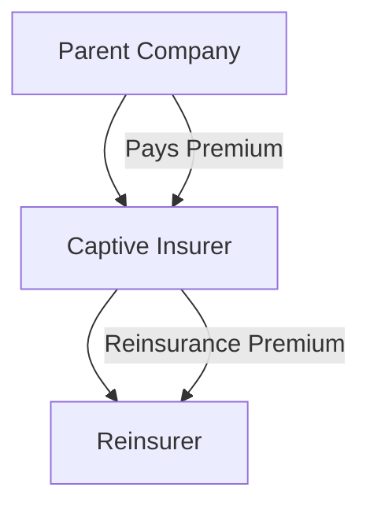

## Introduction

Insurance is one of those topics that can feel both reassuring and bewildering at the same time. Maybe you’ve heard people say, “Just buy insurance, and you’re all set.” Well, if only life (and finance) were that simple. Companies have a range of options when trying to protect themselves from potential losses, from garden-variety commercial insurance policies to more sophisticated risk-financing techniques such as captive insurers and reinsurance arrangements. These solutions help corporations mitigate property, liability, and business interruption risks, among others, in ways that align better with their risk tolerances and strategic goals.

Unlike personal insurance (like home or auto), corporate insurance is often about balancing coverage costs against the probability of major losses. And it’s not just about writing a check for premiums—organizations also need to manage deductibles, coverage limits, and claim processes. Then comes the question of “Should we just start our own insurance company?” That’s not as far-fetched as it sounds: many large firms actually do exactly that, creating what we call captive insurers.

In this reading, we’ll examine how insurance solutions fit into an enterprise risk management (ERM) framework. You’ll see how different policies work, how to design or purchase coverage, and what it means to “self-insure” your biggest hazards. We’ll also explore how captive insurance companies can be used to make coverage far more tailored to a company’s risk profile—and how reinsurance further spreads that risk around global insurance markets.

## Comparing Various Insurance Approaches

Before we plunge into the nitty-gritty of captive insurers, let’s step back and see the big picture of insurance solutions in corporate contexts.

Traditional Corporate Insurance Products:

• Property Insurance: Protects physical assets like buildings, equipment, and certain types of inventory from losses due to fire, theft, or natural disasters.  
• Liability Insurance: Covers legal liabilities if a company is sued for negligence or other acts that result in damages or injuries.  
• Business Interruption Insurance: Compensates for lost profits and additional expenses if operations are disrupted (for example, by a flood or equipment breakdown).  
• Specialty Lines: Covers more specialized exposures—think directors and officers (D&O) liability, product recall, fidelity bonds for employee dishonesty, and environmental liability.

Commercial insurance is usually about transferring risk to a third-party insurer. The company hands over a premium, and in return, the insurer takes on the exposure. In practice, the coverage typically provides a claims payout up to a certain limit. However, commercial insurance might come with high premiums or coverage gaps—especially for specialized industries or large-scale multinationals.

### Self-Insurance

Some firms—particularly ones with reliable cash flows—may decide to self-insure. In other words, they skip buying insurance, at least for predictable or small claims, and instead set aside reserves to handle potential losses. Self-insurance appeals to firms that:

1. Have high-frequency but low-severity losses (for example, routine workplace injuries that are typically small claims).  
2. Prefer to save on premiums (especially administrative loadings or profit margins for the insurer).  
3. Value the direct control over their own claim and safety management processes.

However, self-insurance also brings the risk of severe or unexpected claims that might exceed the firm’s internal budget or cause liquidity shocks. Hence, companies that self-insure often purchase excess or “stop-loss” coverage to shield themselves from catastrophic events.

### Commercial Insurance Programs

These programs are the “standard” approach. The insurer charges a premium based on underwriting assessments—looking at factors like past loss history, industry hazards, corporate safety protocols, and so forth. In large corporations, an insurance broker might negotiate with multiple carriers to create a carefully arranged portfolio of coverages, each with distinct limits and deductibles.

For straightforward exposures, commercial insurance programs remain a popular and effective option. For more complex or larger-scale risks, they can become expensive or simply may not be available with adequate coverage limits. That’s when companies look to more specialized risk-financing strategies.

## Examining the Captive Insurer Model

So, what if a firm says, “We’ve got a decent handle on our risk, we have the capital, and we don’t love handing over big profit margins to commercial insurance carriers all the time. Let’s create our own insurer.” In this scenario, the corporate sponsor establishes a wholly owned subsidiary (the captive) that underwrites its parent’s risks—and sometimes the risks of related parties. The parent effectively pays premiums to this captive, gaining a formal internal insurance mechanism.

Key reasons to form a captive insurer:

1. Cost Control: By cutting out third-party overheads, the parent may reduce the total cost of risk over time.  
2. Coverage Customization: A captive can tailor policy terms to the parent’s exact exposures, which might be more specialized than off-the-shelf insurance solutions.  
3. Risk Management Focus: Operating a captive naturally nudges the parent to be more rigorous in loss prevention, safety protocols, and claims oversight.  
4. Direct Access to Reinsurance Markets: Instead of buying standard coverage from a commercial insurer, the captive can purchase reinsurance at wholesale rates in global markets.  
5. Potential Tax Advantages: In certain jurisdictions, premiums paid to the captive may be deductible, and the captive’s underwriting profits could be taxed at favorable rates—though this varies widely by region and is subject to rigorous regulatory rules.

### Pros and Cons of Captive Insurance

Captives do come with overhead. They’re not a magic wand that instantly saves money. The parent firm must invest significant capital in the captive to meet regulatory requirements for solvency and claims-paying ability. There are also administrative, actuarial, and compliance costs. Additionally, local laws in many jurisdictions impose special regulations on captive formation.

Pros:

• Enhanced risk management and potential cost savings.  
• Flexible underwriting and coverage structures.  
• Direct influence over claims decisions.  
• Access to reinsurance markets without relying on commercial carriers.

Cons:

• Regulatory compliance and capital requirements can be substantial.  
• Administrative complexity (licensing, accounting, corporate governance).  
• Potentially higher exposure to catastrophic losses if not properly reinsured.  
• Requires specialized knowledge in insurance and risk management.

### Setting Up a Captive

Captives are often formed in major domiciles that have well-established captive regulations, such as Bermuda, the Cayman Islands, Vermont (USA), Guernsey, Luxembourg, and others. The parent corporation typically hires specialized lawyers and captive managers, who help with:

• Feasibility studies (loss forecasting, capital adequacy, break-even analysis).  
• Regulatory registration and licensing in the chosen domicile.  
• Ongoing compliance reports, actuarial valuations, and audits.

Here’s a simple diagram illustrating the typical flow of risk and premiums in a captive structure:



In this setup, the Parent Company purchases insurance from its Captive Insurer, which then cedes part of the risk to a Reinsurer if it chooses.

## Role of Reinsurance and Risk Transfer

An insurance company—whether captive or commercial—can itself buy insurance to manage its peak exposures. This is where “reinsurance” enters the picture: it’s basically insurance for insurers. A captive might choose to reign in the maximum potential loss it retains by purchasing reinsurance from specialized global reinsurers like Swiss Re, Munich Re, or Lloyd’s syndicates.

Reinsurance acts as a crucial stabilizer because it prevents the captive from being wiped out by a single massive event. The captive can tailor how much risk it cedes:

• Excess-of-Loss Reinsurance: The reinsurer covers amounts above a specified limit.  
• Proportional (Quota Share) Reinsurance: The reinsurer takes a share of each claim and receives a share of premiums.

Reinsurance itself can be quite technical, and reinsurance companies will underwrite the captive insurer’s portfolio based on historical loss data, current exposures, and global market conditions. The cost of reinsurance is often lower than an equivalent commercial insurance policy because reinsurers deal in higher-level risk pooling, with typically lower distribution and marketing costs.

## Insurance Deductibles, Premiums, and Coverage Limits

Corporations face a balancing act when deciding on deductibles and coverage limits:

• A high deductible (retention) means the company handles small or routine losses itself. This lowers the premium but can cause cash flow volatility.  
• A lower deductible shifts the burden of small claims to the insurer but increases premiums.  
• Coverage limits define the top-end of insurer responsibility—if a claim surpasses that cap, the company is on the hook for the remainder (or any reinsurance arrangement might kick in).

The structure of deductibles, premiums, and limits depends on a firm’s risk appetite and financial strength. A well-capitalized company might prefer higher retentions for predictable losses, hoping to pay lower premiums overall. Conversely, a firm with tighter liquidity might want small deductibles to ensure minimal out-of-pocket exposure.

In general (though simplified), the total premium for a given policy can be expressed as:


\text{Insurance Premium} = E(\text{Loss}) + \text{Administrative Load} + \text{Risk Charge} + \text{Insurer Profit}


When you run your own captive, you effectively internalize the “Risk Charge” and “Insurer Profit.” You still must manage the “Administrative Load,” but you can potentially control it more tightly, and you might purchase reinsurance to mitigate catastrophic exposures.

## Managing Moral Hazard and Adverse Selection

Insurance programs can create moral hazard, where policyholders become less careful because they know their losses are covered. Similarly, adverse selection occurs when entities with higher risks are more inclined to seek insurance, which can skew the risk pool. In corporate contexts:

• Moral Hazard: A company might relax its safety practices if insurance covers all the losses anyway.  
• Adverse Selection: If a firm has a certain line of business with exceptionally high risk, it might overutilize coverage or fail to invest in loss prevention.

To mitigate these issues, insurers often include deductibles or co-insurance. Corporations also implement strong internal loss prevention and safety protocols. Captives, in particular, encourage more vigilant risk management because the loss is effectively “internal” if a claim arises, and the parent has to pay out from its own captive entity.

## Policy Terms, Exclusions, and Endorsements

Insurance coverage is rarely absolute—you’ll see a parade of definitions, exclusions, riders, and endorsements within any policy. For instance:

• Exclusions typically carve out things like war, nuclear events, certain natural disasters, or intangible risks like reputational harm.  
• Endorsements or riders can add coverage or modify policy conditions (e.g., adding cyber liability coverage, adjusting sub-limits for certain perils).

From a corporate perspective, it is crucial to analyze these terms upfront. In real life—no matter how “covered” you think you are—there’s always a clause or two that might trip you up if you haven’t read the fine print. Scenarios like pandemics or large-scale cyber attacks remind us that not all events fit neatly into historical underwriting models.

## Integrating Insurance into Enterprise Risk Management (ERM)

Insurance is not a stand-alone fix: it should be embedded in a comprehensive ERM program. ERM coordinates all corporate risk activities, from operational to financial to strategic. By aligning insurance with broader ERM:

• Claims data helps identify operational deficiencies.  
• Premium costs measure the “market” view of your risk.  
• Loss control measures reduce both insured and un(der)insured exposures.  
• Potential synergy arises if you coordinate insurance decisions with capital structure, budgeting, and strategic initiatives (e.g., expansions into new markets).

One real-life example: I once worked with a manufacturing client that had a high incidence of factory-floor slips and falls. Their workers’ compensation premiums soared every renewal cycle. After implementing an ERM approach (safety training, new floor mats, stricter housekeeping rules), claims dropped significantly, and so did insurance costs. They saved enough over five years that they actually funded expansions in other departments. Not bad for simply connecting the dots between insurance, operational controls, and company culture.

## Non-Insurable Risks and Emerging Solutions

Insurance can’t solve every risk. For instance, intangible risks—like a sudden loss of brand reputation or regulatory shifts—can be tricky to insure. The coverage might be limited, or the premiums might be prohibitively high. Nonetheless, the industry continues to evolve, and we’re seeing new offerings:

• Parametric Insurance: Instead of covering actual property losses, parametric triggers pay out a fixed sum when a specific event threshold is met (e.g., hurricane wind speed reaching a defined number, or an earthquake magnitude measure). This approach can be fast and transparent, but it might not always reflect actual losses precisely.  
• Cyber Liability Insurance: Covers financial losses from hacking, data breaches, or ransomware. The underwriting process is quite new and evolving rapidly as threats become more sophisticated.  
• Pandemic-Related Coverage: Rarely offered in standard policies after 2020’s events, but under certain parametric structures or specialized underwriting, limited coverage might be available.

## Captive Insurer Implementation and Global Considerations

Forming and operating a captive in a global environment can be complicated by:

• Different regulatory regimes for insurance licensure, capital requirements, and solvency.  
• Varied tax treatments—some regions offer tax advantages, while others do not.  
• Complex reinsurance markets—negotiating reinsurance treaties might be easier or more cost-effective in certain domiciles.  
• Currency fluctuations—handling premiums and claims in multiple currencies adds another layer of complexity.  
• Local licensing rules for writing risk across different jurisdictions.

If a multinational organization is expanding, it may decide to domicile multiple captives in different jurisdictions or create a single “global” captive that uses fronting arrangements with local insurers. Still, whichever route is chosen, aligning all this with the firm’s overall capital structure and strategic focus is critical.

## Maintaining and Reviewing Insurance Programs

Insurance programs are not “set-it-and-forget-it.” Corporate risk exposures evolve with changes to products, supply chains, legal environments, and macroeconomic conditions. Periodic reviews help you:

• Check that coverage limits remain sufficient.  
• Update or remove endorsements or riders no longer relevant.  
• Compare premium quotes and coverage from multiple insurers or reinsurers.  
• Evaluate captive solvency, reinsurance treaties, and overall performance.  
• Confirm that local regulations (especially for captives operating abroad) remain satisfied.

From a practical standpoint, many firms maintain a centralized risk management information system (RMIS) to store policy data, claims history, renewal dates, and contact information for brokers, underwriters, and consultants. This single source of truth simplifies decision-making and streamlines audits or coverage expansions.

## Best Practices and Common Pitfalls

• Dedicate specialized resources: Running a captive or large-scale commercial program requires skilled staff or external experts—actuaries, lawyers, claims administrators.  
• Beware of moral hazard: Encourage robust safety and loss prevention programs to avoid “I’m insured” complacency.  
• Watch out for “claim creep”: Tightly manage claim settlement processes for consistency and cost control.  
• Manage your capital properly: Over-leverage or underfunding a captive can be a regulatory nightmare and jeopardize coverage.  
• Stay updated with global events: Economic downturns, catastrophic events, or changes in reinsurance markets can affect premium rates and coverage availability.

## Practical Example: Program Structure

Consider a large multinational manufacturing firm with the following structure:

• $100 million property insurance program split into multiple layers, each covered either by the captive or a commercial insurer.  
• A $5 million deductible applied to each loss event.  
• The captive retains the first $20 million above the deductible.  
• Excess-of-loss reinsurance covers losses above $20 million up to $100 million.  
• Liability coverage is similarly layered, with the captive handling lower-level claims and reinsurance controlling catastrophic exposure.  

This kind of layering ensures the parent faces manageable deductibles while establishing that the captive responds to mid-level claims. Above that, the reinsurance layer prevents the captive from bearing ruinous financial consequences.

## A Quick Python Calculation for Expected Loss Retention

Sometimes, risk managers want a quick snapshot of expected annual losses. You might use a simple Python function to combine frequency and severity assumptions:

```python
import statistics

def expected_annual_loss(frequencies, severities):
    """
    frequencies: List of expected claim counts per year
    severities: List of average claim sizes in the same order
    Returns a sum of frequency * severity across risk categories
    """
    return sum(f * s for f, s in zip(frequencies, severities))

# (slips & falls: freq=20 claims, severity=2,000 USD each;
frequencies = [20, 5]
severities = [2000, 10000]

annual_loss_estimate = expected_annual_loss(frequencies, severities)
print(f"Estimated annual total loss: ${annual_loss_estimate}")
```

Of course, in real life, you’d refine these estimates using probability distributions rather than single average figures. Still, it gives a sense of your expected internal funding needs.

## Exam Tips and Conclusion

As a CFA Level II candidate, you should be prepared to analyze item-set vignettes involving a company’s decision to purchase insurance, form a captive, or restructure existing coverage. Beware of classic pitfalls:

• Failing to recognize the trade-offs between high deductibles (cheaper premiums, more cash volatility) and low deductibles (expensive premiums, less volatility).  
• Mixing up moral hazard with adverse selection.  
• Ignoring how reinsurance can reduce the captive’s risk.  
• Overlooking intangible or non-insurable risks.  
• Underestimating the significance of policy exclusions or endorsements.

Essentially, you’ll want to integrate risk transfer (insurance) decisions with capital budgeting, liquidity management, and overall ERM strategy. Insurance is not just a checkbox—it’s an ongoing, dynamic component of corporate risk management.

-----

Below is a short glossary for quick reference.

• Captive Insurer: A wholly owned insurance subsidiary established by a parent firm to underwrite its own risks.  
• Reinsurance: Insurance purchased by an insurer from another insurance company to manage risk exposure.  
• Deductible: The amount a policyholder is responsible for paying before an insurance company pays a claim.  
• Parametric Insurance: A product where payouts are triggered by a specific event index or threshold, rather than actual losses.  
• Moral Hazard: The tendency of individuals or entities to take higher risks when they are insulated from the consequences.  
• Adverse Selection: Higher-risk parties being more likely to seek insurance, which can distort the risk pool.  
• Underwriter: An entity that evaluates the risk of insuring a particular person or asset and determines coverage terms.  
• Coverage Limit: The maximum amount an insurer will pay for covered losses during a policy period.

## References and Further Reading

• Georges Dionne (Ed.), Handbook of Insurance (Springer)  
• Insurance Information Institute: https://www.iii.org  
• World Captive Forum documentation on captive insurance strategies  
• Lloyd’s of London, Reinsurance Fundamentals

-----

## Test Your Knowledge: Insurance Solutions and Captive Insurers



### Which of the following best describes a primary advantage of using a captive insurer?
- [ ] It fully eliminates the need for reinsurance costs.  
- [x] It allows a corporation more control over coverage terms and potential cost savings.  
- [ ] It removes all capital requirements for the parent company.  
- [ ] It guarantees that all types of risks will be covered without exclusions.  

> **Explanation:** A key attraction of captive insurance is the opportunity for corporations to tailor coverage and potentially reduce costs by internalizing the insurer’s profit margin. However, captives do not eliminate the possibility of needing reinsurance or reduce capital requirements to zero.

### Which insurance approach involves setting aside company funds to pay for potential losses instead of transferring the risk to an external carrier?
- [ ] A fronting arrangement  
- [x] Self-insurance  
- [ ] Parametric insurance  
- [ ] Excess-of-loss reinsurance  

> **Explanation:** Self-insurance means the corporation chooses to budget and reserve capital for covering certain losses, rather than buying coverage from an outside insurer.

### How does a high deductible typically affect a firm’s insurance program?
- [x] The firm faces greater out-of-pocket costs per claim in exchange for lower premiums.  
- [ ] The company experiences lower out-of-pocket costs and lower premiums.  
- [ ] It increases moral hazard because employees know there is high coverage.  
- [ ] It fully protects the firm from catastrophic losses.  

> **Explanation:** A high deductible means you pay more for smaller claims out-of-pocket but benefit from reduced premium costs. It does not guarantee protection from catastrophic losses—those are typically handled by coverage limits and possible reinsurance.

### Which phenomenon describes the tendency for higher-risk companies to seek insurance more frequently than lower-risk companies?
- [ ] Moral hazard  
- [x] Adverse selection  
- [ ] Loss aversion  
- [ ] Crowding out  

> **Explanation:** Adverse selection occurs when higher-risk entities are more likely to purchase insurance or purchase more extensive coverage than lower-risk entities, potentially causing underwriters to misprice or limit coverage.

### In a captive insurance structure, what role does reinsurance primarily serve?
- [x] It limits the captive’s exposure to catastrophic losses by transferring part of the risk to another insurer.  
- [ ] It eliminates the need for premium collections.  
- [x] It helps stabilize the captive’s cash flows.  
- [ ] It replaces the need for a parent company to capitalize the captive.  

> **Explanation:** Reinsurance is used to transfer some of the captive’s risk to another insurer, especially for catastrophic exposures, thereby stabilizing and limiting the captive’s potential losses.

### What is one of the main drawbacks of forming a captive insurer?
- [ ] Zero administrative demands  
- [x] Significant capital requirements and regulatory oversight  
- [ ] Complete avoidance of global market fluctuations  
- [ ] Guaranteed tax benefits in every jurisdiction  

> **Explanation:** Setting up a captive insurer involves substantial capital requirements and must comply with regulatory regimes in its domicile. These obligations can be costly and time-consuming.

### Which of the following statements about parametric insurance is correct?
- [ ] It pays claims based entirely on itemized proof of loss.  
- [x] It uses an event-based trigger (e.g., earthquake magnitude) to initiate payouts.  
- [ ] It does not require any premiums.  
- [ ] It fully covers any catastrophe without limits.  

> **Explanation:** Parametric insurance pays a fixed amount if a pre-defined event parameter is met (e.g., a certain wind speed or quake magnitude), rather than requiring detailed proof of actual property damage or business interruption.

### A company that wants to reduce moral hazard within its insurance programs might do which of the following?
- [ ] Offer zero-deductible policies.  
- [x] Implement a robust workplace safety program and introduce deductibles.  
- [ ] Acquire unlimited liability coverage.  
- [ ] Remove all underwriting guidelines.  

> **Explanation:** A strong loss control program coupled with deductibles ensures that the insured party has some financial stake in preventing or minimizing claims, helping reduce moral hazard.

### Which best describes an “exclusion” in an insurance policy?
- [x] A specific condition or event that is not covered by the policy.  
- [ ] An additional coverage extension that broadens policy limits.  
- [ ] A policy endorsement that lowers premium costs.  
- [ ] An optional coverage area only for intangible losses.  

> **Explanation:** Exclusions are stated conditions or events the policy will not pay for. These can include certain perils, certain property types, or broader categories like acts of war or nuclear incidents.

### True or False: Integrating insurance strategies with an ERM framework ensures that risk transfer, operational controls, and capital structure decisions are aligned.
- [x] True  
- [ ] False  

> **Explanation:** A robust ERM framework coordinates all risk-related activities, ensuring insurance decisions align with broader operational and financial strategies.


