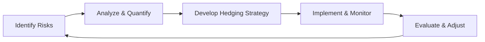

## Introduction

So, let’s say you’re the CFO (or maybe the Treasurer) of a large multinational company. You have to juggle multiple risks—currency swings, volatile commodity prices, fluctuating interest rates, regulatory uncertainties... you name it. And you’ve got stakeholders everywhere saying, “Hey, we gotta hedge this,” or “Wait, that might cost us too much.” Sound familiar?

In this vignette, we’ll explore a hypothetical but very realistic scenario of a global firm grappling with different types of risk. We’ll walk through the key steps: identifying exposures, evaluating existing hedging policies, calculating appropriate hedge ratios, applying instruments like interest rate swaps and forward contracts, dealing with potential hedge failures, and integrating Enterprise Risk Management (ERM) with strong corporate governance. We’ll also look at how regulatory bodies and rating agencies track your risk profile and how you might share your strategy. Oh, and we’ll toss in a supply chain breakdown to spice things up, consider ESG angles, and reflect on how all of this ties back to preserving shareholder value.

## The Case of GlobeTek Inc.

GlobeTek Inc. is a multinational technology and manufacturing firm operating in North America, Europe, and parts of Asia. They produce high-end industrial equipment for the automotive and energy industries. The company has:

• Subsidiaries that sell in different currencies (USD, EUR, JPY).  
• Significant commodity input costs (industrial metals).  
• Some floating-rate debt on the balance sheet.  
• A newly formed ERM department.  
• A strategic mission to align with best-in-class ESG standards, especially regarding climate risk.  

### Current Challenges

• Currency Risk: The firm’s European sales are denominated in euros (EUR), and a weaker EUR against the USD could reduce consolidated revenue. Similarly, the firm’s Japanese subsidiary sells in JPY while most of its cost base is in USD.  
• Commodity Price Risk: Industrial metals such as steel and aluminum have been very volatile recently—if the price surges, GlobeTek’s margins get squeezed (or hammered, you know).  
• Interest Rate Risk: GlobeTek has a notable chunk of floating-rate debt that is sensitive to rising global interest rates.  
• Regulatory Shifts: New regulations on carbon emissions (in part driven by ESG considerations) may lead to potential carbon taxes or require more green-energy inputs.  
• Supply Chain Shocks: The global supply chain is somewhat fragile, especially with shipping delays and potential geopolitical events.  

## Identifying Key Risks

Before picking a hedge, we need clarity on the exposures:

- Currency Exposure:  
  - EUR-denominated revenue.  
  - JPY-denominated revenue vs. cost mismatch in USD.  
- Commodity Exposure:  
  - Rising steel and aluminum costs.  
  - Potential disruptions in commodity supply due to geopolitical events.  
- Interest Rate Exposure:  
  - LIBOR-based (or SOFR-based) floating-rate debt.  
  - Risk of upward rate movements that would increase interest expense.  
- ESG/Regulatory Risk:  
  - Pending climate legislation requiring more environmental disclosures and potential taxes.  
  - Pressure from stakeholder groups to reduce carbon footprint.  

Below is a simplified table capturing these major exposures:

| Risk Type        | Description                                                        | Potential Mitigation                       |
|------------------|--------------------------------------------------------------------|--------------------------------------------|
| Currency Risk    | Volatility in EUR, JPY vs. USD                                     | Forwards, currency swaps, options          |
| Commodity Risk   | Metal prices rising and supply chain disruptions                   | Commodity futures, options, inventory mgmt |
| Interest Rate    | Floating-rate debt costs could rise                                | Interest rate swaps, caps                  |
| ESG/Regulatory   | Carbon taxes, new disclosures, rating agency scrutiny, reputational| Lifestyle changes in supply chain, carbon offsets, better disclosure |

## Evaluating the Existing Hedging Policy

GlobeTek does have some risk management policies in place—like modest forward contracts for currency hedges—but they’ve been somewhat piecemeal. The newly appointed Chief Risk Officer (CRO) has realized there’s no cohesive strategy linking currency hedging with commodity and interest rate hedges. As a result, each treasurer at local subsidiaries often pursues a separate approach, leading to inconsistent coverage, possible overhedging in some areas, and underhedging in others.  

Common pitfalls include:  
1. Ignoring Basis Risk: For instance, hedging commodity exposure with a futures contract on a slightly different grade of steel.  
2. Overlooking Correlation Effects: Sometimes currency weaknesses coincide with rising commodity prices, compounding the overall risk.  
3. Liquidity Constraints: The cost of establishing large forward positions or margin calls on futures can strain working capital.  
4. Misalignment with Risk Appetite: The Board likes stability, but top management also wants to capitalize on favorable market movements.  

## Calculating Hedge Ratios

One of the big tasks for the new ERM department is to propose consistent hedge ratios. Let’s consider a currency risk scenario. Suppose GlobeTek’s European subsidiary forecasts EUR 50 million in net inflows over the next six months, with the EUR/USD rate currently at 1.10. We want to lock in that value in USD.

The hedge ratio formula (in a simplified form) could be:


\text{Hedge Ratio} = \frac{\text{Value of Exposure}}{\text{Notional Size of One Hedge Contract}}


If one standard EUR/USD forward contract is sized at EUR 0.5 million, then the hedge ratio would be:


\text{Hedge Ratio} = \frac{50\ \text{million EUR}}{0.5\ \text{million EUR}} = 100 \text{ contracts}


In practice, you might fine-tune this ratio based on forecast errors, the cost of carrying the forward contract, and your tolerance for partial hedges. A partial hedge might be 80% coverage, leaving 20% unhedged if you’re guessing the euro might strengthen.

## Implementing Interest Rate Swaps and Forward Contracts

### Interest Rate Swaps

GlobeTek’s CFO is looking to convert a floating-rate debt arrangement (tied to SOFR plus a spread) on a $100 million loan into a fixed rate for at least three years. Let’s say the current floating rate is 5% (SOFR + spread), and a bank is willing to swap this for a 5.2% fixed rate.

The basic structure:

• GlobeTek pays fixed @ 5.2%.  
• The bank pays GlobeTek the floating rate (SOFR + spread).  

If interest rates go up (say to 6%), GlobeTek is effectively still paying around 5.2%. This mitigates interest rate risk. Sure, if rates drop to 4%, you pay more than if you’d stayed floating—but that’s the nature of hedging: you give up some upside to protect against a bigger downside.

### Currency Forwards

For simpler currency exposures, short-dated forwards can lock in your exchange rate over, for example, a 3-month or 6-month horizon. If the euro is currently trading at 1.10 and you fear it might drop to 1.05, a forward contract can preserve your 1.10. If the currency moves the other way (to 1.15), you miss out. But again, that’s part of risk management—secure the baseline.

## Enterprise Risk Management and Governance

Now, the Board has recently integrated ESG oversight into the charter of its Risk Committee. The ERM department checks not only financial hazards but also operational and reputational concerns.  

In addition to setting a risk appetite (e.g., maximum acceptable volatility in quarterly earnings), the ERM team must coordinate with business units so that currency hedges in Europe don’t inadvertently conflict with commodity hedges in Asia. You don’t want multiple local hedges offsetting or doubling exposures at the group level.

Below is a small flowchart illustrating the cyclical nature of a comprehensive ERM process:

## Scenario Analysis: Potential Hedge Failures

What if these hedges fail? Perhaps the basis risk jumps out of nowhere—like we have a mismatch where the commodity futures differ from the actual metal grade or shipping location that GlobeTek needs. Or maybe the currency forward exchange rate soared unexpectedly, and the forward contract wasn’t sized properly.  

Scenario analysis might look like this:

• Worst-case: Commodity prices spike 30%, the euro depreciates 10%, and interest rates climb 2%—all at once, triggered by a global crisis.  
• Best-case: Commodity prices remain stable, the euro appreciates slightly, and interest rates remain flat.  
• Middle-case: Modest commodity price increases, slight euro fluctuations, and a mild increase in rates.  

By modeling these scenarios, GlobeTek can measure potential impacts on cash flow, EBIT, and coverage ratios. If the worst case is catastrophic, the board might decide to intensify the existing hedge program.

## Crisis Response: The Emerging Supply Chain Breakdown

Suddenly, you find out that a key supplier in Asia is shutting down due to environmental regulatory sanctions. Production halts, and you have to scramble to find an alternative. Delivery might be delayed, and existing forward contracts or swaps might not fully reflect the new timeline.  

This is the moment for your newly established ERM department to show its mettle. They might initiate quick renegotiations or short-term bridging solutions—like spot purchases of commodities at higher prices or urgent freight. Meanwhile, new interest rate exposures could pop up if you need more short-term financing.  

It’s in these moments that synergy among Capital Structure (Chapters 7 and 8) and Risk Management (Chapters 18+ here) matter. You might need to issue commercial paper or tap into credit lines—both imposing new interest rate exposures that should be hedged or at least recognized.

## Captive Insurer vs. Commercial Coverage

Now, here’s a big strategic question: Should GlobeTek create a captive insurer to handle these industrial and supply chain risks? A captive insurer can potentially offer cost advantages, flexibility, and a tailor-made coverage plan. But it also requires regulatory compliance, capital commitment, and specialized expertise in insurance underwriting.

Alternatively, you might negotiate new commercial agreements with existing insurers. Typically, large insurers can handle many of your main exposures, but the premiums might be high given the recent wave of global uncertainty.

Weighing these options requires an analysis of:

1. Capital outlay for the captive.  
2. Operational complexity.  
3. Regulatory constraints (especially cross-border).  
4. The volume and type of claims you expect.  

Sometimes the “shared risk” model of a captive is appealing if GlobeTek can manage the potential claims better in-house. But if major losses strike, the captive is on the hook.  

## Disclosures to Shareholders, Rating Agencies, and Regulators

Rating agencies care about your debt coverage and any large exposures that could threaten liquidity. If you have robust hedging in place, that might improve your credit profile. At the same time, regulators expect transparent disclosures about derivative usage, especially under IFRS or US GAAP guidelines for hedge accounting.  

Shareholders, of course, want to see stable earnings and responsible management of ESG risks. This might mean disclosing results of scenario analyses that incorporate climate risk or supply disruptions. Demonstrating that you have robust risk processes in place can preserve investor confidence (and maybe your stock price).

## Post-Analysis Reflection on Strategy and Potential Pitfalls

After implementing your hedge program, it’s a good idea to pause, reflect, and see what you got right and where you might improve. Did the interest rate swaps stabilize interest expense as intended? Or did you end up paying more because rates actually fell? That’s a perfectly normal shortcoming of a hedge strategy—but important to note for the next go-around.

A few post-analysis pointers:

• Revisit Hedge Ratios: Are you overhedged or underhedged?  
• Evaluate Hedge Effectiveness: Is the correlation high between your hedge instrument and actual exposure?  
• Track Costs Over Time: Are derivative premiums, collateral requirements, or administration fees piling up?  
• Factor in ESG Trends: Will carbon taxes or new green reporting standards alter your commodity usage or currency flows?  

## Synergy with Other Corporate Issuers Topics

We can’t view risk management in isolation. Chapter 7 and 8 on the cost of capital highlight how your capital structure decisions (debt vs. equity) are deeply affected by how you manage interest rate and currency risk. The payout policy (Chapters 2–4) also interacts: if you plan big share repurchases while ignoring currency headwinds, you could face a double whammy on your cash flow.  

Additionally, your ESG posture from Chapters 5 and 6 shapes how you approach climate risk. If your operations become less carbon-intensive, your derivative and insurance needs may shift, too. Likewise, M&A plans (Chapters 9 & 10) can introduce a wave of new exposures, from new currency pairs to mismatch in local financing.

The best risk management approach, therefore, is synergistic. It balances firm-wide exposures, aligns with your capital structure, and supports your growth and ESG strategies.

## References and Suggested Readings

• CFA Institute, “Standards of Practice Handbook” for ethical risk disclosures.  
• Skoglund, Jimmy, and Wei Chen. “Financial Risk Management: Applications in Market, Credit, Asset and Liability Management.”  
• GARP (Global Association of Risk Professionals) resources on integrated risk management.  
• Practice with past CFA Program item sets on risk management, available in the CFA Institute’s Learning Ecosystem.  

---

## Test Your Knowledge: Multi-Risk Hedging Strategies Quiz



### In evaluating GlobeTek’s currency risk, which of the following instruments BEST allows them to lock in an exchange rate for a specific future payment?

- [ ] Currency option
- [ ] Currency swap
- [x] Forward contract
- [ ] Cross-currency interest rate swap

> **Explanation:** A forward contract is typically used to lock in a specific exchange rate by a set date, perfect for anticipated cash flows. Options give the right but not the obligation, and swaps can be more complex arrangements often involving periodic exchanges of interest and principal.

### A partial hedge ratio might be chosen if:

- [x] Management wants some upside from favorable currency movements.
- [ ] The central bank mandates partial hedging only.
- [ ] Hedge accounting rules prohibit a full hedge.
- [ ] Liquidity is never a concern in forward markets.

> **Explanation:** A partial hedge ratio can be used when you don’t want to fully lock in an exchange rate or commodity price. You hedge, say, 70-80% of your exposure, leaving a portion open to potential favorable (or adverse) market movement.

### If GlobeTek engages in an interest rate swap to fix the cost of its floating-rate debt, the firm:

- [x] Will pay a fixed rate and receive a floating rate.
- [ ] Will pay a floating rate and receive a fixed rate.
- [ ] Is protected from any drop in market interest rates.
- [ ] Must post margin on all types of swaps.

> **Explanation:** In a typical “plain vanilla” interest rate swap, a borrower with floating-rate debt pays fixed and receives floating to lock in their cost. They do forgo the benefit of falling interest rates, though.

### An example of basis risk in a commodity hedge is when:

- [ ] The underlying commodity is identical to the futures contract commodity.
- [x] The commodity’s grade or delivery location differs from the contract specification.
- [ ] You use an interest rate swap to hedge commodity exposure.
- [ ] You over-hedge your commodity exposures intentionally.

> **Explanation:** Basis risk arises when the price of the hedge instrument (like a futures contract on a certain grade of steel) doesn’t move perfectly in tandem with the actual commodity you consume (maybe a different grade or location basis).

### Which scenario would MOST LIKELY require GlobeTek to reconsider its captive insurance decision?

- [x] A regulatory change mandates significantly higher capital reserves for captives.
- [ ] Interest rates remain stable for three consecutive quarters.
- [ ] Commodity prices decline slightly, reducing overall claims.
- [ ] The CFO resigns to join another firm.

> **Explanation:** Stringent licensing or capital requirements can make a captive insurer structure expensive or unworkable, pushing a firm to consider commercial insurance alternatives.

### ESG considerations in GlobeTek’s risk framework MIGHT include:

- [x] Potential carbon taxes raising operating costs.
- [ ] The color of the CFO’s office furniture.
- [ ] Eliminating all forms of derivatives.
- [ ] Dropping interest rate hedges.

> **Explanation:** Under ESG, a rise in carbon taxes or environmental compliance costs can affect a firm’s risk profile, so that’s relevant. Office furniture color typically wouldn’t factor in ESG risk frameworks. It also doesn’t force the firm to drop derivative usage.

### In a severe supply chain breakdown, GlobeTek’s ERM department would likely focus on:

- [x] Immediate alternative sourcing and quantifying abrupt revisions to commodity hedges.
- [ ] Eliminating forward contracts to simplify finances.
- [ ] Deregistering from compliance requirements.
- [ ] Waiting until the next quarter to respond.

> **Explanation:** In a supply chain crisis, quick sourcing alternatives, updated hedging strategies, and real-time analysis of operational and financial impacts are critical.

### For a large multinational firm, one advantage of a comprehensive ERM process is:

- [x] A coordinated approach that reduces overlap or conflicting hedges.
- [ ] Splitting risk management into isolated business units for speed.
- [ ] Avoiding board-level oversight of risk policies.
- [ ] Eliminating all forms of financial hedging.

> **Explanation:** ERM is about integrated oversight and synergy, ensuring that currency hedges, commodity hedges, and interest rate management are not siloed approaches but rather part of a cohesive risk strategy.

### Rating agencies might penalize GlobeTek if:

- [ ] The firm discloses too much detail about its hedges.
- [ ] It chooses to remain unlevered.
- [ ] It invests in new R&D projects.
- [x] Perceived risk exposures are high and poorly managed.

> **Explanation:** Rating agencies look at exposure coverage and risk management rigor. If exposures are high and risk management is sloppy, they might downgrade the firm, increasing borrowing costs.

### True or False: Overhedging can sometimes lead to effectively speculating in the financial markets, contrary to the goal of risk reduction.

- [x] True
- [ ] False

> **Explanation:** When you hedge more than your actual exposure, you can end up with a net speculative position if the market moves favorably (or unfavorably), which goes beyond simple risk mitigation.


