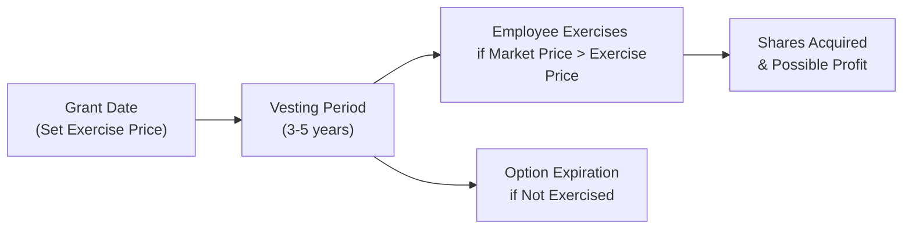
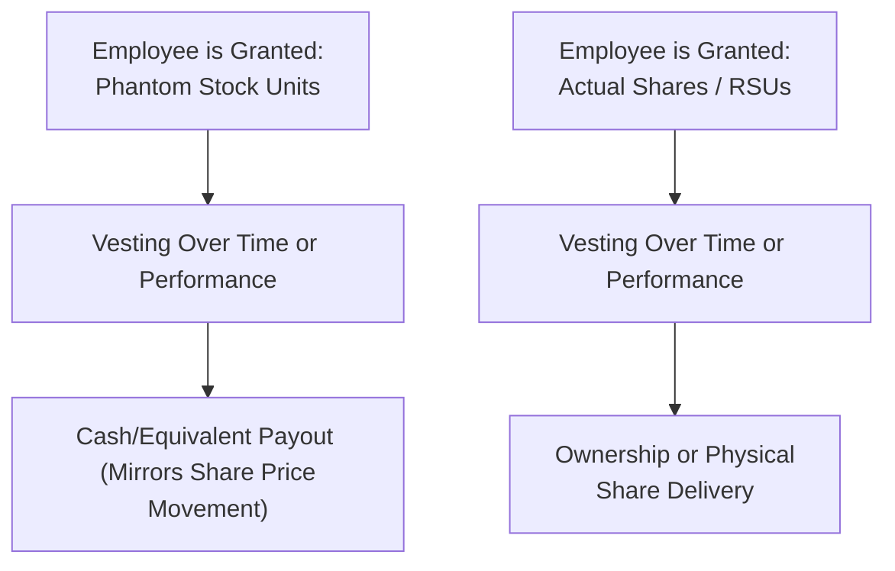

## Overview

Share-based compensation is a vital tool companies use to align employees’ interests with those of shareholders. The basic idea? When employees own a piece of the business, they tend to care more about its performance. It’s a bit like having your favorite sports team be the one you actually play for—you’ll give it your all, right? For CFA Level II, it’s especially important to explore how these compensation mechanisms work in practice: the structures, the vesting, the accounting, and the potential impact on behavior. After all, the real world can be messy, and share-based plans aim to channel that messiness toward healthy corporate performance.

But, well, you might be wondering: Why does share-based compensation get so much attention in the exam curriculum and in corporate boardrooms alike? The short answer is that it can substantially affect a company’s financial statements, employee morale, and overall corporate governance. It is also subject to various regulatory requirements and can have big implications for shareholder value. In this section, we’ll talk through the most commonly used share-based compensation vehicles, why they’re structured the way they are, how they’re measured, and how they might appear in a real CFA vignette.

## Key Instruments of Share-Based Compensation

It’s easy to think, “A share is just a share,” but the truth is that stock-based awards can take many forms. Each design serves a different purpose—some are better for retention, some for incentivizing certain performance targets, and others for limiting share dilution. Let’s look at the major ones.

### Stock Options

Stock options are probably the most famous share-based instrument. They grant an employee the right (but not the obligation) to buy a certain number of shares at a specified “exercise” (or “strike”) price over a set period. Typically:

• The exercise price is set at or around the market price of the stock on the grant date.  
• The options vest over a period—maybe three years—or according to performance triggers.  
• They expire if not exercised by a certain date (often seven or ten years from grant).

The idea behind stock options is straightforward: If the share price rises above the exercise price, the options have intrinsic value. Employees will be more motivated to boost company performance when there’s a potential upside that appreciates along with the stock price. Of course, if the share price doesn’t go anywhere—or it actually declines—the options might remain worthless. That’s a scenario we saw in many industries during downturns. This structure puts employees in the same boat as shareholders, theoretically encouraging them to enhance shareholder value.

Below is a basic flow diagram illustrating the life cycle of a stock option:

#### Structuring and Vesting

Option plans often include time-based schedules (e.g., one-third vests each year over three years) or performance-based schedules (e.g., an employee must hit specific revenue or profit targets for the option to vest). Once vested, employees have a window to exercise before expiration. Importantly, companies must estimate the fair value of these options using models such as Black–Scholes—more on that later.

#### Behavioral Considerations

Say you’re an executive with loads of stock options. You might be more willing to undertake projects that can spike the stock price, even if they’re riskier. In short, options can encourage some entrepreneurial risk-taking, which might be great if managed well but can also encourage undue risk if left unchecked. Companies often add performance or service conditions to keep employees from making short-term, high-risk decisions that jeopardize long-term value.

### Restricted Stock and Restricted Stock Units (RSUs)

Restricted stock awards (RSAs) are actual shares issued to the employee upon grant, but with restrictions: the employee cannot sell or transfer them until the vesting period is complete. If the employee leaves the company before it vests, the shares are typically forfeited.

Restricted stock units (RSUs) are slightly different contractual promises to deliver stock (or sometimes cash) in the future, subject to vesting. RSUs are not actual shares at grant; they represent a right to receive shares down the line. Until vesting, RSUs typically have no voting rights.

#### Why Use Restricted Stock or RSUs?

Companies use these to promote retention. They’re less volatile than stock options because even if the price doesn’t dramatically rise, an RSA/RSU is still worth something as long as it doesn’t fall to zero. You might see this with key managers: “Stay with us for three years, meet some minimal performance or service condition, and you get these shares—no matter what the share price has done, within reason.” That stability can reduce the temptation to take massive risks just to push the stock price up.

#### Example

Imagine a mid-level manager receives 1,000 RSUs vesting over four years, with 25% vesting each year. If the manager stays for the entire four-year period and the stock price keeps climbing steadily, it’s a nice windfall. If the manager bails early, the unvested portion is forfeited. This mechanism encourages people to stick around.

### Performance Shares

Performance shares work similarly to RSUs but contain an additional performance hurdle. Instead of vesting purely based on time, performance shares might vest if the company’s earnings per share (EPS) hits a certain threshold or if total shareholder return (TSR) outperforms a peer group. These serve as a powerful motivator because employees know that vesting is not just about staying in the seat; it’s about meeting strategic targets.

• If metrics are met or exceeded, employees get full (or even multiplied) share payouts.  
• If metrics fall short, employees might get fewer shares or none at all.

This approach helps ensure that employees aren’t simply rewarded for coasting. They must drive actual results. However, define the metrics carefully—an emphasis on short-term EPS might push employees to cut essential R&D spending, for instance. That’s the push and pull of share-based plans: you want to incentivize good performance without encouraging shortsighted decisions.

### Phantom Stock and Stock Appreciation Rights (SARs)

Some companies want to tie compensation to share price performance without issuing actual shares. Why? Maybe they’re concerned about dilution, or they operate in jurisdictions where awarding equity is more complex. Phantom stock and SARs address these issues:

• Phantom Stock: An employee receives compensation equal to the value of a certain number of shares after a specified period, plus any appreciation. No actual shares trade hands, but the employee effectively “feels” like an owner.  
• SARs: Stock Appreciation Rights provide employees with the right to receive the spread between the stock price at grant and at exercise, usually paid in cash (though sometimes in shares). Like an option, if the stock goes nowhere, there’s no payout.

Here’s a simple illustration comparing phantom stock to standard stock awards:

Phantom stock and SARs can be especially popular in private companies seeking to provide “equity-like” rewards without complicating their shareholder base. They can also help reduce actual share issuance, which might please existing shareholders worried about dilution.

## Corporate Governance and Plan Design

When designing any of these share-based plans, boards and human-resources committees often face challenges like:

• Shareholder Approval: Many jurisdictions require approval if the plan is significant or if it dilutes ownership.  
• Plan Limits: Most plans have maximum award sizes, partly to prevent undue dilution.  
• Disclosure Requirements: Under IFRS and US GAAP, there are rules requiring companies to record share-based compensation expense on the income statement, and to disclose relevant assumptions (e.g., fair value calculations).  
• Alignment with Corporate Strategy: Conditions must reflect the kind of performance the company wants to motivate—long-term or short-term, risk-taking or stable.  
• Minimizing Abuse: Companies want to avoid backdating options (setting an earlier, favorable grant date) or setting unrealistically low performance hurdles.  

It can feel like a balancing act: companies want to keep talented people and encourage them to think long-term, and shareholders want to make sure that these plans don’t quietly siphon away equity in ways that don’t benefit the company.

## Sample Valuation Approaches

One of the trickier aspects for many CFA Level II candidates is understanding how companies expense share-based compensation. The standard approach for valuing stock options is the Black–Scholes model (or a variant like binomial models). While we won’t dive into every input detail, it’s good to remember that the main variables are:

• Current Stock Price (S)  
• Exercise (Strike) Price (K)  
• Time to Maturity (T)  
• Risk-Free Interest Rate (r)  
• Volatility (σ)  
• Dividend Yield (q)

The fair value of an option can be expressed via the Black–Scholes–Merton formula. In simplified KaTeX:


C = S_0 e^{-qT} \Phi(d_1) - K e^{-rT} \Phi(d_2)


where


d_1 = \frac{\ln\left(\frac{S_0}{K}\right) + \left(r - q + \frac{\sigma^2}{2}\right)T}{\sigma \sqrt{T}}
\qquad
d_2 = d_1 - \sigma \sqrt{T}


• \\( \Phi(\cdot) \\) is the cumulative distribution function of the standard normal distribution.  
• \\( C \\) is the call option value.  

Performance shares, RSUs, and phantom stock are supported by simpler valuation methods: typically, their value is closer to the underlying share price, adjusted for expected vesting probabilities. Regardless of the method, the total fair value is calculated up front (at grant date) and expensed over the vesting period. If potential performance or market hurdles exist, it might complicate the expense recognition schedule.

## Real-World Scenario Application

Picture a growing tech company with volatile stock and big ambitions. Let’s call it SemantiTek. They need to keep top developers around to build their new AI product. They offer new hires a “drive the future” pitch plus a chunk of stock options, with a three-year vesting schedule. The expectation is that if the product launch succeeds, the share price might triple. This can be a dream scenario—motivation for developers to stick it out and ensure success.

But over in the finance department, they realize that if everyone exercises these options at once, it’ll cause some dilution. They also must show a hefty compensation expense for these options in their income statement. Meanwhile, they’re considering giving executives performance shares tied to the speed of new user adoption, ensuring the leadership team remains laser-focused on that critical metric. Investors, however, want to see robust revenue targets, so maybe the board adjusts the performance conditions. Notice how these decisions shape not just “pay” but the strategic direction and perceived risk posture of the organization.

## Conclusion

It’s hard to overstate the importance of share-based compensation—both for exam success and real-world corporate finance. Selecting and structuring the right type of award is a delicate balancing act that requires understanding the trade-offs: how to align interests while avoiding perverse incentives, how to minimize unwanted share dilution while still offering meaningful upside, and how to handle regulatory and accounting implications. In the end, share-based awards are all about forging a stronger bond between employees and shareholders, motivating each party to pull in the same direction.

Feel free to re-read some of the definitions and revisit the diagrams. The best way to master this material is to imagine how you’d explain these concepts to one of your colleagues at your next company coffee break (or after-work hangout). If you can explain it clearly to a friend, you’re almost certainly ready to tackle those CFA Level II vignettes head-on.

## References, Further Reading, and Resources

- CFA Institute, 2024/2025 Level II Curriculum, “Corporate Issuers—Share-Based Compensation.”  
- Damodaran, A. (2019). Damodaran on Valuation: Security Analysis for Investment and Corporate Finance.  
- PwC, “Share-based payment accounting guide.” https://www.pwc.com/  
- Deloitte, “Stock-Based Compensation: A Roadmap to Applying US GAAP.” https://www2.deloitte.com  

---

## Test Your Knowledge: Share-Based Compensation Quiz



### Which of the following is a key purpose of share-based compensation?

- [ ] To increase the immediate realized salary of employees without affecting shareholders.  
- [x] To align the interests of employees and shareholders by offering equity-based incentives.  
- [ ] To reduce the overall compensation expense reported on the financial statements.  
- [ ] To avoid any connection between company performance and employee rewards.  

> **Explanation:** Share-based compensation is primarily intended to align the interests of employees with those of shareholders by tying a portion of compensation to the company’s stock performance.

### Which statement best describes the nature of a restricted stock unit (RSU)?

- [x] It is a promise to deliver company shares (or a cash equivalent) at a future date after vesting conditions are met.  
- [ ] It is a type of cash-only bonus paid for short-term project completion.  
- [ ] It provides the employee immediate ownership and voting rights during the vesting period.  
- [ ] It allows the holder to purchase shares at a specified price within a certain timeframe.  

> **Explanation:** RSUs are contractual promises to deliver shares or equivalent cash after meeting service or performance conditions. They do not provide immediate voting rights since the actual shares haven’t yet been delivered.

### Performance shares differ from time-based restricted shares in that performance shares:

- [x] Require the achievement of specific performance metrics for vesting, rather than only time-based conditions.  
- [ ] Have no forfeiture provisions upon employee departure.  
- [ ] Are typically priced below market value at the time of grant.  
- [ ] Are never linked to market conditions.  

> **Explanation:** Performance shares vest upon meeting performance metrics (e.g., EPS growth, total shareholder return), not merely based on the passage of time.

### A key distinction between phantom stock and stock appreciation rights (SARs) is that:

- [ ] Phantom stock requires actual share issuance, whereas SARs are purely hypothetical.  
- [ ] SARs cannot be settled in cash, whereas phantom stock generally is.  
- [x] Phantom stock mimics full share value (including dividends), whereas SARs focus only on share price appreciation.  
- [ ] SARs typically require immediate vesting.  

> **Explanation:** Phantom stock generally awards a payoff equal to the full value of the underlying share (including appreciation and sometimes dividends), while SARs compensate only for the appreciation from grant to exercise price.

### What is a principal reason companies adopt share-based compensation plans?

- [ ] To eliminate the need for detailed corporate governance oversight.  
- [ ] To reduce the market price of the company’s shares.  
- [x] To motivate employees to focus on driving the firm’s long-term value and share price.  
- [ ] To ensure employees remain indifferent to firm performance.  

> **Explanation:** By linking employee rewards to share performance, employees have incentives to enhance firm value and focus on strategic growth.

### Which of the following is correct regarding valuation of employee stock options using the Black–Scholes model?

- [x] The risk-free rate, expected volatility, time to maturity, and dividend yield are all critical inputs.  
- [ ] The fair value recognized is always the same as the intrinsic value on the grant date.  
- [ ] Employee concentration risk is typically included as an input to the model.  
- [ ] Expensing occurs only upon option exercise, not during the vesting period.  

> **Explanation:** Black–Scholes factors in the risk-free rate, volatility, time to maturity, and expected dividends, among other variables. Fair value is recognized and expensed over the vesting period, not solely upon exercise.

### Stock Appreciation Rights (SARs) are particularly attractive for companies that:

- [x] Want to offer equity-like incentives without issuing additional shares.  
- [ ] Are focused solely on distributing large dividends to employees.  
- [ ] Prefer to avoid using any share-based instrument.  
- [ ] Require no disclosure under IFRS or US GAAP.  

> **Explanation:** SARs provide “equity-like” payouts without issuing new shares, thereby mitigating dilution. They still require compliance with disclosure standards.

### Which statement best describes one reason companies use performance conditions in share-based compensation rather than purely time-based vesting?

- [ ] Performance conditions reduce the administrative burden for the plan sponsor.  
- [x] Performance conditions aim to ensure that rewards reflect actual improvements in key financial or strategic metrics.  
- [ ] Time-based vesting is illegal in most regulated markets.  
- [ ] Employees dislike performance hurdles because they never vest.  

> **Explanation:** Performance conditions encourage focus on tangible improvements in financials or strategic outcomes, aligning compensation with successful execution of company objectives.

### One of the main corporate governance considerations when designing share-based compensation is:

- [x] Ensuring that the plan receives shareholder approval and does not excessively dilute equity.  
- [ ] Guaranteeing that only the CEO has access to share-based awards.  
- [ ] Maintaining secrecy around the plan parameters to avoid competition.  
- [ ] Retroactively changing the exercise price to match market dips.  

> **Explanation:** Good governance practices require transparency, appropriate shareholder approvals, plan limits, and a fair approach that avoids excessive dilution or retroactive changes.

### True or False: Excessive issuance of stock options can lead to significant share dilution, which may concern existing shareholders.

- [x] True  
- [ ] False  

> **Explanation:** Overly generous option issuance can dilute the ownership percentage of existing shareholders, reducing the value of their holdings and potentially leading to governance conflicts.


