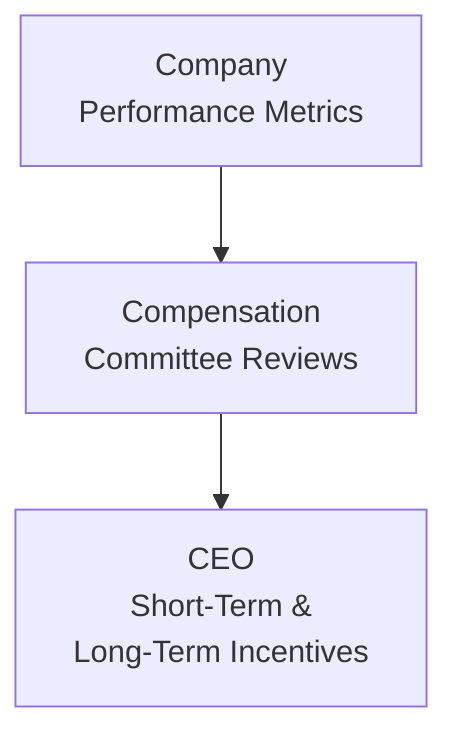

## Introduction

Sometimes, when I think about CEO compensation, I’m reminded of the day I first peeked into a conglomerate’s annual proxy statement. At first glance, all those numbers—base salary, stock options, bonus targets—looked like a stack of random puzzle pieces. But after about a dozen cups of coffee (okay, maybe just two or three), it struck me that the mosaic of figures actually reveals a company’s priorities, how they measure success, and the real meaning behind “pay-for-performance.”

In the Level II CFA® curriculum, you dove into corporate finance fundamentals. Now, we’ll dig a bit deeper, exploring how CEOs’ pay packages are (or sometimes aren’t) aligned with critical performance goals. By weaving together short-term and long-term metrics, boards of directors aim to create a system that pushes the CEO to think strategically and produce sustainable value. But is this always the case? Let’s see.

## Rationale for Linking CEO Compensation with Performance

A big question might be: Why bother tying executive compensation so tightly to certain business outcomes? Couldn’t we just pay a fixed salary? Well, in an ideal world, you want the CEO fully invested—literally—in the company’s performance. If the CEO’s wallet is meaningfully impacted by hitting (or missing) strategic targets, that often aligns their interests with shareholders, bondholders, and other stakeholders.

When CEOs stand to benefit from strong financial results, there’s more incentive to focus on sustainable growth. Traditionally, the pay-for-performance principle rests on the notion that if a company is thriving, CEOs should be rewarded proportionately; if the company is dragging, their pay should also reflect that. This not only drives accountability but also fosters a culture of transparency across the leadership team.

Of course, not every organization gets this exactly right. If the goals and metrics are too short-term, you risk encouraging corner-cutting (like slashing R&D) that artificially props up near-term profits while hurting long-run competitiveness. If the metrics lean too heavily on stock price, you incentivize share buybacks that might not be beneficial for the business’s operational future. Hence, the real art is in the careful design of performance metrics and payout structures.

## Common Performance Metrics in Executive Compensation

Most boards and compensation committees rely on a toolkit of performance measures, each intended to capture a slice of corporate health. Here are some that pop up the most:

• Return on Invested Capital (ROIC).  
  This ratio measures how effectively a firm uses its capital to generate returns. A CEO compensated on ROIC might be motivated to avoid unprofitable projects that tie up capital with little payoff. But watch out: if the target is too high, management might also shy away from promising long-term investments that lower returns in the near term.

• Economic Value Added (EVA).  
  EVA tries to gauge the true economic profit by subtracting the cost of capital from net operating profit after tax. Compensation packages linked to EVA theoretically push executives to create returns above and beyond the firm’s cost of capital. However, calculating EVA can get pretty data-intensive—manufacturing the signals and adjusting for intangible assets might lead to complexity (and potential mischief).

• Total Shareholder Return (TSR).  
  TSR looks at value creation for shareholders, including both stock price appreciation and dividends. It’s easy to communicate: “If shareholders make money, you (the CEO) will make money.” However, TSR can be swayed by external factors like market moods or macroeconomic trends, which may or may not reflect actual management skill.

• Earnings Growth.  
  This is that classic measure indicating how effectively the business is pumping up its net income. But as you probably suspect, focusing on pure earnings growth can push leaders toward short-term moves (like cutting essential research costs or sales expansions) that boost short-run numbers at the expense of long-term resilience.

Now, it’s entirely possible for companies to use multiple measures simultaneously—like a blend of EVA and TSR—to balance short-term results with sustainable performance. Indeed, many compensation committees will choose a “scorecard approach,” where each metric weighs a portion of the total bonus or equity award.

## Short-Term vs. Long-Term Incentives

In many pay packages, you’ll see a combination of Short-Term Incentives (STIs) and Long-Term Incentives (LTIs).

• Short-Term Incentives (STIs).  
  These are often annual bonus payments, pegged to achieving certain immediate targets: revenue, net income, or even departmental goals. The big plus is it keeps the CEO awake at night—constantly vigilant over near-term performance. The danger, though, is that focusing only on STIs might encourage short-term earnings manipulation or cost-cutting that undermines longer-term growth.

• Long-Term Incentives (LTIs).  
  Restricted stock, stock options, performance shares, or performance share units that vest over multiple years fall into this bucket. They nudge the CEO to think beyond the next quarter. For instance, a CEO with a chunk of unvested restricted stock is aligned with other shareholders who want to see the share price climb over time. If the CEO invests in new product lines, invests in quality improvements, or invests in sustainable supply chains that might drive future profitability, LTIs reward that patience.

Many boards mix STIs and LTIs to encourage a balanced leadership style: meet short-term operational goals without torpedoing longer-term strategic positioning.

## The Role of the Compensation Committee

While top executives may have a seat at the table during pay structure discussions, the real power often rests with the Compensation Committee—an independent subcommittee of the board. These are typically non-executive directors who review performance measures, engage with external consultants, and analyze market compensation data for peer comparisons.

This committee’s mission is to strike a delicate balance: They want the CEO to be well-compensated for delivering solid results but not so lavishly that it drains corporate resources or sets inappropriate benchmarks. In an effective governance environment, the committee:

• Reviews performance targets each year and adjusts them if necessary.  
• Evaluates the CEO’s performance against agreed-upon metrics.  
• Proposes new compensation structures when strategic priorities shift (e.g., pivoting from revenue growth to efficiency improvements).  
• Navigates shareholder input—especially in jurisdictions where “Say on Pay” votes are mandatory.

Bottom line: if the Compensation Committee does its job right, it’ll continuously refine the incentive system to keep the CEO’s eye on the right prize.

## Comparing Pay-for-Performance Across Markets

Cultures and regulations vary widely across the globe. In some European countries, there’s a tradition of more modest CEO pay relative to average worker salaries, with tight constraints on bonuses. In the United States, it’s far more common (and often expected) for a large slice of CEO pay to be in equity awards tied to stock performance. Asia-Pacific markets can vary greatly; for instance, in Japan, there’s often an emphasis on base pay and narrower pay gaps, while in other parts of Asia, equity compensation and performance metrics are catching on quickly.

Some regulatory environments (like in the UK) mandate thorough pay disclosure and incorporate binding or advisory shareholder votes on executive compensation packages. Others do not place as much formal emphasis on public input but rely more heavily on private consultation among major shareholders, boards, and top executives. These differences can shape how “pay at risk” is structured and how performance is measured.

## “Pay at Risk” and the Proportion of Variable Compensation

One of the buzz phrases you’ll see a lot in this realm is “pay at risk,” referring to the part of an executive’s compensation that’s contingent upon hitting specified performance milestones. Essentially, if the CEO doesn't meet targets, this portion of pay might shrink—or even vanish.

• High pay at risk.  
  This setup can spark powerful motivation to meet or exceed metrics, but it can also push the CEO to adopt risky strategies in an attempt to hit ambitious targets. For example, a CEO might load up on debt-financed acquisitions to achieve near-term revenue surges—even if the long-term synergy is uncertain.

• Low pay at risk.  
  If the variable pay is a smaller slice of total comp, the CEO might enjoy more stability and potentially maintain a more measured approach. Of course, with minimal consequences for underperformance, some CEOs might coast on the status quo, focusing on preserving their role rather than pushing for transformative results.

Finding the sweet spot—where the CEO is meaningfully incentivized to improve the business but not cornered into catastrophic risk-taking—remains one of the trickiest tasks for compensation committees.

## Concerns and Pitfalls

We can’t talk about CEO pay without mentioning some controversies and potential problems:

1. Excessive Risk-Taking.  
   If the performance metrics emphasize short-term leaps in profit or share price, the CEO might greenlight questionable ventures or push edgy financial engineering. That can backfire if markets or credit conditions turn sour.

2. Short-Term Earnings Manipulation.  
   A classic scenario is to inch up earnings-per-share in the closing days of the quarter to ensure a hefty STI. Perhaps management defers discretionary expenses to the next quarter. These tactics can degrade the business’s real competitiveness over time.

3. Misaligned Metrics.  
   Picture a scenario: the CEO gets heavily rewarded for revenue growth even though the firm is incurring staggering losses that hamper future profitability. Or the pay is tied to absolute share price—overlooking whether that rise is just from a booming sector rather than management’s skill.

4. Inequitable Compensation Structures.  
   Even if the CEO is performing well, a massive pay gap between the CEO and the rest of the organization can strain employee morale. In some environments, stakeholders push for more equitable pay designs that elevate the workforce alongside executives.

5. Questionable Peer Benchmarking.  
   Compensation committees often compare CEO pay to that of “peer companies.” But sometimes, these peer groups are cherry-picked, or the data is gleaned from large, thriving multinationals when your company might be mid-sized. That can ratchet pay upward, even when performance is lackluster.

## Best Practices for Designing Effective CEO Compensation

What can boards do to get it right? Here are a few guiding principles:

• Multifaceted Scorecards:  
  Combine several performance measures (like EVA, TSR, and operational benchmarks) that reflect both short- and long-term health. Weight them carefully—no single metric reigns supreme.

• Appropriate Peer Groups:  
  Use truly comparable companies when benchmarking pay. Make sure it’s not just an artificial list of bigger, wealthier peers.

• Clawback Provisions:  
  Incorporate contractual clauses allowing the company to reclaim bonuses or awards if future revelations show restated earnings, fraud, or other misconduct. This helps deter short-term manipulations and fosters accountability.

• Reasonable Caps:  
  Setting an upper limit on bonuses or LTIs ensures that windfall gains aren’t purely from market exuberance. The CEO might still profit handsomely if everything goes great, but not astronomically beyond reason.

• Mix of Guaranteed vs. Variable Pay:  
  Keep a balanced approach so that top leadership remains motivated without adopting reckless gambles. That sweet spot of pay at risk is usually the product of robust dialogue between compensation consultants, board members, and major shareholders.

• Transparent Communication:  
  Shareholders and employees want to understand how pay aligns with strategy. Publish clear rationales in annual filings and engage in open dialogue (e.g., “Say on Pay” sessions). This fosters trust in management and the board.

## Practical Example: TechCorp’s Evolving Metrics

Let’s consider a hypothetical scenario that might appear in an item-set question:

TechCorp, a fast-growing semiconductor manufacturer, used to rely on a “revenue growth at all costs” metric for its CEO’s annual bonus. After reviewing financials, the Compensation Committee realized that margins were shrinking and R&D spending was lagging behind competitors. In other words, that mania for top-line growth was overshadowing product innovation and operational efficiency.

So the board reshaped the pay plan to include:
• 40% weighting on ROIC to encourage prudent capacity expansions.  
• 30% weighting on R&D outcomes, measured by patent filings and adoption rates.  
• 30% weighting on TSR to reward shareholders and keep an eye on market sentiment.

If TechCorp’s CEO overshoots the targets, she’ll earn a nice chunk of performance shares that vest over three years. If she falters, her STI will be substantially lower, and there’s no chance to recover that bonus once the fiscal year closes. Additionally, TechCorp introduced a clawback provision—should the metrics be later recalculated because of accounting restatements, any unearned portion can be reclaimed.

By shifting from a single-metric solution to a diversified approach, TechCorp aims to drive balanced growth and sustainable shareholder value.

## Glossary

• Pay-for-Performance:  
  A compensation philosophy stating that a significant portion of executive pay should vary with company performance. It usually involves tying base salary, annual bonuses, or equity awards to specific financial or strategic goals.

• Short-Term Incentives (STIs):  
  Typically bonus payments linked to achieving annual—sometimes quarterly—financial or operational targets. While STIs can be powerful motivators, they risk overemphasizing short-term “quick fixes.”

• Long-Term Incentives (LTIs):  
  Compensation in the form of restricted stock, options, or performance shares that vest over longer horizons—often three to five years. They’re used to incentivize sustained growth and align executives with shareholders’ long-term interests.

• Clawback Provision:  
  A policy allowing the company to reclaim bonuses or incentives in cases of wrongdoing, such as fraud or financial restatements. Clawbacks foster accountability and discourage dishonest performance boosts.

• Compensation Committee:  
  A subcommittee of the board of directors that sets and reviews executive compensation policies. They typically enlist outside advisors, ensuring objective evaluations of the CEO’s performance and peer comparisons.

## References, Further Reading, and Resources

• CFA Institute, 2024/2025 Level II Curriculum, “Corporate Issuers—CEO Compensation Frameworks.”  
• Bebchuk, L., & Fried, J. (2009). Pay Without Performance: The Unfulfilled Promise of Executive Compensation.  
• Harvard Business Review Articles on Executive Compensation and Corporate Governance.

---

Remember, from an exam standpoint, you’ll likely encounter item sets describing a company’s executive pay structure, performance metrics, and governance practices. You might be asked to evaluate whether the metrics genuinely measure the CEO’s effectiveness, or how pay design influences short-term or long-term corporate strategy. Pay careful attention to potential red flags like short-term bias or misaligned incentives.

On exam day, you can look for obvious signals: overly simplistic targets, lack of clawback provisions, or unbalanced pay structures. And if an item set describes a CEO making big acquisitions or cutting sensible long-term investments to meet a near-term metric, that’s a strong clue that the compensation system might need reevaluation.

## Test Your Knowledge: Aligning CEO Compensation with Performance



### Which of the following best describes the rationale behind tying CEO compensation directly to firm performance?

- [ ] It ensures CEOs receive minimal compensation, preserving company cash.  
- [x] It aligns the CEO’s financial interests with those of shareholders and promotes accountability.  
- [ ] It is a regulatory requirement in all global markets.  
- [ ] It is a universal practice that guarantees no risk of misaligned motivations.  

> **Explanation:** Linking CEO compensation to firm performance generally incentivizes actions that benefit shareholders, however, it doesn’t guarantee the absence of misaligned motivations.

### Which performance metric focuses on the net operating profit after tax in excess of the cost of capital?

- [ ] ROIC  
- [ ] EPS  
- [x] EVA  
- [ ] TSR  

> **Explanation:** Economic Value Added (EVA) measures a company’s economic profit by subtracting the cost of capital from net operating profit after taxes.

### A primary risk of tying a large percentage of short-term incentives to near-term earnings growth is:

- [ ] The CEO will have too much free time to focus on strategic planning.  
- [ ] Share price will generally remain stable regardless of actual outcomes.  
- [x] The CEO might adopt tactics that inflate short-term earnings at the expense of long-term value.  
- [ ] The company’s R&D budget will automatically increase.  

> **Explanation:** Focusing heavily on short-term earnings can encourage practices like delaying R&D, cutting marketing, or employing financial maneuvers that prioritize near-term results instead of sustainable operations.

### Which of the following is a key responsibility of the compensation committee?

- [ ] Implementing the CEO’s proposed pay plan without modifications.  
- [ ] Selecting the firm’s capital structure policy.  
- [x] Determining and overseeing executive compensation structures.  
- [ ] Preparing quarterly financial statements for the CEO.  

> **Explanation:** The compensation committee is a subcommittee of the board tasked with designing and reviewing the company’s executive compensation policies, ensuring alignment with shareholder interests.

### In institutions where “Say on Pay” is practiced, which stakeholder group typically provides direct feedback on executive compensation plans?

- [ ] The Securities and Exchange Commission (SEC).  
- [ ] Wall Street Analysts.  
- [x] Shareholders through advisory or binding votes.  
- [ ] Competitors in the same industry.  

> **Explanation:** “Say on Pay” gives shareholders the ability to vote (bindingly or on an advisory basis) on executive compensation proposals, fostering greater transparency and accountability.

### The term “pay at risk” typically refers to:

- [ ] Base salary that is guaranteed each month.  
- [ ] Pension benefits that grow with tenure.  
- [ ] A fixed bonus linked only to cost-of-living measures.  
- [x] Compensation that depends on meeting specific performance targets.  

> **Explanation:** “Pay at risk” is a portion of an executive’s compensation that is contingent on the achievement of particular performance metrics or goals.

### A clawback provision is best described as:

- [x] A policy allowing a company to recover previously awarded incentives under certain conditions.  
- [ ] A requirement that all incentives be paid in the form of restricted stock only.  
- [ ] A demand from shareholders that base salary be capped absolutely.  
- [ ] A discretionary bonus the CEO can invoke if targets are missed.  

> **Explanation:** Clawback provisions are designed to reclaim executive compensation if it was awarded based on financial statements or metrics that later prove incorrect or fraudulent.

### Which of the following is not generally considered a long-term incentive (LTI)?

- [ ] Performance shares that vest over three years.  
- [ ] Stock options with a four-year vesting schedule.  
- [ ] Restricted stock awards vesting in five years.  
- [x] An annual bonus paid in cash at year-end.  

> **Explanation:** An annual cash bonus is considered a short-term incentive (STI). It typically rewards performance over a single fiscal year.

### A compensation structure heavily weighted toward TSR might create which unintended consequence?

- [x] Management could focus on stock price manipulation or short-term share performance.  
- [ ] Management might de-prioritize all investor communications.  
- [ ] The CEO might abruptly reduce the R&D budget indefinitely.  
- [ ] Employee turnover across lower-level positions would necessarily decrease.  

> **Explanation:** A focus on TSR can encourage management to emphasize tactics like share buybacks or short-term market moves, potentially overshadowing investments needed for long-term viability.

### Regulations and cultural norms in various global markets:

- [x] Result in meaningful differences in typical CEO pay structures and levels of pay at risk.  
- [ ] Are universally the same, ensuring identical compensation structures globally.  
- [ ] Only matter for non-public companies.  
- [ ] Do not affect how compensation committees operate.  

> **Explanation:** Different regions have distinct regulatory and cultural approaches to executive pay (e.g., mandatory disclosure, strict caps, or shareholder voting requirements), influencing how compensation committees set CEO pay.


