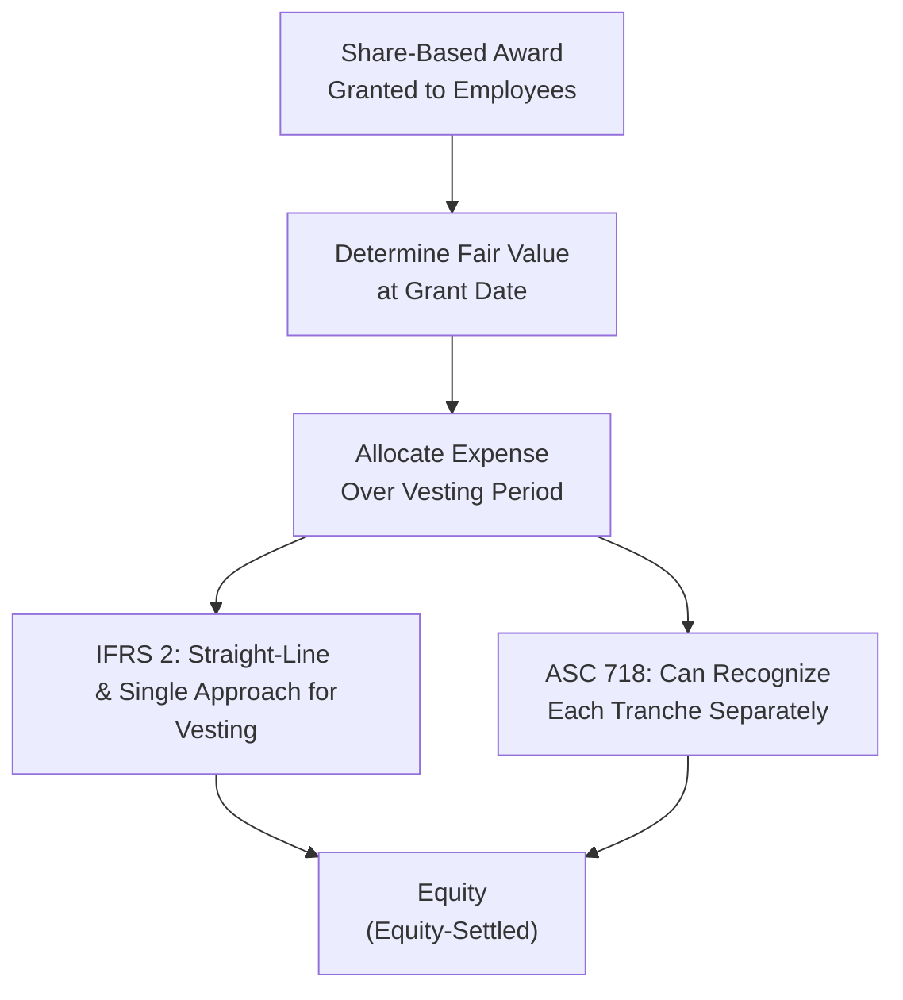

## Overview and Context

Well, I can’t count how many times I’ve heard people say, “Wait, under IFRS, do we capitalize that cost or just expense it?” And every time, I want to grin and say, “Ah, it’s share-based payments—time to really dig into IFRS 2 vs. FASB ASC 718!” That’s normally when they either shrug or run for the coffee machine. But seriously, IFRS (International Financial Reporting Standards) and US GAAP (Generally Accepted Accounting Principles) each offer unique spins on how companies should account for share-based compensation. These differences might appear subtle at first glance, but they can create some pretty big ripples through financial statements—especially for executive compensation packages that include stock options or performance share units.

This section will focus on those differences, including expense recognition across the vesting period, navigating modifications (like when a company changes vesting conditions), distinguishing between liability and equity classification, measuring fair value, and dealing with forfeitures. We’ll also look at how these differences translate into variations in reported EPS, operating income, and net income. Plus, we’ll walk through a quick scenario that might show up in a CFA Level II vignette—so you can be prepared to spot which accounting standard a vignette might reference. Let’s jump right in.

## Recognition of Expense Over the Vesting Period

One of the main things both IFRS 2 and ASC 718 (US GAAP) agree on is that share-based payment expense must be recognized systematically over the vesting period. But exactly how does each framework define and measure the expense?

Under IFRS 2 (Share-Based Payment):
• Companies generally measure the fair value of equity-settled awards (e.g., stock options, restricted shares) at the grant date and “lock in” that value for accounting purposes.  
• The total grant-date fair value is then expensed over the vesting period—some folks call this a “straight-line” approach if the awards vest evenly.  
• The entity recognizes compensation expense each reporting period, with a corresponding credit to equity (for equity-settled awards).  

Under ASC 718 (Compensation—Stock Compensation) in US GAAP:
• Measurement is also at the grant date for equity-settled awards, using a fair value approach that’s conceptually similar to IFRS 2.  
• Many companies use the straight-line method if the award vests on a service basis. However, for graded vesting schedules, US GAAP has a bit of flexibility in how expense is allocated.  
• Just like IFRS, the offset to the expense is an entry to equity when it’s equity-settled.  

So far, so good—no major shockers there. One subtlety is that IFRS often prefers a single, consistent approach to expensing (straight-line over the vesting period), whereas US GAAP can let you accelerate expense for each tranche when you have a graded vesting schedule. This difference can lead to earlier recognition of compensation expense under US GAAP in some scenarios.

Below is a visual flowchart summarizing how a share-based award flows through IFRS vs. US GAAP at a high level:



## Modifications to Awards

Now, life happens—executives leave, new performance metrics rise to prominence, or the Board decides to accelerate vesting. Modifications to share-based awards are a pretty hot topic because the company needs to recalculate fair values or re-determine the vesting period under certain conditions.

### IFRS Perspective (IFRS 2)

• If the modification increases the fair value of the award (unlucky for accountants, beneficial to employees), IFRS requires that incremental fair value to be recognized as additional compensation expense over any remaining vesting period.  
• If the modification reduces the fair value, IFRS says you can’t reverse what’s already been recorded; so you typically do not “back out” the previously recognized expense.  
• For accelerated vesting, the entity recognizes the remaining unrecognized expense immediately in the period of modification.

### US GAAP Perspective (ASC 718)

• Generally, the accounting for modifications under US GAAP is similar—companies measure the incremental fair value from the modification date and record any increase in expense.  
• However, there can be differences in how performance conditions are treated, especially if a performance condition’s probability of vesting changes.  
• Both IFRS and US GAAP require clear disclosure about modifications in the footnotes.

## Cash-Settled vs. Equity-Settled

When an award can be settled in cash or shares, there’s this classic question: “Should we treat it as equity or a liability?” IFRS 2 and ASC 718 have slightly different thresholds.

### IFRS Approach

• IFRS calls it a “cash-settled share-based payment” when the entity is required (or effectively required) to settle in cash. This triggers liability treatment, which is remeasured at fair value at each reporting date until settlement.  
• If the entity has the discretion to settle in shares and no obligation to settle in cash, it’s typically equity-settled.  

### US GAAP Approach

• ASC 718 is fairly consistent, but in practice, US GAAP can have specific rules around “redeemable shares” or put/call features that might shift classification.  
• If it’s probable or likely that you’ll settle in cash, or if employees have the right to demand cash, it becomes a liability.  

## Fair Value Measurement Inputs

Both IFRS and US GAAP require:
• Option pricing models such as Black-Scholes or binomial methods.  
• Assumptions on volatility, dividend yield, expected term, and risk-free rate.  

A subtle difference is that IFRS 2 emphasizes a “market-based” measure for service and non-market performance conditions, while US GAAP uses similar frameworks. But in daily practice, you’ll see a lot of alignment in how companies measure fair value—so the big differences usually come down to how they handle changes over time.

## Forfeitures and True-Ups

Here’s a big one that often causes confusion: do we estimate forfeitures (the people who quit or fail performance hurdles) upfront or recognize them as they occur?

• IFRS once required the expense to be recognized for only the awards expected to vest. That typically meant companies would estimate forfeitures at the grant date and adjust as needed each period.  
• US GAAP also requires an estimate of forfeitures, but it allows an accounting policy election to account for them as they happen instead of estimating up front.  

In practice, these differences can lead to slightly different patterns of expense recognition over time. Perhaps you can imagine applying for a job at a multinational. If they follow IFRS, you might see one pattern of compensation expense; if they follow US GAAP, you might see another. Over multiple years, the sums could end up in roughly the same place, but the annual path can vary.

## Presentation of Share-Based Compensation in Financial Statements

### Income Statement

• Under IFRS, the charge (expense) is typically recorded in the functional areas where the related employee costs are also recorded—so possibly in SG&A or R&D, etc.  
• US GAAP is the same in principle, so you’ll see similar line items impacted.  

### Footnotes

• IFRS 2 requires disclosures about the nature and extent of share-based payment arrangements, how fair values were determined, and the impact on profit or loss.  
• ASC 718 has parallel requirements, though US GAAP is known for more granular breakdowns—especially around assumptions used in option pricing models.  
• Both sets of standards want users to understand the magnitude and nature of share-based compensation.

## Comparability of EPS, Operating Income, and Net Income

Now for the key question: does any of this matter if you’re just scanning a company’s EPS or net income? Absolutely. Differences in how expenses are recognized or remeasured can shift the final reported figures, sometimes in surprising ways. Imagine two competing companies, each awarding their executives fairly similar stock option packages, but one reports under IFRS, the other under US GAAP. You might see differences in:

• The timing of when compensation expense is recognized (especially for graded vesting).  
• The magnitude of restatements if modifications occur.  
• The potential swings in liabilities if the award is cash-settled.  

From an analyst’s perspective, it’s crucial to read the footnotes for share-based compensation to gauge how much is hitting the income statement and whether an IFRS vs. US GAAP approach might be causing a timing mismatch.

## Quick Illustration: Basic Expense Calculation

Let’s say a company grants 1,000 restricted shares to an executive, with a grant-date fair value of $20 per share, vesting over four years. Ignoring forfeitures and modifications for a moment, a simple formula for the annual share-based compensation would be:

 \text{Annual Expense} = \frac{\text{Fair Value per Share} \times \text{Number of Shares}}{\text{Vesting Period}}. 

Thus,


\text{Annual Expense} 
= \frac{20 \times 1,000}{4} 
= \$5{,}000.


Under both IFRS and US GAAP, you’d normally recognize \$5,000 of expense each year for four years. But if the vesting schedule is graded (like 25% vests each year), US GAAP might allow an accelerated approach that front-loads the expense. IFRS tends to keep it at \$5,000 each year, absent any modifications or changes in forfeiture estimates.

## Practical Vignette Scenario

Imagine for your Level II exam that you come across a vignette about an executive who received 2,000 performance-based share units. The performance condition is tied to achieving a certain EPS target by the end of Year 3. Midway through Year 2, the compensation committee changes the EPS target. So:

• If it’s IFRS, you’d remeasure any incremental fair value because a new performance target might alter the probability of vesting and expected payout.  
• If it’s US GAAP, you’d check if you’ve increased the total fair value or changed the probability that performance conditions will be met. That difference would be recognized prospectively if it results in additional expense.  

The exam question might ask you to determine which standard is in use (based on how they treat the performance condition changes), and then to calculate the new share-based compensation expense for the year. Be prepared to highlight how the footnotes disclose the awarding changes and any recognized modifications.

## A Short Anecdote on Implementation

I remember one CFO telling me, half in jest, “We decided to accelerate vesting so we’d get all that expense out of the way this quarter.” Well, that might be a strategy if you’re prepared for a higher expense in one short period. However, if you’re an analyst comparing year-to-year results, such modifications can seriously distort performance trends. IFRS or US GAAP may let you do it, but the clarity in disclosure is essential—otherwise, ratio analysis can get messy.

## Best Practices and Common Pitfalls

• Watch for “half-baked” assumptions in volatility or expected terms. If the entity’s prior share price movements suggest high volatility, but the footnotes show a low volatility assumption, that’s a red flag to investigate.  
• Keep an eye on whether the company is using “accelerated expense recognition” in a graded vesting schedule (often seen in US GAAP) vs. straight-line.  
• If the company modifies the awards multiple times in a year, be ready for layered sets of incremental fair value calculations.  
• Don’t forget that if it’s a cash-settled award, that liability can bounce around with the stock price—leading to additional P&L volatility under both IFRS 2 and US GAAP.  

## Quick Python Snippet for an Expense Calculation

Let’s say you’re a finance analyst who wants to project quarterly expenses for a set of share-based awards. Here’s a tiny, simplistic Python snippet that calculates total expense for each quarter, factoring in an estimated forfeiture rate:

```python
num_shares = 5000
grant_date_fv = 15.0  # grant date fair value per share (USD)
vesting_period_quarters = 12  # over 3 years
estimated_forfeiture_rate = 0.05  # 5% forfeitures

effective_shares = num_shares * (1 - estimated_forfeiture_rate)

quarterly_expense = (grant_date_fv * effective_shares) / vesting_period_quarters

print(f"Quarterly share-based compensation expense: ${quarterly_expense:,.2f}")
```

Of course, IFRS or US GAAP specifics might tweak how we handle that forfeiture estimate, but you get the idea.  

## Impact on Ratio Analysis and EPS

Executive compensation—particularly stock-based comp—affects your top-line operating income, net income, and ultimately EPS. If one company’s standard or policy choices pull more expense into earlier years, you may see lower early-period EPS. Over time, though, the differences might wash out. Still, as a Level II candidate, you should consider normalizing results across standards if you’re doing peer comparisons, especially if the peers are in different jurisdictions.

## Exam Relevance

In the CFA exam, share-based compensation questions often come packaged as item sets, where you’ll see partial financial statements, footnote excerpts, and a narrative about the awarding process. You might be asked to:
• Calculate total compensation expense under IFRS vs. US GAAP.  
• Identify the classification of an award (liability vs. equity) and its impact on reported financials.  
• Adjust your analysis for modifications or accelerated vesting.  
• Evaluate the effect on financial ratios (like Return on Equity or Debt/Equity) when share-based awards flip from equity to liability classification.  

When you see references to IFRS 2 or ASC 718 in that footnote, that’s your clue that you’re dealing with share-based payments. Keep an eye on how the question frames forfeiture assumptions—this often hints at whether the standard is IFRS or US GAAP.

## Final Thoughts

As you can see, IFRS 2 vs. US GAAP differences for share-based compensation aren’t always colossal, but they matter enough to create confusion and significantly affect comparability. So, if you’re analyzing a firm’s compensation strategy—or preparing to ace your CFA exam—understanding these nuances is huge. And remember, whenever you see those footnotes about stock options, restricted stock units (RSUs), or performance shares, pay close attention to how they’re valued and recognized. It may just be the difference between an extra point on the exam or a crucial insight into a company’s financial well-being.

## Test Your Knowledge: IFRS vs US GAAP Differences for Executive Compensation



### Under both IFRS and US GAAP, when should the fair value of equity-settled share-based awards generally be determined?

- [ ] At the end of the vesting period  
- [x] At the grant date  
- [ ] At the exercise date  
- [ ] At the end of the reporting period  

> **Explanation:** Both IFRS 2 and ASC 718 measure equity-settled awards at the grant date, expensing them over the vesting period.

### Which of the following statements best describes a potential difference in expense recognition for a graded vesting schedule?

- [x] US GAAP may allow accelerated expense recognition by tranche, whereas IFRS usually applies a straight-line approach  
- [ ] IFRS requires accelerated expense recognition by tranche, whereas US GAAP requires straight-line recognition  
- [ ] Both IFRS and US GAAP mandate accelerated expense recognition for each individual tranche  
- [ ] Neither IFRS nor US GAAP permits accelerated expense recognition  

> **Explanation:** Although both standards are similar in many respects, US GAAP allows a more flexible approach, often resulting in front-loaded expense for graded vesting—whereas IFRS typically uses a single, straight-line allocation.

### If a share-based award can be settled in either cash or shares at the discretion of the issuer, how is it generally classified under IFRS?

- [ ] Always a liability  
- [x] As equity if the entity can settle in shares without obligation to pay cash  
- [ ] As liability if settlement is solely at the entity’s option  
- [ ] As partial equity and partial liability  

> **Explanation:** Under IFRS, if the entity is not obligated to settle in cash, the award is typically classified as equity-settled. However, facts must be assessed to confirm no effective requirement to settle with cash.

### Under IFRS 2, what happens if an award is modified in a manner that increases its fair value?

- [ ] No additional expense is recognized because the original grant date fair value is locked in  
- [ ] The entire expense recorded to date is reversed to reflect the new fair value  
- [x] The incremental fair value is recognized as additional compensation expense over the remaining vesting period  
- [ ] The old award is cancelled, and a new award is issued with fresh accounting  

> **Explanation:** If the modification increases the fair value of the award, IFRS 2 recognizes the incremental increase over any remaining vesting period.

### Under ASC 718 (US GAAP), when performance conditions change, what is the appropriate treatment?

- [ ] Adjust compensation expense retroactively to the original grant date  
- [x] Reassess and recognize (or reverse) expense prospectively if the probability of vesting changes  
- [ ] Defer all expenses until the final performance outcome is known  
- [ ] Disclose but do not adjust any recognized compensation expense  

> **Explanation:** Under US GAAP, if a performance condition changes (e.g., becomes more or less probable), any change in estimated total expense is recognized prospectively.  

### How do both IFRS 2 and ASC 718 treat the subsequent measurement of equity-settled awards?

- [x] No remeasurement of equity-settled awards after the grant date  
- [ ] Fair value is updated each reporting period  
- [ ] Awards must be remeasured if the company’s stock price declines  
- [ ] A cumulative true-up is booked at the end of the vesting period  

> **Explanation:** Generally, once the fair value has been established at the grant date, equity-settled awards are not remeasured.  

### Which of the following potential differences may arise from IFRS vs. US GAAP in share-based compensation?

- [x] The pattern of expense recognition if a graded vesting schedule is used  
- [ ] The requirement to disclose share-based payment details in footnotes  
- [x] The estimation and recognition of forfeitures  
- [ ] The general need to measure fair value using an option pricing model  

> **Explanation:** IFRS and US GAAP both mandate fair value methods and thorough disclosures, but the manner and timing of forfeiture recognition and the approach to graded vesting can differ.

### Under IFRS, how are forfeitures of awards generally accounted for?

- [ ] They are ignored until the awards are actually forfeited, and then recognized  
- [x] They are estimated at the grant date and adjusted prospectively if actual forfeitures differ  
- [ ] They must be fully recognized as expense immediately  
- [ ] They are not mentioned in IFRS 2  

> **Explanation:** IFRS 2 requires companies to estimate forfeitures at the grant date and update the estimate if actual forfeitures deviate, adjusting expenses accordingly.

### If a share-based payment is cash-settled, which standard(s) require remeasurement at each reporting date?

- [ ] Neither IFRS nor US GAAP require remeasurement for cash-settled awards  
- [x] Both IFRS and US GAAP require remeasurement for cash-settled awards  
- [ ] Only IFRS requires remeasurement for cash-settled awards  
- [ ] Only US GAAP requires remeasurement for cash-settled awards  

> **Explanation:** Under both IFRS 2 and ASC 718, cash-settled share-based payments are considered liabilities and must be remeasured to fair value at each reporting date.

### When comparing net income across two companies, one reporting under IFRS and another under US GAAP, is it possible that share-based compensation differences can affect comparability?

- [x] True
- [ ] False

> **Explanation:** Timing and classification differences—especially regarding forfeitures, modifications, or graded vesting—can cause disparities in the reported compensation expense and thus impact net income.



## References, Further Reading, and Resources  
• International Accounting Standards Board (IASB) IFRS 2, “Share-Based Payment.”  
• FASB ASC Topic 718, “Compensation—Stock Compensation.”  
• EY. “US GAAP vs. IFRS: Share-based payment comparisons.”  

These references are a great starting point if you want more insights into the finer points of IFRS and US GAAP, plus they provide plenty of illustrative examples that can sharpen your exam readiness. Good luck, and remember—mastering the nuances of share-based compensation accounting can really set you apart in both the CFA exam and your professional practice!
