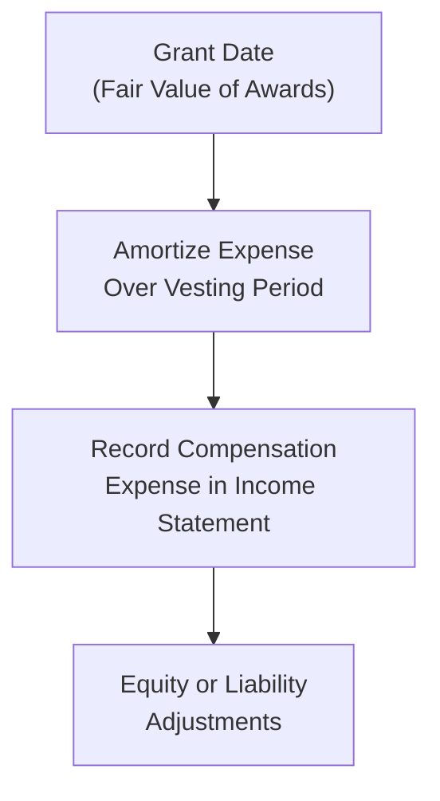

## Scenario Overview

Imagine you’re analyzing a mid-sized technology company, QuazarTech. The newly hired CEO is offered an executive compensation package featuring stock options and restricted share units (RSUs) tied to specific performance metrics. This is exactly the kind of scenario you might see in a CFA exam vignette. By carefully sifting through footnotes, proxy statements, and management discussions, you uncover the structure: the CEO receives 50,000 options with a strike price of $40, plus 20,000 RSUs that vest if revenue growth meets or exceeds 10% annually for three years.

You might think, “Hey, that sounds pretty normal for an executive plan,” and you’d be right. But the exam could ask you to figure out how all this hits the income statement, whether the plan truly aligns executives with shareholders, or if it stokes short-term stock price manipulations. Understanding these nuances is key to nailing an item-set question on executive compensation. 

## Key Incentive Plan Structures

There are many ways to incentivize executives, but the most common ones include:

• Stock options: The right to purchase company shares at a predetermined strike price.  
• Restricted share units (RSUs): Shares granted, but subject to vesting conditions (like performance targets or time-based vesting).  
• Performance share units (PSUs): Similar to RSUs, but vesting depends on hitting specific performance benchmarks (earnings, revenue, etc.).  

Generally, these have one aim: aligning the executives’ fortunes with longer-term shareholder value creation. But if the performance metrics are too narrowly focused (e.g., just short-term EPS), there’s a risk that executives might prioritize quick results over sustainable growth.

## Accounting for Share-Based Awards

Under both IFRS and US GAAP, share-based awards are expensed on the income statement over the vesting period, using the fair value at grant date. However, you’ll notice slight differences in details:

• IFRS (IFRS 2): Requires fair value measurement at grant date and the expense is recognized over the vesting period, adjusted for the likelihood of achieving performance conditions.  
• US GAAP (ASC 718): Similar approach, though certain modifications apply for graded vesting schedules or performance-based conditions.  

At a high level, you track the fair value of these instruments as they vest, and that cost flows through compensation expense. Let’s visualize this in a simple diagram:

The awarding of share-based compensation can also affect the denominator in EPS calculations. Management will usually highlight these effects in the footnotes, especially for diluted EPS. If you’re reading a vignette that references “treasury stock method” or “if-converted method,” that’s your cue to break out the calculator.  

## Multi-Year Projection Example

Picture QuazarTech’s three-year plan. We’ll take a simplified approach to illustrate how compensation expense and dilution appear over time.

- At the start of Year 1 (Grant Date), the fair value of one option is $10, and the fair value of one RSU is $45.  
- The 50,000 options fully vest after three years of continuous service. The 20,000 RSUs vest if revenue growth ≥ 10% for two straight years within that three-year window.  
- Total fair value at grant for the options: 50,000 × $10 = $500,000.  
- Total fair value at grant for the RSUs: 20,000 × $45 = $900,000.  

Let’s assume the company expects 100% probability of meeting the performance condition for RSUs (a big assumption, but let’s go with it for simplicity). Then the total compensation cost is $1.4 million to be recognized evenly across three years (assuming a simple, straight-line basis).

Year-by-Year Snapshot:

| Item                     | Year 1         | Year 2         | Year 3         | Total Over Plan |
|--------------------------|----------------|----------------|----------------|-----------------|
| Options Expense          | $166,667       | $166,667       | $166,666       | $500,000        |
| RSUs Expense            | $300,000       | $300,000       | $300,000       | $900,000        |
| Total Comp Expense       | $466,667       | $466,667       | $466,666       | $1,400,000      |
| Shares Potentially Issued| 70,000         | -              | -              | 70,000          |

(We show all potential shares in Year 1 for illustration, but in reality, they’d vest across years; this might appear differently as time passes. For exam purposes, focus on how the total potential dilution is 70,000 shares.)

Now, how does this affect EPS? If QuazarTech had net income of $10 million and 1 million basic shares outstanding, basic EPS would be $10 per share. But with these awards, you might have to assume an extra 70,000 shares upon exercise/vesting under the treasury stock method. This bumps your denominator to 1,070,000 shares (roughly), dropping diluted EPS to about $9.35.  

For the exam, you’d typically be asked to:

• Calculate share-based compensation expense in each year.  
• Adjust net income by that expense (which is $466,667/year, for instance).  
• Compute diluted EPS by factoring in the additional shares.

## Potential Conflicts of Interest

Sadly, not every compensation plan fosters perfect alignment with shareholders. Here are a few pitfalls:

• Short-term manipulations: If the performance metric is short-term (e.g., next quarter’s net income), executives might cut R&D or do cookie-jar accounting to meet that target.  
• Excessive risk-taking: A plan tied to share price can prompt bold moves or high-leverage strategies to drive the stock upward in the near term, ignoring long-run consequences.  
• Performance goal “sandbagging”: Management sets easily attainable benchmarks to guarantee vesting.  

As a CFA candidate, you need to identify these warning signs. Vignette footnotes might mention unusual accounting treatments, large cost cuts, or sudden changes in capital structure that temporarily inflate share price.

## Evaluating Plan Effectiveness

The big question is, “How well does this plan align with genuine long-term value creation?” A robust plan encourages executives to act like owners, taking measures that pay off over multiple years. Common best practices:

• Balanced performance metrics: Combine financial (EPS, EVA) with strategic (customer satisfaction, market share).  
• Clawback provisions: Let the company reclaim compensation if results were achieved using misleading tactics.  
• Reasonable vesting schedules: A vesting horizon of three to five years discourages short-termism.  
• Transparent footnotes: Detailed disclosures on assumptions, revaluations, and performance triggers help investors gauge risk.  

## Step-by-Step Approach to the Vignette

When you see an item set question on executive compensation, you might feel overwhelmed. But trust me—there’s an efficient method:

Read the scenario carefully: Identify key instruments (options, RSUs, PSUs) and the vesting triggers (time-based vs. performance-based).  
Check the accounting policy: Confirm if the question references IFRS or US GAAP. Pay attention to the mention of “graded vesting” or “straight-line.”  
Look for fair value data: The question often gives you assumptions like volatility, strike price, or expected life of options. They might also note discount rates.  
Grasp the timeline: Determine over how many years the expense is recognized. This helps you allocate the annual compensation charge.  
Calculate diluted EPS: Use the treasury stock method for stock options, the if-converted method for convertible debt or convertible preferred shares, and so on.  
Evaluate governance issues: Notice if performance metrics encourage short-term or questionable behavior.  
Conclude: Provide a final assessment of plan effectiveness, plus any red flags such as misalignment between management and shareholders.  

In exam item sets, each question might ask:  
• “What’s the compensation expense recognized in Year 1?”  
• “What’s the impact on diluted EPS in Year 3?”  
• “Which statement best describes potential governance concerns?”

## Implementation Pitfalls

While the theory is straightforward, real companies introduce complexities:

• Changing performance probabilities: If the chance of meeting the revenue growth threshold suddenly plummets from 80% to 40%, IFRS demands you re-estimate how much of that expense is recognized (though IFRS 2 has specific guidelines on reversing only the portion that’s no longer expected to vest).  
• Modifications: If the company re-prices the options after the share price tanks, that triggers new calculations.  
• Lack of clarity: Footnotes might bury critical details like strike prices, re-pricing clauses, or extra “make-whole” grants if performance fails.  

On the exam, watch out for these twists. They love testing your ability to adapt to partial vesting or changed assumptions midstream.

## Conclusion

An incentive plan’s design can make or break the alignment between executives and shareholders. By grasping how compensation expense flows through the income statement, how it affects EPS, and which performance triggers are in place, you’ll be positioned to judge both the plan’s financial impact and its governance implications. Keep an eye out for footnote disclosures, pay close attention to IFRS vs. US GAAP nuances, and don’t forget that short-term metrics can tempt executives to game the system.

Remember, the best approach to an executive pay vignette is a step-by-step breakdown: identify the instruments, check the fair values, allocate expenses, and compute diluted EPS. Then ask yourself: does this plan create a true owner’s mindset, or does it push for fleeting stock bumps?

## References and Further Reading

• CFA Institute Learning Ecosystem for Level II (Share-Based Compensation sections).  
• Corporate Proxy Statements (DEF 14A) on the SEC’s EDGAR database for real-life examples of executive pay.  
• McKinsey & Company. “Executive Compensation and Corporate Governance: Insights and Case Studies.”  
• IFRS 2: Share-Based Payment.  
• US GAAP (ASC Topic 718): Stock Compensation.  

## Test Your Knowledge: Executive Compensation Plans and Outcomes



### Under both IFRS and US GAAP, share-based compensation is generally measured at grant date and:
- [x] Expensed over the vesting period based on fair value.
- [ ] Kept off the balance sheet until fully vested.
- [ ] Recognized as an expense only when employees exercise the options.
- [ ] Capitalized as an intangible asset.

> **Explanation:** Both IFRS and US GAAP require recognizing compensation expense for share-based awards over the vesting period, based on the fair value at grant date.

### Which of the following is most likely to increase a firm’s reported compensation expense under a stock option plan?
- [x] An increase in the estimated probability of meeting performance conditions.
- [ ] A decrease in employee turnover assumptions.
- [ ] A decrease in the grant-date fair value of the shares.
- [ ] A decision to forfeit previously granted shares.

> **Explanation:** If performance conditions are more likely to be met, the firm is required to expense a higher proportion of the grant’s fair value. Lower turnover assumptions might also increase expense, but not necessarily more than meeting performance conditions.

### Under the treasury stock method of calculating diluted EPS for stock options, which scenario leads to greater dilution?
- [x] A lower exercise price relative to the current market price.
- [ ] A lower current market price relative to the exercise price.
- [ ] Higher expected forfeiture rates over the vesting period.
- [ ] Higher dividends declared by the company.

> **Explanation:** When the exercise price is lower than the current market price, more shares must be assumed to be issued under the treasury stock method, increasing the denominator in the EPS calculation and causing greater dilution.

### If a firm uses a straight-line vesting approach for RSUs under IFRS 2, the firm will:
- [x] Recognize compensation expense equally in each year of the vesting period.
- [ ] Recognize all compensation expense in the final year.
- [ ] Recognize compensation expense only when performance targets are exceeded.
- [ ] First capitalize, then expense upon vesting.

> **Explanation:** With straight-line vesting, the total fair value of the RSU grant is allocated evenly over the vesting period.

### Which of the following performance metrics is most likely to create a short-term manipulation risk if used in isolation?
- [x] Quarterly EPS growth.
- [ ] Five-year average return on invested capital (ROIC).
- [ ] Three-year rolling EVA measure.
- [ ] Customer satisfaction index.

> **Explanation:** Quarterly EPS is relatively easy to manage through short-term decisions (e.g., delaying expenses, cutting R&D). Longer-term benchmarks or qualitative measures are less susceptible to short-term manipulation.

### Which of the following might best mitigate the risk of executives focusing on short-term gains at the expense of long-term value?
- [x] Setting a multi-year vesting period and including a clawback clause.
- [ ] Paying 100% of bonuses in cash every quarter.
- [ ] Linking executive options only to the daily stock price movement.
- [ ] Allowing executives to choose their performance targets.

> **Explanation:** Multi-year vesting and clawback provisions encourage long-term thinking and penalize manipulation or short-term focus. 

### An executive’s stock options were initially granted with a 30% chance of meeting the performance condition. Mid-plan, the firm updates the probability to 60%. The under IFRS 2 treatment typically requires:
- [x] Increasing the cumulative recognized expense from grant date to reflect the new probability.
- [ ] Reversing all previously recognized expense and starting from scratch.
- [ ] Recognizing the additional expense only if the options are exercised.
- [ ] Keeping the original probability assumption for expense computations.

> **Explanation:** If the probability of meeting performance conditions changes, IFRS adjusts the recognized expense cumulatively to date on a prospective basis.

### A board of directors sets an extremely low sales growth target for vesting. This plan may lead to:
- [x] Minimal risk for forfeiture, higher likelihood of automatic vesting, and a weaker alignment with shareholder interests.
- [ ] A more nuanced performance-based approach that fosters long-term strategies.
- [ ] Increased net income volatility due to larger changes in option valuations.
- [ ] Higher short-term stock price but lower expense recognition.

> **Explanation:** Setting an easily attainable performance target reduces the alignment with shareholders, as executives are almost guaranteed to vest.

### In analyzing a vignette, you discover that an executive’s compensation plan depends solely on share price performance over the next 12 months. This plan:
- [x] May encourage short-term actions to boost the stock price but could undermine longer-term value.
- [ ] Likely aligns perfectly with long-term shareholder interests.
- [ ] Reduces the need for footnote disclosures about compensation expense.
- [ ] Eliminates the dilution effect entirely since it is time-based only.

> **Explanation:** Tying compensation solely to a one-year stock price performance can distort managerial decision-making toward short-term gains.

### True or False: Under the treasury stock method, if the exercise price of stock options is higher than the average market price of the stock, the options are considered anti-dilutive and typically do not reduce diluted EPS.
- [x] True
- [ ] False

> **Explanation:** If the exercise price is above the market price, the options would not be in-the-money and hence are generally excluded from diluted EPS calculations as they do not cause additional dilution.


