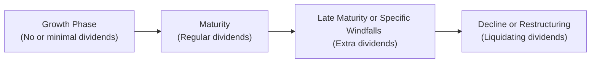

## Introduction

It’s pretty common for companies to discuss dividends and how they might fit into their broader financial strategy—especially once they’re generating steady cash flow. A solid understanding of the different types of dividends, from standard “regular” payouts to more unusual “liquidating” actions, can help you interpret how firms signal their future prospects and priorities. In fact, I remember chatting with a friend who was CFO for a mid-sized manufacturing firm: whenever the board considered changing dividend policy, it sparked a debate over not just the numbers, but the message such a move might send to the shareholders (and the market at large). In this section, we’ll explore why categorizing dividends properly matters, how each category fits into the corporate life cycle (think growth phase versus maturity), and what that might mean for tax and regulatory implications.

## Understanding the Categories of Dividends

There may be a temptation to lump all “dividends” together, but the reality is that investors (and regulators) view them quite differently depending on purpose, frequency, and sustainability. Broadly speaking, dividends fall into three main categories:

• Regular Dividends: Recurring payments, often quarterly.  
• Extra (or Special) Dividends: One-time (or seldom) payouts that go beyond the usual regular dividend.  
• Liquidating Dividends: Distributions that return part of the original investment, often during asset sales or corporate wind-downs.

Below is a high-level summary table of these three dividend types. It’s handy to keep them in mind, and you’ll often see item-set questions in the exam referencing a firm’s newly declared “special” dividend or an unusual “liquidating” event.

| Dividend Type           | Purpose                                              | Frequency     | Key Signal                                                             |
|-------------------------|------------------------------------------------------|---------------|------------------------------------------------------------------------|
| Regular Dividend        | Ongoing profit distribution                          | Periodic (e.g., quarterly) | Confidence in sustaining earnings                                  |
| Extra (Special) Dividend | Supplemental, non-recurring distribution            | One-time or irregular | Unexpected surplus cash or extraordinary gains, not guaranteed to recur |
| Liquidating Dividend    | Return of contributed capital or proceeds from asset sales | Event-based    | Often signals partial or full wind-down of operations                   |

Let’s take a deeper look at each type and how they come into play in corporate finance.

## Regular Dividends

### Definition and Characteristics
Regular dividends are the bread and butter of dividend policy. A board of directors, in coordination with finance and treasury teams, decides to pay these dividends to shareholders typically on a fixed schedule (quarterly, semi-annually, or annually). The amounts tend to be relatively steady or gradually increasing over time. Management usually likes to avoid cutting regular dividends because that move can carry a negative signal about future earnings expectations.

### Example: The Utility Sector
If you look at the utility sector—like major electricity or water companies—they’re known for stable, predictable cash flows. They almost always adopt a consistent quarterly dividend policy and tend to prioritize stable increments over time. Shareholders in these companies often rely on dividends as a primary component of their returns, and thus any change can make waves in share price. In fact, many retirees hold utility stocks specifically for the dividend income. Think about how you’d present that scenario in an exam item set: the case might mention stable cash flows, a conservative culture, and a board reluctant to reduce dividends even during mild downturns.

### Signaling and Market Perceptions
Paying a consistent regular dividend conveys confidence in future earnings. Investors view it as management’s declaration that the company’s core operations can reliably generate excess cash. Unsurprisingly, slashing a regular dividend—even by a small fraction—often leads to a sharp negative share-price reaction. On the positive side, a modest year-over-year increase in the regular dividend can reinforce the impression of stable growth.

## Extra (Special) Dividends

### Definition and Purpose
Sometimes a firm has an especially profitable year, maybe due to an unexpected windfall, asset sale, or some one-time project that generated surplus cash. In such a scenario, the board may declare an extra dividend—often also called a “special dividend.” Although denominated similarly, it differs from a regular dividend in that it’s not intended to recur at the same level or frequency.

### Real-World Examples
Take technology firms that accumulate large cash reserves following a product launch that outperformed forecasts. Instead of making that surge in profit a permanent addition to the regular dividend—which might set unsustainable expectations—they could return some of the excess via a special dividend. Another example is a mining company that experiences a sudden spike in commodity prices, generating higher profits only for a few quarters. Recognizing this short-term bump, the firm might choose a one-off payout.

### Signaling Effect
An extra dividend can indicate that management is optimistic (at least in the near term) about its cash position. However, it doesn’t necessarily imply that recurring earnings will remain at those levels. In investor eyes, a one-time dividend might signal good fortune but not necessarily a permanent upward shift in corporate profitability. In exam vignette scenarios, you might see references to “non-recurring gains” on the income statement—this is frequently a clue for you to anticipate a possible special dividend (rather than an upgrade to the regular dividend).

### Corporate Life Cycle Considerations
As companies mature, they might less frequently invest all retained earnings into growth initiatives. Some older or more stable companies occasionally find themselves with surplus cash, yet lacking the same high-return investment opportunities that younger, growth-oriented firms might have. In such cases, a special dividend can be a way to reward shareholders without over-committing to a new higher baseline payout.

## Liquidating Dividends

### Definition and Background
This category might sound a bit ominous. A liquidating dividend is what a company pays out to shareholders from proceeds that essentially return part of the invested capital. You’ll see this when a firm sells off a major business segment or sometimes when it’s going out of business entirely.

### Case Study: Asset Sale
Picture a scenario where a conglomerate decides to spin off or sell its fastest-growing division. If the sale fetches a healthy sum and management chooses not to reinvest the proceeds into other lines of business, they might distribute part of that sales price in the form of a liquidating dividend. Because a portion of the dividend directly derives from business assets (rather than ongoing operating earnings), it indicates the partial wind-down of those assets.

### Significance for Shareholders
From a shareholder’s perspective, liquidating dividends can be bittersweet. On one hand, you’re getting real capital back in your pocket. On the other hand, it may mean the company has fewer growth prospects, or that it’s stepping away from an industry that once contributed to earnings. In a total liquidation scenario, the final liquidating dividend is effectively the last distribution you’ll get—reflecting the final carve-up of the company’s net assets.

### Tax Implications
Depending on the jurisdiction, certain parts of a liquidating dividend may be treated differently for tax purposes. Often, some portion is categorized as a return of capital, which might reduce the shareholder’s cost basis instead of generating immediate taxable income. It’s crucial to check local tax codes; on the CFA exam, you might face a country-specific rule about liquidating dividends. While the real test question wouldn’t revolve solely around memorizing national tax laws, it might mention general treatments or ask what portion of the dividend is a return of capital.

## Dividend Policy and the Corporate Life Cycle

A firm’s choice among these dividend types usually ties closely to where it stands in the corporate life cycle. Fast-growing companies often skip paying dividends altogether, preferring to reinvest earnings into expansions, acquisitions, or research and development. Once growth slows and predictable cash flow emerges, management may initiate a regular dividend to provide a stable yield to shareholders. That’s typical in more mature sectors.

Extra (special) dividends can pop up at transitional moments—like after a sudden jump in earnings or a reallocation of strategic priorities. Liquidating dividends typically appear when a company is divesting or liquidating a line of business or has reached the end of its life cycle. Here’s a simplified depiction of how different dividend decisions might map onto the corporate life cycle:

You can imagine how each arrow in the diagram represents a shift in the company’s strategic use of cash—first fueling growth internally, then shifting to consistent returns of capital, and finally releasing capital as the firm begins to scale back or wind down.

## Signaling Effects and Market Reactions

Financial theory suggests that dividends can send signals to the market about a firm’s underlying health. Let’s break down some typical signals:

• Higher regular dividend: Suggests management expects a permanent increase in earnings or is comfortable with a higher baseline distribution.  
• Extra dividend: Management has surplus cash on hand, but might see it as a temporary situation.  
• Liquidating dividend: Signals a reduction or cessation of certain operations. Investors often interpret it as the company acknowledging fewer future growth opportunities in that domain.

### When Signals Get Confusing
It’s worth noting that the real world doesn’t always align nicely with theory. There might be times when a firm declares an extra dividend for reasons that don’t clearly match good fortune—maybe they felt compelled by activist shareholders to “unlock value.” Or, the board might prefer to distribute capital to avoid a takeover attempt by limiting the firm’s cash war chest. Exam item sets often include conflicting data points: for example, a footnote might reveal that the so-called “optimal sign” from a special dividend is overshadowed by negative guidance on next quarter’s earnings. As a candidate, keep your eyes peeled for the bigger context behind the distribution decision.

## Tax Implications of Different Dividends

### General Tax Treatment
Most jurisdictions place dividends in a category subject to either a dividend-specific tax rate or taxed as ordinary income, depending on local laws. However, the specifics can vary dramatically. In some frameworks, double taxation occurs (first at the corporate level, then at the personal level). In other places, such as countries with imputation systems, shareholders receive a credit for corporate taxes paid.

### Liquidating Dividends and Return of Capital
A crucial distinction is that, quite often, part or all of a liquidating dividend may not be taxed in the same manner as ordinary dividends because it may be considered a return of capital. Generally, this reduces the shareholder’s basis in the stock. From an exam perspective, be prepared for a question that asks you to compute the portion of the “dividend” that is actually a return of capital—especially if the exam vignette highlights a major partial liquidation.

## The Ex-Dividend Date and Price Adjustments

When a company declares any form of dividend—regular, extra, or liquidating—a specific timeline ensues. Folks often get confused about who exactly receives that dividend if they buy or sell the stock around the announcement. Take a look at this simplified diagram for the general timeline:

- Declaration Date: The board of directors formally declares the dividend, including details such as amount and payment date.  
- Ex-Dividend Date: The crucial cutoff for claiming the dividend. If you buy shares on or after the ex-dividend date, you typically will not receive the upcoming payout.   
- Record Date: The date on which the company examines its list of registered shareholders for dividend eligibility.  
- Payment Date: The date on which shareholders actually receive the money.

On the ex-dividend date, the share price will generally drop by roughly the amount of the dividend at market open—because new buyers no longer have rights to that upcoming payment.

## Industry-Specific Dividend Practices

### Utilities and Consumer Staples
These industries typically enjoy stable cash flows and consumer demand that doesn’t fluctuate wildly. Consequently, they’re known for high dividend payout ratios and a consistent dividend policy. Major changes to the regular dividend are unusual, and if they do happen, it’s often a big story.

### Technology and Growth Sectors
Companies in technology or biotech often reinvest a large portion of their earnings (if they have earnings) back into R&D or expansions. Dividend yields in these sectors can be relatively small, and the few times they pay out might be a special distribution after a major liquidity event.

### Cyclical Industries
Sectors like mining, oil & gas, or airlines can experience unpredictable profit swings. Investors in these corporations might see extra dividends during boom times, or see the company hold off on dividends altogether in down cycles. Liquidating dividends can also appear in cyclical industries when unprofitable segments get shuttered.

## Regulatory Constraints and Legal Environment

Corporate governance laws in many areas prevent firms from paying dividends when such payouts would jeopardize solvency. For instance, if the distribution would render the firm’s balance sheet insolvent, it may be prohibited. Additionally, debt covenants in existing loans or bond agreements sometimes restrict dividend payments above certain financial ratios. Here are three common constraints you might see:

1. Net Income Requirement: Company must show retained earnings sufficient to cover the dividend.  
2. Solvency Requirement: Directors have a fiduciary responsibility to ensure the dividend doesn’t leave the firm unable to meet obligations.  
3. Covenant Restrictions: Loan documents might specifically cap dividend amounts if leverage ratios exceed certain thresholds.

When you read item-set vignettes dealing with potential dividends, watch for mention of debt covenants or a leveraged capital structure. This can hint that a big extra dividend might not be allowed—or if it is allowed, it might trigger some penalty or require a waiver.

## Putting It All Together for Exam Scenarios

Within the CFA® Level II context, you’re likely to see a scenario where a corporation is evaluating a policy shift in its dividend. The vignette might include details such as:

• Cash on balance sheet after a large asset sale.  
• Pressures from activist shareholders to return cash.  
• Management debates whether to signal long-term profitability by raising regular dividends or just issue a special dividend.  
• The possibility of partial liquidation or spinoff, prompting a liquidating dividend.  
• Forecasted earnings or free cash flow constraints that limit ongoing payouts.

You’ll be expected to parse these details and infer the appropriate course—for instance, whether a one-time special dividend is more suitable than a permanent increase in the regular dividend. Or, if the discussion revolves around a major business line divestment, you might anticipate a liquidating dividend. Watch for subtle hints as to what the board of directors is signaling and how the market might react.

## Summary

Categorizing dividends correctly can reveal a lot about a firm’s strategic intent:

• Regular dividends signal consistent profitability and a commitment to returning value on a periodic basis.  
• Extra (special) dividends distribute surplus, non-recurring income, often indicating confidence in near-term cash availability but not necessarily a permanent shift.  
• Liquidating dividends go beyond distributing earnings—they return a portion of invested capital, indicative of a partial or full wind-down of operations or segments.

Recognizing which dividend type is in play can help you better interpret a corporation’s financial health, maturity stage, and management’s perspective on future opportunities. Of course, the exam will test your ability to see through the details and pick up on the subtle clues in vignettes—particularly around historical earnings trends, the stated reasons for any windfalls, and the constraints lurking in the capital structure or regulatory environment.

Understanding these distinctions also ties into subsequent areas of study, such as Dividend Policy Theories (Section 2.2) or Payout Policy analysis (Chapters 3 and 4). If you’re comfortable with the nuances of each dividend type, you’ll more easily navigate complex item-set questions regarding capital management choices and their implications.

## References / Further Reading

• Graham, J.R. & Harvey, C.R. (2002). “How Do CFOs Make Capital Budgeting and Capital Structure Decisions?” Journal of Applied Corporate Finance.  
• CFA Institute: Dividend Policy reading in the Level II curriculum (search “CFA Level II Corporate Issuers Dividends”).  
• Damodaran, A. (2012). Investment Valuation: Tools and Techniques for Determining the Value of Any Asset, 3rd Edition. Hoboken, NJ: Wiley.  
• Online resource: Investopedia’s Dividend Policy section:  
  https://www.investopedia.com/terms/d/dividendpolicy.asp  

## Mastering Dividend Types: Test Your Knowledge



### A company in a mature sector has been paying a stable quarterly dividend for years. Recently, it announced a one-time $2.00-per-share cash distribution attributed to a large asset sale. How would this distribution most likely be classified?

- [ ] Regular dividend  
- [ ] Liquidating dividend  
- [x] Extra (special) dividend  
- [ ] Script dividend  

> **Explanation:** A one-time distribution following a sizeable asset sale is typically treated as an extra (special) dividend. A “liquidating dividend” would generally involve returning capital from a dissolution of some portion of the company’s business, but in many scenarios, headquarters will classify the cash payout as a special dividend if the core ongoing business remains intact.

### A technology startup has never declared a dividend, preferring to reinvest all earnings. In which phase of the corporate life cycle is such a firm most likely operating?

- [x] Growth phase  
- [ ] Maturity phase  
- [ ] Decline phase  
- [ ] Reorganization phase  

> **Explanation:** Firms in a growth phase seldom pay dividends because they allocate earnings toward expansion, R&D, and capital expenditures to fuel future growth.

### Which of the following best describes a liquidating dividend?

- [ ] A taxable payment backed by stable operating earnings  
- [ ] A dividend paid only in common shares  
- [ ] A payment tied to shareholders’ reinvestment plans  
- [x] A return of investors’ capital due to asset sales or partial wind-down  

> **Explanation:** Liquidating dividends involve returning some portion of the company’s original capital to shareholders and generally signify either a partial or full liquidation of assets.

### A firm in the consumer staples industry rarely changes its dividend policy. Which rationale best explains this tendency?

- [ ] They are fully reliant on special dividends to signal positive cash flows  
- [x] They seek to project stability and consistency to clients and investors  
- [ ] They do not earn sufficient profit to vary their dividend payouts  
- [ ] They can only distribute dividends at the year’s end  

> **Explanation:** Consumer staples firms typically maintain stable, predictable dividends to assure shareholders of consistent earnings. Changing the payout policy too often is usually seen as a negative signal or might raise concerns about financial stability.

### Which statement is most accurate about the signaling effect of an extra (special) dividend compared to a permanent dividend increase?

- [x] An extra dividend typically signals a temporary availability of surplus cash  
- [ ] An extra dividend implies an ongoing rise in dividend levels  
- [ ] An extra dividend usually leads to a long-term increase in the payout ratio  
- [ ] An extra dividend rarely reflects unexpected earnings growth  

> **Explanation:** A special or extra dividend generally suggests that management has surplus cash right now but does not anticipate maintaining that higher payout indefinitely, in contrast to raising the regular dividend.

### Which of the following is least likely a direct factor that limits a firm’s ability to pay dividends?

- [ ] Loan covenants in place  
- [x] Recent drop in the firm’s share price  
- [ ] Solvency requirements in corporate law  
- [ ] Negative retained earnings balance  

> **Explanation:** While a recent share price drop might indicate some business challenges, it is not typically a direct legal, contractual, or regulatory barrier to paying dividends. Loan covenants, solvency laws, and negative retained earnings are direct constraints.

### Under which circumstance is a liquidating dividend most commonly distributed?

- [ ] Following a short-term surge in profits due to a price increase  
- [x] After the sale of a major operating division with no intention of reinvestment  
- [ ] As an ongoing replacement for regular dividends  
- [ ] As a routine step to maintain stable payouts  

> **Explanation:** Liquidating dividends often align with the partial or total wind-down of business segments. If the firm sells a major arm of its operations and plans no reinvestment, the resulting payment can be treated as a return of capital.

### On the ex-dividend date, a firm’s share price typically declines by approximately which amount?

- [ ] The prior quarter’s net earnings per share  
- [x] The dividend amount  
- [ ] Market price multiplied by the payout ratio  
- [ ] Twice the next quarter’s dividend  

> **Explanation:** When the stock goes ex-dividend, new buyers no longer qualify for the upcoming dividend, so the share price usually decreases by about the dividend amount to reflect the lost entitlement.

### What is a common reason for a mature company to choose an extra dividend instead of permanently increasing its regular dividend?

- [ ] It has determined its long-term earnings growth rate is significantly higher  
- [ ] It aims to shift investor focus toward future share buybacks  
- [ ] It is legally required to issue a dividend in the years it is profitable  
- [x] It wants to avoid setting an unsustainable higher baseline for future payouts  

> **Explanation:** Declaring a temporary extra dividend allows the firm to distribute surplus cash without committing to a future obligation. Making a permanent increase in the regular dividend heightens market expectations for consistent or growing payouts, hence pushing management to stick to that higher amount even if conditions worsen.

### A CFO wants to ensure that dividend payments do not violate the company’s debt covenants. Which measure is the CFO most likely to monitor?

- [x] Compliance with leverage ratios specified in the loan agreement  
- [ ] Price-to-earnings ratio on the ex-dividend date  
- [ ] Current year’s budget for capital expenditures  
- [ ] Short-term interest rates set by the central bank  

> **Explanation:** Many debt covenants include provisions that restrict dividends if the firm’s leverage or coverage ratios are too high (or too low). Monitoring these specified ratios is crucial to avoid breaching covenants.


