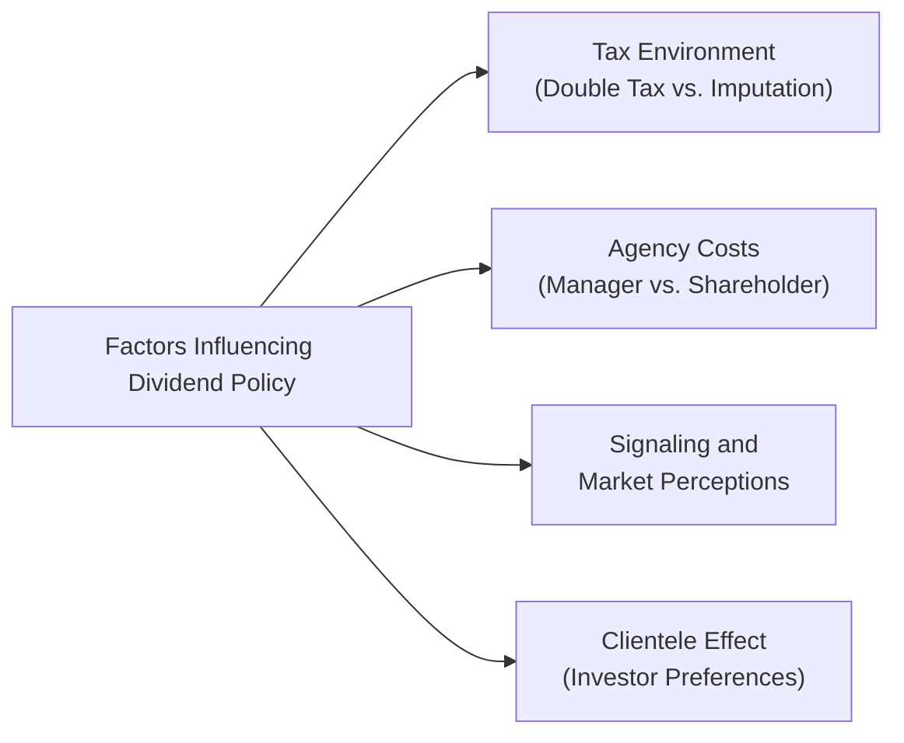

## Introduction
Let’s dive into one of the central topics in corporate finance: dividend policy theories. If you ever find yourself at a business lunch, you’ll inevitably hear folks talk about how a company’s dividend signals good performance—or maybe how it doesn’t matter at all. Early on in my career, I personally remember trying to gauge whether my small biotech holdings would pay a dividend, only to find that their “big product pipeline” meant they plowed most cash right back into R&D, leaving me with hopes of capital gains instead.

In this section, we explore the conceptual frameworks behind dividend policy decisions—particularly looking at Modigliani–Miller’s “dividend irrelevance” proposition, the Bird-in-Hand theory (which basically says folks prefer a dollar today rather than two tomorrow), and how taxes steer investor clienteles toward high- or low-payout strategies. We’ll splice in real-world frictions like transaction costs, corporate governance, and different regulatory environments. Finally, we’ll wrap in some item-set style questions to sharpen your exam techniques.

## Modigliani–Miller (MM) Dividend Irrelevance Theory

### Basic Premise in a Perfect Market
Modigliani–Miller (MM) introduced their famous dividend irrelevance hypothesis in 1961, building on the assumption of a perfect capital market—one where there are no taxes, no transaction costs, and no information asymmetry. Under these ideal conditions, they argue that:
1. A firm’s value is determined by the firm’s earning power and the risk of its underlying assets, not by how it distributes income.
2. Investors can create “homemade dividends” by selling a portion of their shares for cash if they desire income, or reinvesting dividends if they prefer capital gains.

In their view, whether a firm pays a high dividend or a low dividend doesn’t intrinsically change the firm’s total economic pie. If the total pie remains the same, the slices (e.g., dividends vs. retained earnings) are just different ways of cutting that pie.

### Real-World Frictions
Real markets do have taxes, transaction costs, and information asymmetry. Also, managers often know way more about the company’s future prospects than investors do. So, in the real world, a few things can interfere with MM’s tidy argument:

• Taxes: Dividends in many jurisdictions are taxed at a certain rate, sometimes less favorably than capital gains or vice versa.  
• Transaction Costs: Selling shares to generate cash can be expensive if you’re dealing with brokerage fees or price impact.  
• Agency Costs: Managers might invest retained earnings in unprofitable projects unless disciplined by paying out dividends.  
• Signaling Effects: Changing a dividend can signal new information about the firm’s future.  

Despite these limitations, MM’s theory remains invaluable as a baseline to test whether changes in dividend policy truly move the needle on valuation once you factor in real-world complexities.

## Bird-in-Hand Theory

### Gordon’s Rationale
The Bird-in-Hand theory—often linked to Myron Gordon—suggests that investors place a higher valuation on near-certain dividend payouts rather than uncertain future capital gains. In other words, a dividend in hand is worth more than capital gains “in the bush.” This viewpoint stems from the idea that capital gains rely on the firm making profitable reinvestments or relying on stock-market optimism, both of which are uncertain.

### The Role of Uncertainty
Take an investor—maybe a retiree—who needs dependable cash flow. They might see a dividend as a tangible return they can count on to cover living expenses. If the company holds on to its earnings, the investor can only hope that share prices will rise, which isn’t guaranteed. So you can imagine how certain investor groups (like retirees, pension funds) place a premium on stocks that consistently distribute dividends.

In practice, this theory counters MM by highlighting the psychological (and sometimes financial) comfort that a dividend provides. Of course, we have to be careful because the real world includes big players like institutional investors who vary widely in their needs and preferences.  

## Tax Impact and the Clientele Effect

### Double Taxation vs. Imputation
How taxes are structured around dividends versus capital gains can hugely affect a firm’s payout decision. Under a classic “double taxation” environment, companies pay corporate income tax on their profits, and then shareholders pay personal income tax on dividends. This can discourage high dividend payouts because it whittles away a greater portion of return. 

However, some countries use an imputation system, where part or all of corporate taxes on dividends are credited back to shareholders. In such systems, the effective tax on dividends is often lower, making dividend payouts relatively more attractive.

Let’s illustrate this briefly:

1. In a pure double-tax system, if the corporate tax rate is 30% and the personal tax on dividends is 20%, then $1.00 of pre-tax corporate income first becomes $0.70 after corporate tax, and then you lose another 20% ($0.14) on the dividend payment, leaving $0.56 in the shareholder’s pocket.  
2. In an imputation system, that same $0.70 might be partially “grossed up” so that the shareholder receives a credit for corporate taxes already paid, lowering or eliminating the second layer of taxation.

### The Clientele Effect
Because shareholders with different tax brackets will have different preferences, you get what we call the clientele effect:  
- Investors in high tax brackets might favor companies that distribute lower dividends to reduce ongoing tax liabilities, preferring capital gains (which might be taxed at a lower rate or are deferred until the sale of the shares).  
- Pension funds or tax-exempt investors may prefer high-dividend companies because they don’t feel the tax sting.  
- Some retired individuals might also prefer current dividend income (despite possible higher taxes) simply for the certainty and cash flow.

So, if you’re a company with a certain base of loyal investors, you might adopt a dividend policy that aligns with their tax preferences. That’s not just guesswork: in practice, many companies gather feedback through investor relations or pay attention to the market reaction to dividend announcements to sense “what kind of investors” they tend to attract.

## Real-World Frictions, Agency Costs, and Governance
In addition to taxes and transaction costs, companies face internal agency costs. If managers have a pile of idle cash, they might be tempted to invest in risky or non-value-adding pet projects or grant themselves perks. Paying out dividends can serve as an internal check—managers must return to the capital markets to raise new equity if they want to fund expansions, thus subjecting themselves to market scrutiny. On the flip side, if growth opportunities are abundant, paying out too much cash can hamper strategic investments.

So, corporate governance structures (e.g., board composition, activism from large shareholders) often help shape dividends. For instance, a strong board may push for robust dividend payouts if they think the company is hoarding more cash than necessary. Meanwhile, managers might prefer retention if they believe reinvestment is likely to yield a stronger return. In heavily regulated industries (think utilities), dividends are often used as a sign of financial stability.

## Empirical Evidence and Observations
In reality, dividend policy is shaped by a blend of these theories:

• **Taxes and Clienteles:** We do see high-dividend stocks in the portfolios of tax-exempt entities like pension funds, which supports the clientele effect.  
• **Signaling:** Markets often respond heavily to changes in dividend policy; announcements of dividend cuts are typically read as negative signals of future earnings.  
• **Agency Costs:** Firms flush with free cash flow typically adopt some sort of distribution policy (dividends or buybacks) to reduce the risk of managerial mischief.  

I remember analyzing a transport company years ago—this was when they were pivoting to new e-commerce logistics. They decided to slash dividends and reinvest in expanding their delivery fleet. The share price took a hit initially (investors worried about a sudden change in policy) but rebounded after the market saw the subsequent boost in earnings from the new strategy. It was a classic interplay of Bird-in-Hand (some wanted dividends now) vs. a strategic growth reinvestment (Bird-in-Bush with bigger potential nests).

## Integrating Dividend Policy with WACC
At CFA Level II, you’ll find that dividend policy can factor into the WACC discussion. Although at first glance they’re separate topics—WACC is about costing out capital—an overly high dividend might mean the firm must raise more external equity or debt. This can change the relative weights in the capital structure and potentially shift the firm’s overall cost of capital.

• If a firm consistently distributes large dividends but also has many profitable growth projects, it might have to issue new equity (potentially diluting shares) or take on more debt (raising the interest burden).  
• Conversely, a low-dividend or zero-dividend policy might preserve earnings for reinvestment, possibly reducing the need for new financing.  

So, from an integrated corporate finance stance, management must weigh the potential cost of raising capital externally (including floating costs, underwriter fees, or interest payments) against the strategic and signaling benefits of paying dividends.

## Numerical Example: Comparing After-Tax Outcomes
Below is a simple illustration of how tax structures can change the net proceeds for an investor.

Assume:
• Corporate tax rate: 25%  
• Dividend tax rate: 15%  
• Capital gains tax rate: 10%  
• Before-tax corporate income per share: $2.00  

### Scenario 1: Pay Out Entire Earning as Dividend
• After 25% corporate tax: $1.50 available.  
• Pay entire $1.50 as dividend.  
• Shareholder tax on dividend = $1.50 × 15% = $0.225  
• Net to shareholder = $1.275  

### Scenario 2: Reinforce Retained Earnings (No Dividend)
• $0 direct dividend.  
• Stock price presumably reflects added retained earnings. If the shareholder sells later, only capital gains are taxed at 10%.  
• However, total net proceeds might be higher if the retained earnings eventually yield a capital gain, but the outcome is less certain.

Clearly, a shareholder’s preference depends on how soon they need the cash and how heavily dividends are taxed relative to gains, as well as the firm’s reinvestment outlook.  

## Visualizing Factors Influencing Dividend Policy
Below is a simple Mermaid diagram capturing some major considerations:

Each arrow leads to a different dimension you’d consider when formulating or analyzing a firm’s dividend policy. Of course, real decision-making also involves synergy or conflict among these factors.

## Practice with an Integrated Vignette Approach
When tackling dividend policy questions on the CFA exam, you might see a vignette that provides partial data about a firm’s new tax environment, changes in shareholder base, or statements from management about how they plan to use their cash flows. Watch out for these subtle hints:

• Does the company have upcoming massive capital expenditures? If so, a big dividend might be questionable unless they’re confident they can also fund those projects.  
• Is the firm in a regulatory environment that discourages or encourages dividends (like a utility sector)?  
• Are key shareholders in a high or low tax bracket? Are they tax-exempt?  

It’s all about synthesizing these details to figure out whether the firm’s announced dividend policy shift is consistent with the Bird-in-Hand rationale, or aligning with a specific tax clientele, or perhaps simply reflecting a new capital structure stance.

## Best Practices and Pitfalls
• **Avoid Over-Simplification**: Real-world dividend policy is rarely driven by just one theory.  
• **Check Cash Flows**: Always see if the firm can actually afford the dividend, especially if you see a mismatch between net income and operating cash flow.  
• **Consider Signaling**: Dividend initiations and cuts are major corporate events that can cause market reaction.  
• **Tax Complexity**: Realize that tax rules differ across jurisdictions and can influence cross-border investors differently.  

## Final Exam Tips
1. **Link to WACC**: On the exam, a question might ask you to evaluate changes in a firm’s capital structure after a dividend is declared. Know how to pivot quickly between dividend policy concepts and cost of capital calculations.  
2. **Look for Contradictions**: If a vignette says the firm has “exciting, profitable growth projects” but also announces an abnormally high dividend, that might be contradictory. What’s the trade-off?  
3. **Remember Agency Costs**: Keep an eye out for mention of “excessive managerial perks” or “free cash flow” in the passage—those are your cues that agency costs are at play.  
4. **Time Constraints**: The exam’s item sets can be dense. Practice scanning for the key data relevant to dividend policy (e.g., stated tax rates, the firm’s strategic outlook, the new board members’ viewpoints).  
5. **Bird-in-Hand vs. MM**: On a conceptual level, always ask: Which “world” are we in—an idealized one (MM) or a real one with risk-averse managers/investors wanting immediate returns?

## Glossary
• **Modigliani–Miller Dividend Irrelevance Theory**: Argues that dividend policy does not affect firm value in a perfect market.  
• **Bird-in-Hand Theory**: Proposes investors prefer the certainty of current dividends to uncertain future capital gains.  
• **Clientele Effect**: Different investor groups are attracted to different dividend policies based on their tax or income preferences.  
• **Tax Imputation System**: Corporate taxes on dividends are credited or partially credited to the shareholder, reducing double taxation.  
• **Double Taxation**: Corporate earnings are taxed at the corporate level, and then dividends are taxed again at the shareholder level.  

## References / Further Reading
• Modigliani, F., & Miller, M. (1961). “Dividend Policy, Growth, and the Valuation of Shares.” Journal of Business.  
• Gordon, M. (1963). “Optimal Investment and Financing Policy.” Journal of Finance.  
• Brealey, R., Myers, S., & Allen, F. (2020). Principles of Corporate Finance (13th ed.). McGraw-Hill.  
• Poterba, J., & Summers, L. (1984). “New Evidence That Taxes Affect the Valuation of Dividends.” Journal of Finance.  

## Test Your Knowledge: Dividend Policy Theories Quiz



### 1. According to the Modigliani–Miller dividend irrelevance theorem (under perfect market assumptions), the value of the firm is:
- [ ] Directly linked to the firm’s dividend payout ratio.
- [x] Independent of the firm’s dividend policy.
- [ ] Strictly a function of retained earnings only.
- [ ] Strongly driven by the level of taxes on dividends.

> **Explanation:** MM asserts that in a world with no taxes, transaction costs, or other frictions, dividend policy does not affect the firm’s total value.

### 2. The Bird-in-Hand theory suggests that:
- [ ] Higher dividends are too risky for conservative investors. 
- [ ] Firms should never pay dividends if they have growth opportunities.
- [x] Investors value current dividends more than uncertain future capital gains.
- [ ] Higher dividends only matter in taxable accounts.

> **Explanation:** Bird-in-Hand emphasizes investors’ preference for a certain dividend today rather than relying on uncertain future gains.  

### 3. In a classic double-taxation system, dividends are:
- [ ] Taxed only at the corporate level.
- [ ] Not taxed at the shareholder level.
- [x] Taxed at both the corporate and shareholder levels.
- [ ] Grossed up, then credited to the shareholder.

> **Explanation:** In double-taxation regimes, corporate profits are first taxed at the corporate level, then dividends are taxed again at the investor’s personal rate.

### 4. Which of the following is a key assumption behind the Modigliani–Miller (MM) dividend irrelevance theory?
- [ ] Varying personal tax rates for dividend income.
- [ ] Informational asymmetry between managers and shareholders.
- [x] No transaction costs exist in the market.
- [ ] Investors have limited options for reinvesting cash flows.

> **Explanation:** MM theories require assumptions such as no transaction costs, no taxes, and symmetric information to show that dividends do not affect value.

### 5. The clientele effect in dividend policy means:
- [x] Investors self-sort into companies that match their dividend preferences. 
- [ ] Companies can freely change dividend payout with no market impact.
- [x] Tax-exempt entities may prefer high-payout firms.
- [ ] Dividend announcements always have no effect on share price.

> **Explanation:** Because investors have varying tax rates or income needs, they choose stocks whose dividend policies align with their preferences, creating distinct clienteles.

### 6. One practical reason a firm might pay dividends, even if it has growth opportunities, is:
- [x] To reduce free cash flow under manager control and mitigate agency costs.
- [ ] To accelerate capital expenditures beyond the firm’s strategic plan.
- [ ] Because interest rates are always lower than the cost of equity.
- [ ] To maximize the tax burden on shareholders.

> **Explanation:** Paying dividends can reduce agency costs by limiting the amount of free cash flow management can spend on non-profitable or excessive projects.

### 7. A key difference between a double-taxation system and an imputation system is:
- [ ] Higher transaction costs in double-taxation systems.
- [ ] No corporate tax in double-taxation systems.
- [x] Tax credits are provided to shareholders in imputation systems to offset corporate taxes paid.
- [ ] Dividends are taxed at the same rate as capital gains in imputation systems.

> **Explanation:** In an imputation system, shareholders receive credits for the corporate tax the company has already paid, reducing or eliminating the second layer of tax on dividends.

### 8. If a firm chooses to pay out a high percentage of its earnings as dividends, this may:
- [x] Require the firm to issue new equity if it also wants to fund new investments.
- [ ] Automatically reduce its cost of debt.
- [ ] Have no impact on capital structure decisions.
- [ ] Eliminate the firm’s exposure to interest rate changes.

> **Explanation:** A higher payout means less internal financing for new projects, so firms may need external financing, affecting capital structure decisions.

### 9. Under the Bird-in-Hand perspective, investors may react negatively to a dividend cut because:
- [x] They interpret it as a sign of potential cash flow problems.
- [ ] Dividend policy is irrelevant to them.
- [ ] They think the firm has found better uses for the cash.
- [ ] Tax rates on capital gains are always lower than on dividends.

> **Explanation:** The Bird-in-Hand thesis highlights the certainty effect; a cut in dividends is often read by investors as a negative signal about the firm’s ability to generate cash.

### 10. True or False: Modigliani–Miller’s dividend irrelevance theory and the Bird-in-Hand theory can both be correct depending on market assumptions and investors’ risk perceptions.
- [x] True
- [ ] False

> **Explanation:** MM’s theory relies on a universe of no frictions, where dividend policy does not matter. Bird-in-Hand addresses real-world uncertainty and investor preferences. Both can be valid frameworks under different assumptions.


