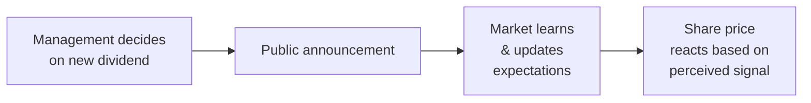

### Introduction
If there’s one thing I remember vividly from my first real experience in equity research, it’s that dividends can make the market downright emotional—yes, emotional. You’d see this sudden wave of excitement when a company announced a higher dividend than expected, and an instant wave of disappointment (or sometimes plain panic) when a dividend got cut. It might sound odd that a simple dividend announcement could stir such strong reactions, but managers often use dividend changes to send signals. In many ways, it’s like a secret code between the boardroom and the investing public.

### Signaling Theory: The Basics
Signaling theory, in the context of dividends, suggests that corporate managers possess private information about the company’s future cash flows and profitability. Rather than spilling all details in public (which they often can’t do for competitive reasons), managers might choose to “speak” through dividends. A higher or more stable dividend often implies that management is confident about sustaining or growing future earnings. On the flip side, a cut or an omission might hint at internal distress or at least the fear of insufficient future cash flow.

Investors are generally eager to interpret these messages. If you think about it, dividends are more than just a cash-based reward; they’re an indicator (sometimes reliable, sometimes not) of what’s happening behind the scenes. This dynamic often leads to immediate price adjustments, as markets incorporate this new information.

### How Dividend Increases Can Signal Managerial Confidence
Let’s say a well-known pharmaceutical company unexpectedly hikes its dividend by 20%. You can almost hear the analysts scramble: “Why would management do that now?” “Are the R&D pipeline results stronger than the market anticipated?” “Are they expecting a surge in cash flows to sustain this higher payout?” If the market collectively concludes that management’s action implies robust future outlook, demand for the stock often jumps, pushing share prices higher.

But as with any signal, context is key. Is the company in a stable or cyclical industry? Does the firm have a pattern of consistent dividend increases, or is this a complete surprise in an otherwise tight-lipped payout history? These nuances shape how the market interprets the announcement.

### Case Study: Dividend Hikes Preceding Expansion
Imagine a manufacturing firm—call it Titan Machining—that’s historically paid out steady dividends over two decades. One quarter, Titan bumps its dividend by 15% and simultaneously announces plans to expand capacity. Investors might interpret this as a strong hint that management has forecast healthier profit margins in the near future, possibly due to new contracts or efficiency improvements. The stock price rallies, but six months later, reality sets in: the expansion projects require more capital than originally forecast, so Titan issues new debt at less favorable rates.

Suddenly, the once-exciting dividend hike looks more precarious. If Titan eventually struggles to meet both its interest expenses and the promised dividend, the market might turn sour. What seemed like a glowing sign might become a cautionary tale about reading too much into a short-term dividend bump.

### Dividend Cuts: Negative Signals and Financial Distress
On the flip side, few events spark immediate concern like a dividend cut—especially an unexpected one. It’s common to see share prices drop within hours (or even minutes) after the announcement. Investors often read a cut as: “Uh-oh, they must be having issues generating enough cash.” The assumption is that management wouldn’t want the negative publicity (and potential stock sell-off) that comes with a cut unless something was seriously off with the company’s finances or outlook.

Still, not all cuts are catastrophic. Sometimes, a dividend cut is part of a deliberate strategy to preserve cash for a strategic acquisition or to reduce debt aggressively—both of which could be beneficial in the long run. But in the short term, markets usually treat the news as negative unless management clearly articulates the internal rationale and convinces investors of the potential upside.

### Bull vs. Bear Markets: Does Context Change the Signal?
Market conditions also matter. In a roaring bull market, where optimism runs high, a company that hikes its dividend tends to receive an extra boost in share price. The environment is already supportive, so the positive signal is amplified. Conversely, in a bear market charged with fear, even a decent dividend increase might not stir much enthusiasm—investors may be too risk-averse or worried about broader economic headwinds.

In some bear markets, a dividend cut might be interpreted more empathetically: “Everyone’s cost-cutting; let’s not panic over one severed payout.” Yet, often the negativity can compound. If a recession is looming and corporate cash flows are under threat across the board, any sign of weakness can become a major cause for concern.

### Sector Norms and Shareholder Expectations
Dividend culture varies widely by sector. Some sectors—like utilities or consumer staples—are known for stable, even unwavering dividend policies. Investors in these sectors often expect consistent payouts. Thus, any deviation sparks big reactions. Technology firms, by contrast, often reinvest heavily in growth; many pay negligible dividends (if any). When a tech startup announces its first dividend, investors might interpret it as a sign of maturity or a pivot toward stable earnings, which can be positive.

In industries where dividends are standard, a failure to keep up with peer payouts can be read as weakness. Meanwhile, in high-growth sectors where dividends are rare, paying out a dividend might raise eyebrows: is the firm running out of profitable projects to invest in?

### Reliability of Dividend Signals
While dividend changes can serve as strong signals, they’re not foolproof. Sometimes management hikes the dividend because of external pressures—such as activist shareholders demanding higher payouts—even if the underlying fundamentals aren’t rock-solid. A short-term spike in investor enthusiasm could be followed by disappointment if future earnings come in below expectations.

It’s also possible that companies maintain or raise dividends by tapping other sources of cash, like taking on more debt or selling assets. In these scenarios, the market might initially respond positively, only to realize later that the firm is eroding its long-term financial health to pay dividends it can’t truly afford.

### Ratio Analysis and Dividend Sustainability
To gauge the viability of a dividend change, investors often look at:

- Dividend Payout Ratio: 
  
  \text{Dividend Payout Ratio} = \frac{\text{Dividends per share}}{\text{Earnings per share}}
  
  This ratio helps us see how much of a company’s profit is being distributed to shareholders. A payout ratio that suddenly jumps from 30% to 80% might raise questions. Is the company comfortable parting with that much cash?

- Dividend Coverage Ratio:
  
  \text{Dividend Coverage Ratio} = \frac{\text{Net Income (or Free Cash Flow)}}{\text{Dividends Paid}}
  
  The higher the coverage ratio, the more secure the dividend. If coverage dips below 1, it implies the firm is paying out more in dividends than it is earning, which is likely unsustainable over time.

These ratios, combined with an understanding of the firm’s cash flow drivers and future earnings potential, provide a more complete picture of whether a dividend bump is a real sign of positive momentum or just a short-lived stunt.

### Visualizing the Signaling Process
Below is a simple flowchart illustrating how a dividend announcement can ripple through the markets:

- Management’s decision is based on private information (e.g., future contracts, cost savings).
- The public announcement is made, and analysts, media, and investors all interpret it in light of current market conditions.
- Investors act on revised expectations for the firm’s profitability, adjusting share prices accordingly.

### Market Efficiency and Dividend Announcements
According to the semi-strong form of market efficiency, public information is rapidly factored into the share price. A dividend announcement, by definition, becomes public the moment it’s released. If the market is reasonably efficient, the share price will adjust quickly, often within hours or minutes, to reflect the news.

But let’s be real: markets can overreact or underreact in the short run. A dramatic sell-off or an exuberant rally can both happen, depending on market sentiment. Over time, though, the fundamentals tend to reassert themselves. If the dividend signal was genuine—indicating that future earnings are indeed strong—the share price might continue to climb. If it wasn’t, the market could correct course.

### Practical Example: Short-Term vs. Long-Term Reactions
Assume a mid-sized retailer, ShopSmart, announces a 10% dividend hike despite soft sales forecasts in the broader retail sector. Within a day, ShopSmart’s stock jumps 5%. Investors reason that management must see better consumer demand ahead or new cost savings that weren’t obvious. But if, after a few quarters, earnings continue to stagnate, investors might question the decision to raise dividends. Eventually, the share price may lose the premium it initially gained, reflecting skepticism about the firm’s ability to sustain that higher dividend.

### Common Pitfalls in Interpreting Dividend Signals
- **Overemphasizing One Data Point:** Treating a single dividend announcement as the be-all-end-all can be risky. Combine it with other indicators like earnings guidance, macro trends, and ratio analysis.  
- **Ignoring Cash Flow Fundamentals:** Even if net income looks strong, keep an eye on free cash flow. Financing dividends through large debt inflows isn’t always healthy for the company’s balance sheet.  
- **Failing to Account for Sector Dynamics:** A dividend hike in biotech means something different than a similar hike in utilities. Always consider the baseline expectations.  
- **Short-Term vs. Long-Term:** The market can react instantly, but the lasting impact depends on actual earnings performance and broader company strategy.

### Item-Set Vignette Applications
CFA Level II item sets might give you a scenario where a CFO is quoted as saying, “We believe our recent product line expansion supports a higher dividend payout.” You could see partial financials showing free cash flow trending upward, while at the same time noticing a spike in the firm’s debt ratio. You’d be asked to assess whether the dividend increase truly indicates long-term strength or if it’s masking a more precarious funding strategy. You might also see share price data for a few weeks post-announcement and need to infer how efficiently the market processed the dividend signal.

### Limitations of Signaling Theory
While signaling is an influential concept, it’s not always ironclad. Why? Because actions that look like signals can be motivated by other factors. Managers might raise dividends simply to gain investor favor or to align with board-member preferences. Sometimes they cut dividends not due to poor prospects but because they see an investment opportunity so compelling that cash retention outweighs the cost of a negative signal. 

Moreover, external factors such as regulatory changes or tax policy shifts can alter the implications of dividend changes. In certain jurisdictions, capital gains and dividend taxes might push companies to prioritize share repurchases over dividends, changing the usual interpretation of a dividend hike or cut.

### Closing Thoughts and Exam Mindset
Dividend announcements can be powerful catalysts for quick share price moves. For the CFA Level II exam, remember to interpret these signals in the broader context—look at the company’s industry, the market climate, and the sustainability of these payouts from a ratio and cash flow perspective. 

When approaching item-set questions:
- Sift through the scenario carefully, pulling out relevant data from the financial statements and management commentary.
- Frame your hypothesis around whether the dividend change is consistent with the company’s fundamentals and any unique conditions described in the vignette.
- Don’t forget that the signal might be a red herring: just because a dividend changed doesn’t automatically mean the company’s fundamentals have changed for better or worse.

The ability to connect the dots—signals, market reactions, financial ratios, sector norms, and potential distortions—is central to mastering dividend policy questions at Level II. 

Remember: not all signals are created equal, and it’s your job to dissect the context to decide if the market’s reaction is truly warranted or just hype.

### References / Further Reading
- Bhattacharya, S. (1979). “Imperfect Information, Dividend Policy, and ‘The Bird in the Hand’ Fallacy.” Bell Journal of Economics.  
- DeAngelo, H., DeAngelo, L., & Stulz, R. (2006). “Dividend Policy and the Earned/Contributed Capital Mix.” Journal of Financial Economics.  
- CFA Institute: Signaling and Dividend Changes reading in the Level II curriculum.  
- Mayo, H. (2019). Basic Finance: An Introduction to Financial Institutions, Investments, and Management, 11th Edition.

---

## Dividend Signaling in Action: 10-Question Quiz



### Which of the following best describes the core idea behind signaling theory in dividend policy?

- [ ] Dividends are primarily a way to redistribute excess cash to bondholders.  
- [x] Managers use dividend changes to convey private information about future earnings.  
- [ ] Dividends are effective only in times of economic expansion.  
- [ ] The tax treatment of dividends is uniform across all jurisdictions.  

> **Explanation:** Signaling theory holds that managers have inside information about the firm and use dividend changes to disclose some of this outlook to the market.

### In a semi-strong form efficient market, a dividend cut announcement would likely lead to which initial outcome?

- [x] The share price adjusts rapidly to reflect the new information.  
- [ ] The share price shows no reaction and remains constant.  
- [ ] The share price declines only after a lag of several weeks.  
- [ ] Investors ignore the announcement entirely.  

> **Explanation:** Semi-strong form efficiency suggests all publicly available information, including dividend announcements, is quickly incorporated into share prices.

### A company widely known for stable dividends announces a surprise 25% dividend increase. What is the most probable immediate market reaction?

- [ ] No noticeable reaction since the dividend is expected to remain stable.  
- [x] An increase in the share price, reflecting management’s perceived confidence in future earnings.  
- [ ] A decrease in the share price due to fears of liquidity issues.  
- [ ] Indifference among shareholders because dividends aren’t relevant to firm value.  

> **Explanation:** In stable dividend-paying firms, a sizable positive change is often interpreted as a signal of growth or strong cash flow expectations.

### Which factor would most likely dampen a positive investor reaction to a dividend hike?

- [ ] Public statements by the CFO confirming strong future growth.  
- [ ] A historically low level of debt on the balance sheet.  
- [x] Recent large debt issuance to fund the dividend increase.  
- [ ] A consistent history of rising dividends.  

> **Explanation:** If the company is relying on significant external borrowing to fund dividend payments, it raises questions about the sustainability of future payouts.

### The dividend coverage ratio is generally calculated by dividing:

- [ ] Earnings per share by dividends per share.  
- [ ] Earnings before interest and taxes by total dividends.  
- [x] Net income (or free cash flow) by total dividends paid.  
- [ ] Operating cash flow by total debt.  

> **Explanation:** Dividend coverage ratio = Net Income (or free cash flow) ÷ Dividends Paid. It measures how comfortably a firm’s income supports its dividend.

### How might a firm’s sector alter the market’s interpretation of a dividend increase?

- [ ] Sector factors are irrelevant to dividend policy.  
- [x] Investors expect higher dividend payouts in certain industries, making changes more or less impactful.  
- [ ] All sectors have the same reaction to dividend changes due to market efficiency.  
- [ ] Sectors like technology always pay high dividends.  

> **Explanation:** Different sectors have different baseline expectations for dividends (e.g., utilities vs. tech), thus altering how the market perceives changes.

### A fast-growing tech firm announces its first-ever dividend. What might investors infer?

- [ ] The firm is likely to experience perpetual hypergrowth.  
- [x] Management believes free cash flow is strong enough to return some capital to shareholders.  
- [ ] The firm has no future investment opportunities.  
- [ ] Tech firms cannot sustain dividends due to high R&D costs.  

> **Explanation:** Initiating a dividend often indicates that the company is generating sufficient cash and perhaps perceives fewer compelling reinvestment opportunities compared to its earlier growth phase.

### Which of the following statements best reflects a limitation of dividend signaling?

- [ ] Markets are incapable of reacting to dividend changes.  
- [x] Some companies might increase dividends using external financing, misleading investors.  
- [ ] Signaling only applies in large multinational corporations.  
- [ ] Dividend policy changes never affect share prices.  

> **Explanation:** A company can mask weaker fundamentals by borrowing to fund a higher dividend, which may provide a misleading signal to investors.

### An investor reviewing two companies’ dividend coverage ratios finds that Company A’s ratio is 1.8 and Company B’s ratio is 0.9. How might this data inform the investor’s reaction to a dividend hike from each company?

- [ ] Both companies likely can sustain higher dividends.  
- [ ] Both companies likely cannot sustain higher dividends.  
- [x] Company A appears more capable of sustaining higher payouts than Company B.  
- [ ] Company B’s lower ratio indicates a more confident management team.  

> **Explanation:** Company A’s coverage ratio > 1.0 suggests it has adequate income to support dividends, whereas Company B is paying out more than it earns.

### True or False: In a bull market, a dividend cut might occasionally be interpreted as a strategic move rather than a negative signal.

- [x] True  
- [ ] False  

> **Explanation:** In certain bullish conditions, investors may accept a dividend cut if the firm convincingly argues that the retained capital will be used for lucrative investments or expansions.


