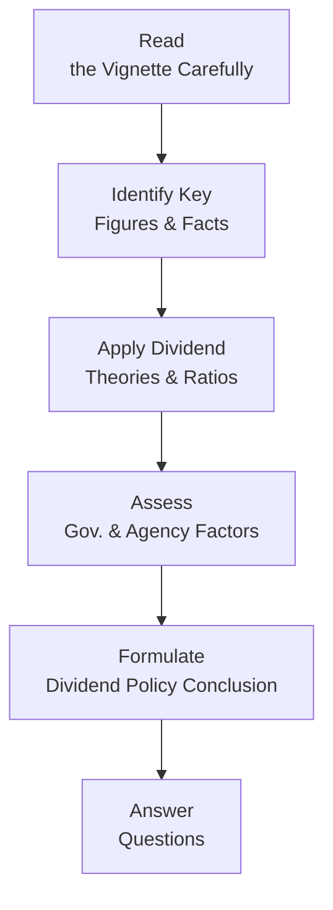

## Introduction

Ah, the simultaneous thrill and dread of a complex vignette in a CFA® Level II exam. I’ll never forget the first time I came across a dividend policy item set that wove together capital structure changes, partial data on free cash flow (FCF), and subtle references to agency conflicts. Seriously, it felt like an information puzzle—some details mattered, others were just red herrings. The good news is: once you discover the blueprint for disentangling these questions, it’s kind of (dare I say) fun.

So let’s talk about how to integrate concepts from earlier sections—Types of Dividends, Dividend Policy Theories, Signaling, Agency Costs, and more—into the real exam scenario. We’ll walk through qualitative and quantitative aspects, highlight common distractions, and practice zeroing in on relevant clues for quick, high-quality analysis. By the end, you’ll (hopefully) feel more confident about tackling multi-layered item sets that revolve around dividend policy.

## Key Themes for Vignette Analysis

### Linking Dividend Theories to Real-World Data
Remember from earlier sections that the leading dividend policy theories include:
• The Modigliani–Miller (MM) proposition (dividends vs. capital gains are irrelevant in a perfect market).  
• The Bird-in-Hand theory (investors prefer certain dividends over uncertain capital gains).  
• The Tax Preference theory (investors in higher tax brackets might prefer capital gains due to taxation differences).  

In a vignette, you might see:
• Manager statements about a “stable dividend policy” or “dividend continuity.”  
• Investors complaining about tax implications of higher payouts.  
• CFO commentary on future expansions or capital investments.  

When you read such narrative fragments, ask yourself: Which dividend policy theory best explains management’s action or inaction?

### Signaling, Agency Costs, and Corporate Governance
We also covered how dividend announcements can signal management’s confidence in future earnings. On the other hand, big dividends can exacerbate agency problems if managers prioritize short-term payouts over profitable long-term investments. Keep these possibilities in mind when the vignette hints at:
• A CFO pushing for more R&D funding (reduced dividend to fund new projects).  
• Pressure from controlling shareholders to maintain (or increase) dividends.  
• A mismatch between official board policy and day-to-day management decisions.  

### The Role of Free Cash Flow
FCF is the bedrock of any sustainable dividend policy. If you notice in the vignette phrases like “excess liquidity,” “ample free cash flow,” or “limited reinvestment needs,” that’s a direct sign to evaluate whether the firm will initiate or boost dividends. Meanwhile, if you see high FCF but also hear about big capital expenditures, there might be conflicting interests: do we pay out or do we invest?

### Time Management
Honestly, some vignettes can be so stuffed with superfluous data—like a note about the CEO’s personal stock holdings or minor details about the firm’s philanthropic efforts—that you have no choice but to skip irrelevant bits. Focus on:
• Net income, payout ratio, coverage ratio.  
• Dividend yield before and after proposed changes.  
• Tax rates or potential changes in the tax regime.  

One big tip: highlight or circle numeric data such as share counts, net income, or dividend amount. You’ll likely need these for a ratio calculation.

### Handling Red Herrings
Exam item sets often throw in ambiguous statements—like the CFO hinting at an impending acquisition that never materializes in the final questions. Be sure you can quickly parse out what’s directly relevant. Ask: “Does it affect the dividend amount or ratio? Does it alter the capital structure or governance stance? If not, ignore it.”

## A Flow for Tackling Dividend Vignettes

Below is a visual representation of the typical sequence you might follow when dissecting a dividend policy vignette. Keep this in mind so you approach each item set systematically instead of haphazardly:

• A → Read the entire vignette at least once for context.  
• B → Pull out relevant data (FCF, net income, existing dividend track record, etc.).  
• C → Recall which theory or ratio helps interpret the data.  
• D → Don’t forget governance issues, possible conflicts, or signals.  
• E → Conclude logically on likely dividend policy changes.  
• F → Address the question prompts one by one.

## Example Vignette: Redwood & Co.

Let’s walk through a condensed item set. Redwood & Co. is a mid-sized firm in the manufacturing sector. The CEO, Ms. Parker, has publicly committed to “gradual, steady growth in dividends,” claiming it signals corporate strength to shareholders. Meanwhile, Redwood’s CFO, Mr. Chen, warns that Redwood’s capital expenditure needs for the upcoming year will nearly triple due to automation plans. Redwood has a history of paying $1.20 per share in annual dividends and has never cut its distribution.  

• Redwood’s current net income: $450 million.  
• Total outstanding shares: 300 million.  
• Free cash flow (to equity): $380 million.  
• Planned capital expenditures next year: $350 million (up from $120 million).  
• Dividend policy statement from Redwood’s board: “We aim to sustain or modestly increase our dividend whenever possible.”  

Additional details (red herrings or not—your call):  
• Redwood’s largest institutional investor is a pension fund with a preference for stable dividend-paying stocks.  
• The CFO is rumored to be leaving next year.  
• Tax rates have remained consistent, though a new tax law might be considered by the legislature next quarter.

### Step-by-Step Reasoning

1. Current Dividend Outflow:  
   • Annual total dividend = $1.20 × 300 million shares = $360 million.  
2. Available FCF:  
   • Redwood has $380 million in free cash flow. That comfortably covers the current $360 million dividend.  
3. Future CapEx Spike:  
   • Next year, Redwood expects $350 million in CapEx, a nearly threefold jump from $120 million. This is a direct competitor for Redwood’s free cash flow.  
4. Potential Dividend Increase?  
   • Ms. Parker wants to maintain the tradition of increasing dividends. But with higher CapEx demands, Redwood’s “excess” free cash flow over the dividend might shrink.  
5. Policy Decision:  
   • Redwood could keep the dividend at $1.20 or slightly increase it. But doing so might reduce internal funding capacity and force Redwood to either (a) take on more debt or (b) cut back on expansions.  

### Interpreting the Vignette for an Exam Question
The question might ask: “Based on Redwood & Co.’s free cash flow constraints and stated dividend policy, how should Redwood respond to the upcoming CapEx needs?” Potential answers could require you to:  
• Conclude whether Redwood should keep the dividend flat, raise it slightly, or slash it.  
• Evaluate if Redwood’s leadership is consistent with a Bird-in-Hand approach or if they’re more aligned with the residual theory (i.e., pay dividends only after all profitable investments are funded).  
• Explain the signal Redwood’s management might be sending by maintaining or altering the dividend.  

You can see how easily a question could combine quantitative math (dividend coverage ratio, payout ratio, changes in FCF) with the qualitative dimension of a rumored acquisition, an unclear shift in tax laws, or the preferences of Redwood’s biggest shareholders.

## Common Pitfalls and Best Practices

• Overlooking Agency Considerations: Sometimes the CFO wants to preserve cash for positive NPV (net present value) projects, but the board might push for higher dividends. Check for that tension—it’s huge.  
• Misreading Signals: A stable dividend may be seen as a strong signal, but if it’s contrary to the firm’s available cash or capital demands, the market might interpret it as reckless or unsustainable.  
• Naïve Tax Assumptions: A mention of a potential tax law might be a distractor if no decisive legislation has been passed yet. Don’t overcomplicate your analysis with incomplete details unless the question specifically asks about them.  
• Time-Management Traps: Watch out for small references that eat up your time. If Redwood’s CFO is leaving next year, that’s probably not immediately relevant to the dividend calculation unless the question explicitly connects the two.

## Another Quick Example: Northern Harvest Mining

Imagine a second scenario: “Northern Harvest Mining” (NHM) is a metals producer. It’s flush with cash after a big commodity price upswing, but the CEO expresses uncertainty about the stability of future earnings (commodity prices may fall next year). Meanwhile, the board faces pressure from activist shareholders wandering whether the firm is hoarding cash unnecessarily.  

Scenario Data:  
• Current net income: $300 million.  
• Cash on hand: $350 million, with minimal debt.  
• Expected capital spending: $30 million.  
• Dividend last year: $0.50 per share on 200 million shares.  
• CEO’s statement: “We’re uncertain about next year’s commodity prices.”  

A question might ask you to reconcile the board’s desire for a special dividend (reflecting extra cash accumulation) with the CEO’s cautious approach to resource uncertainty. Perhaps they propose a one-time special dividend of $100 million or $0.50 per share. Your job is to confirm if that’s feasible, given net income and the capital needs. Then you must decide if it’s consistent with the firm’s stated policy or if it goes against the notion of a stable policy.

## Best Practices for Tackling the Exam

1. Read Methodically:  
   Skim for big numbers first. Then read the narrative for strategic or governance hints.  
2. Annotate and Organize:  
   Under exam conditions, highlight net income, FCF, share count, prior dividend. Put them in an easy-to-see place on your scratch paper.  
3. Map Theories to Actions:  
   Is management following a Residual Dividend Model? Are they signaling confidence by raising dividends in uncertain times? Or is there a conflict with the board or shareholders that might color the final dividend decision?  
4. Don’t Get Lost in Irrelevant Details:  
   If the question doesn’t mention the CFO’s personal ambitions, it’s probably a distractor.  
5. Practice on Timed Mocks:  
   The best way to get good at vignettes is to do them under timed conditions. You’ll cultivate a sense for what’s crucial and what’s a red herring.

## References

• CFA Institute Official Curriculum, Level II: Corporate Issuers – Dividend Policy  
• CFA Institute: Past Level II Mock Exams for Corporate Issuers  
• SchweserNotes™: Dividend Policy Practice Questions  
• AnalystNotes™: Dividend Coverage & Payout Ratios Drills  
• Harvard Business School Case Studies on Corporate Dividend Announcements and Signaling Theory  

## Test Your Skills: Dividend Policy Vignette Mastery



### Question 1

A company pays an annual dividend of $2.50 per share on 100 million outstanding shares. The CFO wants to drastically increase capital spending next year from $150 million to $350 million, funded partly by existing reserve cash. Which ratio or metric should be prioritized to determine if the current dividend is sustainable?

- [ ] Dividend yield
- [x] Dividend coverage ratio
- [ ] EPS before dilution
- [ ] Price-to-book ratio

> **Explanation:** Dividend coverage ratio (e.g., Net Income / Dividends Paid) or an FCF-based coverage measure is most critical for assessing whether the firm can continue paying (or raising) dividends while also increasing capital expenditures.  

### Question 2

Shareholders in a high tax bracket receive higher after-tax returns from capital gains than from dividend income. This preference can be tied to which of the following?

- [ ] Bird-in-Hand theory
- [ ] Residual Dividend Model
- [ ] Agency cost perspective
- [x] Tax Preference Theory

> **Explanation:** Tax Preference Theory states that investors may prefer lower dividends if capital gains enjoy a more favorable tax treatment.

### Question 3

A firm has net income of $500 million, shares outstanding of 200 million, and a dividend payout ratio of 40%. Which final piece of information is needed to confirm the viability of maintaining this dividend?

- [x] The firm’s expected free cash flow or capital spending needs
- [ ] The board’s stance on dividend smoothing
- [ ] The historical trading volume
- [ ] The CEO’s personal ownership stake

> **Explanation:** Even if net income can cover the dividend, the firm’s actual cash demands for operations and capital investments (i.e., FCF) determine if the payout is truly sustainable without debt financing.

### Question 4

Which of the following best exemplifies a “red herring” in a dividend policy vignette?

- [ ] The firm’s largest shareholder is a group of retirees
- [x] Mention of the CFO’s vacation schedule
- [ ] The board’s explicit statement favoring stable dividends
- [ ] The firm’s high free cash flow but uncertain growth projects

> **Explanation:** While large retirees as shareholders or uncertain growth can be relevant to payout decisions, personal info like a CFO’s vacation schedule usually distracts from the real data needed for policy analysis.

### Question 5

Consider a firm that historically followed a stable dividend policy but is now under pressure to raise its dividend due to activist shareholders. Which intangible factor most strongly indicates a potential conflict?

- [ ] The company has moderate net income growth
- [ ] The board is evenly split on how to allocate capital
- [x] The CFO’s open concern about losing liquidity for expansions
- [ ] The firm’s tax rate is significantly lower than its peers

> **Explanation:** If the CFO is publicly worried about liquidity or expansions, that suggests an agency conflict between short-term dividend demands and the firm’s capital requirements for growth.  

### Question 6

A firm’s residual dividend policy states that dividends are paid “only after all profitable investments are funded.” If pro forma statements show an unexpected capital requirement spike, how might the dividend be affected?

- [x] It will likely be reduced or even suspended
- [ ] It will remain unchanged
- [ ] It should remain stable as a signal to investors
- [ ] It should double to attract new shareholders

> **Explanation:** Under a strict residual approach, higher capital investment needs directly reduce the funds available for dividends.

### Question 7

Which statement is most consistent with the Bird-in-Hand theory in a vignette?

- [x] “Paying dividends now gives our shareholders immediate value, without relying on uncertain future share prices.”
- [ ] “We’ll distribute whatever is left after we fund all expansions.”
- [ ] “Our shareholders are in high tax brackets, so they prefer not to receive dividends.”
- [ ] “We only pay dividends when our CFO decides surplus funds are available.”

> **Explanation:** Bird-in-Hand suggests shareholders value prompt, tangible dividends over uncertain future capital gains.

### Question 8

A firm’s current dividend is $0.80 per share, net income is $800 million, and shares outstanding are 1 billion. Management states their intention to raise the payout ratio by five percentage points. Which question is most crucial to assess feasibility?

- [ ] Does the firm have publicly traded bonds?
- [x] Does the firm have sufficient free cash flow for the higher dividend?
- [ ] How many controlling shareholders does the firm have?
- [ ] Has the firm’s credit rating recently changed?

> **Explanation:** Before raising the dividend payout ratio, the firm must ensure it has the free cash flow to sustain that higher payout.

### Question 9

An exam vignette describes a company that continues to pay dividends at historical levels despite several consecutive quarters of negative net income, using debt financing to fund the shortfall. Which concept is best exemplified?

- [ ] Agency cost minimization
- [ ] Residual dividend policy
- [x] Dividend smoothing policy
- [ ] Bird-in-Hand theory

> **Explanation:** Dividend smoothing is when a company maintains a consistent (or gradually growing) dividend, even if it must borrow funds to do so. This is explicitly not a residual approach.

### Question 10

True or False: A change in dividend policy that contradicts management’s previous public statements about future dividends can still be a positive signal if accompanied by transparent rationale and healthy FCF data.

- [x] True
- [ ] False

> **Explanation:** While dividend cuts or policy changes can often be perceived negatively, if management offers a convincing explanation (e.g., major investment opportunities with strong free cash flow) and transparent communication, investors may interpret the shift as prudent and potentially beneficial long-term.



---

By reviewing these common scenarios, you can sharpen your ability to filter out irrelevant fluff, pinpoint crucial numbers, and interpret signals or conflicts that define the firm’s dividend policy. Practice these techniques across additional vignettes—both real CFA® mock exams and specialized practice sets—to cultivate a swift, precise approach under time pressure. Good luck, and trust me, once you get the hang of linking the “story” to the raw figures, dividend policy item sets start feeling a lot more approachable!
