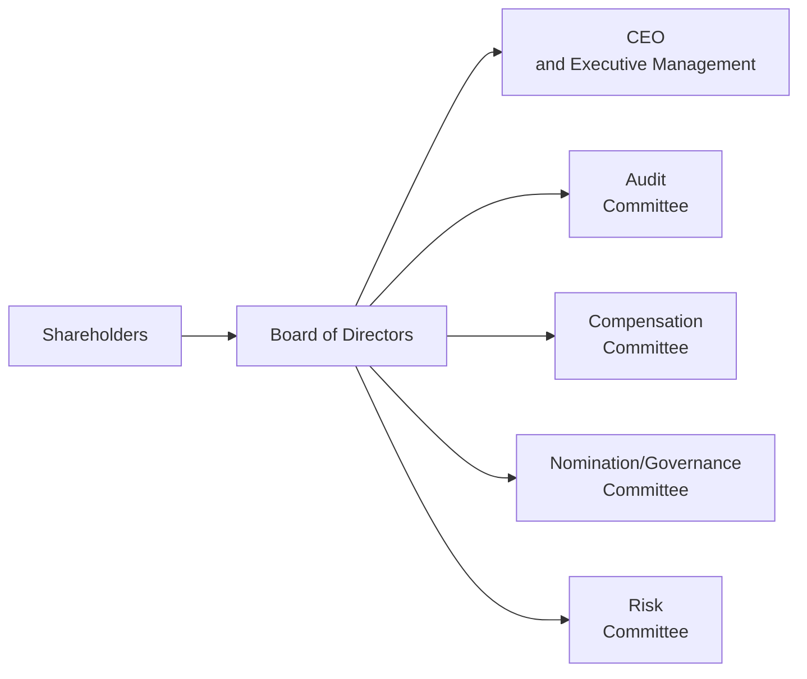

## Board Composition and Independence
The board of directors is often described as the core guardian of shareholder interests, yet it also has to balance the needs of creditors, employees, and society at large. It’s tasked with monitoring senior management, guiding company strategy, and ensuring corporate activities remain within ethical and legal boundaries. In my early days as a consultant, I remember sitting in a conference room (and let’s be honest, trying not to nod off) while watching a board wave through a risky acquisition—simply because nobody wanted to challenge the CEO’s pet project. That scenario highlighted an age-old truth: robust independence and constructive debate are vital if boards are to fulfill their duties effectively.

An “independent” director is typically defined as one who has no material relationships with the company that could affect judgment—no significant ownership stake, no direct ties to management, and no consulting contracts on the side. The idea is that these individuals will bring objective, unbiased scrutiny. Independence is closely tied to diversity–in expertise, gender, age, and even cultural background. The more perspectives in the boardroom, the more likely the board can spot risks and navigate opportunities before they turn into fiascoes.

However, absolute independence can be tricky. Interlocking relationships (where directors sit on multiple boards that do business with each other) or long-standing friendships between directors and executives may undermine objectivity. Some firms implement strict guidelines, such as limiting the number of boards a single director can serve on. Others may reduce director tenure to dodge the sort of coziness that can creep in over the years.

## Key Committees and Their Responsibilities
While the full board oversees the broad strategic and governance framework, specialized committees delve into complex areas that require targeted expertise. These committees typically include:

• Audit Committee  
• Compensation Committee  
• Nomination/Governance Committee  
• Risk Committee (if separate; sometimes risk is combined under audit)

Below is a simple diagram illustrating how these committees often relate to the overall governance framework:

### Audit Committee
Picture the audit committee as the frontline defense for financial integrity. Its mission? Validate the reliability and transparency of financial reporting. **They oversee internal and external audits, internal controls, risk assessments, and compliance with regulatory mandates.** Under regulations like the Sarbanes-Oxley Act in the United States, audit committees face increased scrutiny:  
• They must approve the external auditor’s appointment, ensuring the auditor’s independence and scope of work.  
• They evaluate the effectiveness of internal controls, bridging any gaps that could lead to fraud or material misstatements.  
• They review whistleblowing procedures and investigate allegations of improper conduct.  

Many boards insist that audit committee members are financially literate. At least one director typically qualifies as a “financial expert,” meaning they’ve worked with complex financial statements or auditing before. If that’s missing, well, mistakes can slip through—think back to high-profile cases like Enron or WorldCom, where poor oversight from the board paved the way for massive accounting scandals.

### Compensation Committee
The compensation committee’s main job is to ensure that executive pay is aligned with a company’s long-term objectives. You might be thinking, “So, they watch out for CEOs scoring outsized bonuses for short-term gains, right?” Precisely. A well-functioning compensation committee designs packages that encourage sustainable performance, balancing fixed salaries, bonuses, equity options, and other perks.

Their responsibilities often include:
• Setting performance metrics that link pay to strategic milestones.  
• Reviewing executive compensation in the context of peer benchmarks.  
• Ensuring compliance with local regulations on disclosure of executive pay packages.  
• Reviewing and approving the CEO’s compensation (often with input from external consultants).  

However, real independence matters hugely here, because it’s easy for a strong CEO to sway directors into awarding overly generous pay. This is just one reason why many global governance codes require that the compensation committee be composed entirely of independent directors.

### Nomination/Governance Committee
The nomination (or governance) committee typically handles board appointments, director evaluations, and board succession planning. I once observed a family-controlled firm that struggled to recruit truly independent directors. The nomination committee, dominated by family members, consistently picked individuals with personal ties— inevitably limiting the board’s perspective. This pitfall highlights how crucial it is for this committee to be not only independent but also open-minded about different skill sets and fresh viewpoints.

Key tasks often include:
• Identifying, screening, and nominating new directors.  
• Overseeing succession planning for both directors and senior executives.  
• Conducting regular board evaluations to pinpoint performance gaps and training needs.  
• Reviewing and updating corporate governance policies to match best practices.  

In many jurisdictions, this committee also addresses ethical codes of conduct and ensures the board’s composition aligns with regulatory requirements (e.g., meeting specified guidelines for independent or external representation).

### Risk Committee
While some firms incorporate risk oversight under the audit committee, more complex organizations maintain a separate risk committee. This committee zeroes in on enterprise-level threats—credit risk, liquidity risk, market risk, operational risk, cybersecurity, you name it. Large financial institutions often have robust risk committees that dig into capital adequacy, stress testing, and scenario analysis.

Primary responsibilities:
• Defining the firm’s risk appetite and tolerance levels.  
• Monitoring risk management frameworks, including stress tests.  
• Ensuring adequate resources for risk oversight (e.g., risk management staff, systems).  
• Evaluating the effectiveness of risk reporting up to the board.  

Given how everything from surging interest rates to shifting ESG regulations can pose major challenges, the risk committee’s role is increasingly recognized as critical for long-term resilience.

## Meeting Frequency, Minutes, and Active Engagement
A board that meets rarely—or breezes through agendas with minimal discussion—can miss early-warning signals. **Best practice is to schedule regular board and committee meetings** (often quarterly or bimonthly), plus “special” sessions when urgent issues arise, such as a potential merger.

Minutes should document key deliberations, highlight major concerns, and record the essence of any dissenting views. If you skim a set of board minutes and see little more than “Meeting commenced, agenda reviewed, meeting adjourned,” that’s a sign of trouble. Directors are expected to challenge management, ask tough questions, and consider alternatives—so the minutes should reflect a vibrant discussion, not a rubber stamp.

On occasion, the board will hold executive sessions, meaning independent directors meet without management present. These closed-door discussions foster open dialogue about sensitive matters—like the CEO’s performance, conflicts of interest, or pending leadership changes.

## Director Tenure, Rotation Policies, and Retirement
There’s a delicate balance between continuity and fresh thinking. Some governance codes suggest a limit of about nine years of service, after which a director might be deemed non-independent. Other firms set mandatory retirement ages (e.g., 70 or 75). The rationale is straightforward: **if you’re too entrenched, how objective can you really be?**

On the flip side, an overly quick rotation of board members can breed instability and hamper knowledge transfer. The best boards have a mix: some long-standing, seasoned members and some newer directors who bring fresh energy. Periodic rotation across committees is also healthy—this cross-pollinates ideas, prevents complacency, and broadens individual directors’ skill sets.

## Board Leadership
How leadership is structured at the top can shape the entire governance culture. Many boards split the roles of chairperson and CEO to avoid a concentration of power. Where the CEO also serves as the board’s chair, a separate designated lead independent director (LID) may coordinate the work of the independent directors and maintain checks and balances.

The presence of a strong chairperson or LID who fosters a culture of open communication is essential. This leadership ensures that no single director or manager dominates discussion, encouraging respectful debate and thoughtful decision-making. In some companies, the strategic direction is set primarily by management, with the chair and LID providing guidance, ensuring robust oversight, and making sure the board’s voice is heard.

## Conflict of Interest and Interlocking Relationships
One common pitfall is the presence of interlocking directorships—when directors serve on each other’s boards or have overlapping business affiliations. This can cloud decision-making, especially if big transactions between interconnected companies arise. Such overlaps might, for instance, tempt a director to push for favorable contract terms that benefit a personal relationship at the expense of shareholders in the main firm. While it’s not always possible to avoid any overlap (especially in closely knit industries), the board must implement policies requiring full disclosure of potential conflicts, and directors should recuse themselves from relevant votes.

## The Board’s Role in Major Strategic and Capital Decisions
The board signs off on strategic plans, major capital expenditures, and acquisitions or divestitures. For instance, in a potential M&A deal, the board must analyze synergy projections, cultural fit, integration challenges, and the financial rationale. Directors often rely on management’s input, but they also engage independent financial advisors for fairness opinions and valuation analyses. This approach helps confirm that shareholder value is not being carelessly sacrificed.

In the realm of capital allocation—dividends, share buybacks, or expansions— the board evaluates how each option impacts long-term growth, credit ratings, and future funding needs. This is where knowledge gleaned from earlier chapters (like those on payout policies in Chapter 2 or advanced capital structure in Chapter 7) comes into play. Effective boards connect the dots between corporate finance decisions and broader governance duties.

## ESG Oversight and Stakeholder Engagement
It’s hardly surprising that environmental, social, and governance (ESG) factors have become a big deal. Regulators and investors alike increasingly expect boards to oversee a company’s sustainability and social impact. Some boards form an ESG committee or fold ESG responsibilities into an existing one (often the risk committee). They monitor carbon emissions, supply chain labor standards, and corporate citizenship efforts. They also give voice to stakeholders beyond just shareholders. 

Why is this relevant for your CFA exam? Because ESG issues can create financial risks (think climate change disruptions) and reputational risks (think labor controversies). A vigilant board spots these red flags early and integrates them into the firm’s risk management and strategic planning processes.

## Board Evaluations and Continuous Improvement
Finally, top-performing boards never assume they’ve “arrived.” They engage in regular assessments—sometimes facilitated by external consultants—to measure effectiveness. These evaluations often result in personal feedback for individual directors on their preparedness, engagement, and contribution to discussions.

It’s not uncommon for a board to discover it’s missing crucial competencies—maybe none of the directors have experience in digital transformation or supply chain finance. That realization might drive future recruitment strategies, ensuring the board stays agile.

## Short Practical Example
Consider a hypothetical mid-cap technology firm, “TechNova.” Its board comprises seven members: five external directors (including the chairperson) and two inside directors (the CEO and CFO). The board committees function as follows:

• The audit committee meets quarterly. It approves the external auditor’s selection and reviews internal audit findings. A designated financial expert, who spent 20 years in public accounting, heads the committee.  
• The compensation committee reviews the CEO’s pay structure. Recently, it moved away from heavy stock option grants toward restricted shares with a three-year vesting, aligning executive incentives with long-term performance.  
• The nomination/governance committee just initiated a thorough board skills-gap analysis, discovering the board lacks expertise in cybersecurity. As a result, they’re searching for a director with that background.  
• The risk committee meets semi-annually and focuses on TechNova’s IP protection, supply chain disruptions, and potential data breaches.  

All committees produce detailed minutes summarizing key takeaways, decisions, and pending action items. At year-end, the entire board meets to review the strategic plan and evaluate the CEO’s performance. The lead independent director hosts an executive session (with no management present) to gather frank feedback from the outside directors on the firm’s strategy and the CEO’s leadership. This roundtable fosters an open and constructive atmosphere that helps TechNova refine its direction, adapt to market changes, and remain transparent to shareholders.

## Conclusion
The board’s structure and committee responsibilities form the bedrock of effective corporate governance. When done right, boards don’t just keep management accountable; they help shape the firm’s strategic trajectory. Independent, engaged directors who leverage specialized committees are critical for protecting shareholders, augmenting organizational resilience, and championing corporate sustainability. Exam-wise, keep an eye out for scenario-based questions where you’ll need to identify red flags—like an overly powerful CEO-chair, or a board lacking relevant expertise. These are exactly the kinds of real-world governance dilemmas the CFA curriculum loves to explore.  

Ultimately, the best boards embrace a culture of transparency, active dialogue, and continuous learning, ensuring they’re well prepared to tackle both routine oversight and big strategic pivots. And, at least in my experience, that often starts with having the courage to ask the tough questions—especially when nobody else will.

## References and Further Reading
- CFA Institute Standards and Practice Council. (latest). CFA Institute Code of Ethics and Standards of Professional Conduct.  
- G20/OECD (2015). Principles of Corporate Governance. Available at: [OECD Principles of Corporate Governance](https://www.oecd.org/corporate/principles-corporate-governance.htm)  
- Sarbanes-Oxley Act of 2002, United States.  
- “Board of Directors and Corporate Governance,” Harvard Law School Forum on Corporate Governance.  
- UK Corporate Governance Code (Financial Reporting Council).  

---

## Board Oversight and Committee Knowledge Check



### Which of the following best describes the primary function of a board of directors in corporate governance?

- [ ] To ensure the company's stock price remains above its competitors'.
- [ ] To manage day-to-day operations and administrative tasks.
- [x] To represent shareholder interests by overseeing management and strategic direction.
- [ ] To finalize annual audit reports without review from external auditors.

> **Explanation:** The board of directors oversees the firm's strategic direction and ensures management acts in shareholders' best interests. They do not handle daily operations or guarantee the highest share price.

### What is the main benefit of having an independent director on the board?

- [ ] They streamline CEO decision-making by deferring to management.
- [ ] They always possess superior knowledge of market conditions.
- [x] They bring impartial judgment and mitigate potential conflicts of interest.
- [ ] They oversee day-to-day activities and micro-manage financial statements.

> **Explanation:** Independent directors lack ties to the company's management or major shareholders, helping foster objective decision-making and limit conflicts.

### In structuring the audit committee, which of the following is most aligned with best practice?

- [x] Ensuring at least one committee member is a financial expert and all members are independent directors.
- [ ] Having the CFO lead the committee to provide direct oversight of the audit process.
- [ ] Chairman of the board appointing family members to ensure loyalty and commitment.
- [ ] Avoiding external auditors to reduce complexity.

> **Explanation:** Best practice requires independence from management and the presence of a “financial expert” to ensure meaningful oversight of financial reporting and auditing practices.

### Which of the following would be a sign of strong compensation committee governance?

- [ ] Awarding guaranteed bonuses in all economic conditions to executive directors.
- [x] Linking a significant portion of executive pay to long-term performance metrics.
- [ ] Letting the CEO set his or her own compensation package.
- [ ] Eliminating all variable pay components to reduce management incentives.

> **Explanation:** Aligning compensation with long-term performance and ensuring that the committee—not the CEO—sets pay fosters accountability and incentive alignment with shareholders.

### Which committee typically evaluates the skill sets needed among directors and oversees board succession planning?

- [ ] Audit Committee
- [x] Nomination/Governance Committee
- [ ] Risk Committee
- [ ] Compensation Committee

> **Explanation:** The nomination/governance committee identifies board composition needs, recruits new directors, and manages succession. Other committees focus on financial reporting, risk, or executive compensation.

### How might a dedicated risk committee differ from an audit committee in its primary focus?

- [ ] Focuses only on routine bookkeeping tasks.
- [x] Takes a comprehensive view of enterprise-level risks, including market and operational exposures.
- [ ] Oversees the company's external audit engagements.
- [ ] Sets executive compensation incentives based on risk metrics alone.

> **Explanation:** While audit committees concentrate on financial reporting integrity and internal controls, a dedicated risk committee monitors broader risks (e.g., credit risk, market risk, operational risk).

### If a company's directors rarely question management and meetings end quickly with no records of disagreement, this often indicates:

- [ ] An efficient board that reaches consensus immediately.
- [x] A rubber-stamp board lacking genuine oversight or independent judgment.
- [ ] A board with excellent synergy and perfect alignment of interests.
- [ ] Compliance with global governance best practices.

> **Explanation:** Too little debate and no dissent signals a potential lack of rigorous oversight. Effective boards typically engage in thorough discussions that are documented in meeting minutes.

### What is one reason why mandatory director retirement ages are sometimes implemented?

- [ ] To ensure directors can serve on unlimited numbers of committees.
- [ ] To allow boards to avoid paying pensions to directors.
- [x] To promote turnover and ensure fresh perspectives are regularly introduced.
- [ ] To align board tenure precisely with market cycles.

> **Explanation:** Mandatory retirement policies prompt director turnover, helping keep board discussions lively and preventing entrenchment.

### Why might splitting the roles of CEO and board chairperson enhance corporate governance?

- [ ] It leads to constant power struggles between the CEO and chair.
- [ ] It guarantees higher stock prices in any market condition.
- [ ] It eliminates the need for board evaluations.
- [x] It reduces the concentration of power and helps ensure independent oversight of executive decisions.

> **Explanation:** Separating CEO and chair roles (or appointing a lead independent director) can strengthen checks and balances and guard against excessive influence by a single individual.

### A board that diligently incorporates climate risk assessment into its strategic planning is most likely:

- [x] Demonstrating proactive ESG oversight.
- [ ] Failing to protect shareholder interests.
- [ ] Overshadowing the role of the risk committee.
- [ ] Violating the principle of director independence.

> **Explanation:** Including climate risk analysis in strategic decisions reflects a comprehensive ESG oversight approach, aligned with emerging best practices.


