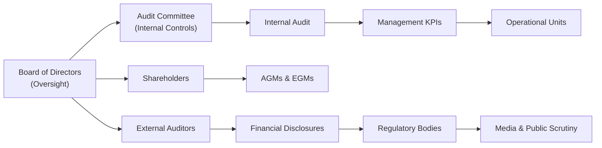

## Introduction
Corporate accountability is at the heart of good governance, ensuring that organizations answer to shareholders, employees, creditors, and the wider community for their actions. It’s really about transparency and maintaining trust—something that, honestly, can be harder to achieve than it sounds. Let’s face it: in many real-world scenarios, accountability efforts can get bogged down by business pressures, internal politics, or simply a lack of clear systems. So the mechanisms we’ll talk about here—from internal audits to whistleblower policies—help anchor ethical and responsible behavior in a company’s day-to-day operations. That might sound a bit idealistic, but enforcement of these mechanisms can make an enormous difference when it comes to protecting shareholder value and safeguarding reputations.

In this section, we’ll discuss the major internal and external mechanisms companies use to align management actions with stakeholder interests. We’ll talk about how annual general meetings (AGMs) provide a direct line of accountability, how timely financial disclosures keep everyone informed, why whistleblower policies matter so much, and the ways management metrics can be molded to encourage the right behavior. We’ll also consider global best practices, highlight potential pitfalls, and connect the conversation back to frameworks like COSO that you’ve probably seen in your studies.

## Understanding Accountability
At its core, accountability means being responsible for outcomes and accepting the consequences of one’s actions or decisions. In a corporate setting, accountability requires management to explain and justify decisions in a transparent manner, especially when those decisions significantly impact stakeholders. Stakeholders include:

• Shareholders seeking return on investment  
• Creditors monitoring risk and liquidity  
• Employees wanting stable employment and fair treatment  
• Regulatory bodies enforcing compliance  
• Communities concerned with corporate social responsibility

Accountability ties into the broader corporate governance frameworks covered in other parts of this curriculum (for instance, how boards structure oversight committees or how ESG practices are integrated into strategic decisions).

## Internal Accountability Mechanisms
Internal mechanisms are like the corporate body’s immune system. They work from the inside, spotting issues and enforcing ethical standards before the damage becomes too big. Let’s explore some of these mechanisms.

### Internal Audits and Internal Controls
Internal audits provide an independent, objective assurance function inside the organization. They help ensure financial records are accurate, operations are efficient, and policies are followed. If you’ve ever come across a situation where leadership was tempted to “massage” the numbers, internal audits—and the broader internal control environment—are designed to stop that from happening. They:

• Identify process gaps, compliance failures, and fraud risks  
• Recommend improvements to various departments (e.g., finance, human resources, operations)  
• Verify management’s adherence to approved policies and strategies

A common framework here is COSO (Committee of Sponsoring Organizations). COSO offers an integrated model for internal control that covers control environment, risk assessment, control activities, information/communication, and monitoring. By following COSO, organizations can systematically track accountability.

### Performance-Based Compensation
Performance-based compensation aligns executives’ and employees’ rewards with the company’s strategic goals. Ideally, if metrics are designed well, managers will focus on long-term objectives rather than short-term personal gains. However, the design is crucial: tie incentives only to short-term earnings, and you risk encouraging manipulative or even risky behavior. When performance metrics include revenue growth, profitability, social objectives, and even employee wellness, accountability improves because managers know they’ll be held to business-wide standards.

### Codes of Ethics and Conduct
A code of ethics is a written policy outlining acceptable behavior, decision-making standards, and potential disciplinary measures for violations. It’s sometimes brushed off as a “formality,” but it can serve as a strong internal beacon when actively enforced. For instance, if the code prohibits conflicts of interests in procurement, managers know that awarding a contract to a friend’s firm without the proper bidding process violates internal policy. That clarity supplies a huge piece of accountability, as employees can’t claim ignorance as a defense for unethical behavior.

### Specialized Oversight Committees
You might have heard of compliance committees, ethics committees, or corporate social responsibility (CSR) committees. These specialized bodies look beyond purely financial metrics to evaluate broader impacts of business activities. For example, a CSR committee might assess how effectively the company’s environmental initiatives meet stakeholder expectations, ensuring accountability on sustainability goals. Or an ethics committee can focus on big-picture concerns about organizational culture, conflict-of-interest policies, and other risk areas the standard audit committee might overlook.

## External Accountability Mechanisms
Sometimes internal mechanisms aren’t enough—people want outside validation that a firm is actually walking the talk. External accountability mechanisms provide that independent perspective, bringing transparency and discipline.

### External Audits
Independent external auditors evaluate a company’s financial statements, checking for appropriate accounting standards, compliance with relevant regulations, and the fairness of reported results. While internal audits can identify issues preemptively, external audits add credibility to financial disclosures for shareholders, creditors, and analysts. They also help catch problems that an internal audit might have missed or minimized.

### Credit Rating Agencies
Credit rating agencies (CRAs) like Moody’s, S&P Global, and Fitch measure a company’s creditworthiness. Companies with poor governance or accountability structures may struggle to maintain a positive credit rating, which translates into higher borrowing costs. Because CRAs are typically well-versed in analyzing governance and risk, the mere threat of a downgraded rating incentivizes stronger accountability mechanisms.

### Regulatory Bodies
Regulatory authorities—like the US Securities and Exchange Commission (SEC) or other securities commissions globally—can demand strict adherence to reporting, disclosure, and governance standards. They also impose fines, lawsuits, or even suspend trading of a company’s stock if accountability lapses are severe. For public firms, these regulators loom large, and ignoring them can be career-ending for executives.

### Media and Public Scrutiny
Let’s be honest, a negative headline can ruin years of brand building in a single day. Many of us have read stories of companies undone by exposés on unethical or even illegal practices. Whether it’s a financial newspaper or social media backlash, external scrutiny can be swift and damaging, so it serves as a potent accountability check. If management knows unsavory behavior might get plastered on the front page, they’ll (usually) think twice.

## Annual and Extraordinary General Meetings
AGMs (Annual General Meetings) and EGMs (Extraordinary General Meetings) allow shareholders to question executives and directors directly. This forum can turn heated if investors feel they’ve been misled or sidelined. In many jurisdictions, legal requirements ensure that certain items—like election of directors, approval of auditors, or major strategic changes—must be brought before the shareholders. This structure guarantees a minimal level of accountability, as executives can’t ignore shareholder demands. Shareholders can vote on:

• Board composition  
• Major acquisitions, mergers, or divestitures  
• Changes to corporate charters and bylaws  
• Ratification of auditors  
• Executive compensation packages

It’s not always a pleasant experience for management—particularly if performance has been poor—but it forces them to address concerns in a public, transparent forum.

## Clarity and Timeliness of Disclosures
In an era where investors want immediate, reliable data, companies need to be on top of their disclosure game. Late or inaccurate disclosures can spook markets and raise red flags about management competence or integrity. Common disclosures include:

• Quarterly or interim financial statements  
• Annual reports and proxy statements  
• Press releases on significant developments  
• Integrated reports (combining financial and ESG performance)

Integrated reporting is becoming increasingly popular as stakeholders—especially institutional investors—want to see how financial performance aligns with sustainability objectives. The integrated report effectively ties back to internal and external accountability because it reveals how a company manages financial, environmental, and social capital.

## Whistleblower Policies and Protections
Sometimes, unethical or illegal conduct comes to light only when an internal stakeholder (employee or contractor) steps forward. A whistleblower policy creates a channel for safely reporting misconduct—like fraudulent accounting, corruption, or harassment—without risk of retaliation. Many jurisdictions, spurred by high-profile corporate scandals, have enacted legislation protecting whistleblowers (e.g., Sarbanes-Oxley in the US).

From my observation, a robust whistleblower system can be a lifesaver for firms. One CFO friend once shared how a whistleblower tip led them to discover procurement fraud costing the company millions. Without that policy in place, it might have gone undetected indefinitely. Effective whistleblower programs typically:

• Offer confidential or anonymous reporting channels  
• Clearly outline investigation procedures  
• Specify protections against retaliation (like demotion or firing)  
• Provide feedback or follow-up to the whistleblower, where possible

## Related-Party Transactions
Related-party transactions, while sometimes benign, carry the risk of conflicts of interest. For example, a director might steer business to a company in which they or a relative has ownership. If not disclosed and vetted, such transactions erode trust in governance, as external stakeholders may worry about preferential deals or hidden deals. Proper oversight of related-party transactions might include:

• Board approval for deals involving directors or major shareholders  
• Clear disclosure in financial statements describing the nature and size of transactions  
• Independent review for fairness of the terms

In strong accountability systems, the mere hint of sweetheart deals can set off alarm bells, driving the board and shareholders to demand thorough explanations.

## Aligning KPIs with Strategy and Stakeholder Value
Key Performance Indicators (KPIs) keep everyone on track—if they’re chosen well. If a company emphasizes short-term metrics like quarterly earnings growth, management might ignore the long-range strategies or cut corners just to boost immediate performance. That might help the current quarter but ultimately undercut the company’s ability to compete. Proper KPIs cover areas such as:

• Financial (revenue growth, margins, capital efficiency)  
• Customer satisfaction (net promoter scores, churn rates)  
• Operational efficiency (production costs, cycle times)  
• ESG (carbon footprint, diversity targets)  

When these metrics align with strategic goals and stakeholder interests, accountability follows organically. Management must then justify actions against a balanced scorecard of measures rather than fixate solely on the share price.

## Enforcing Consequences
Policies and committees only have teeth if they’re backed by real consequences for misconduct. That might mean reprimands, demotions, financial penalties, or legal action. In several landmark corporate ethics cases, top officials faced legal consequences when wrongdoing was proven. While nobody relishes handing out punishment, the willingness to enforce stated consequences reinforces a culture of accountability. Employees learn quickly if a company is serious or if its policies are just for show. Enforcement must be consistent across all levels—senior executives shouldn’t get a free pass over a violation that would cost a junior employee their job.

## Global Best Practices & Cultural Nuances
Accountability structures can differ significantly from one jurisdiction to another. For example, some countries have two-tier board systems (a management board and a supervisory board) that enhance accountability. Other places have strong codified corporate governance codes, while some rely more on cultural norms of trust and honor. Additionally:

• Legal Protections: Whistleblower and minority shareholder rights vary widely  
• Governance Codes: Many markets follow comply-or-explain models (like the UK Corporate Governance Code)  
• Disclosure Requirements: IFRS or US GAAP guidelines may require different details in financial statements  
• Cultural Attitudes: In some regions, hierarchical traditions can make employees hesitant to raise concerns

When assessing global companies, it’s wise to review local regulations, codes, and typical corporate structures to gauge the strength of accountability mechanisms.

## Putting It All Together in a Visual
Below is a simple Mermaid flowchart illustrating the interplay between internal and external accountability mechanisms. (Admittedly, it’s just one possible representation, but it should give you a sense of how these elements connect.)

## Why It Matters for CFA Candidates
As a CFA Level II candidate studying Corporate Issuers, you’ll need to understand corporate accountability from both a finance and governance perspective. Item set questions may test your ability to spot weaknesses in a firm’s governance practices and propose solutions, or to recommend improvements in accountability structures to align managerial behavior with shareholder interests. And remember, accountability issues can surface in a wide range of contexts—everything from evaluating risk disclosures to analyzing a firm’s payout policy.

## Exam Tips and Common Pitfalls
• Read the Vignette Carefully: Pay attention to subtle hints in item sets about undisclosed related-party transactions or vague compliance frameworks.  
• Look for Red Flags: Overly complex org charts, disclaimers about delays in disclosures, or newly appointed external auditors after repeated internal control issues can signal accountability gaps.  
• Evaluate Incentive Alignment: When management’s compensation is heavily stock-based but short-term in focus, question whether that fosters long-term accountability.  
• Story vs. Substance: Don’t be fooled by “nice-sounding” policies. Verify whether they’re truly enforced or simply check-the-box exercises.  
• Global Nuances: Be aware that accountability structures can differ depending on jurisdiction—test question scenarios may highlight cultural or regulatory differences.  

## References and Further Reading
• COSO (2017). “Enterprise Risk Management–Integrating with Strategy and Performance.”  
• CFA Institute (2019). “Corporate Governance for Institutional Investors: Principles and Best Practices.”  
• OECD (2010). "Accountability and Transparency: A Guide for State Ownership."

## Test Your Knowledge: Corporate Accountability Mechanisms Quiz



### Which of the following best defines corporate accountability?
- [x] The process by which management and the board answer to stakeholders for their actions and performance.
- [ ] A set of financial ratios used to track a firm’s leverage.
- [ ] A public relations campaign focused on brand awareness.
- [ ] The obligation to maximize only short-term profits.

> **Explanation:** Corporate accountability involves explaining and justifying decisions to shareholders, creditors, and other stakeholders, and taking responsibility for outcomes.

### A robust internal audit function primarily:
- [x] Provides independent and objective assurance of risk management and internal controls.
- [ ] Replaces the need for external auditing.
- [ ] Evaluates only the organization’s marketing strategies.
- [ ] Prevents all forms of misconduct within a firm.

> **Explanation:** Internal audits focus on improvement opportunities within risk management, but do not eliminate external audit requirements, nor can they guarantee zero misconduct.

### Which example best illustrates a potential conflict in a related-party transaction?
- [x] A director awarding a supply contract to a company owned by their family member.
- [ ] Issuing bonds that are sold to the general public.
- [ ] Hiring an external firm to perform an unbiased external audit.
- [ ] Purchasing raw materials from multiple competing suppliers.

> **Explanation:** A director dealing with a family-owned company creates a conflict of interest that must be disclosed and properly managed.

### Which external party is most likely to impose fines or other penalties for accountability failures?
- [x] A regulatory body such as the SEC.
- [ ] The company’s compensation committee.
- [ ] A trade magazine reviewing product quality.
- [ ] The human resource department.

> **Explanation:** Regulatory bodies enforce laws and regulations, often imposing fines or other sanctions on companies that fail to meet accountability standards.

### Which item is typically voted on by shareholders at an AGM?
- [x] The election of the board of directors.
- [ ] The dismissal of credit rating agencies.
- [ ] The creation of a new internal audit department.
- [ ] The daily operational decisions of sales managers.

> **Explanation:** Shareholders commonly vote on the composition of the board, among other high-level governance measures, at annual general meetings.

### Which statement best describes the role of a whistleblower policy?
- [x] It allows individuals to report unethical behavior anonymously, with protection from retaliation.
- [ ] It confirms the company has never faced misconduct issues.
- [ ] It guarantees that fraudulent activities will remain internal.
- [ ] It compensates manager-level employees for self-reporting mistakes.

> **Explanation:** A whistleblower policy aims to encourage reporting of wrongdoing without fear of punishment. It doesn’t guarantee zero misconduct, but it encourages discovery and accountability.

### How do credit rating agencies enhance corporate accountability?
- [x] By evaluating a firm’s governance and oversight structures, impacting borrowing costs.
- [ ] By regulating corporate disclosures directly under government authority.
- [ ] By preventing negative media coverage of corporate conduct.
- [ ] By replacing internal audits with standardized risk ratings.

> **Explanation:** Credit rating agencies assess governance risks alongside financial metrics. A lower rating indicates higher perceived risk and thus higher borrowing costs.

### Performance-based compensation can undermine accountability when it:
- [x] Focuses solely on short-term financial metrics without considering long-term strategy.
- [ ] Balances short-term, long-term, and ESG targets consistently.
- [ ] Is accompanied by strong internal controls and oversight.
- [ ] Is disclosed transparently in the company’s annual report.

> **Explanation:** If incentive structures prioritize quick earnings gains at the expense of long-term performance and sustainability, managers may act against broader stakeholder interests.

### Which of the following is generally a characteristic of effective disclosure practices?
- [x] Timely, accurate, and transparent communication of both financial and nonfinancial information.
- [ ] Comprehensive information shared selectively with only a few large shareholders.
- [ ] Sealed disclosures accessible only to board members for competitive reasons.
- [ ] Exclusive reliance on social media posts to communicate all major announcements.

> **Explanation:** Effective disclosure requires that information be shared in an accurate and timely way with all stakeholders, not just large or favored investors.

### True or False: Cultural values and legal frameworks can influence how corporate accountability is enforced in different countries.
- [x] True
- [ ] False

> **Explanation:** Each jurisdiction may have unique corporate governance codes, legal remedies, and cultural norms that shape how accountability is mandated, monitored, and enforced.


