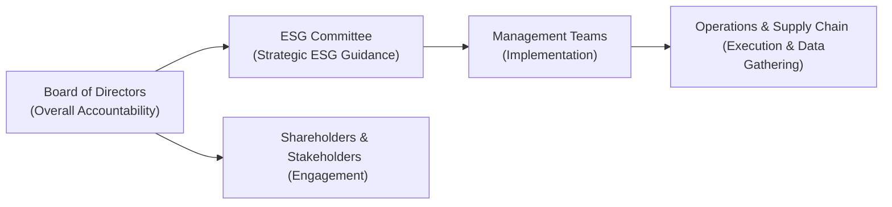

## The Strategic Importance of Governance in ESG

It’s sometimes easy to fixate on the “E” (environmental) and “S” (social) aspects of ESG. After all, climate change grabs headlines, and social issues—like labor practices—always spark public interest. But there’s this other component, the “G,” that is arguably the glue holding it all together: governance. And, well, experience shows that if governance fails, even the best-intentioned environmental and social initiatives can unravel. 

In the context of ESG, governance refers to the decision-making framework within a company—how the board of directors exercises effective oversight, how policies are formulated, and how strategies are executed to ensure accountability to shareholders, creditors, employees, and the broader society. In a modern corporate landscape, strong governance translates to sustainable value creation.  

This section explores how boards weave ESG into their strategic fabric, from setting corporate direction to rewarding executives for hitting ESG metrics, while ensuring the firm remains competitive in both financial and ethical performance.  

## Board Responsibilities and Oversight

A board of directors that effectively embraces ESG considerations typically goes beyond merely signing off on sustainability initiatives. Instead, boards often embed ESG objectives directly into strategic planning, operations oversight, and performance assessments.  

Boards will frequently establish specialized committees (often called ESG or Sustainability Committees) to focus on relevant initiatives. These committees evaluate proposed strategies for managing environmental footprint, examine employee safety records, and review supply chain compliance with international standards. The board remains the ultimate authority, though—if the ESG committee recommends a shift in vendor selection due to poor labor practices, the board ensures that recommendation meshes with broader corporate objectives.  

Below is a simple diagram illustrating how board oversight might integrate with ESG committees, management teams, and other stakeholders:



This structure highlights that while the board sets the tone, various layers of the organization funnel data and feedback to enable governance actions.

## Integrating ESG into Corporate Strategy

Most sustainable firms embed ESG priorities in their day-to-day decision-making rather than viewing them as an afterthought. For example, a tech company might prioritize green data centers to reduce carbon emissions, while a manufacturing firm may opt for recycled or fair-trade raw materials to align with environmental and social objectives.

Some ways boards integrate ESG factors into strategy include:  
• Resource Allocation: Directing capital expenditure toward greener technologies or safer equipment.  
• Supply Chain Policies: Requiring vendors to adhere to specific labor and environmental standards.  
• Product Development: Designing products that minimize ecological impact and promote social well-being.  

Moreover, boards often set measurable targets—for instance, a 40% reduction in carbon emissions over five years. Achievement of these targets can be integrated into performance dashboards and short-list reviews at quarterly board meetings.

## Linking Executive Compensation to ESG Mastery

Let’s be honest: money motivates. One way boards ensure that ESG considerations aren’t overlooked is by linking performance on ESG metrics to executive pay. So if the CEO’s bonus depends partly on slashing greenhouse gas emissions by a certain percentage, guess what? That CEO is more likely to push for meaningful sustainability projects.

Some large multinational companies share detailed compensation structures highlighting exactly how leadership is rewarded for progress in ESG. It might be a small fraction of total compensation at first, but the signal to the organization—and the market—can be profound: it says, “We mean business when it comes to sustainability.”  

In practice, aligning executive pay with ESG might include metrics such as:  
• Reducing workplace injuries.  
• Improving workforce diversity.  
• Decreasing a product’s carbon footprint.  
• Engaging local communities or philanthropic initiatives.  

When well-designed, these incentives encourage long-term thinking, so the board ensures the firm doesn’t chase short-term profits at the expense of future sustainability.

## Balancing Short-Term Performance with Long-Term Sustainability

A classic tension within governance is balancing near-term financial results—such as quarterly earnings calls and short-term stock price movements—with the strategic, long-run benefits of robust ESG practices. Clearly, the board must ensure that capital spending for ESG efforts is justified in terms of both future returns and stakeholder well-being. This might entail:

• Creating multi-year budgets for sustainability that complement, rather than cannibalize, short-term profitability targets.  
• Communicating closely with shareholders so they understand that short-term financial “sacrifices” can lead to stronger brand reputation, reduced legal and regulatory risks, or even cost savings through operational efficiencies in the long run.  
• Incorporating scenario analysis, especially for climate-related risks, which can forecast potential regulatory costs or changes in consumer demand.  

At times, boards encounter pushback from factions demanding immediate returns. Skilled directors will articulate the strategic rationale for ESG investments. They highlight the real possibility that ignoring ESG can lead to fines, lawsuits, and reputational fallout, all of which can harm the bottom line.

## Mitigating Environmental and Social Risks Through Governance

Anyone who’s looked at environmental or social scandals knows how devastating they can be—not just to a company’s reputation but also to its stock price and consumer trust. Governance structures address these risks by instituting:  

• Clear Policies: For instance, boards might approve a policy specifying vendor labor standards or greenhouse gas emission thresholds.  
• Internal Audits: Regular reviews of safety incidents, compliance with environmental regulations, and so on.  
• Regulatory Monitoring: Teams that track evolving legal requirements (like new emissions regulations) and inform the board of needed policy changes.  

It’s also increasingly common to see frameworks such as the Task Force on Climate-Related Financial Disclosures (TCFD) used to structure risk analysis. The TCFD approach can help boards measure carbon footprint exposures, estimate potential stranded assets, and prepare for climate transitions.  

## Engaging with Stakeholders and the Community

Strong governance doesn’t just focus inward; it recognizes the power of the external environment. That includes local communities, philanthropic causes, activists, and even critics. Let’s say your firm is building a new factory—well, you might want to meet with community leaders, listen to their concerns, and plan ways to support local infrastructure development.  

Good stakeholder engagement can:  
• Improve brand perception and consumer loyalty.  
• Reduce the risk of costly protests, strikes, or community opposition to expansion.  
• Open the door to new markets through community-level partnerships.  

If the board is doing its job, it regularly reviews community relations and philanthropic budgets. Directors might ask: “Are we investing in ways that genuinely align with our mission and our stakeholders’ needs?” or “How do local hiring strategies affect our cost structure and ESG ratings?”

## ESG Performance Metrics, Disclosures, and Global Standards

Investors, regulators, and the public increasingly demand transparency regarding ESG performance. As a result, boards are encouraging management to produce robust disclosures that follow recognized standards such as:

• GRI (Global Reporting Initiative): Widely used for sustainability reporting across industries.  
• SASB (Sustainability Accounting Standards Board): Industry-specific metrics that help investors compare ESG performance across peers.  
• TCFD (Task Force on Climate-Related Financial Disclosures): Focuses on climate risks and opportunities within mainstream financial filings.  

Reports aligned with these frameworks help ensure consistent, comparable, and material data. You can think of them, in a sense, like IFRS or US GAAP for sustainability: standardized, transparent metrics that investors and other stakeholders can rely on.

The board typically oversees the completeness and accuracy of these disclosures, possibly via the audit committee. They’ll expect management to properly identify material ESG issues, highlight strategies to address them, and track progress.  

## Establishing an ESG Risk Matrix

Many firms use an ESG risk matrix to systematically identify, categorize, and manage potential threats or opportunities. Have a look at this basic Python code snippet to see how an organization might weight different ESG metrics in a simplified approach:

```python
import pandas as pd

data = {'Environmental': [80],
        'Social': [70],
        'Governance': [90]}
df = pd.DataFrame(data)
weights = {'Environmental': 0.3, 'Social': 0.3, 'Governance': 0.4}

weighted_score = sum(df.iloc[0][factor] * weight for factor, weight in weights.items())
print(f'Weighted ESG Score: {weighted_score}')
```

In reality, boards evaluate more complex scoring systems, factoring in issues like supply chain disruptions, potential regulatory changes, and reputational risks. The matrix might categorize these items by probabilities (e.g., low, medium, high) and impacts (financial, reputational, operational).

## Benchmarking ESG: Peer Comparisons

A common question is: “Are we keeping pace with peers on ESG?” Boards frequently use analyst reports and rating agencies (e.g., MSCI ESG Ratings, Sustainalytics) to benchmark the firm’s performance against industry averages. This comparison can spur boards to step up their game if data shows that rivals rank more favorably in carbon intensity or labor practices.

Industry-specific benchmarks, informed by SASB standards, are also effective. For instance, an oil and gas firm might track methane leak rates, while a tech company focuses on electronic waste recycling or data center energy consumption.

## Practical Examples and Case Studies

Picture a global apparel manufacturer that suffers a scandal when a foreign supplier is caught violating labor safety regulations. The board’s response could include:  
• Immediately terminating the relationship with the offending supplier, demonstrating zero tolerance for unethical labor practices.  
• Establishing a new ESG oversight subcommittee to audit vendor compliance.  
• Reallocating resources to improve vendor transparency, such as implementing digital tracking systems or on-site inspections.  

In this scenario, strong governance fosters swift action that protects brand reputation and prioritizes the well-being of workers.

## Common Pitfalls and Best Practices

Even with good intentions, boards can fall into traps when integrating ESG:

Pitfalls:  
• “Greenwashing”: Publishing rosy ESG reports with misleading or unverified data.  
• Focusing on cosmetic metrics rather than material issues.  
• Poor data quality—no robust system for measuring emissions or workforce diversity.  
• Overlooking stakeholder voices, such as ignoring community opposition to an expansion plan.

Best Practices:  
• Regular engagement with stakeholders and transparent reporting.  
• Linking executive compensation to verifiable ESG metrics (e.g., third-party data).  
• Continuous training for board members on emerging regulations and ESG topics.  
• Clear, consistent, globally recognized frameworks for ESG disclosures.

## Additional Resources

Below are some references that boards and aspiring analysts may consult to deepen their expertise:

• CFA Institute (2020). “Guidance and Case Studies for ESG Integration: Equities and Fixed Income.”  
• Global Reporting Initiative (2021). [GRI Standards](https://www.globalreporting.org/standards/)  
• Task Force on Climate-Related Financial Disclosures (TCFD). [TCFD Recommendations](https://www.fsb-tcfd.org/recommendations/)

## Glossary

ESG (Environmental, Social, Governance):  
A set of criteria that measures a company’s operations and value creation in terms of environmental sustainability, social responsibility, and corporate governance.

GRI (Global Reporting Initiative):  
A widely adopted set of sustainability reporting standards used by organizations worldwide to report ESG impacts in a standardized manner.

SASB (Sustainability Accounting Standards Board):  
A nonprofit organization that sets industry-specific sustainability disclosure standards to aid investors in analyzing corporate ESG performance.

TCFD (Task Force on Climate-Related Financial Disclosures):  
A framework for consistent climate-related financial risk disclosures, providing recommendations on how companies should identify, assess, and manage climate risks and opportunities.

Materiality:  
In impact investing or ESG context, the principle of focusing on factors that are significant to a company’s long-term success, stakeholder interests, and financial outcomes.

Stakeholder Engagement:  
The process of regularly consulting and collaborating with individuals, groups, or organizations that can affect or be affected by a company’s operations. Examples include local communities, ethical consumer collectives, and employee representative groups.

ESG Risk Matrix:  
A systematic method for identifying and categorizing environmental, social, and governance risks, then prioritizing them based on likelihood and potential impact.

Philanthropic Efforts:  
Voluntary contributions in the form of donations, grants, or community development programs that aim to address social and environmental challenges.

## Exam Tips and Takeaways

• Pay special attention to how boards prioritize ESG in corporate strategy and day-to-day decisions. Item set questions for CFA Level II might showcase vignettes describing boards grappling with ESG trade-offs.  
• Keep board-level decision flows in mind. If the question mentions a specialized ESG committee, grasp how that information might align with stakeholder interests or regulatory compliance.  
• Look for details linking compensation to ESG. The exam might ask you to evaluate the pros and cons of tying executive bonuses to sustainability outcomes.  
• Recognize materiality: Not all ESG matters are equally important to every industry. Understanding this helps you focus on the issues that truly move the needle in scenario-based questions.  
• Expect to evaluate disclosures: Practice distinguishing between robust, standardized reporting (aligned with GRI, SASB, or TCFD) and superficial or incomplete data that leads to greenwashing.

Remember: Strong governance is not a box-checking exercise—at heart, it’s about strategic leadership that secures ethical, sustainable success.

---

## ESG Governance Knowledge Check for CFA Level II



### The primary role of the board of directors in ESG governance typically includes:
- [x] Ensuring strategic oversight and accountability for ESG practices.
- [ ] Setting day-to-day operational policies for middle managers.
- [ ] Avoiding any specialized sustainability committee to keep reporting paths simple.
- [ ] Holding external consultants fully responsible for environmental compliance.

> **Explanation:** Boards provide high-level oversight and guidance, not micro-level management. They often establish committees or delegate to management but retain the ultimate accountability.

### Which of the following best explains why executive compensation might be tied to ESG metrics?
- [x] To encourage executives to prioritize long-term sustainability goals.
- [ ] To penalize executives whenever the company underperforms other firms in its industry.
- [ ] To comply with government-mandated pay structures for ESG.
- [ ] To ensure that the shareholders have direct control over daily environmental decisions.

> **Explanation:** Linking pay to ESG incentivizes sustainable initiatives. Governments rarely mandate specific ESG-linked pay structures, and daily environmental decisions remain management-level, not shareholder-led.

### How do TCFD recommendations primarily help companies?
- [ ] By providing solutions to eliminate all climate-related risks.
- [x] By offering a structured framework for disclosing climate-related financial risks.
- [ ] By setting mandatory standards for philanthropic spend by major corporations.
- [ ] By identifying which social issues are immaterial for manufacturers.

> **Explanation:** The TCFD focuses on helping companies disclose and manage climate-related risks in their financial reports. It does not solve all risks, nor does it mandate philanthropic spending.

### When a company complies with SASB standards, it implies that:
- [ ] The firm has reduced its carbon emissions to below industry benchmarks.
- [x] It reports industry-specific ESG metrics in a standardized format.
- [ ] It publicly discloses all proprietary research and development activities.
- [ ] The board cannot set independent governance policies.

> **Explanation:** SASB fosters industry-specific ESG disclosures, helping investors compare similar companies. It does not guarantee actual emissions reductions or limit governance autonomy.

### A well-structured ESG risk matrix is intended to:
- [x] Classify ESG threats by their probability and impact for better prioritization.
- [ ] Automate all decisions regarding climate resilience.
- [x] Identify environmental and social hazards across the supply chain.
- [ ] Create an inflexible hierarchy that prevents management from making quick decisions.

> **Explanation:** An ESG risk matrix is a strategic tool for risk categorization (probability, impact), including within supply chains. It doesn’t remove managerial discretion or automate all decisions.

### Which of the following actions by a board of directors exemplifies strong ESG oversight?
- [x] Commissioning an internal audit of labor practices across international suppliers.
- [ ] Counting on third-party ESG ratings alone to confirm compliance.
- [ ] Reactively responding to compliance failures due to public backlash.
- [ ] Excluding community stakeholders from discussions about a new factory.

> **Explanation:** Proactive internal audits show a genuine commitment to ESG and mitigate risks before they blow up. Passive or reactive approaches can endanger reputation and stakeholder trust.

### What is a potential drawback of ignoring stakeholder engagement in ESG governance?
- [x] Increased risk of reputational damage and community opposition.
- [ ] Lower incidence of product defects.
- [x] Missed opportunities for strategic local partnerships.
- [ ] Guaranteed stock price appreciation due to reduced expenses.

> **Explanation:** Neglecting stakeholder input can cause reputational harm, local pushback, or missed growth chances. Lack of engagement rarely leads to better financial returns in the long run.

### If a firm is accused of greenwashing:
- [x] It may be overstating or misrepresenting its environmental achievements.
- [ ] It demonstrates leading-edge climate-friendly technologies.
- [ ] It is fully compliant with GRI standards by definition.
- [ ] It is actively reducing its carbon footprint beyond regulatory mandates.

> **Explanation:** Greenwashing often involves deceptive or exaggerated claims about sustainability practices, leading to skepticism from investors, regulators, and consumers.

### When boards set ESG targets, they typically:
- [x] Incorporate both quantitative goals (like emission reductions) and qualitative measures (like community relations).
- [ ] Keep targets secret from shareholders to avoid scrutiny.
- [ ] Focus purely on image-driven programs with no performance metrics.
- [ ] Eliminate accountability by refusing to track progress.

> **Explanation:** Effective ESG goals include metrics for accountability and transparency and are often shared with shareholders to reflect genuine commitment.

### A firm claims full compliance with TCFD guidelines. Which statement is TRUE?
- [x] The firm includes climate-related risk disclosures in its mainstream financial filings.
- [ ] The firm is exempt from national environmental regulations.
- [ ] The company can omit discussion of extreme weather impacts.
- [ ] The firm’s supply chain is automatically compliant with all climate standards.

> **Explanation:** TCFD compliance entails clear climate-related disclosures in the firm’s key financial reporting, but it doesn’t grant regulatory exemptions or guarantee supply chain compliance.


