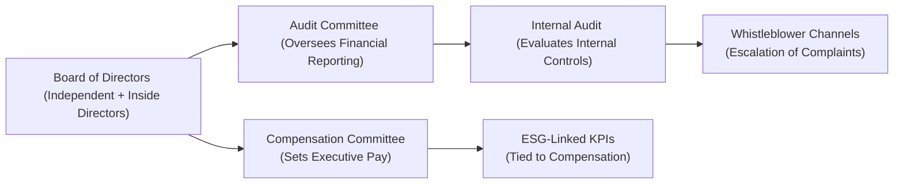

## Introduction

Imagine you’re working through a real-life corporate governance puzzle. The board has some star power, the CEO has ambitious growth targets, and the CFO is flamboyantly confident that everything is perfect. Meanwhile, activist investors keep complaining about shady committee processes, and rumor has it that several whistleblower reports have been “lost” in the swirl of bureaucratic hand-offs. Sound familiar? Well, that’s essentially the scenario you might encounter in a typical CFA Level II item set focusing on governance. Here, we’ll walk through how to break down a governance vignette and piece together the key elements for a thorough policy assessment.

Understanding how to evaluate a company’s governance structure is a critical skill for any finance professional—especially given that executive compensation, risk management, board oversight, and stakeholder engagement can all drastically impact valuation. By the end of this section, you’ll be able to recognize red flags, propose best-practice solutions, and view governance from a holistic vantage point that ties into the broader Corporate Issuers perspective introduced in earlier chapters (for instance, how the board’s oversight might shape payout policy or M&A decisions).

## Setting the Scene: A Hypothetical Vignette

Let’s create a scenario, just to keep things concrete. Welcome to “Omega Industries,” a mid-sized manufacturing firm listed on a major stock exchange. Omega’s board includes:

• A chairperson who’s also the CEO (dual role).  
• Two independent directors with finance expertise, but minimal industry background.  
• Three executive directors from operations, sales, and marketing.  
• One external director who’s a close friend of the CEO and invests alongside him in multiple side ventures.

In addition, Omega Industries has the following committees:  
• Audit Committee: Chaired by one of the independent directors; under-resourced and meets infrequently.  
• Compensation Committee: Run by the external director, who apparently enjoys occasional sports tickets courtesy of the CEO.  
• Nominating Committee: Only the CEO and one other executive director sit here—an unusual setup potentially failing independence requirements.

Now for the issues swirling around Omega:

• Several whistleblower reports regarding questionable supply-chain sourcing have gone unanswered for six months.  
• ESG disclosures are minimal. The CFO has publicly stated, “Investors only care about the bottom line, not carbon footprints.”  
• A large institutional investor launched an activist campaign alleging conflicts of interest within Omega’s board.  
• The external auditor flagged “material weaknesses” in internal controls last quarter, but the audit committee hasn’t publicly addressed it.  
• Rumors of an impending proxy fight have surfaced, with the institutional investor claiming the board fails to uphold fiduciary duties.

Reviewing this scenario is exactly the kind of exercise you’ll face in an exam vignette. Now let’s break down the core elements you should look for and how to approach them systematically.

## Board Composition and Independence

A fundamental question for any governance assessment is: “Who comprises the board, and are they independent enough to represent shareholder interests?” In Omega’s case, red flags wave almost immediately. The CEO is also the board chair. While not always prohibited, this dual role can blur the lines of oversight. Next, the presence of only two truly independent directors might not meet typical best-practice guidelines (e.g., a majority of the board should ideally be independent). The external director’s personal ties with the CEO further compromise independence.

From an exam lens, you’ll want to:

- Look for conflicts of interest. Does the external director invest in the CEO’s side businesses? Is that truly “independent”?  
- Assess each committee’s composition. Are they chaired by independent board members? Or are executives controlling key committees?  
- Compare board structures against recommended guidelines like those from the International Corporate Governance Network (ICGN) or NACD. Most codes of best practice suggest robust independence, a lead independent director if the chair is not independent, and a clear separation of powers to ensure real checks and balances.

## Committee Structures and Responsibilities

Next, dive into committees:

- **Audit Committee**: This group oversees financial reporting and internal controls. In the vignette, the audit committee seldom meets. That’s an immediate sign something’s off, especially following an auditor-reported material weakness. If they’re not responding to crucial financial control issues, you might suspect broken channels between internal audit, external auditors, and the board.

- **Compensation Committee**: This committee approves executive pay packages and aligns them, presumably, with the company’s strategic goals. The question is whether those goals reflect shareholders’ long-term interests (including ESG considerations). When the committee is chaired by a director who receives personal perks from the CEO, you’re dealing with a potential conflict of interest. Executive pay might be inflated, short-term, or insufficiently linked to meaningful ESG metrics.

- **Nominating Committee**: Responsible for recommending new board members, ensuring the board’s skills are up to date, and overseeing succession planning. If it’s dominated by insiders, it’s less likely to challenge or reshuffle incumbents. This can perpetuate poor governance, especially if new ideas or external scrutiny never gain traction.

These committees form the backbone of corporate accountability. On your exam (and in real-life practice), you should be able to pinpoint which committees are performing properly, which are compromised, and how that might harm or help shareholders.

## Whistleblower Complaints, Internal Audits, and Compliance

If a whistleblower policy exists but nobody enforces it, employees grow reluctant to report serious issues, fostering operational risk. In our Omega Industries scenario, multiple whistleblower reports remain unaddressed. And yet, there’s no sign that either the audit committee or the board as a whole has investigated. This is a huge hint that compliance oversight is weak.

An effective governance framework typically features:

- Clear whistleblower channels that protect confidentiality and ensure escalation to the audit committee or board.  
- Responsive internal audit functions that highlight and track these complaints.  
- Transparent external reporting if issues are material.

If the audit committee is toothless or unaware of ongoing issues, the door is wide open for compliance missteps. In an exam context, you would note that ignoring whistleblower concerns could lead to serious legal ramifications (like class-action lawsuits or regulatory fines) if the misconduct is eventually exposed.

## ESG Integration and Disclosure

Today, environmental, social, and governance metrics are not just “nice-to-have” add-ons—they're increasingly demanded by both regulators and investors. One might recall from Chapter 5 (Foundations of ESG in Corporate Finance) that failing to integrate ESG considerations in executive KPIs can prompt activist pressure and reputational damage.

In the Omega scenario, the CFO trivializes sustainability disclosures, and it shows. That approach could hamper the firm’s ability to attract long-term investors who regard ESG as part of risk mitigation (e.g., climate-related or supply-chain vulnerability). The board’s lack of engagement with ESG also indicates that it may be missing critical strategic opportunities or ignoring emerging regulatory demands. For instance, many markets now require more detailed reporting on carbon footprints, diversity and inclusion metrics, and supply-chain practices.

## Activist Investors and Proxy Threats

Now, let’s talk about activism. Activist shareholders often step in when they see governance shortfalls, undervalued stock prices, or underperforming assets. Their approach might involve:

- Calling for board seats.  
- Demanding the replacement of top management.  
- Proposing strategic pivots (like spin-offs, buybacks, or ESG improvements).

In your vignette analysis, check how management reacts to activist campaigns. Are top executives engaging constructively, or are they defensive? Long-term value creation typically requires management to address legitimate shareholder concerns. Ignoring or antagonizing activists can spur a messy proxy fight or even lawsuits.

## Potential Legal and Regulatory Ramifications

Having recognized that Omega is facing big governance issues, it’s logical to question whether legal or regulatory trouble is on the horizon. For example:

- **Class-Action Lawsuits**: If undisclosed compliance failures come to light and result in a scandal or financial loss, shareholders might unite in a class action, claiming the board breached its fiduciary duties.  
- **Delisting Risk**: Persistent internal-control weaknesses or failure to meet exchange governance standards could put the firm at risk of warnings or eventual delisting.  
- **Fines and Investigations**: Securities regulators aren’t typically lenient with repeated compliance lapses. Failure to rectify issues can lead to heavy monetary fines, mandated leadership changes, or more stringent oversight.

As a CFA candidate or practicing financial professional, always read the scenario carefully for hints that the firm has crossed some regulatory lines—those can be immediate red flags regarding the company’s solvency, share price volatility, or future capital-raising potential.

## Diagram: Typical Governance Flow

Below is a simple diagram showing how information might ideally flow in a well-structured governance framework. Compare it to Omega’s environment to see where the gaps might lie.

In a strong governance setup, each committee diligently reports back to the full board, ensuring nothing falls through the cracks. In Omega’s weaker framework, it appears committees rarely meet or the lines of communication may be broken.

## Best Practices and Corrective Measures

If you spot deficiencies in your vignette scenario, it’s time to propose solutions. Based on guidelines from bodies like the ICGN and the NACD, here are measures that could strengthen Omega’s governance:

- **Separate the CEO and Chair Roles**: Appoint a lead independent director or reassign the chairmanship to a fully independent board member.  
- **Increase Independence**: Add more independent directors with relevant sector expertise. Possibly replace the “friendly” external director if conflicts can’t be mitigated.  
- **Reform Committees**: Restructure the audit and compensation committees so they are exclusively composed of independent members. Encourage frequent, well-documented meetings with robust agendas.  
- **Link ESG to Compensation**: Weave ESG performance measures into executive KPIs, particularly around supply-chain stewardship and sustainability.  
- **Strengthen Whistleblower Protections**: Ensure immediate escalation of whistleblower reports to the audit committee, and require the internal audit function to track and monitor all allegations thoroughly.  
- **Develop Transparent Reporting**: Disclose material governance or internal-control issues promptly. Provide detailed ESG metrics consistent with frameworks such as SASB (Sustainability Accounting Standards Board) or TCFD (Task Force on Climate-related Financial Disclosures).  
- **Engage Constructively with Activists**: Listen to legitimate concerns, potentially refresh the board with nominees who can address governance and operational deficiencies.

## Forecasting the Impact on Valuation and Risk Profile

Governance improvements can have tangible effects on a firm’s valuation. Investors generally place a higher multiple or lower cost of capital on firms with robust governance, as it signals lower risk of scandals or strategic misalignment. Conversely, companies perceived as disregarding best practices often trade at a discount or face higher financing costs.

Better governance often translates into:

- Improved accountability and risk management, yielding fewer operational surprises.  
- Stronger reputational standing, possibly drawing in ESG-focused investors.  
- More sustainable and responsible capital allocation decisions, potentially boosting long-term growth prospects.  

A final note: If asked on the exam, don’t forget to connect governance reforms to broader Corporate Issuers topics: for instance, how the newly independent board might refine the firm’s dividend policy (Chapter 2), reevaluate share repurchases (Chapter 3), or support a proposed restructuring (Chapter 9). It’s all interlinked!

## Exam Mindset and Strategy

When facing a corporate governance item set, time management and methodical reading are key. Here’s how I’d do it:

• Skim the vignette once, highlighting potential “hot spots” (board composition, committees, any anomalies).  
• Quickly identify the key governance codes or best practices you need to reference.  
• For each question, isolate the relevant portion of the scenario (e.g., a statement from the CFO). Check it against best-practice standards (e.g., independence guidelines, whistleblower requirements, ESG integration).  
• Provide a structured response that addresses not only the flaw, but also aligns with known corrective measures.  

This approach helps you sidestep confusion and ensures your answers are well-supported. Keep a mental (or written) checklist of governance best practices. And, of course, practice by tackling plenty of vignettes so that you can quickly parse the crucial details under exam pressure.

## References and Further Reading

- CFA Institute Level II Curriculum – Corporate Issuers, especially governance case studies.  
- NACD (National Association of Corporate Directors) Resource Center:  
  [NACD Governance Materials](https://www.nacdonline.org/)  
- ICGN (International Corporate Governance Network) “ICGN Global Governance Principles.”

----

## Test Your Knowledge on Governance Policy Assessment



### Which of the following is generally considered a best practice for structuring the board of directors?

- [ ] Combining the CEO and Chair roles for clear leadership.  
- [x] Having a majority of independent directors to oversee management.  
- [ ] Minimizing the total number of directors to reduce complexity.  
- [ ] Allowing all senior executives to hold board seats for transparency.  

> **Explanation:** Corporate governance guidelines usually recommend that the board be composed of a majority of independent directors to ensure objective decision-making. Combining the CEO and Chair roles is widely seen as a weaker governance structure.

---

### A whistleblower policy is most effective when:

- [x] Whistleblowers have direct access to an independent audit committee.  
- [ ] Reports are handled entirely by the CFO’s office.  
- [ ] The board only meets annually to review whistleblower complaints.  
- [ ] There is no formal escalation; issues are resolved at the department level.  

> **Explanation:** Proper whistleblower policies direct complaints to an independent committee (often the audit committee) so that conflicts of interest are minimized and reports are handled transparently.

---

### An activist investor is pushing for more independent committee membership. Which statement best describes why this might enhance long-term shareholder value?

- [x] Independent committees can provide better oversight, reducing risk.  
- [ ] Independent members prevent the company from issuing dividends.  
- [ ] Independent committees eliminate the need for external auditors.  
- [ ] Independent committees rarely disagree with management.  

> **Explanation:** Greater committee independence promotes objective oversight of management, helps identify risk early, and can address potential conflicts of interest—vital factors that improve long-term value.

---

### Which of the following is a red flag in evaluating the Compensation Committee’s independence?

- [x] The committee chair receives entertainment perks directly from the CEO.  
- [ ] The committee includes one non-executive board member.  
- [ ] The committee meets at least quarterly.  
- [ ] Executive compensation is partly tied to company performance.  

> **Explanation:** Receiving perks or gifts from the CEO often creates a conflict of interest and compromises the ability of the committee chair to evaluate compensation fairly.

---

### ESG metrics in executive KPIs typically benefit shareholders by:

- [ ] Reducing management accountability.  
- [ ] Encouraging short-term profit-taking.  
- [ ] Eliminating investor activism.  
- [x] Aligning corporate strategy with sustainability and long-term goals.  

> **Explanation:** Integrating ESG criteria into executive pay drives managers to consider environmental, social, and governance impacts, which often leads to more sustainable and strategic decision-making.

---

### A material weakness flagged by external auditors that remains unaddressed likely indicates:

- [ ] Exceptional oversight by the audit committee.  
- [ ] No potential for regulatory action.  
- [ ] A robust internal control environment.  
- [x] Major deficiencies in the board’s ability to manage financial controls.  

> **Explanation:** If a material weakness is not corrected in a timely manner, it signals serious deficiencies in internal controls and board/committee oversight. It increases the risk of misstatements and potential regulatory scrutiny.

---

### Which of the following best defines fiduciary duties in corporate governance?

- [ ] A board member’s duty to exclusively serve their personal interests.  
- [x] The legal obligation of the board and management to act in the best interests of shareholders.  
- [ ] A requirement that the CEO publicly disclose personal financial statements.  
- [ ] An optional code of conduct that committees may ignore.  

> **Explanation:** Fiduciary duties obligate directors and executives to place shareholder interests above personal or insider priorities. It’s a cornerstone concept in corporate governance.

---

### If a firm frequently fails to respond to whistleblower complaints and internal audit findings, it may:

- [ ] Strengthen credibility with regulators.  
- [ ] Reduce the need for an independent audit committee.  
- [ ] Improve employee morale due to less bureaucratic process.  
- [x] Face liability from future lawsuits or regulatory actions.  

> **Explanation:** Ignoring whistleblower alerts can lead to unchecked misconduct, and eventually, lawsuits or regulatory sanctions—often harming a company’s reputation and market valuation.

---

### What is a typical reason an institutional investor might initiate a proxy fight?

- [ ] They believe the existing board is fully aligned with shareholder interests.  
- [x] They wish to replace the board due to perceived weak governance.  
- [ ] They prefer a smaller share of voting control.  
- [ ] They want to reduce transparency in board meetings.  

> **Explanation:** Investors generally launch a proxy fight to replace a board they see as failing to uphold shareholder value or lacking proper oversight, hoping that a new board will introduce better governance practices.

---

### True or False: Tying ESG performance goals to executive compensation can help mitigate conflicts of interest in a board with mixed independence.

- [x] True  
- [ ] False  

> **Explanation:** Incorporating ESG targets in executive compensation can strengthen alignment between management and broader stakeholder interests, potentially offsetting some conflicts of interest if board independence is not optimal.


