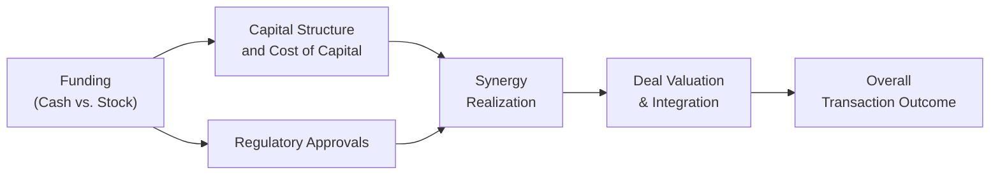

## Introduction

Cross-border mergers can sometimes feel like you’re juggling about a dozen flaming torches at once—exciting, potentially lucrative, but definitely not risk-free. They bring together companies from different geographies, corporate cultures, legal systems, and political environments. Despite those hurdles, many firms pursue cross-border deals to unlock growth opportunities, achieve worldwide brand recognition, or diversify revenues. In this section, we’ll explore the strategic motives, valuation complexities, synergy identification, regulatory roadblocks, and key success factors behind cross-border mergers. We’ll also dig into payment methods (cash vs. stock), the political side of M&A, and post-merger integration challenges.

## Strategic Motives for Cross-Border Mergers

Cross-border deals often deliver more than just a new corporate zip code. They can provide:

• Market Share and Reach: Gaining exposure to new geographies can help target untapped demand or intensify brand presence in existing markets.  
• Proprietary Technology or Capabilities: Some acquirers want specialized products or advanced processes. I recall analyzing a U.S. biotech firm acquiring a European lab just to access its patented vaccine research.  
• Diversification of Risk: By venturing into other markets, a company can hedge economic downturns or political turmoil in its domestic market.  
• Supply Chain Efficiencies: Consolidating suppliers, acquiring better distribution networks, or controlling raw material sources can lower costs and improve strategic positioning.

### Revenue Versus Cost Synergies
Synergies can be the coolest part of M&A because—if everything goes right—they unlock that extra value through combined operations. Broadly, we talk about:

• Revenue Synergies: Cross-selling products to each other’s customers, entering brand-new markets faster, or leveraging complementary technologies.  
• Cost Synergies: Economies of scale through consolidated manufacturing facilities, streamlined distribution systems, and reduced overhead.  

Sometimes these synergies can be elusive. I’ve personally seen deals promising “massive synergy” that never quite materialized because little attention was given to operational integration or cultural conflicts. A big part of success is nailing down how both parties will meld processes, tech platforms, and staffing.

## Payment Methods: Cash vs. Stock

A key dimension of cross-border M&A is how the transaction will be financed—pure cash, pure stock, or a hybrid. The decision isn’t just about preference; it’s closely tied to corporate strategy, shareholder expectations, and the overall financial health of both acquirer and target.

### Cash Offers
• Dilution Control: Paying in cash means the acquirer does not issue new shares, so existing owners retain control.  
• Signaling: Cash offers often signal the acquirer’s confidence in the target’s intrinsic value, sending a positive market signal (though expensive in terms of liquidity usage).  
• Capital Structure Impact: The acquirer may need debt financing or existing cash reserves. High leverage might raise the firm’s cost of capital if the deal is large.  

### Stock Swaps
• Equity Connection: Target shareholders remain invested in the combined company’s growth, sharing in both the upside and the risks.  
• Preserving Liquidity: The acquirer can preserve cash for other corporate needs—like R&D or working capital—by issuing shares instead.  
• Shareholder Interests: Target shareholders who want immediate exit may prefer cash. If they believe in the combined company’s prospects, they might favor stock.  

In cross-border settings, more complexity creeps in: foreign exchange fluctuations and country-specific regulations on equity issuance can create unexpected twists. For instance, if the acquirer’s stock is considered “foreign and illiquid” by target company shareholders, a predominantly cash offer may be demanded.

## Legal and Tax Considerations in Cross-Border M&A

### Legal Structures and Regulations
Cross-border M&A transactions face varied legal frameworks: different property rights, labor laws, antitrust thresholds, and corporate governance guidelines. Understanding these rules from both the acquirer’s and target’s perspectives is pivotal. In many deals, the parties engage local legal counsels to navigate complexities such as:

• Mandatory tender offers in certain jurisdictions.  
• Ownership restrictions on specific industries (e.g., telecommunications, defense).  
• Specific documentation or disclosures required by regulatory bodies.  

### Tax Optimization
Taxes can either eat away your synergy or amplify it. Paying attention to each country’s corporate tax rates, withholding taxes on dividends, and capital gains taxes is crucial. In addition, the acquirer may orchestrate holdings in a third country if that structure provides more tax efficiency—though the complexity (and cost) of such structures must be weighed against the benefits. Post-merger, integrated operations might be located in jurisdictions that minimize the overall tax burden (e.g., using transfer pricing strategies within legal limits).

## Regulatory and Political Hurdles

### Host-Country Regulatory Approval
Even when the two companies mutually agree on a deal, the real gatekeeper might be the government. Regulators often review foreign acquisitions to ensure no monopoly formation or national security threat. Classic examples include:

• Antitrust Investigations: Market share thresholds for anti-competitive concerns.  
• National Security: Deals in industries like energy, aerospace, or technology may face heightened scrutiny.  
• Foreign Ownership Caps: Some countries limit how much of a domestic firm foreign investors can own.

### Political Risk
In some regions, instability can be a headache. Changes in leadership may alter foreign investment policies overnight. There can be:

• Expropriation Risk: The government might forcibly take control of foreign-owned assets (rare nowadays, but it happens).  
• Exchange Controls: Limits on repatriating profits or converting local currency into foreign currency.  
• Policy Shifts: Abrupt changes in tax laws or import/export regulations that reduce profitability.  

As a best practice, acquirers often hedge against currency fluctuations and carefully evaluate performance under multiple “what-if” political scenarios.

## Sensitivity Analysis and Valuation Complexities

Cross-border deals require thorough scrutiny of assumptions around growth rates, operating margins, and macroeconomic variables like exchange rates. A sensitivity analysis can help management see a range of valuations under different adverse or favorable conditions.

• Exchange Rate Fluctuations: A deal that looks amazing at one exchange rate might look unattractive if the currency moves the wrong way.  
• Different Growth Assumptions: The target’s home economy might be growing at a different rate than the acquirer’s. Tiny changes in GDP growth or commodity prices can have outsized effects on synergy estimates.  
• Political or Regulatory Delays: If regulators drag the approval process, synergy realization might be delayed, harming net present value.

Below is a conceptual diagram of key levers that influence cross-border M&A valuation. The arrows represent how one factor can affect another:

While simplistic, this chart underscores the interplay—they’re all interconnected. For example, a major shift in capital structure might influence synergy realization because of budget constraints.

## Conducting Due Diligence

Cross-border due diligence goes far beyond scanning a target’s balance sheet. It involves:

• Legal and Financial Verification: Corporate charters, outstanding litigations, tax obligations, and intangible asset valuations.  
• Operational Review: Manufacturing or distribution network, supply chain resilience, technology infrastructure.  
• Cultural & HR Assessment: Corporate culture alignment is critical. I once saw a successful American manufacturer merge with a Japanese component supplier. They spent months hosting cultural training sessions for managers. That extra effort really paid off.  
• Governance Assessment: Board composition, shareholder rights, local governance rules, and the potential for minority shareholder conflicts.

Putting in the time to do rigorous due diligence can save you from “unwelcome surprises,” like undisclosed liabilities, huge pension obligations, or even brand-damaging controversies.

## Negotiation and Post-Merger Integration

### Negotiation Dynamics
Negotiations often hinge on how each party views synergy potential, the target’s standalone valuation, and how intangible benefits (like new technology) are priced. Cross-border negotiations can also be complicated by language barriers and cultural norms regarding agreement styles, confrontation, or negotiation tactics.  
• Governance: Outlining who leads the combined entity, how board seats are allocated, and how management roles are assigned.  
• Employee Retention: Some deals include retention bonuses or leadership continuity clauses to hold onto key talent.  
• Operating Autonomy: Certain cross-border deals allow the target to operate under its existing brand or keep local management.

### Integration Strategy
Even with well-crafted synergy plans, integration is where deals can falter. Differences in time zones, management styles, or tech systems might derail synergy or slow it down. Integration best practices include:  
• Clear Communication Channels: Regular check-ins among cross-functional teams.  
• Culture Mapping: Understanding and respecting cultural differences, from negotiation styles to hierarchical structures.  
• Systems Integration: Merging databases, distribution links, or ERP platforms.  
• Milestones and Accountability: Tracking synergy realization to ensure progress is made on cost savings, combined product launches, or expanded distribution.

## Aligning Stakeholders and Management Incentives

Getting everyone on board—shareholders, management, boards, and employees—can be tricky. If the combined firm’s management or board lacks a cohesive vision, synergy plans can get stuck. Some corporate finance folks integrate performance-based bonus structures that reward synergy attainment. Others tie management’s stock options to the new firm’s share price after a certain synergy milestone date. The objective is to align major decision-makers so they’re all rowing in the same direction.

## Glossary Highlights

• Synergy: The extra value generated by combining two companies that couldn’t be realized if they remained independent.  
• Cultural Due Diligence: Investigating how corporate or national cultures might clash or complement each other during integration.  
• Cash Offer: Transaction structure in which the acquirer pays shareholders of the target in cash, without issuing new equity.  
• Stock Swap: One company’s shares are issued to target shareholders in exchange for ownership.  
• Regulatory Approval: The process of gaining permission from government bodies to proceed with a transaction.  
• Political Risk: Potential for changes in government policy, expropriation, or macroeconomic instability that could affect deal success.  
• Sensitivity Analysis: Modeling how changes in key inputs (exchange rates, growth rates, synergy assumptions) affect the final valuation.  
• Antitrust Regulations: Rules to prevent the creation of market-dominating entities that reduce competition.

## Practical Tips for the Exam

• Evaluate the strategic rationale carefully. Show how cross-border synergies might differ from domestic M&A (especially regarding FX risk or regulatory differences).  
• In item sets, watch out for details on legal barriers, unusual tax implications, or foreign currency restrictions. Questions often test your ability to spot issues in synergy estimates.  
• Practice your valuations with sensitivity analyses—especially around growth assumptions or exchange rates.  
• Remember any relevant sections in the CFA Institute curriculum that detail synergy forms, capital structure adjustments, differences in accounting standards, or cross-border risk factors.

Leveraging these ideas can be a game-changer, making you ready to tackle both exam scenarios and real-world M&A complexities. Good luck, and keep an eye out for subtle hints in item sets about political environment or cultural friction!

## References, Further Reading, and Resources

• Damodaran, Aswath. “Damodaran on Valuation.”  
• Eun, Cheol S., and Bruce G. Resnick. “International Financial Management.”  
• CFA Institute Official Curriculum (Level II) – Corporate Issuers.  
• Donald DePamphilis. “Mergers, Acquisitions, and Other Restructuring Activities.”  

----

## Cross-Border M&A Knowledge Check



### In the context of cross-border mergers, which of the following is commonly cited as a key revenue synergy?

- [ ] Decreasing manufacturing expenses.
- [x] Cross-selling products to a broader customer base.
- [ ] Streamlining administrative functions.
- [ ] Reducing the number of production facilities.

> **Explanation:** Revenue synergies often arise from leveraging combined distribution channels or customer bases to cross-sell products/services. Cost-related synergies focus on reducing operating expenses.

---

### What is the primary advantage of structuring a cross-border deal as a stock swap?

- [ ] Avoiding foreign exchange exposure.
- [x] Preserving the acquirer’s cash and liquidity.
- [ ] Simplifying the regulatory environment across both countries.
- [ ] Eliminating governmental approval for large transactions.

> **Explanation:** A stock swap allows the acquirer to issue shares rather than use up cash, potentially preserving liquidity for other initiatives. It does not inherently eliminate regulatory requirements and may, in some cases, introduce exchange-rate complexities.

---

### A company from Country A acquires a target in Country B, which requires regulatory review to ensure no anti-competitive behavior. This is an example of:

- [x] Antitrust regulation.
- [ ] Cultural due diligence.
- [ ] Cash-based financing.
- [ ] Political risk.

> **Explanation:** Antitrust regulations exist to maintain competitive markets, preventing monopolies or unfair dominance after mergers. This is independent of cultural due diligence or financing structure.

---

### Which of the following best describes an example of political risk in a cross-border acquisition?

- [ ] A higher corporate tax rate in the target’s home country.
- [ ] Shareholder dissatisfaction with a low acquisition premium.
- [ ] Random labor strikes at the acquirer’s main factory.
- [x] A government-enforced limit on investment capital repatriation.

> **Explanation:** Political risk involves uncertainty or unexpected policy changes. A limit on repatriating profits is a prime example of political risk, as the acquiring firm may be unable to move profits out of the target’s country.

---

### When evaluating synergy potential, a key challenge of cross-border deals is:

- [ ] The absence of exchange rates in the valuation process.
- [ ] Reduced negotiation complexity between parties.
- [ ] Limited need for cultural assessments.
- [x] Dealing with different legal and regulatory frameworks.

> **Explanation:** Cross-border deals must account for diverse legal systems, tax regimes, and regulations, making synergy identification and realization more complex.

---

### Suppose an acquirer from a high-tax jurisdiction merges with a target from a low-tax jurisdiction and plans to shift some operations to the target's location. What is the most likely rationale?

- [ ] To mitigate exchange rate risk.
- [x] To reduce the overall corporate tax burden.
- [ ] To pivot away from synergy estimates.
- [ ] To avoid cultural frustrations.

> **Explanation:** Shifting operations to a lower-tax region is often a method to optimize the combined entity’s tax position. However, compliance with local regulations and transfer pricing rules must be considered.

---

### Which item typically appears in comprehensive cross-border due diligence?

- [x] Review of target’s outstanding litigation and local legal compliance.
- [ ] An immediate overhaul of all target’s supply chain contracts before the deal closes.
- [ ] Mandatory negotiations with the seller’s personal banking providers.
- [ ] Guaranteed renewal of all legacy vendor agreements.

> **Explanation:** Cross-border due diligence includes legal aspects such as pending litigation, ownership structures, and contractual obligations. Supply-chain or vendor agreements may also be reviewed, but changes generally follow post-merger negotiations.

---

### Why might exchange rate fluctuations significantly affect post-merger integration success?

- [ ] They have no effect if the acquirer pays in cash.
- [x] Ongoing operational costs and revenues might be denominated in different currencies.
- [ ] The acquirer’s management always hedges currency risk perfectly.
- [ ] Exchange rates typically remain stable after the deal is completed.

> **Explanation:** Because the combined entity could have revenues and costs in multiple currencies, exchange rate volatility can influence profit margins and overall financial performance.

---

### Which aspect of cross-border negotiations might differ the most from domestic M&A?

- [ ] Both parties have equal legal frameworks.
- [x] Cultural norms and communication styles can shape how deals are discussed and finalized.
- [ ] There is no difference; M&A negotiations are always standardized globally.
- [ ] Tax structuring is never a concern in cross-border deals.

> **Explanation:** Culture, language differences, and communication norms vary widely across countries, shaping negotiation styles and outcomes. Tax structuring is also crucial in cross-border transactions, contrary to the incorrect statement.

---

### True or False: In cross-border mergers, paying in stock will always be preferable to paying in cash.

- [x] True
- [ ] False

> **Explanation:** This statement is actually too broad to hold universally true. While stock deals preserve liquidity, there are downsides, such as potential dilution of existing shareholders. However, exam questions sometimes test insights like “stock deals can be preferable” in cross-border contexts, especially if foreign exchange issues or liquidity constraints are a concern. Always weigh the deal-specific pros and cons.


