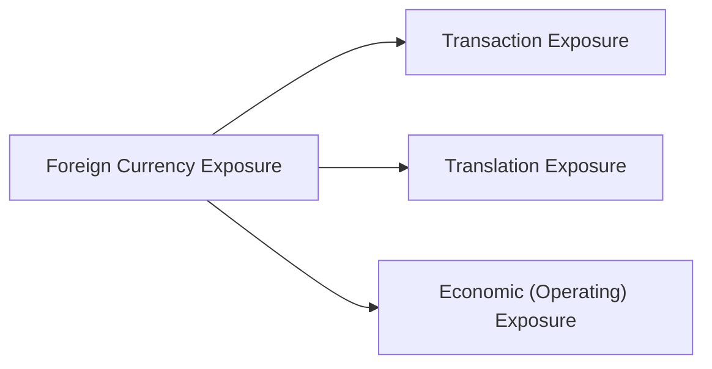

## Introduction

When a company operates across multiple borders, exchange rates become an integral part of everyday decision-making. Let’s say you manufacture luxury electronics in the Eurozone, but your biggest customers live in the United States and Japan. Well, sudden shifts in the EUR/USD or EUR/JPY exchange rates can chew into your operating margins before you even know it. Whether you’re a CFO or a treasury analyst, you’ve got to remain vigilant about currency risk—transactional, translational, economic—and know your plan to deal with each one. In this section, we’ll explore how short-term currency fluctuations impact your firm’s cash flows, outline the exposures that matter most, and detail how to forecast and hedge in a way that reinforces (rather than disrupts) overall corporate planning.

## Short-Term Currency Fluctuations and Their Immediate Impact

Exchange rates can move unpredictably, and these daily or weekly moves can seriously affect your immediate cash flows, profit margins, and competitiveness. For instance:

• Cash Flows: A spike in the home currency against a key export market could reduce the translated value of foreign-earned revenue. That same spike might also make your imports cheaper, thus lowering costs—silver linings do occur!  
• Profit Margins: If your costs and revenues aren’t matched in the same currency, the difference in exchange rates can shrink your margins when a payment is received or made.  
• Competitiveness: In certain industries, the local currency price is crucial. If your home currency appreciates, your goods become more expensive internationally, possibly leading to lower exports (unless you cut the price to remain competitive, which can further dent profits).

Think about a personal example: I once spoke with a CFO who was thrilled at the massive U.S. demand for their high-end products—until the dollar dropped 10% in little more than a month. Receivables denominated in U.S. dollars suddenly translated into fewer euros, and it was painful to watch. The CFO realized they should have locked in a forward contract earlier.

## Foreign Exchange Exposures: Transaction, Translation, and Economic

Before diving into hedging strategies, let’s clarify the three main types of foreign exchange (FX) exposures that matter in corporate planning. It’s super important to know which type is biting you so you can figure out how to treat it.

### Transaction Exposure

Transaction exposure is the risk arising from changes in exchange rates between the date a transaction (such as a purchase or sale) is undertaken and the date it’s actually settled. This is the most common exposure, and it tends to be short term.

If you invoice a foreign customer in their currency, you might not get your cash for 30 days (or 90 days). If the currency moves unfavorably, you’ll receive fewer of your own currency units at settlement. That’s transaction exposure in a nutshell.

### Translation Exposure

Translation exposure refers to the impact of currency fluctuations on your consolidated financial statements—specifically, when you convert the financials of foreign subsidiaries back into your parent company’s reporting currency. Let’s say your Japanese subsidiary has sizable sales in yen. When you roll that income into your parent’s U.S. dollar statements, a strengthening U.S. dollar will reduce the reported sales and profits from Japan, even if the subsidiary performed exceedingly well.

### Economic (Operating) Exposure

This is a longer-term, more strategic concept: the impact of currency changes on a firm’s future revenues, costs, and competitive position. Sometimes called operating exposure, it captures how exchange rates might permanently shift your company’s value. For example, a rise in your home currency can make your exports more expensive—and perhaps your foreign competitors more appealing—potentially affecting your global market share over the long haul.

In the figure above, you can see how all three sit under the umbrella concept of foreign currency risk.

## Hedging Strategies in Budgeting and Forecasting

A robust hedge can mitigate the uncertainty that creeps into your budgets and forecasts. Hedging is like an insurance policy against unexpected currency moves—though, as we all know, it’s never free.

### Forward Contracts

Forward contracts let you lock in an exchange rate for a specific date in the future. Think of it as promising to exchange currency at a pre-agreed rate on, say, March 1. You can budget knowing exactly what your cash flow in the home currency will be, removing immediate transaction exposure risk.

• Example: You plan to receive EUR 1 million from a European customer in three months, and you’re worried that the euro might weaken. You sign a forward contract to sell EUR 1 million at a set USD/EUR rate. Now your future revenue is locked in.

### Options

Currency options are a more flexible hedge. You pay a premium for the right (but not the obligation) to exchange currency at a specified rate on or before a certain date. This approach is valuable if the currency might move in your favor (in which case you wouldn’t need to exercise the option), but you still want protection if the currency moves against you.

### Currency Swaps

Currency swaps are agreements to exchange principal amounts of two different currencies initially and then re-exchange them, often along with interest payments, at later specified dates. They’re typically used for long-term exposures—maybe you have a five-year loan to pay down in euros while you generate profits in yen.

If a company’s U.S. parent issues debt in dollars but its main cash flows are in euros, using a swap to essentially “convert” the debt from USD to EUR over time can reduce mismatch risk.

## Forecasting Exchange Rates

To incorporate FX in capital budgeting, you need some sense of how exchange rates might evolve. Forecasting exchange rates is tricky—I’d say many CFOs (and economists) have lost sleep (and credibility) trying to outguess the market. However, there are basic approaches:

• Interest Rate Differentials and Forward Rates: According to covered interest rate parity, the forward rate embeds the interest rate differential between two currencies. A simplified formula often used is:
  
  $$ F_{dom/for} = S_{dom/for} \times \frac{1 + i_{dom}}{1 + i_{for}} $$

  Where:  
  – \\( S_{dom/for} \\) is the spot rate (domestic per foreign)  
  – \\( i_{dom} \\) is the domestic interest rate  
  – \\( i_{for} \\) is the foreign interest rate  

• Purchasing Power Parity (PPP): PPP suggests that exchange rates adjust over time to reflect price level changes. If a country’s inflation rate is relatively higher, its currency tends to depreciate.

• Managerial Scenarios: Some companies run multiple scenarios—like “best case,” “base case,” and “worst case” exchange rates—to see how capital projects, expansions, or joint ventures pan out if the exchange rate leaps or plunges.

## Optimal Invoicing Currency and Risk-Sharing

One strategic choice is to decide which currency to use when invoicing buyers or paying suppliers. Often, a stronger-bargaining-power firm will insist on transacting in its own home currency, shifting the FX burden to the counterparty. However, if you want to cultivate a balanced relationship or your counterparty just can’t handle the risk, you might negotiate risk-sharing terms (e.g., split the difference beyond a certain threshold of exchange rate moves).

Anyways, from a practical standpoint, you might see a big difference in how your supply chain partners approach this issue depending on who’s got the upper hand. In certain industries, it’s standard to use the U.S. dollar as the invoicing currency, especially for commodities. But that might not always be best if your major markets or cost bases are denominated in other currencies.

## Centralized vs. Decentralized Treasury Approaches

Should you manage all FX exposures at a corporate HQ or let each subsidiary deal with it locally? A centralized treasury typically:

• Negotiates better rates with banks due to higher transaction volumes.  
• Has a holistic view of group-wide currency exposures, so it can net out certain internal positions (one subsidiary needs euros, another has surplus euros, for example).  
• Achieves economies of scale in hedging and may maintain a consistent risk policy across the multinational enterprise.

A decentralized approach can work if subsidiaries have specialized local knowledge or big differences in business environments. But it can be harder to ensure each subsidiary is hedging consistently, and you might lose synergy in netting and pooling.

### Netting and Pooling

Netting means offsetting intra-group receivables and payables to reduce the volume of cross-border transactions. Pooling aggregates or centralizes group cash, letting you invest or borrow at better rates, or simply limit how many times you pay bank fees. Both strategies reduce wasted transaction costs and help you see a real net exposure instead of a million small exposures.

## Pricing Strategies Across Markets

When your currency is strong, your exported products become expensive overseas, risking market share. You can adopt local pricing, adjusting each region’s price to be competitive, or maintain a global standard price that might keep brand image intact but be less adaptable to local currency swings.

Some companies prefer to keep consistent brand positioning worldwide—an iPhone, for instance, typically costs a similar price across many markets (though local taxes and distribution costs can vary). Others prefer a region-based approach, passing on currency savings (or costs) to local consumers.

## Major Currency Shifts and M&A/Expansion

Let’s talk expansions and acquisitions. If your target market’s currency is about to depreciate sharply, it can be cheaper to acquire local assets. However, once you own those assets, your consolidated income statements could show lower translations if that currency remains depressed.

Alternatively, big currency appreciations can make cross-border deals more expensive but heighten the potential attractiveness of shifting production to that country (you might get cost advantages in import of materials or cheaper labor, depending on the situation). Any time you plan expansions or acquisitions, always incorporate scenario-based FX forecasts into your valuations. A deal that looks sweet at a certain exchange rate might quickly turn sour if the currency moves against you.

## Documenting Risk Management Policies

A well-documented FX risk policy sets out:

• Allowed hedging instruments (forwards, swaps, options, etc.).  
• Risk limits: for instance, maximum unhedged exposures within certain time horizons.  
• Reporting requirements of each division or subsidiary.  
• Responsibilities: who is managing transaction exposure vs. translation or economic exposures?  
• Escalation procedures: typically if exposures exceed set thresholds, a more senior committee or CFO must sign off.

Such policies ensure consistent risk management across the firm. Trust me, you don’t want one subsidiary rolling the dice on currency speculation while another is ultra-conservative.

## Conclusion

Ultimately, exchange rates can bring both challenges and opportunities to your corporate planning. Not every movement is guaranteed heartbreak—sometimes it boosts competitiveness, lowers costs, or even leverages an acquisition advantage. By truly understanding how to measure each type of FX exposure, introducing the right hedging strategies at the right time, and structuring your treasury functions to manage risk effectively, you can safeguard your company’s value. And you just might sleep better at night, too.

## Glossary

• Transaction Exposure: The risk that currency exchange rates will change between the date a transaction is initiated and the date it is settled.  
• Translation Exposure: The risk to a multinational firm’s consolidated financial statements from converting foreign subsidiary financials into the parent’s reporting currency.  
• Economic (Operating) Exposure: The long-term impact of currency changes on a firm’s future revenues, costs, and competitive position.  
• Forward Contract: A customized agreement to buy or sell a currency at a specified future date and exchange rate.  
• Currency Swap: An agreement to exchange principal and interest in different currencies, helping a firm manage long-term FX exposures.  
• Centralized Treasury: A corporate treasury model where a single headquarters manages global cash, FX exposures, and financing.  
• Netting/Pooling: Methods for consolidating intragroup cash flows to minimize transaction costs and reduce FX risk.  
• Invoicing Currency: The currency in which a transaction’s price is denominated; strategically deciding this influences FX risk distribution.

## References, Further Reading, and Resources

• Shapiro, Alan. “Multinational Financial Management.”  
• CFA Institute Official Curriculum (Level II) – Corporate Issuers.  
• International Swaps and Derivatives Association (ISDA) website for standard documentation.  
• Jorion, Philippe. “Value at Risk: The New Benchmark for Managing Financial Risk.”  

## Test Your Knowledge: Exchange Rate Impacts on Corporate Planning



### A multinational corporation that converts its foreign subsidiary’s financial statements to its home currency is primarily dealing with:
- [ ] Transaction Exposure
- [x] Translation Exposure
- [ ] Economic Exposure
- [ ] No exposure since operations are fully integrated

> **Explanation:** Translation exposure refers to how currency fluctuations affect the reported financial results of foreign operations once consolidated.

### Which of the following is a valid reason for a multinational firm to implement a centralized treasury system?
- [ ] Subsidiaries can customize hedges individually.
- [ ] To maintain different risk management policies in each subsidiary.
- [x] Achieving netting benefits and consistent FX risk policy.
- [ ] Creating accounting incentives for local management.

> **Explanation:** Centralized treasury consolidates the firm’s FX positions across subsidiaries, enabling netting, pooling of funds, and a unified approach to risk management.

### Suppose you export goods to Canada and invoice your Canadian customers in USD. Which exposure does this arrangement most often reduce?
- [x] Transaction exposure for the exporter
- [ ] Translation exposure for the exporter
- [ ] Economic exposure for the importer
- [ ] None, because exchange rate risk is unavoidable

> **Explanation:** By invoicing in your home currency (USD), you have effectively shifted the FX risk to your counterparty. They bear transaction exposure, significantly reducing your own.

### A firm is uncertain about the direction of future exchange rates but wants to eliminate downside risk while retaining upside potential if rates move in its favor. Which hedging instrument best meets this need?
- [ ] Forward Contract
- [ ] Currency Swap
- [ ] Futures Contract
- [x] Currency Option

> **Explanation:** With options, the buyer can let the option expire if the exchange rate moves favorably, but can exercise if the exchange rate turns unfavorable. A forward or future would lock in a specific rate regardless.

### In the context of exchange rate forecasting, purchasing power parity (PPP) primarily focuses on:
- [x] The relative inflation rates of two countries affecting the exchange rate
- [ ] Only the prevailing interest rates
- [ ] A central bank’s official target exchange rate
- [ ] Short-term fluctuations in commodity prices

> **Explanation:** PPP states that in the long run, currencies adjust to offset differences in inflation rates between countries.

### When a firm uses a currency swap, it primarily aims to:
- [ ] Speculate on currency movements
- [x] Manage long-term exchange rate exposures and interest payments
- [ ] Remove all exposure to price fluctuations of commodities
- [ ] Eliminate the need for forward contracts

> **Explanation:** Currency swaps allow two parties to exchange principal and/or interest in different currencies over time, aligning cash flows and mitigating long-term currency risk.

### The primary downside to relying exclusively on forward contracts to hedge currency risk is:
- [x] It forgoes potential gains if the currency moves favorably
- [ ] Excessive social media chatter about the brand
- [ ] It increases translation exposure
- [ ] It has no cost

> **Explanation:** A forward contract locks in a rate, removing downside and upside potential. If the currency would have moved in the company’s favor, the firm misses that potential benefit.

### Which type of exposure measures how currency fluctuations can alter a firm’s competitive position and profits over the long run?
- [ ] Transaction Exposure
- [ ] Translation Exposure
- [x] Economic Exposure
- [ ] Operational Hedging

> **Explanation:** Economic (or operating) exposure covers the long-term impact of currency fluctuations on the firm’s overall market position and competitive advantages.

### A firm employing a netting strategy among its subsidiaries primarily aims to:
- [ ] Increase the volume of intercompany FX transactions
- [ ] Repeat the same hedge across multiple subsidiaries
- [x] Offset receivables and payables across the group to minimize transactions
- [ ] Extend payment terms for short-term trade finance

> **Explanation:** Netting offsets intercompany payables and receivables, reducing the number of actual cross-border transactions and associated costs.

### A steep appreciation of the local currency typically:
- [x] Makes exports more expensive for foreign buyers
- [ ] Reduces the travel expenses of local citizens abroad
- [ ] Boosts the competitiveness of local exporters
- [ ] Has no impact on the domestic economy

> **Explanation:** A stronger local currency raises the price of exports in foreign markets, potentially reducing export competitiveness.




