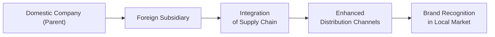

## Setting the Stage

Picture a thriving domestic manufacturer—let’s call them Globetex—that has spent years dominating the local market for consumer electronics. Now, they’re itching to expand internationally, find new customers, and tap into supply-chain cost efficiencies. You know, the classic storyline: a company sees promising growth across borders and decides it’s time to make a move.

Globetex wants to enter “Country Z,” an emerging market with rising disposable income and a growing appetite for consumer gadgets. There’s excitement in the air, but also nervousness. How should they go in? Full-blown acquisition? Joint venture? Or maybe cultivate strategic alliances with local players who already know the market inside out?

This case study tackles the questions a financial analyst might ask when guiding such a firm through a multinational expansion. In particular:

• How will exchange rate fluctuations affect revenue projections?  
• Do synergy opportunities—like supply-chain optimization—truly outweigh the complexities?  
• Can local borrowing reduce risks, or does parent-level financing make more sense?  
• What is the incremental value we get from this expansion, and does it justify the risk?

There was a time (short anecdote here) when I watched a small software firm enter a South American market without properly hedging currency risk. It was thriving for a few months, but when exchange rates turned volatile, the profit margins took a serious hit. Luckily, they survived, but it was an eye-opener: currency can make or break a good expansion plan.

## Exchange Rate Projections: Base, Bullish, Bearish

Before going deeper into synergy or cost of capital, let’s take a quick look at how Globetex might model revenue growth under different exchange rate scenarios. Exchange rates matter big time—if the foreign currency weakens against the parent’s domestic currency, any revenues earned abroad might shrink when translated back home.

Below is a simplified example of how Globetex might approach this. Let’s assume:

• Current exchange rate is 1.00 domestic currency (DC) to 1.00 target country currency (TCC).  
• Year 1 projected revenues in Country Z are TCC 100 million.  

Globetex draws up three scenarios:

| Scenario | Exchange Rate End of Year 1 | Revenues in TCC  | Revenues in DC  |
|----------|-----------------------------|------------------|-----------------|
| Bullish  | 1.10 TCC/DC                | 100 million TCC  | 90.9 million DC |
| Base     | 1.00 TCC/DC                | 100 million TCC  | 100 million DC  |
| Bearish  | 0.90 TCC/DC                | 100 million TCC  | 111.1 million DC|

Anyway, the numbers get a bit reversed if you interpret the strengthening or weakening in different ways, but you get the point: if your home currency is strengthening, you bring back fewer domestic dollars for the same foreign-currency revenue, which can make everything more complicated.

In more formal modeling, you’d project these exchange rates for multiple years, factoring in local macro conditions, interest rates, and political environment. This might require a sensitivity analysis so you can prepare for best-case (bullish) and worst-case (bearish) outcomes.

## Synergy Potential in the New Market

One of the big draws for Globetex is synergy. Why synergy? Because in addition to simply selling more product, you might:

• Plug into existing distribution channels in Country Z (maybe there’s a local chain that can fast-track your brand recognition).  
• Streamline supply-chain management so that raw materials are sourced more cheaply. For example, lower labor costs might cut production expenses.  
• Strengthen overall brand image. Sometimes, being an “international brand” can carry cachet at home, too.

Here’s a simple Mermaid diagram to show how these synergies might flow:



The synergy concept is straightforward: The parent company invests capital, technology, and expertise. The subsidiary leverages local labor, markets, and distribution channels. Ideally, you get an outcome that’s better than the sum of its parts. In the best expansions, synergy potential translates to real cost savings and revenue enhancements that push up the project’s net present value (NPV).

## Cost of Capital and Financing Considerations

When a company goes multinational, it can’t just rely on the same cost of capital it used domestically. There might be new risk premiums to reflect Country Z’s unique political risk, currency risk, and possibly higher volatility in corporate tax regimes. If the expansion is large, Globetex’s capital structure might shift in a big way.

At its simplest, Weighted Average Cost of Capital (WACC) can be written as:


\text{WACC} = \left(\frac{E}{V} \times R_e\right) + \left(\frac{D}{V}\times R_d\times (1 - t)\right)


But in a multinational setting, you’d need to adjust the cost of equity \\( R_e \\) to account for country-specific risk. That might look something like:


R_e = R_f + \beta \cdot ( \text{Market Risk Premium} ) + \text{Country Risk Premium}


And sometimes you factor in an equity risk premium for emerging markets, plus a “size premium” if your project is smaller or if liquidity is low. A firm might also incorporate local tax rates. If new local investors come on board, or if you secure debt from the host country, your capital structure changes. It can get messy fast.

### Local Borrowing vs. Parent-Company Borrowing

Local borrowing refers to raising debt in Country Z’s capital market, denominated in TCC. This can be a powerful strategy to hedge currency swings, because your revenues and debt payments are both in TCC. That’s effectively a “natural hedge.”

However, local borrowing might be more expensive if that emerging market has higher interest rates or a weaker credit environment. Also, the parent company might not have the same credit rating in the foreign market, reducing the availability of cheap financing.

Parent-company borrowing, on the other hand, might mean using the firm’s existing domestic credit lines or bond market access. Rates might be better, but now you’ve added currency mismatch to the picture: foreign revenues must convert to domestic currency for debt service. If the exchange rate moves unfavorably, your interest payments become more burdensome.

Globetex might do a mix: borrow some portion in the local market to match local cash flows, and the rest from the parent’s home market to take advantage of lower rates or more flexible debt structures.

## Integration Plan: Cultural Alignment

Let’s assume Globetex sets up an integration plan for the first two years of operations. They know that bridging language gaps and localizing the corporate culture is often half the battle. Even the best synergy opportunities can go off the rails if the parent treats the foreign subsidiary like an afterthought or fails to understand the nuances of local consumer behavior.

Steps in the integration plan might include:

• Hiring local managers who know the culture and language.  
• Creating cross-border task forces—representatives from the parent and the subsidiary working together on daily operational issues.  
• Training programs to ensure local staff understand Globetex’s brand image, quality standards, and corporate values.  

Sometimes that last point is overlooked: Yes, the local folks know how to do business in Country Z, but it’s crucial they also get the parent’s perspective on brand fidelity and product consistency. Cultural misalignment, even subtle, can harm brand reputation and hamper synergy realization.

## Quantifying Incremental Value

So, does all this pay off? Let’s measure the incremental value. Typically, analysts look at incremental cash flows from the new project and discount them back to present value at an appropriate rate. The basic formula for net present value (NPV) is:


\text{NPV} = \sum_{t=1}^{n} \frac{CF_t}{(1 + r)^t} - \text{Initial Investment}


In a multinational context, you might:

• Project free cash flows in local currency.  
• Convert them to domestic currency estimates using forecasted exchange rates.  
• Discount them using an adjusted WACC that reflects both the parent’s cost of equity and the additional risk premium for Country Z.  

One way to test the sensitivity of your result is to compare NPV using:

1. A “home-country discount rate” that lumps all cross-border risk together, vs.  
2. A “target-country discount rate” that factors in local risk parameters more precisely, plus any diversification benefits to the parent’s portfolio of projects.

For instance, the parent might discover that using Country Z’s local discount rate, the project yields a 12% IRR. But using a parent-level discount rate with an added risk premium, you might get a 9% IRR. Or vice versa—maybe the local environment has decent stability, so the local discount rate sees the project as less risky. Good analysts check each scenario to see how robust the business case is.

If you like Python, you could do a quick scenario simulation to see how NPV shifts under multiple exchange-rate and synergy assumptions:

```python
import numpy as np

def npv(cf_list, rate):
    """Calculate the NPV of a series of cash flows"""
    return sum([cf / ((1+rate)**t) for t, cf in enumerate(cf_list, start=1)]) - cf_list[0]

initial_investment = -1000000  # negative for cash outflow
cash_flows = [initial_investment, 200000, 300000, 400000, 450000]  # years 0-4
discount_rate = 0.12

project_npv = npv(cash_flows, discount_rate)
print("Expected NPV:", project_npv)
```

Of course, in a real setting, you’d incorporate exchange rate forecasts, synergy estimates, and local tax rates to refine each year’s cash flow. A big chunk of the analysis is also testing the “worst-case scenario”—like: “What if synergy doesn’t materialize? What if local demand doesn’t ramp up?” NPV can sink fast if assumptions are off.

## Structural Options: WOS, JV, or Partial Acquisition

Maybe you’re sold on the expansion, but you still need to choose the right structure. Let’s define a few terms quickly from our glossary:

• Wholly-Owned Subsidiary (WOS): Parent company fully controls the foreign entity. This provides maximum control but also maximum risk exposure and capital outlay.  
• Joint Venture (JV): The parent partners with a local firm, sharing ownership and governance. This can distribute risk and leverage local expertise, but you may face conflicts in leadership or strategy.  
• Partial Acquisition: The parent buys a minority or controlling stake in an existing local player. Learn from their established network, but also respect that you’re not in total control.

For Globetex, a WOS might feel appealing if they have the capital and want strong brand control, especially if they see synergy potential that requires integrated processes. But a JV might be smarter if the local business environment is really tricky and you want a local ally to navigate the bureaucracy or cultural norms. Lastly, a partial acquisition might be a middle road if there’s a strong local competitor who can benefit from your capital infusion while giving you almost instant market access.

In terms of financing:

• Equity: Issue new shares to fund the expansion. This could dilute existing shareholders but reduce overall debt burden.  
• Local Debt: As mentioned, possibly more expensive but a natural hedge in the local currency.  
• Corporate Bonds: An option if your credit rating is strong. Could be denominated in the parent’s currency or the foreign currency.

## Conclusion and Best Practices

Multinational expansions require a holistic approach. It’s not just about seeing a big new market and jumping in. The success of Globetex depends on carefully modeling currency exposure, building synergy in the local market, managing shifts in cost of capital, and tailoring an operational integration plan that respects cultural differences.

Below are a few best practices to keep top of mind:

• Always perform scenario analyses for exchange rates, synergy assumptions, and local inflation.  
• Carefully weigh local borrowing vs. parent-level financing. Factor in interest rate differentials and any tax benefits.  
• Train and integrate local teams to ensure brand consistency and minimize culture clashes.  
• Revisit your NPV calculations regularly as new information about the market emerges—don’t rely on static models that get outdated within six months.  
• Keep an eye on your WACC. Adding new foreign subsidiaries can alter your risk profile and capital structure in ways that affect the entire organization.

It’s an iterative process—maybe your first plan will show high risk, so you pivot to a partial acquisition or strategic alliance. That’s fine. The key is an honest, quantitative approach to analyzing incremental value, paired with the human understanding that local partnerships and cultural alignment can make or break your strategy.

## References, Further Reading, and Resources

• Case Study Collections: Harvard Business Review cases focusing on multinational expansions.  
• CFA Institute Official Curriculum (Level II) – Corporate Issuers.  
• Weston, Mitchell & Mulherin. “Takeovers, Restructuring, and Corporate Governance.”

Below is a quick glossary recap to keep our terms crystal clear:

• Strategic Alliance: A partnership between companies to pursue objectives while remaining independent.  
• Incremental Value: Additional economic benefit (e.g., measured via NPV or IRR) from undertaking a new project.  
• Local Borrowing: Debt sourced in the host country (and usually in local currency).  
• Wholly-Owned Subsidiary (WOS): A fully owned and controlled entity operating in the foreign market.  
• Joint Venture (JV): Shared ownership, risks, and returns by multiple parties in a new or existing venture.  
• Partial Acquisition: Buying a controlling or minority stake in a local player.  
• NPV (Net Present Value): Present value of future cash flows minus initial investment—used to gauge a project’s worth.  
• Language Gaps: Communication barriers due to differing native languages, possibly leading to misunderstandings.

And that’s it. Thanks for sticking with me through this journey. Stay alert to evolving market conditions, run your numbers carefully, and good luck out there.

## Multinational Expansion Knowledge Check



### Which of the following best describes a “natural hedge” in the context of a multinational expansion?

- [ ] Using currency derivatives in the forward markets to lock in exchange rates.  
- [x] Financing foreign subsidiaries with local debt to match local currency exposure.  
- [ ] Securing political risk insurance to protect against expropriation.  
- [ ] Employing cost-plus transfer pricing to manage taxable profits.  

> **Explanation:** A natural hedge occurs when a company’s operations naturally offset FX risk—such as borrowing in the same currency as its revenues.

### What is the main advantage of local managers in a new foreign subsidiary?

- [ ] They can reduce parent-company overhead expenses.  
- [ ] They eliminate language gaps entirely.  
- [x] They bring market-specific expertise, cultural insights, and local relationships.  
- [ ] They prevent the need for training and integration programs.  

> **Explanation:** While local managers won’t automatically solve every issue, they offer critical on-the-ground knowledge, bridging cultural nuances and local business practices.

### In terms of synergy, which aspect is a direct benefit of having a foreign partner for distribution?

- [ ] Lower corporate tax rates in the foreign country.  
- [x] Immediate access to established distribution networks and local retail channels.  
- [ ] Guaranteed currency stability.  
- [ ] Reduced brand risk at the parent level.  

> **Explanation:** A local partner can fast-track your product to established channels, saving time and money.

### When calculating NPV for a multinational project, why might cash flows be forecasted first in the local currency?

- [ ] Because local currency denominated cash flows are always more profitable.  
- [ ] To avoid using a discount rate altogether.  
- [x] To accurately reflect real operating conditions and convert to parent currency with relevant exchange rate forecasts.  
- [ ] Because home-currency forecasts are illegal in many foreign markets.  

> **Explanation:** Forecasting in local currency mirrors the project’s true economic environment, which is then converted back to the parent currency.

### Which financing structure can most effectively mitigate currency mismatch between revenues and debt service?

- [x] Borrowing a portion of the debt in the foreign market’s currency.  
- [ ] Securitizing assets in the parent country’s stock market.  
- [x] Using equity from the foreign market’s local investors.  
- [ ] Issuing convertible bonds in the parent’s local currency only.  

> **Explanation:** Both domestic-currency equity from local investors and local-currency debt can match your revenue currency, naturally hedging exposure.

### If a project’s base-case NPV is positive using the parent’s WACC, but turns negative under a higher local discount rate, what might this indicate?

- [x] The project’s risk might be undervalued when using the parent’s home-country rate.  
- [ ] The local environment has zero additional risk.  
- [ ] The parent’s cost of equity is inflated.  
- [ ] Foreign currency is expected to appreciate dramatically.  

> **Explanation:** A higher local discount rate suggests higher risk in the target market, reducing NPV. Using only the parent’s rate can understate that risk.

### Which of the following is a potential drawback of forming a joint venture (JV)?

- [x] Possible conflicts in decision-making and strategy between partners.  
- [ ] Requiring all financing to come from the parent’s country of origin.  
- [x] Eliminating knowledge transfer between the parent and local entity.  
- [ ] The subsidiary must adopt IFRS.  

> **Explanation:** JVs involve shared ownership and can suffer from strategic misalignments. On the flip side, they often foster knowledge exchange rather than eliminate it.

### Why might a parent choose a partial acquisition rather than a full-blown buyout?

- [ ] They want to maximize capital outlay.  
- [ ] They have no interest in local market knowledge.  
- [x] They wish to leverage existing local management and networks without complete control.  
- [ ] They cannot legally acquire assets in the target country.  

> **Explanation:** A partial stake can still grant significant influence while reducing upfront costs and capital risk.

### Which best summarizes the rationale for modeling multiple exchange rate scenarios?

- [ ] To forecast the risk of default on parent-level debt.  
- [ ] To determine the local inflation rate in perpetuity.  
- [x] To understand how currency fluctuations can significantly alter project cash flows and returns.  
- [ ] To predict the exact short-term valuation of the subsidiary’s stock.  

> **Explanation:** Modeling bullish, base, and bearish currency scenarios clarifies how sensitive the project’s cash flows are to FX changes.

### A parent corporation using local debt financing to pay for capital expenditures in the foreign subsidiary aims primarily to:

- [x] Reduce currency exposure and align financing costs with local cash inflows.  
- [ ] Avoid paying all principal back to the parent.  
- [ ] Increase the parent’s cost of capital.  
- [ ] Ensure complete ownership of the new entity.  

> **Explanation:** With local debt, the foreign currency inflows can service interest and principal, reducing exchange-rate risk on payments.


