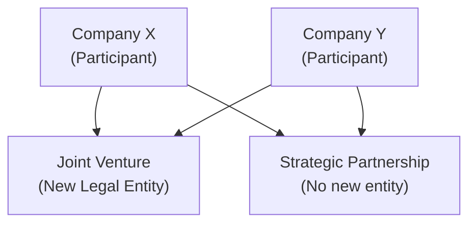

## Overview

Imagine you’re expanding into a new market but don’t quite have the local expertise or distribution networks to do it alone. A partnership with an established player might be exactly what you need. But do you simply align strategies without creating any new entity (a strategic partnership), or do you go all in and form a brand-new legal entity that both companies own (a joint venture)? These decisions can make or break your corporate goals, so it’s crucial to understand the nuances of alliance structures.

In the CFA® Level II world, especially under the Corporate Issuers lens, alliances like Joint Ventures (JVs) and strategic partnerships are not just about making deals. They involve rigorous valuation analyses, legal frameworks, resource allocations, synergy measurements, risk management, and carefully crafted exit strategies. And it’s not just theoretical—these topics pop up in the real world constantly.

Below, we’ll dig deep into the differences and help you develop the skills you need, from sorting out governance conflicts to planning for the dreaded (but often inevitable) “What if we need to walk away?” scenario.

## Distinguishing Alliance Structures

It’s easy to say, “Oh, a JV is basically two companies teaming up.” But in reality, a JV typically requires creating a new legal entity, jointly owned by the partners. That entity stands on its own two feet: it can hold assets, take on liabilities, issue shares, and even be partially sold off. On the other hand, a strategic partnership doesn’t necessarily cross that threshold. It might just be a formal agreement to collaborate on technology or a marketing effort without establishing a new company.

“Ownership rights” in a JV are explicitly spelled out through equity ownership in the newly formed entity. Strategic partnerships, though, usually center on contractual rights and obligations, where the partners remain two separate legal entities but align on specific projects or goals.

Here’s a quick visual:



• In the Joint Venture path, a distinct new “box” (legal entity) emerges.  
• For a Strategic Partnership, each company remains separate yet collaborates under contractual agreements.

A quick personal anecdote: I once saw a large consumer goods company collaborate with a local brand in a high-growth market. They formed a JV because they needed to share both risk and reward in building a new facility. But in a separate arrangement with a software provider, they only formed a strategic partnership—no new legal entity—just a contract to share product development timelines.

## Legal Implications and Regulatory Considerations

Legal structures aren’t just fancy paperwork. They define liability exposures, governance mechanisms, and tax implications. A JV requires legal entity formation under the jurisdiction you choose—maybe your home country or an international hub known for investor-friendly laws.

• Joint Venture (JV):
  – Legally recognized organization with separate books, often subject to IFRS or local GAAP.  
  – Partners typically use the “equity method” of accounting to reflect their portion of the JV’s net income (under IFRS, US GAAP, or other local standards).  
  – Liability is often contained within the JV. If the JV goes bankrupt, the parent companies risk losing their contributions but typically aren’t on the hook for all the JV’s debts.  

• Strategic Partnership:
  – Usually governed by a contract. No separate legal entity means each partner is individually liable for its own obligations.  
  – Partnerships can be simpler to unwind, though disputes can become messy if the contract lacks clear provisions.  
  – Tax implications depend on how costs/revenues are recognized in each partner’s financial statements.

In certain regulated industries—banking, telecom, defense, etc.—a separate JV entity might be required by law to ensure independent governance or compliance with foreign-ownership restrictions.

## Control and Decision-Making

When two or more parties join forces, the question “Who actually calls the shots?” always looms. In a JV, control is usually formalized through share ownership percentages and board representation. If you own 40% of the JV, you might get 40% of board seats (subject to negotiation, of course). Certain major decisions—like issuing new shares, acquiring another company, or selling core assets—may require supermajority or unanimous consent. 

Strategic partnerships often emphasize joint steering committees. Each partner nominates representatives to a coordination or oversight body, and decisions require consensus. Control tends to be more fluid. A partner with specialized expertise might “carry more weight” in that domain even if they don’t control the entire partnership.

One pitfall in these alliances is the dreaded stalemate. If the agreement says you need unanimous approval for major decisions, you’d better have a robust conflict resolution mechanism in place.

## Resource Allocation

So you’ve got your partnership. Great. But what’s each side ponying up?

• Joint Venture:
  – Often requires capital contributions at formation or in stages. Each partner typically invests equity or assets.  
  – Technology or intangible assets can also be contributed in-kind (e.g., patents, licenses, brand rights).  
  – The JV entity can raise its own debt, partially guaranteed by the parents if needed.

• Strategic Partnership:
  – Instead of formal equity contributions, partners might share R&D budgets, staff, or distribution channels.  
  – Payment terms might hinge on specific milestones—like a “pay as you go” model for each deliverable.

It might help to see a rough synergy equation. When forming a partnership, you can estimate synergy in a very simple sense:


\text{Net Synergy} 
= \text{(Combined Cash Flow)} 
- \left(\text{Sum of Stand-alone Cash Flow of Partners}\right) 
- \text{Integration Costs}


In a JV, synergy is realized within the new entity and then distributed to the parent companies based on ownership. In a strategic partnership, synergy typically yields shared cost savings or revenue enhancements—but each partner recognizes its share separately.

## Developing Synergy Targets

Let’s face it: the reason we form an alliance is (hopefully) synergy—whether it’s access to new markets, advanced tech, cost efficiencies, or a more comprehensive suite of products. Setting synergy targets from the get-go can help keep everyone motivated and ensure accountability.

Typical synergy objectives:
• Market entry: Expand into new regions with local partner knowledge.  
• Cost efficiencies: Pool R&D efforts, manufacturing, or supply chain resources.  
• Product development: Speed up time-to-market by combining complementary skills.  

You want synergy targets to be measurable—like a 10% cost reduction in manufacturing overhead within 12 months, or a $100 million revenue boost in three years. In real life, I’ve seen synergy targets that were too lofty. Everyone was excited initially, but once the synergy numbers failed to materialize, the finger-pointing began. Clear, realistic targets are essential.

## Governance Conflicts and Conflict Resolution

Even the happiest partnership can run into trouble. So, how do you handle disagreements?

1. Defined Decision Rights: Spell out who decides day-to-day operational issues and who decides “material” issues like major capital expenditures or acquisitions.  
2. Escalation Paths: If the management committee is deadlocked, it might go to the board or a dispute resolution panel.  
3. Arbitration or Mediation: Many JV agreements specify that if internal negotiations fail, the dispute will move to a third-party arbitrator. This can reduce legal costs and preserve goodwill.

Joint ventures often have a formal board structure, so conflicts might get hashed out like in any typical corporation, though with the twist that you have two (or more) owners with potentially different strategic visions. Strategic partnerships might rely on a “Steering Committee,” where you hope everyone still plays nice. But if you don’t have pre-agreed conflict resolution mechanisms, you’re setting yourself up for serious risk.

## Exit Provisions

Let’s say everything starts out great. The synergy is unstoppable. But five years down the road, maybe it’s not so peachy. You decide you want out. Then what?

• Joint Venture Exit:
  – Buy-sell agreements: If one partner wants to leave, they can force the other to buy them out (or vice versa).  
  – Right of first refusal (ROFR): If you find an outside buyer for your stake, the other partner(s) can match that offer.  
  – Dissolution: The JV is wound down, assets get sold, and any proceeds are distributed.

• Strategic Partnership Exit:
  – Typically spelled out in the contract. Maybe each side can give notice and walk away after a certain date.  
  – If complex intangible property (IP) or technology is shared, you need clear guidelines on how to handle future use or licensing if the partnership ends.

You’d be surprised how many alliances skip a well-thought-out exit plan because nobody wants to talk about potential failure when the new project is still in its honeymoon phase.

## Scenario Analysis

All alliances look dreamy in a best-case scenario: synergy targets are easily met, markets surge, and the cost synergy dwarfs integration expenses. But, well, the real world rarely follows such a neat script.

It’s wise to run:
• Best-case scenario: Perhaps everything goes right—maybe you exceed synergy targets.  
• Moderate scenario: Mixed results with moderate synergies.  
• Worst-case scenario: A downturn hits, synergy is minimal, or partner disagreements hamper progress.  

You might build a financial model for JV net present value (NPV) that toggles among these scenarios—particularly relevant when you’re dealing with big capital outlays and uncertain payoffs. Meanwhile, a strategic partnership model may focus more on revenue-sharing or cost-splitting structures.

Python can be handy for building quick scenario analyses. For instance:

```python
import numpy as np

best_case = 50
moderate_case = 30
worst_case = 5

discount_rate = 0.1
years = 5

def npv(cash_flows, r):
    return sum([cf / ((1+r)**t) for t, cf in enumerate(cash_flows, start=1)])

scenarios = {
    'Best': [best_case]*years,
    'Moderate': [moderate_case]*years,
    'Worst': [worst_case]*years
}

for scenario, flows in scenarios.items():
    scenario_npv = npv(flows, discount_rate)
    print(f"{scenario} scenario NPV: ${scenario_npv:.2f} million")
```

This snippet lumps synergy values into a simple “$X million every year.” In practice, you’d get more detailed, but it demonstrates how quickly you can pivot among different synergy assumptions.

## Risk Management Considerations

When alliances are formed, you’re not only sharing resources but also risks:

• Strategic Risks: What if the market evolves differently than expected?  
• Operational Risks: Are you mixing supply chains or sharing tech that could become obsolete?  
• Reputational Risks: If your partner faces bad press, you might get dragged down too.  
• Compliance Risks: Are cross-border regulations or antitrust laws in play?

You often integrate the alliance into your Enterprise Risk Management (ERM) framework, tracking it like any major project or business unit. For example, if you’re a manufacturing giant forming a JV in a region with political instability, you might buy political risk insurance or set up a letter of credit to mitigate payment default risk.

## Practical Example: Technology Development JV

Let’s consider a simplified example. TechCo (based in the U.S.) forms a JV with SoftNet (based in Europe) to develop next-gen artificial intelligence solutions:

• Alliance Structure: A new entity, “AI Solutions JV,” is incorporated in Ireland.  
• Legal Implications: The JV has separate legal status, must comply with EU data protection regulations, and each partner uses the equity method under IFRS or US GAAP to report this JV.  
• Control: TechCo owns 60%, SoftNet owns 40%. Major decisions (like acquiring a competitor) require at least 75% board approval.  
• Resource Allocation: TechCo provides $100 million in capital plus specialized AI processors. SoftNet contributes $70 million plus existing software IP.  
• Synergy Targets: Launch the AI platform within 18 months and achieve combined revenues of $200 million by Year 3.  
• Governance Conflicts: Disputes go to a board vote. If that fails, they use a neutral arbitration process in London.  
• Exit: Each partner has a right of first refusal on the other’s stake plus a call option if certain performance metrics aren’t met after five years.

## Best Practices and Common Pitfalls

• Clearly define your objectives and synergy goals upfront. Vague synergy promises are a recipe for disappointment.  
• Choose the right legal structure. JVs usually require more commitment and formal governance; strategic partnerships remain flexible but could be less stable if disputes arise.  
• Nail down control mechanisms. Spell out who’s in charge of what, from day-to-day decisions to long-term strategy.  
• Plan for conflict. Don’t assume you’ll always get along—establish robust processes for dispute resolution.  
• Address exit provisions. Consider a buy-sell agreement, lock-up periods, and valuation procedures for an orderly unwind.

One pitfall often seen: two companies form an overly broad JV without truly clarifying responsibilities or synergy expectations. The JV flounders, leading to confusion about how to exit, recoup investments, or pivot away from the sinking ship.

## Final Thoughts

Joint ventures and strategic partnerships can be powerful growth engines, especially in new markets or rapidly changing industries. But forming these alliances is far from trivial: you must handle governance, synergy targets, resource allocation, risk management, and potential exits with precision. If you approach them with a thorough financial model, clear legal frameworks, and solid communication channels, you can reap the benefits while minimizing surprises.

As a CFA® Level II candidate, you’ll likely encounter vignettes testing your ability to evaluate whether a JV or strategic partnership is the optimal route for a given corporate scenario. Be ready to analyze synergy potential, ownership/control complexities, and the overall financial impact on the parent firm’s statements. Above all, never overlook the human side—where good communication, conflict resolution, and strategic alignment often determine success far more than just the numbers.

## References

• Bamford, J., Ernst, D., & Fubini, D. (2004). “Launching a World-Class Joint Venture.” Harvard Business Review.  
• Inkpen, A.C., & Ramaswamy, K. (2006). Global Strategy: Creating and Sustaining Advantage across Borders. Oxford University Press.

## Test Your Knowledge: Joint Ventures vs. Strategic Partnerships



### A company chooses to form a legally separate entity when collaborating with a partner. Which alliance type does this decision most likely illustrate?

- [ ] Strategic partnership
- [x] Joint venture
- [ ] Merger
- [ ] Consortium without a legal entity

> **Explanation:** Forming a new legal entity is the hallmark of a joint venture in which ownership, risks, and governance structures are shared within a distinct organization.

### A strategic partnership differs from a joint venture primarily because it:

- [x] Usually does not establish a new legal entity.
- [ ] Requires full equity ownership by each partner.
- [ ] Is always subject to minority shareholder protections.
- [ ] Is typically seen in regulated industries only.

> **Explanation:** Strategic partnerships are often contractual arrangements without creating a separate incorporated entity, whereas a joint venture generally involves forming a new company.

### Which of the following is a typical upside of forming a JV rather than a strategic partnership?

- [x] Containment of liabilities within a separate entity.
- [ ] Reduced complexity in governance structures.
- [ ] Complete protection from foreign regulatory requirements.
- [ ] Immediate cost advantages for both partners.

> **Explanation:** By establishing a distinct legal entity, a JV often confines liabilities within that entity, protecting parent companies beyond their equity contributions.

### A pharmaceutical JV requires unanimous board consent for major decisions. One parent wants to commercialize a new drug; the other opposes it. What governance mechanism is most likely needed?

- [ ] Share rebalancing
- [ ] Public offering of shares
- [x] Dispute resolution such as arbitration
- [ ] Immediate winding up

> **Explanation:** When unanimous consent is required and a deadlock occurs, a pre-defined conflict resolution process, like arbitration, often steps in to resolve the issue.

### In a strategic partnership, the allocation of revenue typically occurs through:

- [x] Contractual revenue-sharing terms.
- [ ] Quarterly dividends from the newly formed entity.
- [x] Formal equity stakes in a separate joint entity.
- [ ] Complete distribution of net income based on board votes.

> **Explanation:** Because strategic partnerships do not form separate legal entities, revenue allocation is typically governed by a contract rather than dividends or equity stakes.

### Which factor best explains the preference for a strategic partnership over a JV in certain scenarios?

- [ ] The need to incorporate corporate governance committees.
- [x] The desire for simpler setup and greater flexibility.
- [ ] The requirement to share equal control over a new entity.
- [ ] The goal of limiting each partner’s liability.

> **Explanation:** Strategic partnerships can be less complex to set up and dissolve, appealing to firms that value flexibility over the more formal JV structure.

### A typical conflict resolution path in a JV might involve:

- [x] Escalating from management committee to the board, then arbitration if needed.
- [ ] Bypassing the board and requiring shareholder intervention.
- [x] Subjecting all disagreements to a public vote.
- [ ] Ignoring the conflict until synergy targets are missed.

> **Explanation:** JV agreements often specify a structured path, starting with internal negotiation and escalating to independent arbitration if stakeholders cannot agree.

### If partners are planning an exit from a JV, which clause is most relevant?

- [ ] Non-compete clause
- [ ] Exclusivity provision
- [ ] Stabilization clause
- [x] Buy-sell agreement

> **Explanation:** A buy-sell agreement (or “shotgun clause”) dictates how one partner can buy out the other’s stake, facilitating a structured exit.

### Which risk might be heightened if the partnership is purely contractual with no separate entity?

- [x] Liability exposure for each partner.
- [ ] Strict parent-company equity accounting under IFRS.
- [ ] Double taxation of distributed profits.
- [ ] Limited reputational exposure to external stakeholders.

> **Explanation:** In a strategic partnership without a separate entity, each partner retains direct liability for obligations linked to the collaboration, as there is no “corporate veil” to shield them.

### The “equity method” for accounting for investments is most commonly applied to:

- [x] Joint ventures
- [ ] Strategic partnerships
- [ ] Wholly owned subsidiaries
- [ ] Venture capital funds

> **Explanation:** Under both IFRS and US GAAP, a JV is often accounted for using the equity method, reflecting the investor’s share of the joint venture’s net income or loss.


