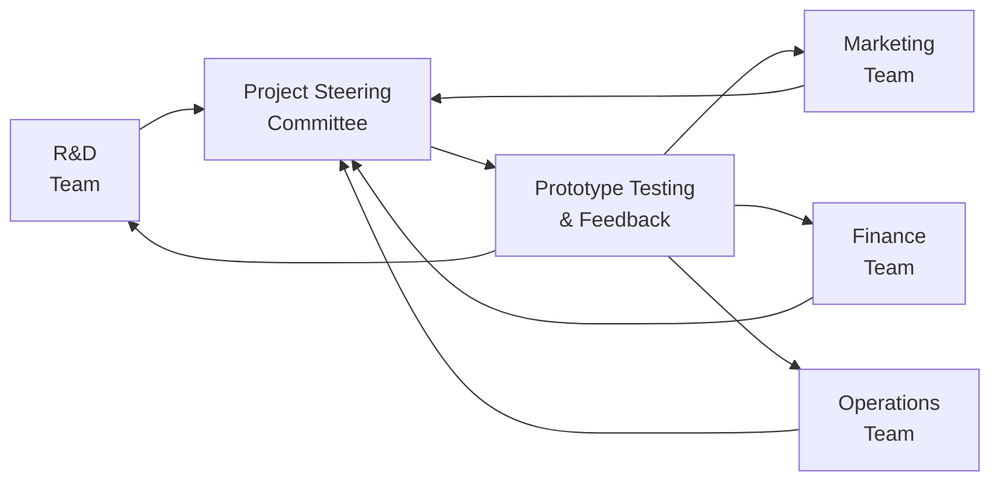

## Introduction and Overview  

Collaborative R&D initiatives can be both exciting and demanding. They bring together multiple firms or partners—each with distinctive capabilities, resources, and ideas—to solve technical challenges, launch new products, and share the inherent risks of research and development. In practice, however, it’s not always as glamorous as it may sound in the boardroom. I remember a time when my team excitedly joined forces with a fast-moving software startup to develop a new analytics platform—only to realize (well, rather late) that we’d never really nailed down who would own which parts of the end product or how we would split future revenue. That caused plenty of headaches once the project’s momentum picked up.  

In this section, we’ll explore how collaborative R&D alliances in corporate finance come to life. We’ll discuss key considerations for structuring such alliances, these include:  
• Outlining clear innovation objectives.  
• Defining intellectual property (IP) ownership.  
• Securing confidentiality.  
• Establishing effective governance for project milestones.  
• Leveraging cross-functional teams.  
• Diversifying research risk among partners.  
• Planning commercialization strategies.  

As a reminder, collaborative R&D goes well beyond just sharing lab space. It involves forging strategic alliances that can drastically reduce each partner’s individual risk and accelerate innovation cycles. In the context of CFA® Level II Corporate Issuers, understanding these alliances is crucial because they can influence corporate valuations, capital budgeting decisions, and strategic capital allocation.  

## Innovation Objectives  

Determining the rationale for collaboration comes first. Are we creating an entirely new product line to enter a market we’ve never served? Are we enhancing a current offering to outpace the competition? Or are we attempting a technological breakthrough that might disrupt traditional processes? Clarity around these objectives is often what differentiates messy, unstructured partnerships from streamlined alliances.  

Rather than simply saying, “Let’s just make something great,” set specific, measurable targets. Timelines and key deliverables—like prototypes or patent registrations—help anchor the alliance, align partner expectations, and ensure that resource allocation (human, financial, or otherwise) is on track.  

### Example: Timeline with Milestones  

• Month 0–3: Laboratory testing to validate feasibility.  
• Month 4–6: Prototype construction and internal evaluation.  
• Month 7–9: Market testing (focus groups, surveys).  
• Month 10–12: Official launch or licensing discussions.  

When you lay out such objectives, it’s easier for both sides to see how the collaboration should progress, which supports consistent budgeting and fosters a stronger sense of shared purpose.  

## Intellectual Property Ownership  

Now, IP is a hot-button issue. New ideas, inventions, and processes are intangible yet unbelievably valuable. In collaborative R&D initiatives, you must clarify from the outset who owns newly created IP—particularly if the project leads to multiple patents, designs, or trade secrets.  

### Joint vs. Individual Ownership  

• Joint Ownership: Partners share any IP generated, often split proportionally based on funding or resources contributed.  
• Individual Ownership: One partner owns the IP, with the other receiving licensing revenue or usage rights.  

**Pro tip**: Many alliances prefer a hybrid approach—maybe product A is assigned to Partner 1 based on their deeper domain expertise, while product B is assigned to Partner 2. To avoid friction, document these details clearly in a legally binding agreement.  

It’s also important to keep an eye on the entire IP life cycle, from inception to possible commercialization or licensing. If IP ownership is ambiguous, you will likely see tension down the road, particularly once the project nears commercial success.  

## Securing Confidentiality  

R&D thrives on experimentation, which by nature is iterative and often reveals intangible “know-how” that can be difficult to protect. Keeping trade secrets secret is critical. In any collaboration, establishing comprehensive non-disclosure agreements (NDAs) or confidentiality agreements is a must.  

These legal frameworks should specifically outline:  
• What type of data is considered confidential (e.g., engineering drawings, algorithms, formulae).  
• Who within each partner organization can access it.  
• How that data must be stored, transported, or otherwise safeguarded.  
• The consequences if confidentiality is breached.  

Confidentiality often extends beyond the scope of the internal development team. Sales, marketing, and other functions sometimes gain insights into the project—particularly if they’re going to be responsible for product launch. So be sure to implement robust training and “need-to-know” protocols to keep the data truly secure.  

## Governance for Project Milestones  

To keep R&D initiatives on track, it helps to define a governance structure from day one. Milestone reviews and performance checkpoints give partner organizations a chance to say, “Hey, do we keep going, or do we pivot?”  

### Milestone Reviews  

• Frequency: Monthly, quarterly, or tied to specific achievements.  
• Format: Could be in-person or virtual but must be consistent and documented.  
• Accountability: Each partner must know who’s leading particular tasks, who signs off on budgets, and how decisions are escalated if disagreements arise.  

One approach is establishing a joint project management office (or a smaller steering committee) that includes individuals from both companies—folks with authority to approve budgets, adjust project scope, or even cancel the project if it’s no longer viable.  

In a more relaxed environment, you might rely on ad hoc check-ins. From experience, though, the more advanced or capital-intensive a project is, the more valuable it is to have a visible governance process—preferably with a consistent structure that encourages synergy rather than fosters confusion.  

## Deploying Cross-Functional Teams  

Cross-functional teams (CFTs) are more than just buzzwords; they can make or break a collaborative R&D project. In these teams, you’ve got R&D engineers rubbing shoulders with marketing gurus, financial analysts, supply chain experts, and even external consultants or academic researchers.  

### Merits of a Cross-Functional Approach  

• Accelerated Development: Marketing can weigh in on product features early, saving potential rework costs if the product is misaligned with market demand.  
• Broader Expertise: Finance can forecast capital needs, while engineers remain laser-focused on technical feasibility.  
• Early Adoption of Best Practices: Operational folks can advise on manufacturability or distribution constraints before the design is locked.

Below is a simple Mermaid diagram showing how R&D, marketing, finance, and operations can collaborate:

Notice that the Steering Committee integrates input from all functional teams, enabling centralized decision-making while leveraging each group’s expertise.  

## Diversifying Research Risk  

R&D can be expensive and uncertain—essentially, you don’t know if you’ll discover a breakthrough or run smack into a technical dead end. So, collaborating with a partner allows you to share:  

• Upfront Costs: You won’t bear the full brunt of equipment purchases, specialized hires, or lab expansions.  
• Ongoing Expenses: Salaries, materials, and overhead for continuing experiments.  
• Market Risks: If a concept flops post-launch, at least the loss is shared.  

### Risk Modeling  

One approach to quantifying risk is scenario analysis, where partners model multiple discrete outcomes. For instance, you might assume the best case yields a 25% increase in sales, the base case yields a modest 10% gain, and the worst case results in zero commercial viability. By splitting these scenarios across partners, each party’s downside exposure is reduced. This risk diversification angle can also appeal to equity and debt investors, especially if they see that your R&D pipeline is not reliant on a single “winner-takes-all” bet.  

## Planning for Commercialization Phase  

Creating an innovative prototype is one thing; successfully launching it is another entirely. Commercialization planning is crucial for recouping R&D investment and driving long-term shareholder value.  

### Key Considerations  

• Licensing Agreements: Do both parties plan to license the new technology to third parties, or is it restricted to use within the alliance?  
• Market Rollout: Who takes the lead on marketing, logistics, and after-sales service?  
• Pricing Strategies: Align pricing approaches with each partner’s brand positioning and cost structures.  
• Integration: If each company will integrate the new product or technology in distinct ways, highlight early how those differences might affect product design, supply chain, or customer support.  

Be prepared for negotiations on revenue-sharing models, especially if the new product is expected to produce significant profit streams. A well-structured revenue-sharing mechanism usually ties partner returns to their respective investments, resource commitments, or intangible contributions (such as brand name or distribution network).  

## Practical Example: A Green Energy Venture  

Imagine that an established automotive company partners with a tech-savvy battery manufacturer to develop next-generation electric vehicle (EV) batteries.  

• Innovation Objectives: Target higher energy density by 20% over existing batteries with a two-year completion timeline.  
• IP Ownership: The automotive company will own the final battery architecture, but the battery manufacturer will retain rights to any improvements in the core chemical composition process.  
• Confidentiality: Strict NDAs to protect proprietary manufacturing processes and battery safety test data.  
• Governance: Monthly joint milestone reviews focusing on cost per kWh, battery durability, and safety tests.  
• Cross-Functional Teams: Engineers from both sides collaborate with marketing teams to ensure alignment with the automaker’s brand identity.  
• Research Risk: Each partner invests 50% of the initial capital, distributing the risk.  
• Commercialization: Once the new battery meets safety standards, it will be integrated into the automaker’s EV line, while the battery maker can license the improved chemical composition to other sectors (e.g., consumer electronics).  

This structure helps each party capitalize on the other’s core strengths while reducing overall risk exposure.  

## Best Practices and Common Pitfalls  

### Best Practices  

• Negotiate IP Ownership Early: Resolve potential conflicts before large sums of money or resources are devoted.  
• Establish Clear Governance: Regular progress reviews prevent unpleasant surprises.  
• Encourage Open Communication: Cross-functional synergy hinges on consistent information exchange.  
• Use Transparent Budgeting: Cost overruns can derail trust; monitor them closely.  
• Develop Exit Clauses: Plan ahead for if one party wants to leave the alliance.  

### Common Pitfalls  

• Overlooking Cultural Differences: Especially in cross-border collaborations, managerial style or risk appetite can clash.  
• Failing to Update IP Agreements: If your R&D direction shifts mid-project, your original IP agreement may need updating.  
• Inadequate Market Testing: R&D success doesn’t guarantee market adoption.  
• Confusing “Team Collaboration” with “Everyone Decides Everything”: Too many decision-makers can slow progress; define roles and responsibilities.  

## Glossary  

• **Intellectual Property (IP)**: Creations of the mind—such as inventions, patents, trademarks—legally protectable and offering competitive advantages.  
• **Proprietary Data**: Confidential organizational data (e.g., processes, formulas, prototypes) that could provide competitive benefits.  
• **Milestone Reviews**: Structured checkpoints where project progress is assessed. Often tied to budget approvals or go/no-go decisions.  
• **Cross-Functional Team**: A group of professionals from different functional areas (engineering, finance, marketing) collaborating toward a common goal.  
• **Research Risk**: Uncertainty regarding the outcomes of R&D, including technical failures or market rejection of new products.  
• **Commercialization**: The process of bringing new products or technologies to market, covering pricing, marketing, and distribution strategies.  

## References  

• Pisano, G.P. (1990). “The R&D Boundaries of the Firm: An Empirical Analysis.” Administrative Science Quarterly.  
• Chesbrough, H.W. (2003). Open Innovation: The New Imperative for Creating and Profiting from Technology. Harvard Business Press.  

---

## Final Exam Tips  

• In a typical Level II item set, you might be given a scenario describing a newly formed alliance. Be ready to assess how IP ownership, milestone governance, or confidentiality structures could affect valuation or risk.  
• Watch for trick questions on who realistically owns newly developed processes—exam vignettes often hinge on subtle wording in R&D agreements.  
• Practice multi-part scenarios. One part might focus on evaluating synergy potential, while another part directs you to compute potential financial returns from a new product line, factoring in royalty streams or licensing fees.  
• Time management is crucial. Don’t get stuck on details of technology. Focus on the financial, strategic, and risk implications for the collaborating parties.

## Sample Questions: Collaborative R&D Initiatives



### Which of the following best describes a key advantage of cross-functional teams in a collaborative R&D initiative?

- [ ] They eliminate the need for regular progress reviews and project governance.
- [x] They integrate expertise from diverse areas, leading to faster prototype development.
- [ ] They allow one partner to fully transfer all technical risk to another.
- [ ] They provide an automatic process for IP ownership transfer.

> **Explanation:** Cross-functional teams bring together professionals from various backgrounds (e.g., R&D, finance, marketing) to share knowledge and speed up the product development cycle.

### In a typical collaborative R&D agreement, why is clarifying IP ownership at the outset so critical?

- [x] Ambiguous ownership can lead to disputes if the collaboration results in valuable inventions.
- [ ] It allows either partner to avoid sharing patent licensing fees.
- [ ] It ensures that all potential R&D risks are transferred to one party.
- [ ] It motivates cross-functional teams to ignore milestone reviews.

> **Explanation:** Determining IP ownership early prevents disagreements down the road if the partnership yields significant new technologies or patents.

### Which of the following would be the most effective mechanism to protect trade secrets during a collaborative R&D project?

- [ ] Eliminating cross-functional teams to reduce communication.
- [ ] Conducting all project meetings via public video streams.
- [x] Requiring strict adherence to NDAs to limit information sharing outside the partnership.
- [ ] Publishing interim research findings on the company website.

> **Explanation:** Confidentiality agreements (NDAs) are critical in preventing sensitive project details from becoming public or being exploited by competing firms.

### During milestone reviews, a key decision is typically:

- [ ] Eliminating future use of cross-functional teams.
- [ ] Abandoning established IP agreements and starting fresh.
- [ ] Hiring a single external consultant to take over the project entirely.
- [x] Evaluating project progress and determining whether to continue, pivot, or terminate the collaboration.

> **Explanation:** Milestone reviews are structured checkpoints used to assess performance and decide whether the project is on schedule, requires adjustments, or should be discontinued.

### What is a primary benefit of diversifying research risk through collaboration?

- [x] Sharing the costs and potential failures among multiple parties.
- [ ] Gaining exclusive IP ownership rights for the financing partner.
- [x] Avoiding the need for cross-functional collaboration or external financing.
- [ ] Guaranteeing that the new product will succeed upon launch.

> **Explanation:** By splitting the financial and operational burdens, each participant’s risk is reduced. However, this does not guarantee commercial success.

### Which factor most commonly disrupts the commercialization phase of a jointly developed product?

- [ ] Cross-functional collaboration continues after launch.
- [x] Unclear revenue-sharing models for license and sales.
- [ ] A well-defined IP ownership agreement set at the start.
- [ ] Strict NDAs prohibiting external disclosures.

> **Explanation:** Commercialization can stall or lead to disagreements if the alliance partners have not predetermined how they will share revenues or license potential.

### When forming cross-functional teams for collaborative R&D, one typical pitfall is:

- [x] Failing to assign clear roles and responsibilities, leading to delayed decisions.
- [ ] Involving marketing and finance personnel in the process.
- [ ] Providing consistent progress reviews.
- [ ] Encouraging open communication among team members.

> **Explanation:** While cross-functional teams confer many advantages, they can also lack structure if responsibilities and decision rights are not explicitly defined.

### In a scenario where governance structures are absent or weak:

- [ ] Major milestones are reliably completed on schedule.
- [ ] Enhanced confidentiality controls automatically fill the gap.
- [x] Partners might lack clarity on budget approvals, roles, and deadlines, causing confusion.
- [ ] Risk diversification is doubled.

> **Explanation:** Without solid governance, project activities can become fragmented, roles ambiguous, and accountability uncertain.

### A hybrid IP ownership arrangement often:

- [ ] Gives sole rights to the partner that contributed the lesser capital.
- [ ] Means each partner ceases new R&D efforts.
- [x] Divides specific technologies or products based on each partner’s domain expertise.
- [ ] Prohibits cross-functional teams from engaging in the final development stage.

> **Explanation:** A hybrid IP approach can allocate new technology ownership between partners according to each firm’s unique strengths or investments.

### True or False: Collaborative R&D initiatives automatically minimize all forms of risk since costs are shared among multiple partners.

- [x] True
- [ ] False

> **Explanation:** This statement is actually tricky—sharing costs does help reduce financial burdens, but it does not “automatically minimize all forms of risk.” The question above is intentionally paradoxical; while cost-sharing does mitigate some financial risk, technical, operational, and market risks still exist. Within the context of an exam scenario, be mindful that distributing costs can reduce certain risk aspects, but does not guarantee overall risk elimination.


